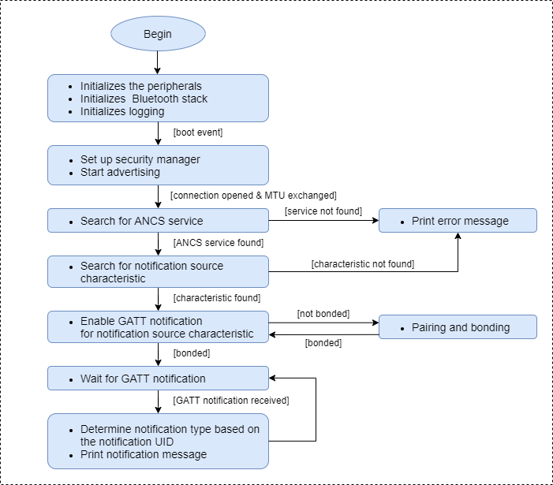
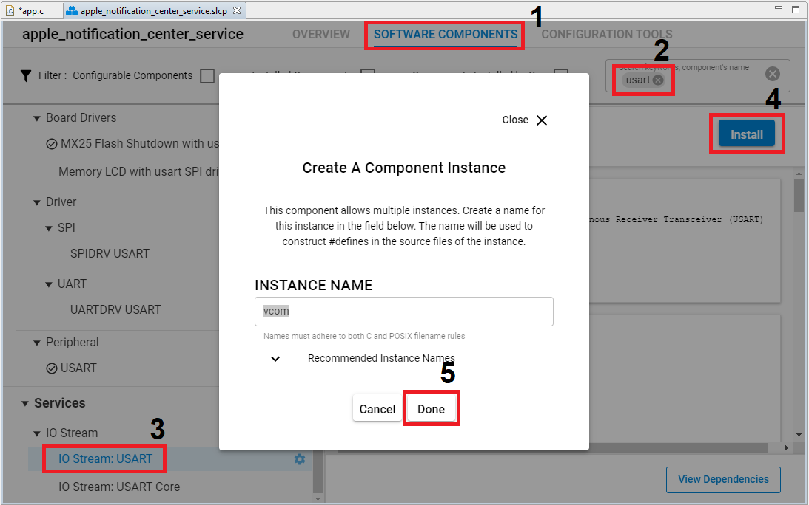
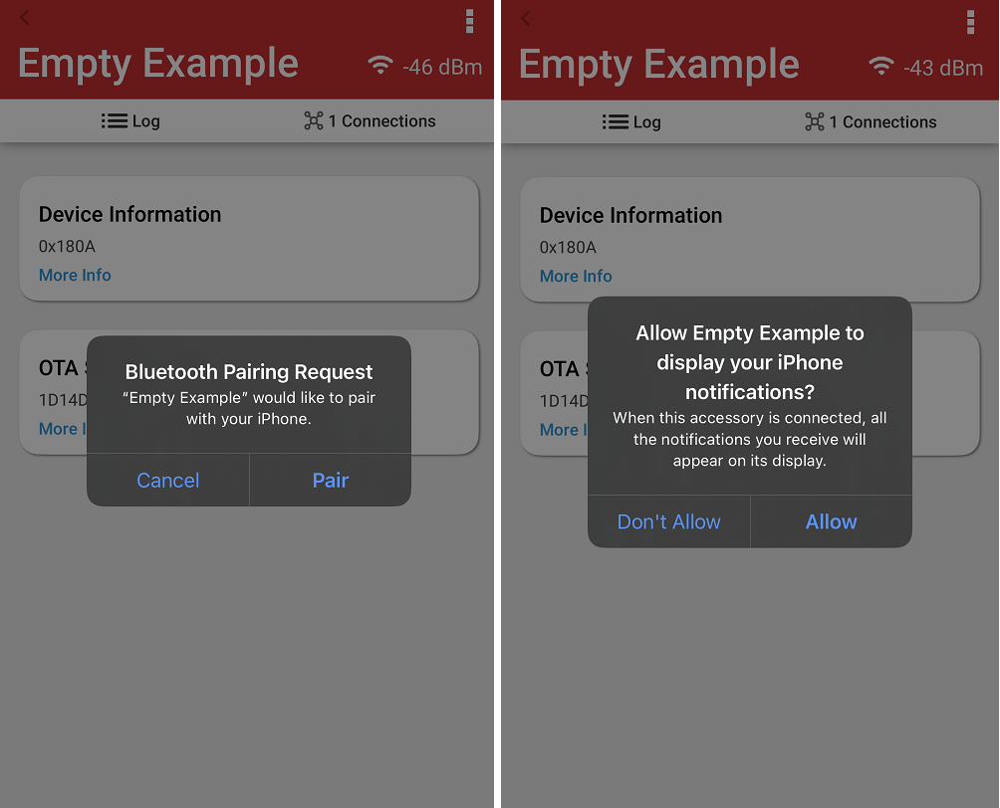
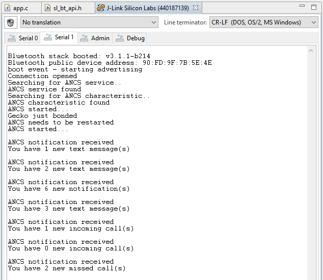

# Apple Notification Center Service #

## Description ##
 
This example demonstrates how to receive [Apple Notification Center Service (ANCS)](https://developer.apple.com/library/content/documentation/CoreBluetooth/Reference/AppleNotificationCenterServiceSpecification/Specification/Specification.html) Notifications, such as phone calls, calendar events, and so on and print them out to the VCOM.

The purpose of the Apple Notification Center Service is to give Bluetooth accessories (that connect to iOS devices through a Bluetooth Low Energy link) a simple and convenient way to access notifications that are generated on iOS devices.

### Terminology ###

- The Apple Notification Center Service is referred to as the ANCS.

- The publisher of the ANCS service (the iOS device) is referred to as **Notification Provider** (NP).

- Any client of the ANCS service (an accessory) is referred to as a **Notification Consumer** (NC).

- A notification displayed on an iOS device in the iOS Notification Center is referred to as **iOS notification**.

- A notification sent by a GATT characteristic as an asynchronous message is referred to as a **GATT notification**.

### The Apple Notifications Center Service ###

In its basic form, the ANCS exposes three characteristics:

- **Notification Source:** UUID: 9FBF120D-6301-42D9-8C58-25E699A21DBD (notifiable)

- **Control Point:** UUID: 69D1D8F3-45E1-49A8-9821-9BBDFDAAD9D9 (writable with response)

- **Data Source:** UUID: 22EAC6E9-24D6-4BB5-BE44-B36ACE7C7BFB (notifiable)

All these characteristics require authorization for access.

Support for the Notification Source characteristic is mandatory, whereas support for the Control Point characteristic and Data Source characteristic is optional.

**Note:** In this demo project only the Notification Source characteristic is used.

A GATT notification delivered through the Notification Source characteristic contains the following information:

- **EventID:** This field informs the accessory whether the given iOS notification was added, modified, or removed. The enumerated values for this field are defined in [EventID Values](https://developer.apple.com/library/archive/documentation/CoreBluetooth/Reference/AppleNotificationCenterServiceSpecification/Appendix/Appendix.html#//apple_ref/doc/uid/TP40013460-CH3-SW3).

- **EventFlags:** A bitmask whose set bits inform an NC of specificities with the iOS notification. For example, if an iOS notification is considered “important”, the NC may display a more aggressive user interface (UI) to properly alert the user. The enumerated bits for this field are defined in [EventFlags](https://developer.apple.com/library/archive/documentation/CoreBluetooth/Reference/AppleNotificationCenterServiceSpecification/Appendix/Appendix.html#//apple_ref/doc/uid/TP40013460-CH3-SW4).

- **CategoryID:** A numerical value providing a category in which the iOS notification can be classified. The NP will make a best effort to provide an accurate category for each iOS notification. The enumerated values for this field are defined in [CategoryID Values](https://developer.apple.com/library/archive/documentation/CoreBluetooth/Reference/AppleNotificationCenterServiceSpecification/Appendix/Appendix.html#//apple_ref/doc/uid/TP40013460-CH3-SW2).

- **CategoryCount:** The current number of active iOS notifications in the given category. For example, if two unread emails are sitting in a user’s email inbox and a new email is pushed to the user’s iOS device, the value of CategoryCount is 3.

- **NotificationUID:** A 32-bit numerical value that is the unique identifier (UID) for the iOS notification. This value can be used as a handle in commands sent to the Control Point characteristic to interact with the iOS notification.

For more information about ANCS, see the [specification page](https://developer.apple.com/library/content/documentation/CoreBluetooth/Reference/AppleNotificationCenterServiceSpecification/Specification/Specification.html).

### ANCS Implementation ###

The software flow is as follows:

1. First, the software initializes the peripherals, the Bluetooth stack, and logging to the virtual COM port.

2. After the *sl_bt_evt_system_boot_id* event arrives, it sets up the security manager to bond with an iOS device. Then, it starts advertising.

3. After the *sl_bt_evt_gatt_mtu_exchanged_id* event is received, the device is connected, and the connection parameters are negotiated. Then, the device starts searching for the ANCS service in the remote GATT with the *sl_bt_gatt_discover_primary_services_by_uuid* API.

4. If it finds the ANCS service, it will start searching for the notification source characteristic in the remote GATT with the *sl_bt_gatt_discover_characteristics_by_uuid* API.

5. If the notification source characteristic is found in the remote GATT, the device tries to subscribe to characteristic notification with the *sl_bt_gatt_set_characteristic_notification* API. If the iOS device and the EFR module are not bonded, subscribing is not possible. After the bonding is completed, enable the characteristic notification again and subscribing should work.

6. Receiving a *sl_bt_evt_gatt_characteristic_value_id* event with the *att_opcode* == *gatt_handle_value_notification* means the a GATT notification is received from the remote device. In this case, the notification type is determined based on the notification UID and printed out with the **ancCharValueReceivedCallback** function.

The activity diagram below shows the described flow.

 
## Gecko SDK version ##
 
GSDK v3.1.1
 
## Hardware Required ##
 
- A WSTK board.
- A Bluetooth capable radio board, e.g: BRD4161A.
 
## Setup
 
To be able to test this example do as follows:

1. Create a **Bluetooth - SoC Empty** project.

2. Copy the attached app.c file into your project (overwriting existing app.c).

3. Install the software components to use the **VCOM** port (UART) for logging:

- Open the .slcp file in the project.

- Select the SOFTWARE COMPONENTS tab.

- Install **IO Stream: USART** component with the default instance name: **vcom**.

- Find the **Board Control** component  and enable *Virtual COM UART* under its configuration.

- Install the **Log** component (found under Bluetooth > Utility group).

4. Build and flash the project to your device.

5. Do not forget to flash a bootloader to your board, if you have not done so already.
 
## How It Works ##
 
Follow the below steps to test the example:

1. On your PC open a terminal program, such as the Console that is integrated on Simplicity Studio or a third-party tool terminal like TeraTerm to receive the logs from the virtual COM port.

2. Open the EFR Connect app on your iOS device. 

3. Find your device in the Bluetooth Browser, advertising as Empty Example, and tap Connect. Then you need accept the pairing request and allow application to display your iOS device notifications when connected for the first time.

4. Now you should get ANCS notifications, as shown below when you get an email, a text message, an incoming call, and so on.

