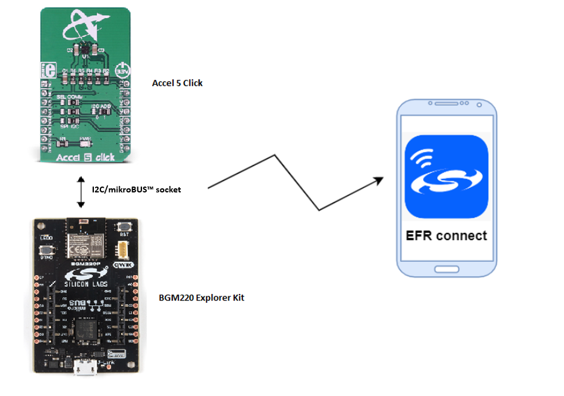
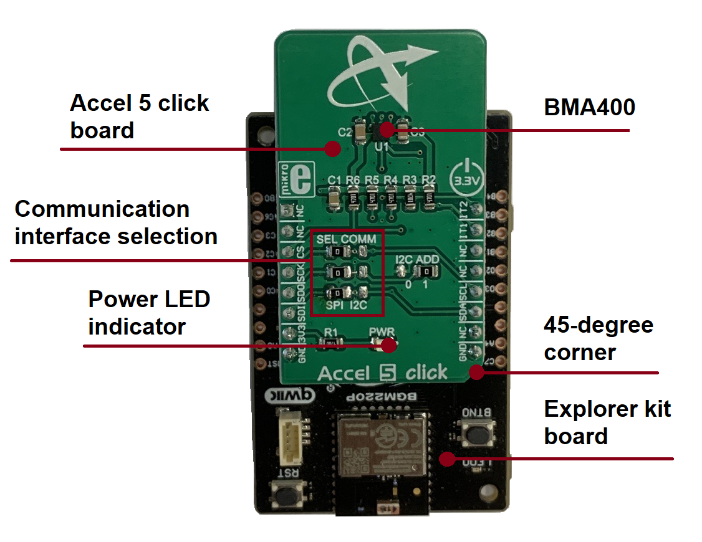
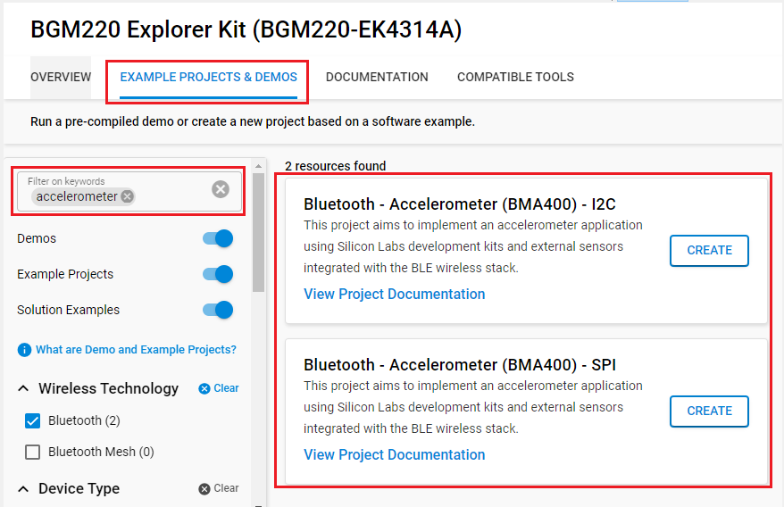
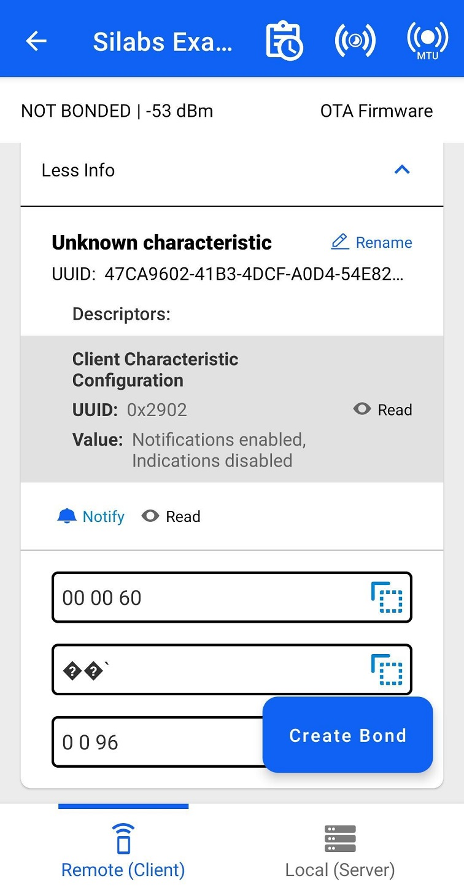
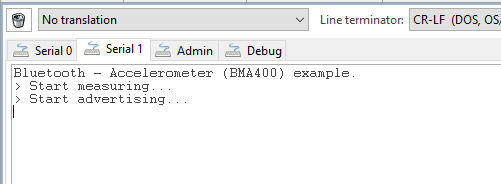

# Bluetooth - Accelerometer (BMA400) #


## Overview ##

This project aims to implement an accelerometer application using Silicon Labs development kits and external sensors integrated with the BLE wireless stack.

The following picture shows the system view of how it works.



## Gecko SDK Suite version ##

- GSDK v4.4.0
- [Third-Party Hardware Drivers v2.0.0.0](https://github.com/SiliconLabs/third_party_hw_drivers_extension)

## Hardware Required ##

- [A BGM220P Explorer Kit board.](https://www.silabs.com/development-tools/wireless/bluetooth/bgm220-explorer-kit)

- [A MikroE Accel 5 Click board.](https://www.mikroe.com/accel-5-click)

**NOTE:**
Tested boards for working with this example:

| Board ID | Description  |
| ---------------------- | ------ |
| BRD2703A | [EFR32xG24 Explorer Kit - XG24-EK2703A ](https://www.silabs.com/development-tools/wireless/efr32xg24-explorer-kit?tab=overview)    |
| BRD4314A | [BGM220 Bluetooth Module Explorer Kit - BGM220-EK4314A](https://www.silabs.com/development-tools/wireless/bluetooth/bgm220-explorer-kit?tab=overview)  |
| BRD4108A | [EFR32BG22 Explorer Kit Board](https://www.silabs.com/development-tools/wireless/bluetooth/bg22-explorer-kit?tab=overview)  |

## Connections Required ##

The mikroBUS Accel 5 Click board can be just "clicked" into its place. Be sure that the board's 45-degree corner matches the Explorer Kit's 45-degree white line.



Make sure that the click board is properly configured (I2C-mode or SPI-mode) by the resistors. Also, if using the I2C interface the application uses by default **I2C address 0x15** as it is the Accel 5 click default (the resistor labeled "I2C ADD" is on the "1". If setting "I2C ADD" resistor "0", the address will be 0x14).

## Setup ##

To test this application, you can either create a project based on an example project or start with a "Bluetooth - SoC Empty" project based on your hardware.

**NOTE**:

- Make sure that the SDK extension is already installed and this repository is added to [Preferences > Simplicity Studio > External Repos](https://docs.silabs.com/simplicity-studio-5-users-guide/latest/ss-5-users-guide-about-the-launcher/welcome-and-device-tabs).

- SDK Extension must be enabled for the project to install the required components.

### Create a project based on an example project ###

1. From the Launcher Home, add your hardware to My Products, click on it, and click on the **EXAMPLE PROJECTS & DEMOS** tab. Find the example project with the filter "accelerometer".

2. Click **Create** button on the example:

    - **Bluetooth - Accelerometer (BMA400) - I2C** if using the I2C interface.  

    - **Bluetooth - Accelerometer (BMA400) - SPI** if using the SPI interface.

    Example project creation dialog pops up -> click Create and Finish and Project should be generated.
    

3. Build and flash this example to the board.

### Start with a "Bluetooth - SoC Empty" project ###

1. Create a **Bluetooth - SoC Empty** project for your hardware using Simplicity Studio 5.

2. Copy all attached files in *inc* and *src* folders into the project root folder (overwriting existing).

3. Import the GATT configuration:

    - Open the .slcp file in the project.

    - Select the **CONFIGURATION TOOLS** tab and open the **Bluetooth GATT Configurator**.
    
    - Find the Import button and import the attached `config/gatt_configuration.btconf` file.

    - Save the GATT configuration (ctrl-s).

4. Open the .slcp file. Select the SOFTWARE COMPONENTS tab and install the software components:

    - [Services] → [IO Stream] → [IO Stream: USART] → default instance name: *vcom*

    - [Services] → [Timers] → [Sleep Timer]

    - [Application] → [Utility] → [Log]

    - [Application] → [Utility] → [Assert]

    - [Platform] → [Driver] → [LED] → [Simple LED] → default instance name: *led0*

    - If using the I2C interface: [Third Party Hardware Drivers] → [Sensors] → [BMA400 - Accel 5 Click (Mikroe) - I2C] → use default configuration

    - If using the SPI interface: [Third Party Hardware Drivers] → [Sensors] → [BMA400 - Accel 5 Click (Mikroe) - SPI] → use default configuration

5. Build and flash the project to your device.

**NOTE**:

- Do not forget to flash a bootloader to your board, see [Bootloader](https://github.com/SiliconLabs/bluetooth_applications/blob/master/README.md#bootloader) for more information.

## How It Works ##

The application is based on the Bluetooth - SoC Empty example. Since the example already has the Bluetooth GATT server, advertising, and connection mechanisms, only minor changes are required.

The GATT changes were adding a new custom service using UUID ```03519cae-ce32-44be-ad30-e2c7d068da03``` that has a characteristic UUID ```27038e55-8e48-b5f1-6e20-84a124258810``` with Read and Indicate properties. The acceleration characteristic is 3 bytes containing 1 byte per X-, Y- and Z-axis accelerations. The axis values are absolute accelerations where 1 g is about value of 98. Typically "0 0 98" when the board is on a level plane like a table.

After resetting, the program will continuously query the interrupt from bma400. Once the interrupt from bma400 occurs, the application reads the current accelerations. If the notification was enabled, the client is notified about the updated values. The sl_bt_evt_gatt_server_characteristic_status_id-event is handling the indication enable/disable control.

## Testing ##

Follow the below steps to test the example:

1. Open the EFR Connect app on your smartphone.

2. Find your device in the Bluetooth Browser, advertising as "Silabs Example", and tap Connect.

3. Find the unknown service, try to read the unknown characteristic and check the value.

4. Enable notify on the unknown characteristic. Try to move your kit in some direction and check the value.

    

5. You can launch the Console that is integrated in Simplicity Studio or can use a third-party terminal tool like TeraTerm to receive the logs from the virtual COM port.

    

*Note*: The LED blinks once if the accelerometer initialization is successful. If the LED stays on, the initialization has been failed. The reason is typically wrong sensor I2C address (see "I2C ADD" resistors) or wrongly configured Click board mode (SPI-mode instead I2C) or if using some own ways to connect the sensor.
