# Bluetooth - AI/ML Hand Signal Recognition #


## Overview ##

This application uses TensorFlow Lite for Microcontrollers to run image classification machine learning models to detect the hand gestures from image data recorded from a Far Infrared Sensor. The detection is visualized using the OLED and the classification results are written to the VCOM serial port.
Additionally, the classification results are transmitted to a connected Bluetooth Low Energy (BLE) client.

The hand gestures:

- Nothing
- Thumbs Up
- Thumbs Down

## Gecko SDK Suite version ##

- GSDK v4.4.0
- [Third Party Hardware Drivers v2.0.0](https://github.com/SiliconLabs/third_party_hw_drivers_extension)

## Hardware Required ##

- [SparkFun Thing Plus Matter - MGM240P - BRD2704A](https://www.sparkfun.com/products/20270)

- [SparkFun Micro OLED Breakout (Qwiic) board](https://www.sparkfun.com/products/14532)

- [Sparkfun MLX90640 IR Array (MLX90640 FIR sensor)](https://www.sparkfun.com/products/14844)

**NOTE:**
Tested boards for working with this example:

| Board ID | Description  |
| ---------------------- | ------ |
| BRD2703A | [EFR32xG24 Explorer Kit - XG24-EK2703A](https://www.silabs.com/development-tools/wireless/efr32xg24-explorer-kit?tab=overview)    |
| BRD2704A | [SparkFun Thing Plus Matter - MGM240P - BRD2704A](https://www.sparkfun.com/products/20270) |
| BRD2601B | [EFR32xG24 Dev Kit - xG24-DK2601B](https://www.silabs.com/development-tools/wireless/efr32xg24-dev-kit?tab=overview)   |

## Connections Required ##

The following picture shows how the system works.

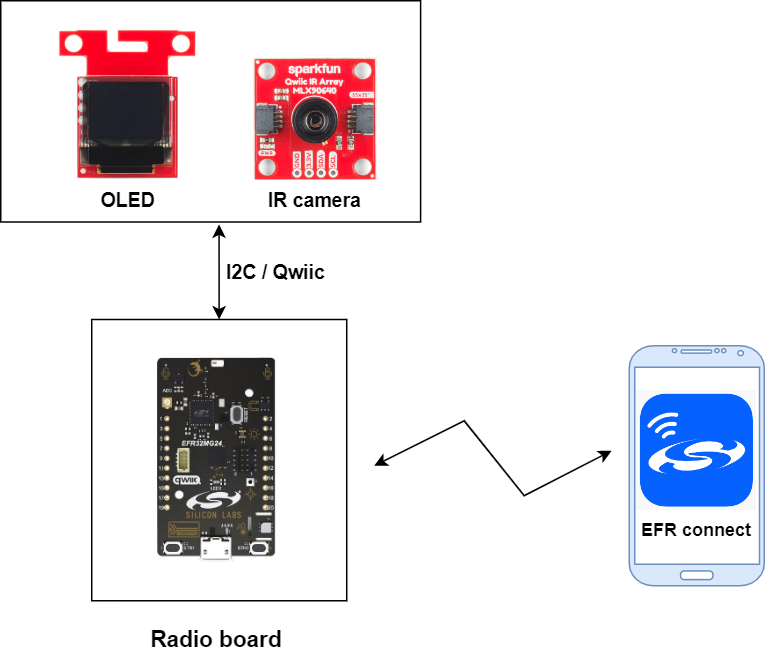

Listed below are the port and pin mappings for working with this example.

- Board: **BRD2704A - Sparkfun Thing Plus Matter - MGM240P**

    | Qwiic Pin | Connection | Pin function |
    |:---:|:-------------:|:---------------|
    | SCL | PB03 | I2C Clock |
    | SDA | PB04 | I2C Data |

- Board: **BRD2703A - EFR32xG24 Explorer Kit - XG24**

    | Qwiic Pin | Connection | Pin function |
    |:---:|:-------------:|:---------------|
    | SCL | PC04 | I2C Clock |
    | SDA | PC05 | I2C Data |

- Board: **BRD2601B - EFR32xG24 Dev Kit - xG24**

    | Qwiic Pin | Connection | Pin function |
    |:---:|:-------------:|:---------------|
    | SCL | PC04 | I2C Clock |
    | SDA | PC05 | I2C Data |

## Setup ##

To test this application, you can either create a project based on an example project or start with a "Bluetooth - SoC Empty" project based on your hardware.

**NOTE:**

- Make sure that the [SDK extension](https://github.com/SiliconLabs/third_party_hw_drivers_extension) is already installed and this repository is added to [Preferences > Simplicity Studio > External Repos](https://docs.silabs.com/simplicity-studio-5-users-guide/latest/ss-5-users-guide-about-the-launcher/welcome-and-device-tabs).

- SDK Extension must be enabled for the project to install the required components.

### Create a project based on an example project ###

1. From the Launcher Home, add your hardware to My Products, click on it, and click on the **EXAMPLE PROJECTS & DEMOS** tab. Find the example project with filter "hand signal".

2. Click **Create** button on the **Bluetooth - AI/ML Hand Signal Recognition (MLX90640)** example. Example project creation dialog pops up -> click Create and Finish and Project should be generated.
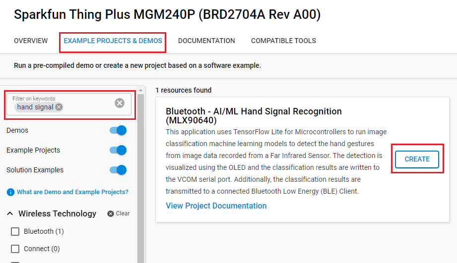

3. Build and flash this example to the board.

### Start with a "Bluetooth - SoC Empty" project ###

1. Create a **Bluetooth - SoC Empty** project for your hardware using Simplicity Studio 5.

2. Copy all attached files in *inc* and *src* folders into the project root folder (overwriting existing).

3. Load the model file into the project:

    Create a tflite directory inside the config directory of the project and then copy the **config/tflite/thumbs_up_and_down.tflite** model file into it. The project configurator provides a tool that will automatically convert .tflite files into sl_tflite_micro_model source and header files.

4. Import the GATT configuration:

   - Open the .slcp file in the project.

   - Select the **CONFIGURATION TOOLS** tab and open the **Bluetooth GATT Configurator**.

   - Find the Import button and import the attached **config/btconf/gatt_configuration.btconf** file.

   - Save the GATT configuration (ctrl-s).

5. Open the .slcp file. Select the SOFTWARE COMPONENTS tab and install the software components:

    - [Services] → [IO Stream] → [IO Stream: EUSART] → default instance name: vcom
    - [Application] → [Utility] → [Log]
    - [Third Party] → [Tiny Printf]
    - [Platform] → [Driver] → [LED] → [Simple LED] → default instance name: **led0**.
    - [Platform] → [Driver] → [I2C] → [I2CSPM] → instance name: **qwiic**. Configure this instance to suit your hardware.

    - [Machine Learning] → [Kernels] → [TensorFlow Lite Micro] → Configure this component to use 9000 Tensor Arena Size.

        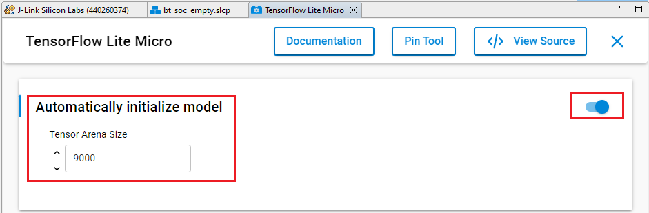

    - [Platform] → [Toolchain] → [Memory configuration] → Set this component to use 10240 Stack size and 12288 Heap size.

        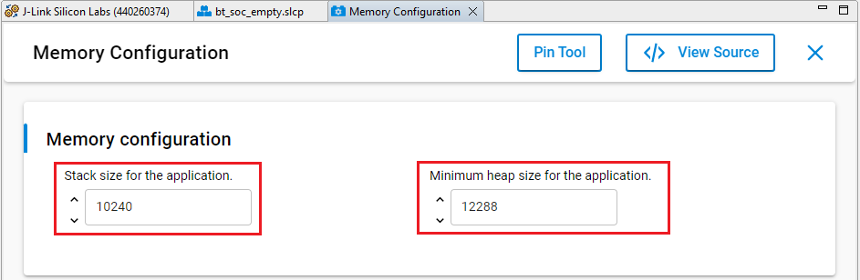

    - [Third Party Hardware Drivers] → [Display & LED] → [SSD1306 - Micro OLED Breakout (Sparkfun) - I2C] → use default configuration

        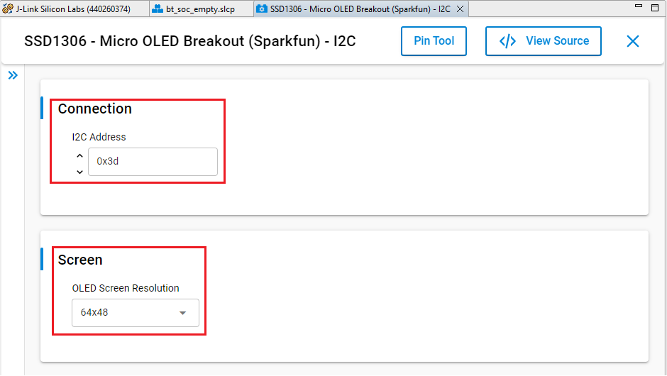

    - [Third Party Hardware Drivers] → [Service] → [GLIB - OLED Graphics Library]

    - [Third Party Hardware Drivers] → [Sensors] → [MLX90640 - IR Array Breakout (Sparkfun)]

6. Build and flash the project to your device.

**NOTE:**

- Do not forget to flash a bootloader to your board, see [Bootloader](https://github.com/SiliconLabs/bluetooth_applications/blob/master/README.md#bootloader) for more information.

## Hand Signal Model ##

### Model overview ###

Before continuing with this project, it is recommended to review the [MLTK Overview](https://siliconlabs.github.io/mltk/docs/overview.html), which provides an overview of the core concepts used by this project.

Image classification is one of the most important applications of deep learning and Artificial Intelligence. Image classification refers to assigning labels to images based on certain characteristics or features present in them. The algorithm identifies these features and uses them to differentiate between different images and assign labels to them [[1]](https://www.simplilearn.com/tutorials/deep-learning-tutorial/guide-to-building-powerful-keras-image-classification-models).

In this project, we have a dataset with three different image types:

- **Thumbs up** - Images of a person's hand making a "like" gesture
- **Thumbs down** - Images of a person's hand making a "dislike" gesture
- **Nothing** - Random images not containing any of the above

We assign an ID, a.k.a. **label**, 0-2, to each of these classes.  
We then "train" a machine learning model so that when we input an image from one of the classes is given to the model, the model's output is the corresponding class ID. In this way, at runtime on the embedded device when the camera captures an image of a person's hand, the ML model predicts its corresponding class ID which the firmware application uses accordingly. i.e.

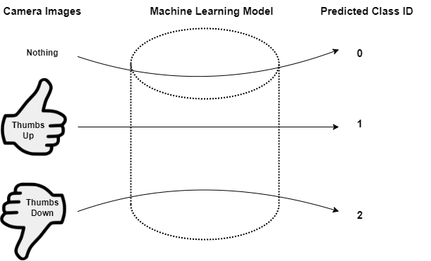

### Dataset Model ###

The most important part of a machine learning model is the dataset that was used to train the model.

Class: [Thumbs up](dataset/thumbs_up.zip)


Class: [Thumbs down](dataset/thumbs_down.zip)


Class: [Nothing](dataset/nothing.zip)


### Model Input ###

The model input should have the shape:  `<image height>  x <image width> x <image channels>`  
where:

- `<image height>`: 24
- `<image width>`: 32
- `<image channels>`: 1

The datatype should be `float32`.

### Model Input Normalization ###

The application supports "normalizing" the input.

If the `samplewise_norm.rescale` [model parameter](https://siliconlabs.github.io/mltk/docs/guides/model_parameters.html#imagedatasetmixin)
is given, then each element in the image is multiplied by this scaling factor, i.e.:

```c
model_input_tensor = img * samplewise_norm.rescale
```

If the `samplewise_norm.mean_and_std` [model parameter](https://siliconlabs.github.io/mltk/docs/guides/model_parameters.html#imagedatasetmixin)
is given, then each element in the image is centered about its mean and scaled by its standard deviation, i.e.:

```c
model_input_tensor = (img  - mean(img)) / std(img)
```

In both these cases, the model input data type must be `float32`.

### Model Output ###

The model output should have the shape `1 x <number of classes>`  
where `<number of classes>` should be the number of classes that the model can detect.

The datatype should be `uint8`:

- 0: Nothing

- 1: Thumbs up

- 2: Thumbs down

### Model Evaluation ###

```txt
Name: thumbs_up_and_down
Model Type: classification
Overall accuracy: 98.795%
Class accuracies:
- thumbs_up = 99.682%
- thumbs_down = 98.457%
- nothing = 98.446%
Average ROC AUC: 99.472%
Class ROC AUC:
- thumbs_up = 99.996%
- nothing = 99.246%
- thumbs_down = 99.174%
```

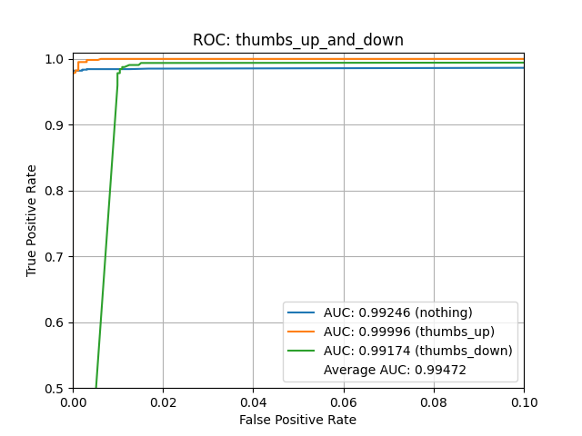
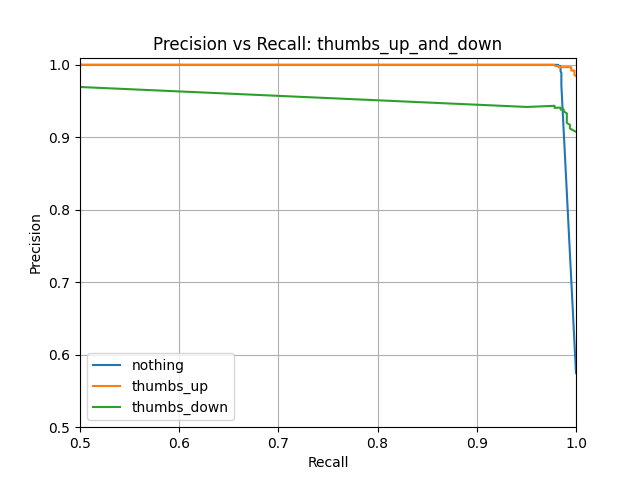
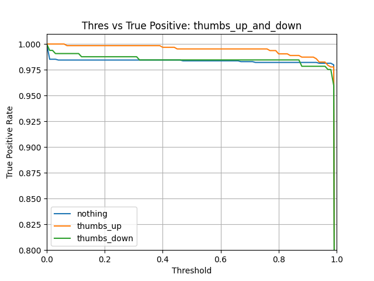
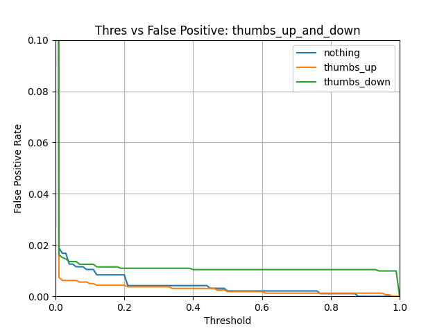
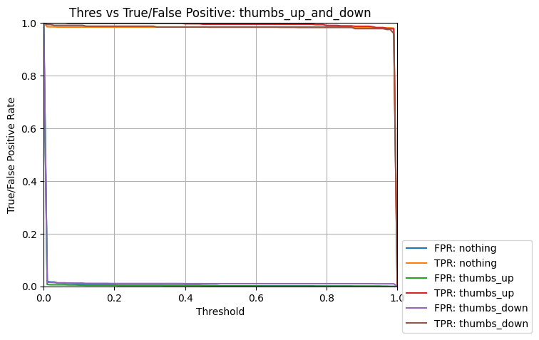

## How It Works ##

### Video ###

[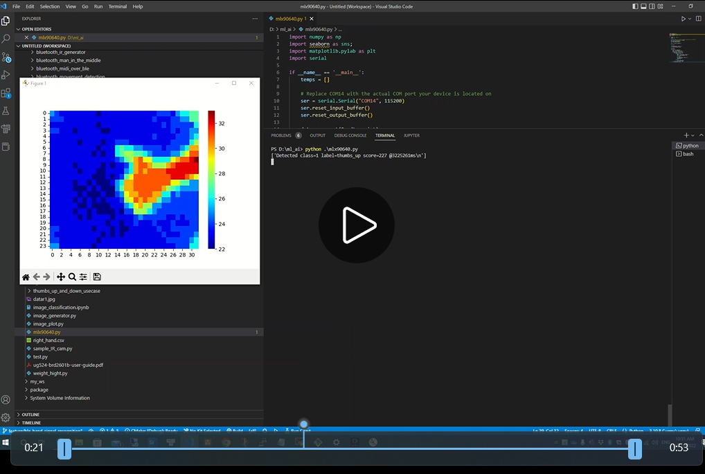](https://youtu.be/xF_SeU2ZNU4)

### System Overview Diagram ###

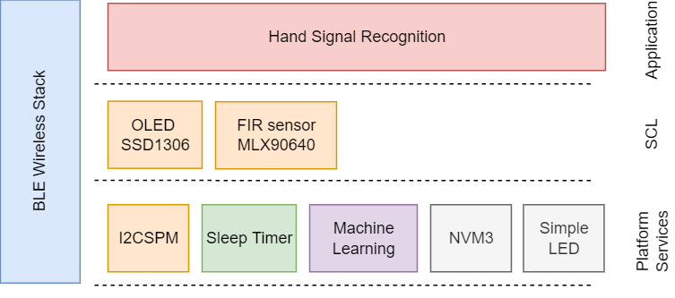

### Application Workflows ##

#### Startup and initialization ####

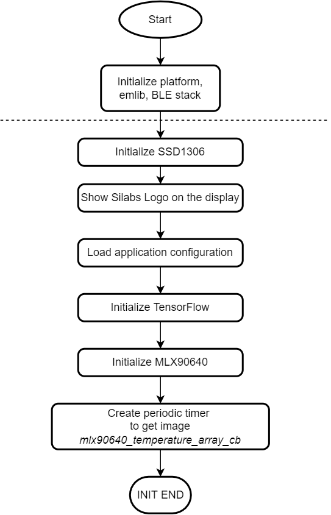

#### Application event loop ####

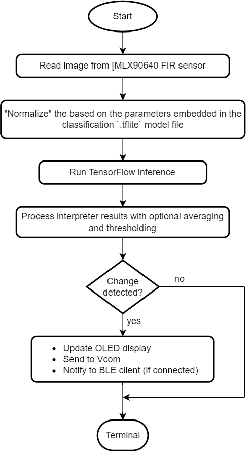

#### User Configuration ####

```c
// These are parameters that are optionally embedded
// into the .tflite model file
typedef struct AppSettings
{
  // norm_img = img * rescale
  float samplewise_norm_rescale;
  // norm_img = (img - mean(img)) / std(img)
  bool samplewise_norm_mean_and_std;
  // enable verbose inference logging
  bool verbose_inference_output;
  // Drop all inference results older than this value
  uint32_t average_window_duration_ms;
  // The minimum number of inference results to average
  uint32_t minimum_count;
  // Minimum averaged model output threshold for a class
  // to be considered detected, 0-255; 255 = highest confidence
  uint8_t detection_threshold;
  // The number of samples that are different than the last detected sample
  // for a new detection to occur
  uint32_t suppression_count;
  // This the amount of time in milliseconds between inference
  uint32_t inference_time;
} app_settings_t;
```

#### Display ####

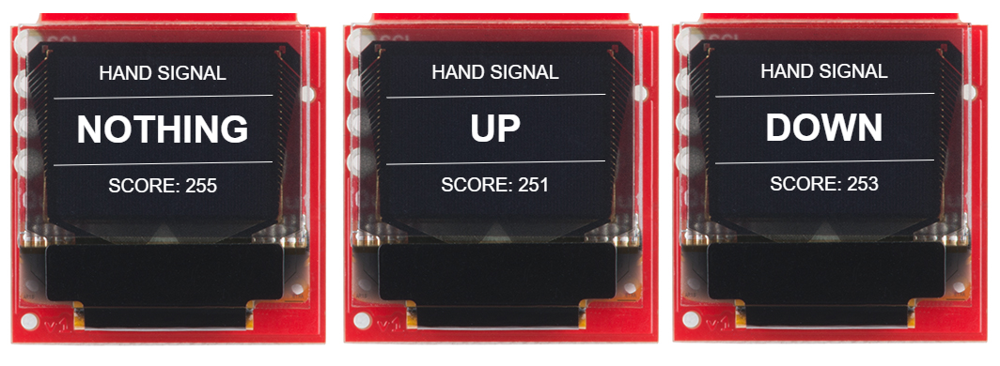

**Note:** score is the probability score of the detected gesture as a uint8 (i.e. 255 = highest confidence that the correct gesture was detected)

#### BLE ####

- **Device Name:** `Hand Signal Recognition`

- **Service:** Hand signal with UUID: `b1448626-7e61-40a5-8ac7-aabae70f3b2a`

Which has one characteristic with the properties: `Read` and `Notify`.
The contents of this characteristic are two bytes with the format:

```txt
<detect_class_id> <score>
```

Where:  

- **detect_class_id** - Is the class ID of the detected gesture (0 - Nothing, 1 - Thumbs up, 2 - Thumbs down)

- **score** - Is the probability score of the detected gesture as a uint8 (i.e. 255 = highest confidence that the correct gesture was detected)

### Testing ###

Upon reset, the application will display the Silicon Labs's logo on the OLED screen for a few seconds. Then you can bring your hand close to the camera and make thumbs up or down. The classification results will be displayed on the OLED screen.

Follow the below steps to test the example with the EFR Connect application:

1. Open the EFR Connect application on your iOS/Android device.

2. Find your device in the Bluetooth Browser, advertising as Air Quality, and tap Connect. Then you need accept the pairing request when connected for the first time.

3. Find the unknown service at the above of OTA service.

4. Try to read, subscribe to the characteristic, and check the value.

    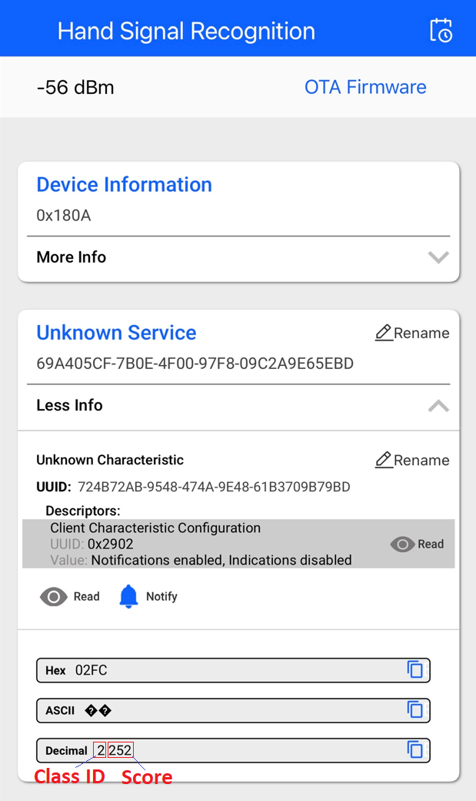

5. You can launch the Console that is integrated into Simplicity Studio or can use a third-party terminal tool like TeraTerm to receive the data from the virtual COM port. Use the following UART settings: baud rate 115200, 8N1, no flow control. You should expect a similar output to the one below.

    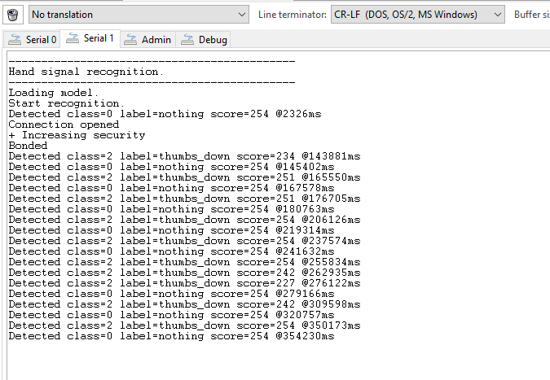
