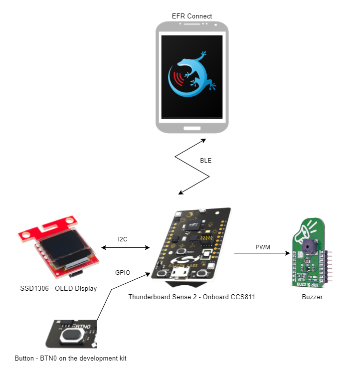
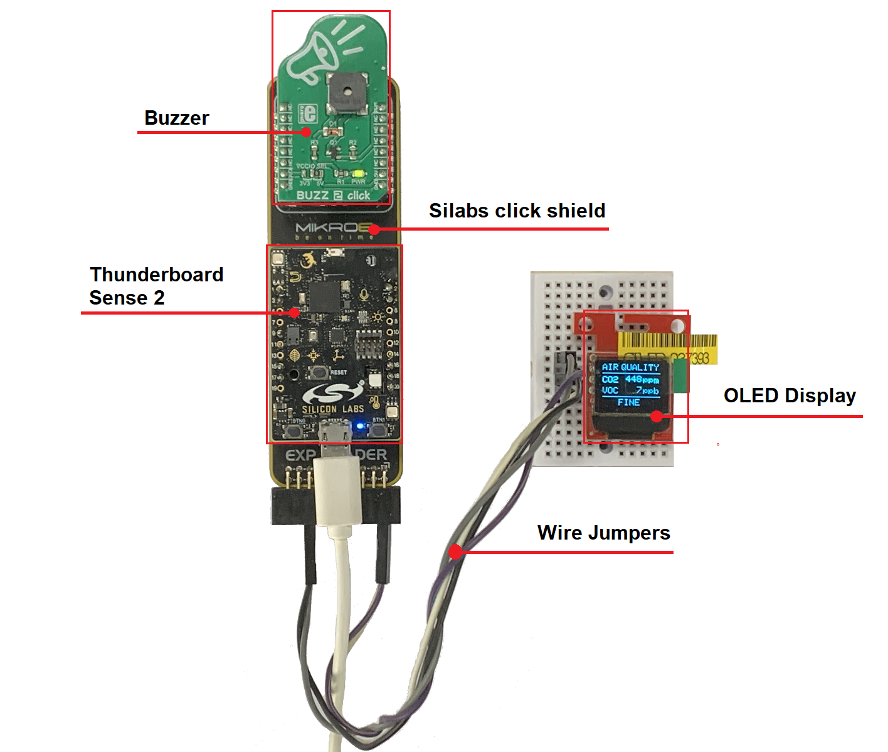
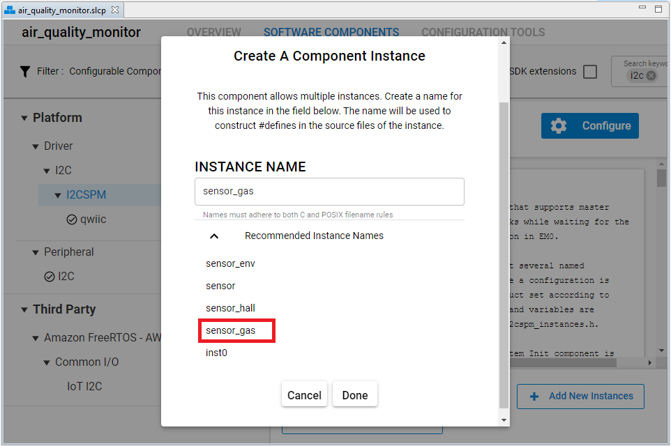
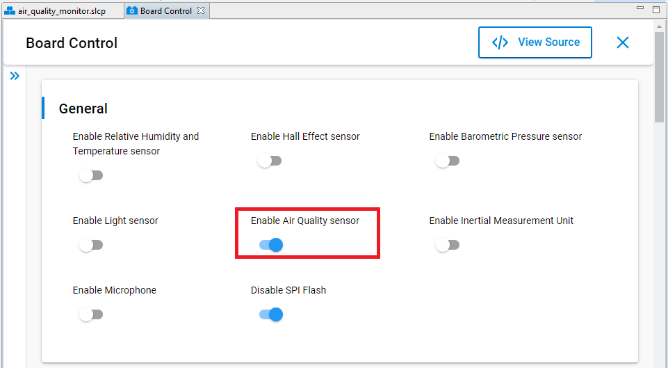
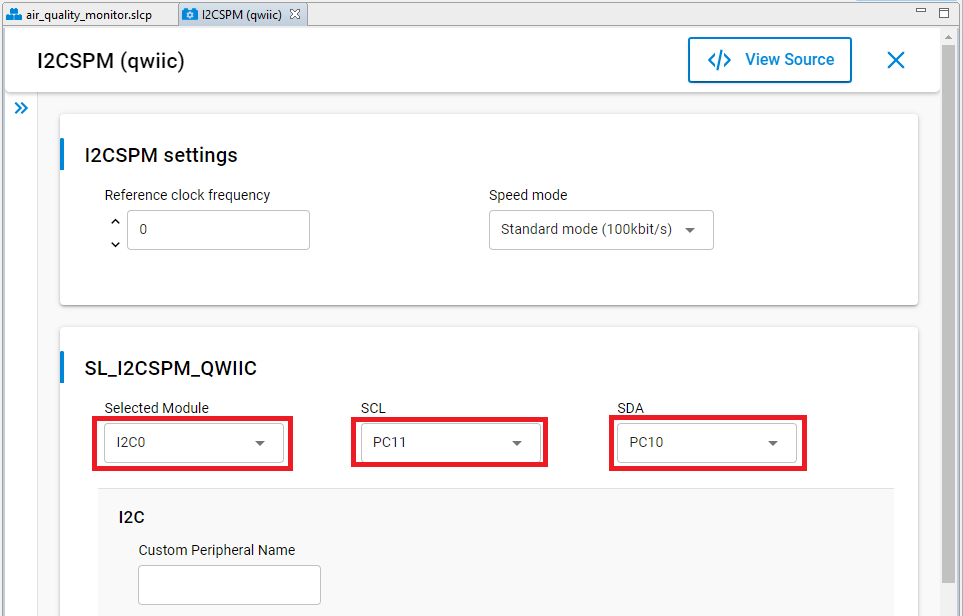
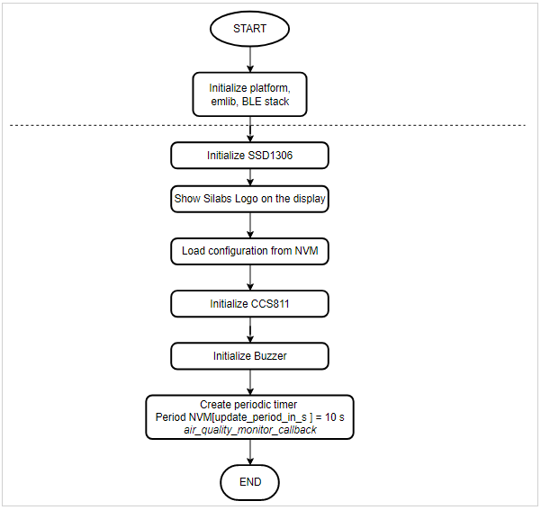
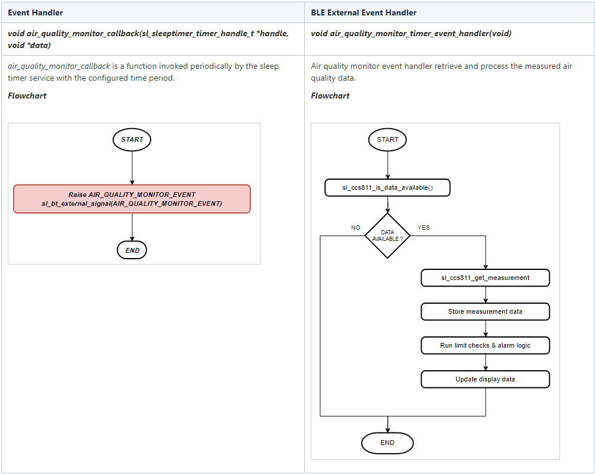
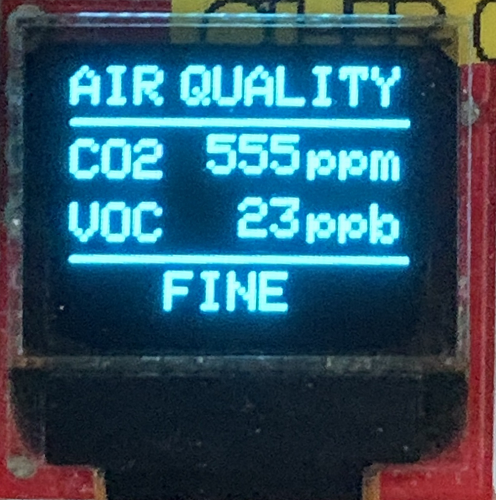
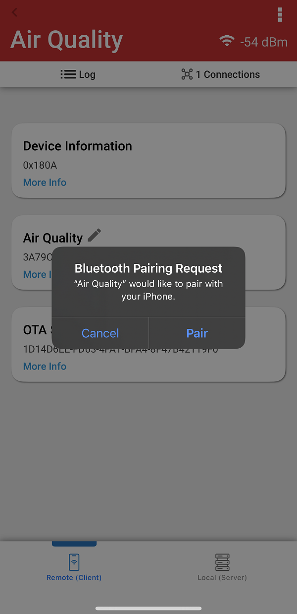
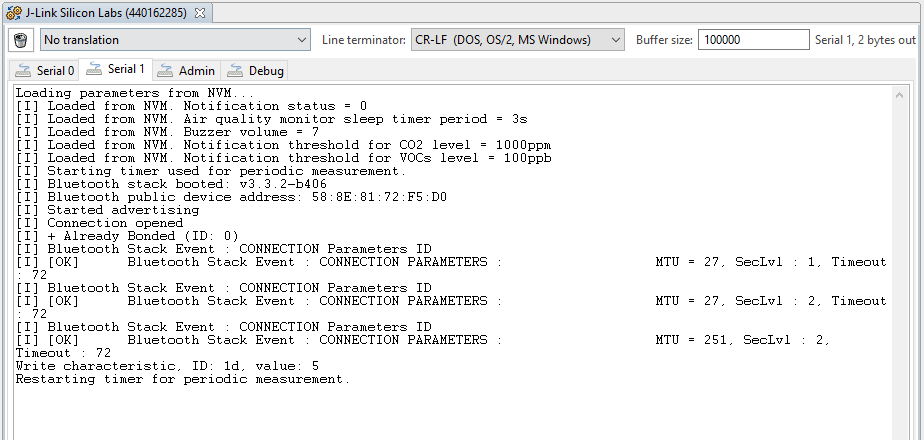

# Air Quality Monitor application with BLE #

## Overview ##

This project aims to implement an air quality monitor and notification system using Silabs development kits and external sensors integrated with the BLE wireless stack.

The block diagram of this application is shown in the image below:

More detailed information can be found in the section [How it works](#how-it-works).

This code example referred to the following code examples. More detailed information can be found here:

- [OLED SSD1306 driver](https://github.com/SiliconLabs/platform_hardware_drivers/tree/master/oled_ssd1306_i2c)
- [Buzzer driver](https://github.com/SiliconLabs/platform_hardware_drivers/tree/master/magnetic_buzzer)
- [Bluetooth security feature](https://github.com/SiliconLabs/bluetooth_stack_features_staging/tree/master/security)

## Gecko SDK Suite version ##

GSDK v4.0.2

## Hardware Required ##

- [Thunderboard Sense 2 Sensor-to-Cloud Advanced IoT Kit](https://www.silabs.com/development-tools/thunderboard/thunderboard-sense-two-kit)

- [SparkFun Micro OLED Breakout (Qwiic) board](https://www.sparkfun.com/products/14532)

- [BUZZ 2 click](https://www.mikroe.com/buzz-2-click)

- [Silabs Click Shield](https://www.mikroe.com/silabs-click-shield)

## Connections Required ##

The hardware connection is shown in the image below:

The Thunderboard Sense 2 and the MikroE Buzzer 2 Click can be plugged into the the Silabs Click Shield directly via the Thunderboard socket and the mikroBus socket respectively. To connect the Thunderboard with the SparkFun Micro OLED Breakout (Qwiic) board we can use some [Wire Jumpers Female to Female](https://www.mikroe.com/wire-jumpers-female-to-female-30cm-10pcs) as shown in the table below:.

| Silabs click Shield markings     |  SparkFun Micro OLED Breakout Pins |
|----------------------------------|:----------------------------------:|
| EXP HEADER PIN 1  - 3V3          |  3V3                               |
| EXP HEADER PIN 2 - GND           |  GND                               |
| EXP HEADER PIN 15 - SDA          |  SDA                               |
| EXP HEADER PIN 16 - SCL          |  SCL                               |

## Setup ##

To test this application, you can either import the provided `bluetooth_air_quality_monitor.sls` project file or start with an empty example project as the following:

1. Create a **Bluetooth - SoC Empty** project for the **Thunderboard Sense 2** using Simplicity Studio 5.

2. Copy all attached files in *inc* and *src* folders into the project root folder (overwriting existing app.c).

3. Import the GATT configuration:

   - Open the .slcp file in the project.

   - Select the **CONFIGURATION TOOLS** tab and open the **Bluetooth GATT Configurator**.

   - Find the Import button and import the attached [gatt_configuration.btconf](config/gatt_configuration.btconf) file.

   - Save the GATT configuration (ctrl-s).

4. Open the .slcp file. Select the SOFTWARE COMPONENTS tab and install the software components:

    - Install **[Platform] > [Driver] > [I2CSPM]** component with the default instance name: **sensor_gas**.

        

    - Set **Enable Air Quality sensor** in **[Platform] > [Board Control]** component.

        

    - Install **[Platform] > [Board Drivers] > [CCS811 - Gas/Air Quality Sensor]** component.

    - Install **[Platform] > [Driver] > [I2CSPM]** component with add new instance name: **qwiic**. Set this component to use I2C0 peripheral, SCL to PC11 pin, SDA to PC10 pin.

        

    - Install **[Platform] > [Peripheral] > [TIMER]** component

    - Install **[Platform] > [IO Stream] > [IO Stream: USART]** component with the default instance name: **vcom**.

    - Install **[Platform] > [Driver] > [Button] > [Simple Button]** component with the default instance name: **btn0**.

    - Install **[Services] > [NVM3] > [NVM3 Default Instance]** component.

    - Install **[Application] > [Utility] > [Log]** component.

5. Build and flash the project to your device.

## How it Works ##

### API overview ###

A detailed description of each function can be found in [doc/doxygen](doc/doxygen/html/modules.html).

### GATT Configurator ###

The application is based on the Bluetooth - SoC Empty example. Since the example already has the Bluetooth GATT server, advertising, and connection mechanisms, only minor changes are required.

The GATT changes were adding a new custom service (Air Quality Monitor) using UUID `3a79c933-c922-45c7-b5e7-9bdefd126dd9` which are 5 characteristics:

- **Notification**: UUID `ec26adea-75af-409d-b267-51a4e753e9ea`

  - [**Readable**] - Get notification status

  - [**Writable with response**] - Set notification status

- **Buzzer volume**: UUID `c5fd8492-9c55-4c18-b761-99b8cf9bca77`

  - [**Readable**] - Get configured buzzer volume

  - [**Writable with response**] - Set buzzer volume (0-10)

- **CO2**: UUID `1b621ff2-b789-4b7c-985f-b62a50802bbf`

  - [**Readable**] - Get latest measured CO2 level (ppm)

  - [**Writable with response**] - Set CO2 Threshold (ppm)

- **VOCs**: UUID `ec099dd9-7887-4ca6-a169-92a5e9ed7926`

  - [**Readable**] - Get latest measured VOCs level (ppb)

  - [**Writable with response**] - Set VOCs Threshold (ppb)

- **Measurement update period**: UUID `98205b49-a9e1-4bfc-a18d-60d36798397f`

  - [**Readable**] - Get configured measurement update period in s (1-30)

  - [**Writable with response**] -  Set configured measurement update period in s (1-30)

### Air Quality Monitor Implementation ###

The Initialization software flow is as follows:

1. First, the software initializes the peripherals, the Bluetooth stack, and logging to the virtual COM port.

2. After the *sl_bt_evt_system_boot_id* event arrives, it sets up the security manager to bond with an iOS/Android device. Then, it starts advertising.

3. Every time the timer expires, an Air quality monitor event handler retrieve and process the measured air quality data as described below:

### OLED Display ###

Measured values are displayed on the OLED display:

- CO2 (ppm)

- VOCs (ppb)

- Air quality that matches with the levels described in the following document: [calculating an actionable indoor air quality index](https://www.breeze-technologies.de/blog/calculating-an-actionable-indoor-air-quality-index/).

More detailed information can be found in the section [Testing](#testing).

### Testing ###

Upon reset, the application will display the Silicon Labs's logo on the OLED screen for five seconds. Then you can check the measured CO2 and VOCs values on the OLED screen. You should expect a similar output to the one below.

**Note:** The measured CO2 and VOCs values will be more accurate after the sensor is warmed up.

Follow the below steps to test the example with the EFR Connect app:

1. Open the EFR Connect app on your iOS/Android device.

2. Find your device in the Bluetooth Browser, advertising as Air Quality, and tap Connect. Then you need accept the pairing request when connected for the first time.

    

3. Find the unknown service at the above of the OTA service.

4. Try to read, write, re-read the characteristics, and check the value.

5. You can launch the Console that is integrated on Simplicity Studio or can use a third-party terminal tool like TeraTerm to receive the data from the virtual COM port. Use the following UART settings: baud rate 115200, 8N1, no flow control. You should expect a similar output to the one below.

    

## .sls Projects Used ##

- [bluetooth_air_quality_monitor.sls](SimplicityStudio/bluetooth_air_quality_monitor.sls)
