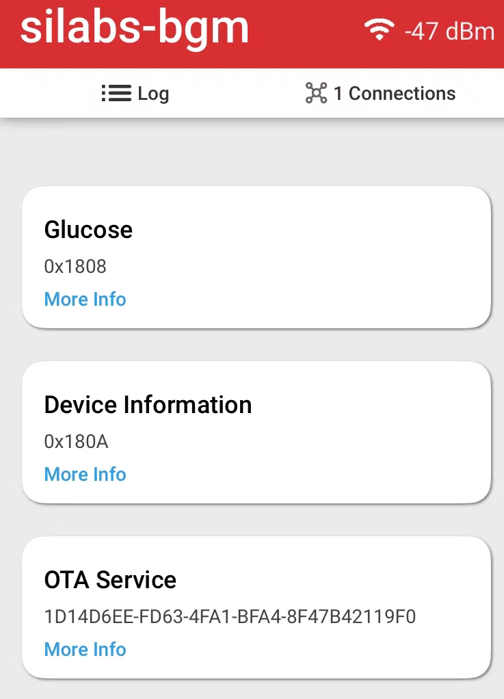
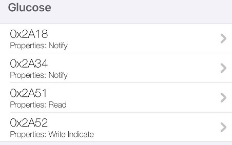
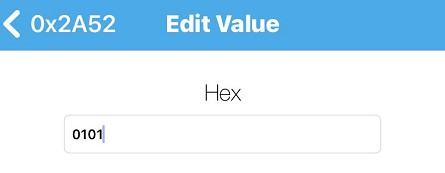
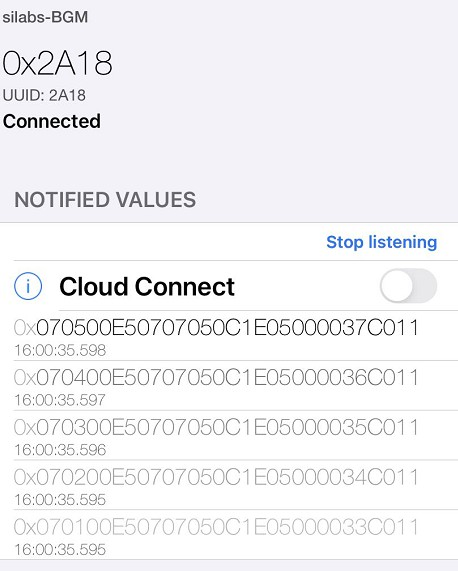
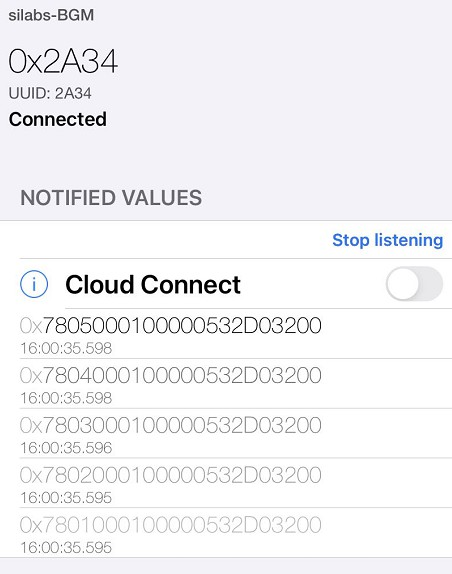
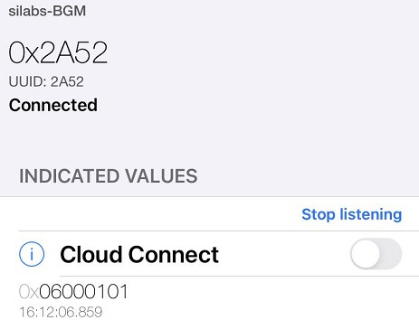

# Health Care - Blood Glucose Meters  #

## Overview ##

This project shows an example of **Blood Glucose Meters** using the **Thunderboard EFR32BG22**. Please refer to [Bluetooth SIG BGM introduction.md](doc/Bluetooth SIG BGM introduction.md) in doc folder for more information about BGM.

The project implemented the Bluetooth Glucose Profile.

## Simplicity Studio and Gecko SDK Suite version ##

Simplicity Studio V5.3.1.0 and GSDK v4.0.1, if you use newer GSDK, it may need some code modification.

## Hardware Required ##

[Thunderboard EFR32BG22](https://www.silabs.com/development-tools/thunderboard/thunderboard-bg22-kit)

## Software Required

LightBlue app(version 4.2.1)/EFR connect app(version 2.4.2)

## How It Works ##

### setup

1. Get a Thunderboard EFR32BG22, connect it to a PC,
2. Flash bootloader.s37 and Bluetooth - Blood Glucose Meter.s37 in SimplicityStudio folder,
3. If the phone was bonded with the device before,  please remove the device from the Bluetooth setting in the phone.

### Test

Open EFR connect app, filter silabs-BGM, connect it.

There are two major services: Glucose and the OTA service.

##### OTA service

Used for OTA upgrade, please refer to [AN1086: Using the Gecko Bootloader with the Silicon Labs Bluetooth® Applications](https://www.silabs.com/documents/public/application-notes/an1086-gecko-bootloader-bluetooth.pdf) for more information.

##### BGM service

There are 4 characteristics:

1. Glucose Measurement characteristic: UUID 0x2A18
2. Glucose Measurement Context characteristic: UUID 0x2A34
3. Glucose Feature characteristic: UUID 0x2A51
4. Record Access Control Point characteristic: UUID 0x2A52

*Please refer to BGM specifications in doc folder for below process*

1. Press the button in the Thunderboard 5 times to simulate generating 5 BGM measurement records,

2. Open Lightblue app, connect silabs-BGM,

3. Set Notify of 0x2A18 characteristic(**Glucose Measurement characteristic**), 

   Set Notify of 0x2A34 characteristic(**Glucose Measurement Context characteristic**), 

   Set indicate of 0x2A52 characteristic(**Record Access Control Point characteristic**),

4. Write "0101" to 0x2A52 characteristic(**Record Access Control Point characteristic**), it means read all records, you can find this test case in Glucose.service.TS.1.0.9 section 4.9.1: GLS/SEN/SPR/BV-01-C [Report Stored Records - All records]), 

5. There will be 5 notifications in 0x2A18 characteristic(**Glucose Measurement characteristic**), which means 5 Glucose Measurement records

6. There will be 5 notifications in 0x2A34 characteristic(**Glucose Measurement Context characteristic**), which means 5 Glucose Measurement Context values

   

7. Finally 1 indication in  0x2A52 characteristic(**Record Access Control Point characteristic**) shows the process is completed.

# Create from an SoC example #

1. Create a SoC empty project,
2. Install IO stream: USART(instance name: vcom), Log, Simple timer service,
5. Install Simple Button(instance name: btn0),
6. Import the BGM.btconf,
7. copy all files in src folder to your SoC empty folder
8. build the project and flash to the Thunderboard

## .sls Projects Used ##

Bluetooth - Blood Glucose Meter.sls - This is the project. 

Also precompiled binaries in S-Record format (.s37) are included for the projects above test the applications instantly. The files can be programmed using for example _Simplicity Studio Flash Programmer_ tool or _Simplicity Commander_ application. Remember to flash also the bootloader at least once.

# More information #

## PTS test ##

You can download BGM spec and test case in https://www.bluetooth.com/specifications/specs/, or in doc folder in this repository.

Please refer Bluetooth SIG BGM introduction.md in doc folder for more information about how to test.
