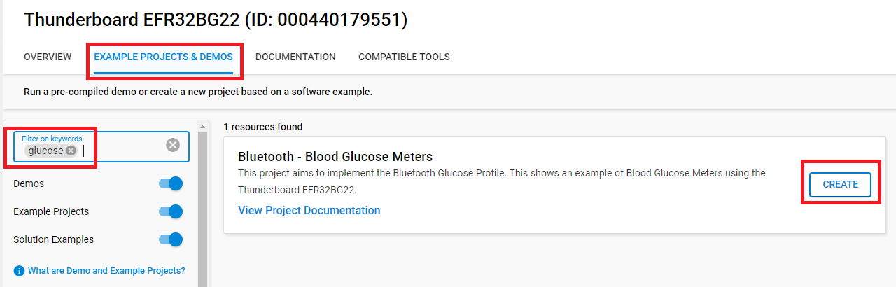
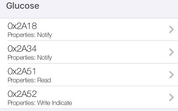
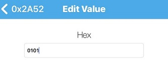
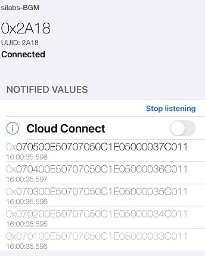
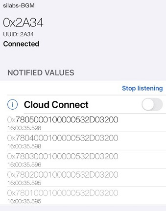
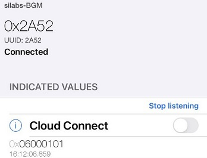
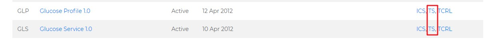

# Bluetooth - Blood Glucose Meters

## Overview

This project shows an example of **Blood Glucose Meters** using the **Thunderboard EFR32BG22**. Please refer to [Bluetooth SIG BGM introduction.md](./doc) for more information about BGM.

The project implemented the Bluetooth glucose meter, which has the ability to wirelessly connect to your smart device to conveniently capture glucose data and provide added health monitoring features.

## SDK version

- [SiSDK v2024.12.0](https://github.com/SiliconLabs/simplicity_sdk)

## Software Required

- [Simplicity Studio v5 IDE](https://www.silabs.com/developers/simplicity-studio)
- [LightBlue app](https://punchthrough.com/lightblue)

## Hardware Required

- 1x [Thunderboard EFR32BG22](https://www.silabs.com/development-tools/thunderboard/thunderboard-bg22-kit)
- 1x smartphone running the 'LightBlue' app

## Connections Required

- Connect the Thunderboard EFR32BG22 to the PC through a micro USB cable.

## Setup

To test this application, you can either create a project based on an example project or start with a "Bluetooth - SoC Empty" project based on your hardware.

**NOTE**:

- Make sure that the [bluetooth_applications](https://github.com/SiliconLabs/bluetooth_applications) repository is added to [Preferences > Simplicity Studio > External Repos](https://docs.silabs.com/simplicity-studio-5-users-guide/latest/ss-5-users-guide-about-the-launcher/welcome-and-device-tabs).

### Create a project based on an example project

1. From the Launcher Home, add your hardware to My Products, click on it, and click on the **EXAMPLE PROJECTS & DEMOS** tab. Find the example project filtering by "glucose".

2. Click **Create** button on **Bluetooth - Blood Glucose Meters** examples. Example project creation dialog pops up -> click Create and Finish and Project should be generated.

3. Build and flash this example to the board.

### Start with a "Bluetooth - SoC Empty" project

1. Create a **Bluetooth - SoC Empty** project for your hardware using Simplicity Studio 5.

2. Copy all attached files in *inc* and *src* folders into the project root folder (overwriting existing).

3. Import the GATT configuration:
   - Open the .slcp file in the project.
   - Select the CONFIGURATION TOOLS tab and open the "Bluetooth GATT Configurator".
   - Find the Import button and import the `gatt_configuration.btconf` file (located in the bluetooth_blood_glucose_meters/config folder).

4. Open the .slcp file. Select the **SOFTWARE COMPONENTS** tab and install the software components:
   - [Services] → [IO Stream] → [IO Stream: USART] → default instance name: **vcom**
   - [Application] → [Utility] → [Log]
   - [Platform] → [Driver] → [Button] → [Simple Button] → default instance name: **btn0**
   - [Application] → [Utility] → [Timer]

5. Build and flash this example to the board.

**Note:**

- A bootloader needs to be flashed to your board if the project starts from the "Bluetooth - SoC Empty" project, see [Bootloader](https://github.com/SiliconLabs/bluetooth_applications/blob/master/README.md#bootloader) for more information.

## How It Works

There are two major services: Glucose and the OTA service.

### OTA service

Used for OTA upgrade, please refer to [AN1086: Using the Gecko Bootloader with the Silicon Labs Bluetooth Applications](https://www.silabs.com/documents/public/application-notes/an1086-gecko-bootloader-bluetooth.pdf) for more information.

### BGM service

There are 4 characteristics:

1. **Glucose Measurement** characteristic: UUID 0x2A18
2. **Glucose Measurement Context** characteristic: UUID 0x2A34
3. **Glucose Feature** characteristic: UUID 0x2A51
4. **Record Access Control Point** characteristic: UUID 0x2A52

*Please refer to the BGM specifications in doc folder and follow the below steps.*

1. Press the **button0** in the Thunderboard 5 times to simulate generating 5 BGM measurement records.

2. Open the Lightblue app on your iOS/Android device. Find your device in the Bluetooth Browser, advertising as 'silabs-BGM', and tap Connect.

3. Find the Glucose service,
  
   set Notify of 0x2A18 characteristic(**Glucose Measurement characteristic**),

   set Notify of 0x2A34 characteristic(**Glucose Measurement Context characteristic**),

   

   set Indicate of 0x2A52 characteristic(**Record Access Control Point characteristic**)

4. Write "0101" to 0x2A52 characteristic(**Record Access Control Point characteristic**), it means read all records, you can find this test case in Glucose.service.TS.1.0.9 section 4.9.1: GLS/SEN/SPR/BV-01-C [Report Stored Records - All records],

   

5. There will be 5 notifications in 0x2A18 characteristic(**Glucose Measurement characteristic**), which means 5 Glucose Measurement records

   

6. There will be 5 notifications in 0x2A34 characteristic(**Glucose Measurement Context characteristic**), which means 5 Glucose Measurement Context values

   

7. Finally 1 indication in  0x2A52 characteristic(**Record Access Control Point characteristic**) shows the process is completed.

   

## More information

### PTS test

You can download BGM spec and test case in <https://www.bluetooth.com/specifications/specs/>, or in doc folder in this repository.

Please refer Bluetooth SIG BGM introduction.md in doc folder for more information about how to test.

## Reference

All of the specifications of BGM can be found at the Bluetooth SIG website <https://www.bluetooth.com/specifications/specs/>, search BGM

Click GLP and GLS to download the specification, click TS to download the test case specification.
