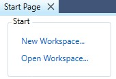

# Bluetooth SIG BGM introduction

This document is part of Silicon Labs Healthcare BGM project. We use [Thunderboard EFR32BG22](https://www.silabs.com/development-tools/thunderboard/thunderboard-bg22-kit) to send the data to the smartphone.

This document provides an overview of the following aspects of BGM:

1. What is BGM,
2. The BGM service/profile specification,  
3. How to test BGM service/profile

# What is BGM

1. A Blood Glucose Meter (BGM) is a medical device for determining the approximate concentration of glucose in the blood, and send the data to smartphone through Bluetooth link.

   

   ***This document focuses on Bluetooth part, not on the biological sensors and AFE. Generally, there are no common biological sensor and AFE solution for the BGM/CGM product in the market; some of the manufacturers have their own proprietary solutions.***

2. the measurement unit is mmol/l(millimole per litre) or mg/dl(milligrams per deciliter), the conversion is:

   ```value [mg/dl] = 18.02 * value [mmol/l]```

3. The normal blood sugar (glucose) level for a healthy adult (without diabetes) should be less than 3.9-6.1 mmol/l (70-110 mg/dl) before meals.

# SIG BGM service/profile

In this section, I will explain the structure of the SIG BGM service/profile and how it works.

Basically, the profile contains all the characteristics and behaviors of the collector and the sensor, while the service focuses only on the characteristics and behaviors of the sensor.

## The structure of SIG BGM service/profile

The SIG published Glucose Service and Glucose Profile, and in additional, there are test case specifications called CLS.TS and CLP.TS. these documents are in doc folder of this repo.

The profile defines two roles: BGM Sensor and Collector. The BGM Sensor is the device that measures the glucose level concentration and the Collector is the device that receives the glucose measurement and other related data from a BGM Sensor.

- The Glucose Sensor shall be a GATT Server.

- The Collector shall be a GATT Client.
This profile shall operate over an **LE transport only**


In the real situation, the collector maybe an APP runs on a smartphone. 

Below is a SIG BGM service, it includes 4 characteristics.


The Collector shall write to the RACP characteristic using one of the supported Op Codes to request a Glucose Sensor to perform a procedure. This shall include an Operator and Operand that is valid within the context of that Op Code.

## How SIG BGM works 

Below is the basic procedure of how BGM works.


1. Prepare one BGM sensor and one collector, The BGM Sensor shall instantiate one and only one BGM Service.

2. The BGM Sensor will enter a GAP Connectable Mode and start advertising when it has data to send to the Collector. The Collector will typically execute a GAP connection establishment procedure such that it is scanning for the BGM Sensor. 
3. When a connection is established,  the Collector shall perform the GATT Discovery the service and characteristics, include below:

+ Glucose Measurement Characteristic
+ Glucose Measurement Context Characteristic
+ Glucose Feature Characteristic
+ Record Access Control Point Characteristic

4. The Collector shall bond with the BGM Sensor,
5. The Collector shall configure the Client Characteristic Configuration descriptor to enable notifications or indications as needed.

There are plenty of procedures in BGM, below are some basic descriptions:

4. When the **Report Number** of All Stored Records Op Code is written to the Record Access Control Point, the Server shall calculate and respond with a record count to Record Access Control Point Characteristic.
5. When the **Report Stored Records** Op Code is written to the Record Access Control Point, the Server shall notify the selected set of stored patient records to Glucose Measurement Characteristic.
6. When the **Abort** Operation Op Code is written to the Record Access Control Point, the Server shall stop any RACP procedures currently in progress and shall make a best effort to stop sending any further data.
7. When the **Delete** Stored Records Op Code is written to the Record Access Control Point, the Server may delete the specified patient records.

# How to test BGM service/profile

[Thunderboard EFR32BG22](https://www.silabs.com/development-tools/thunderboard/thunderboard-bg22-kit) acts as BGM sensor role. Fore more information please refer to README.md in this repo.

***This document focus on how to use PTS, not the whole qualification process.***

## 1. PTS setup

The test includes hardware and software. The software is Profile Tuning Suit(PTS), you can go to [SIG website](https://apps.bluetooth.com/mysettings#/ptsdownload) to download, the latest version is 8.1.2, please note the PTS may have some issues, you can raise a ticket through PTS(click HELP->PTS issue).

The hardware is PTS dongle, you can purchase it in [SIG store](https://store.bluetooth.com/). The dongle acts as BGM collector. 

This document use the new LE only dongle(up to core v5.2 supported).


In additional, you need to download [PTS Firmware Upgrade Software](https://www.bluetooth.com/develop-with-bluetooth/qualification-listing/qualification-test-tools/profile-tuning-suite/), in case the dongle does not have the latest firmware.

## 2. Create a test workspace

Firstly, plug in the dongle to the PC, open PTS software,

then click "connect" to the dongle.


create a new workspace for testing.



make sure the Thunderboard is working now, then choose the BGM sensor, in this case, the BGM sensor's name is "silabs-BGM", click next, 


in this test, we select GLP and GLS to the test Suite, click finish.


remember select TSPC_ALL to unlock all the test cases.


expand all the test cases in this panel, you should pass all the BGM service/profile as shown below,


the whole picture is below,


# 3. start to test

The test case is associated with the SIG test suite, let's take GLS/SEN/SPR/BV-01-C as an example. It is described in  GLS.TS section 4.9.1 GLS/SEN/SPR/BV-01-C [Report Stored Records - All records].

After test, the test item will have a PASS flag shown below,


if something got wrong, the test item will have a failed flag as below,


# Reference

All of the specifications of BGM can be found at the Bluetooth SIG website https://www.bluetooth.com/specifications/specs/, search BGM, 


click GLP and GLS to download the specification, click TS to download the test case specification.

For your convenience, all the documents are in the doc folder of this repo.

