# Bluetooth - BTHome v2 - Humidity and Temperature Monitor (SHTC3) #

## Overview ##

The example showcases the implementation of BTHome support for Silabs development kits.

The example application illustrates how BTHome can be effectively utilized with Silabs development kits to communicate measured humidity and temperature values using SparkFun Humidity Sensor Breakout (SHTC3) to a HomeAssistant system, which is running on a Raspberry Pi 4. This demonstration will provide developers with insights into integrating BTHome with Silabs hardware for IoT applications.

The BTHome v2 sensor device is a BGM220 Explorer Kit that reads humidity and temperature values using SparkFun Humidity Sensor Breakout (SHTC3) via I2C communication and sends Bluetooth Low Energy advertisement packets in the BTHome v2 format.

Raspberry Pi 4 runs a Home Assistant OS that scans for and detects BTHome v2 devices. You can use the Home Assistant application on your smartphone to communicate with Raspberry Pi 4 to get advertisement packets of the BTHome v2 sensor device, parse those packets and display sensor values.

## Gecko SDK Suite Version ##

- GSDK v4.3.1

- [Third Party Hardware Drivers v1.8.0](https://github.com/SiliconLabs/third_party_hw_drivers_extension)

## Hardware Required ##

- [**BGM220-EK4314A** BGM220 Bluetooth Module Explorer Kit](https://www.silabs.com/development-tools/wireless/bluetooth/bgm220-explorer-kit)

- [SparkFun Humidity Sensor Breakout - SHTC3 (Qwiic)](https://www.sparkfun.com/products/16467)

**NOTE:**
Tested boards for working with this example:

| Board ID | Description  |
| -------- | ------ |
| BRD2601B | [EFR32xG24 Dev Kit - xG24 - DK2601B](https://www.silabs.com/development-tools/wireless/efr32xg24-dev-kit?tab=overview)  |
| BRD2703A | [EFR32xG24 Explorer Kit - xG24-EK2703A ](https://www.silabs.com/development-tools/wireless/efr32xg24-explorer-kit?tab=overview)    |
| BRD4314A | [BGM220 Bluetooth Module Explorer Kit - BGM220-EK4314A](https://www.silabs.com/development-tools/wireless/bluetooth/bgm220-explorer-kit?tab=overview)  |
| BRD4108A | [EFR32BG22 Explorer Kit Board - BG22-EK4108A](https://www.silabs.com/development-tools/wireless/bluetooth/bg22-explorer-kit?tab=overview)  |
| BRD2704A | [SparkFun Thing Plus Matter - MGM240P](https://www.sparkfun.com/products/20270)  |

## Connections Required ##

The following picture shows the connection for this application:

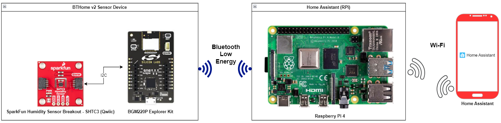

## Setup ##

To test this application, you can either create a project based on an example project or start with a "Bluetooth - SoC Empty" project based on your hardware.

### Create a project based on an example project ###

1. From the Launcher Home, add your product name to My Products, click on it, and click on the **EXAMPLE PROJECTS & DEMOS** tab. Find the example project with the filter **"bthome"** and **"shtc3"**.

2. Click the **Create** button on **Bluetooth - BTHome v2 - Humidity and Temperature Monitor (SHTC3)** example. Example project creation dialog pops up -> click Create and Finish and the project should be generated.
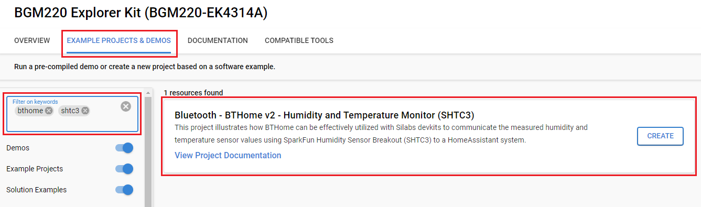

3. Build and flash this example to the board.

### Start with a "Bluetooth - SoC Empty" project ###

1. Create a **Bluetooth - SoC Empty** project for your hardware using Simplicity Studio 5.

2. Copy the `src/app.c` file into the project root folder (overwriting the existing file).

3. Install the software components:

    - Open the .slcp file in the project

    - Select the SOFTWARE COMPONENTS tab

    - Install the following components:

      - [Services] → [IO Stream] → [Driver] → [IO Stream: USART] → default instance name: vcom.

      - [Application] → [Utility] → [Log]
  
      - [Third-Party Hardware Drivers] → [Services] → [BTHome v2]

      - [Third-Party Hardware Drivers] → [Sensors] → [SHTC3 - Temp&Hum 9 Click (Mikroe)]
  
      - [Driver] → [I2C] → [I2CSPM] → using instance name: mikroe.

        **Note:**

        - If you are using **[EFR32xG24 Dev Kit - xG24 - DK2601B](https://www.silabs.com/development-tools/wireless/efr32xg24-dev-kit?tab=overview)** or **[Sparkfun Thing Plus Matter - MGM240P](https://www.sparkfun.com/products/20270)**, you have to create a new instance for **I2CSPM** and name it **"mikroe"**. Then configure this instance as follows:
        
            **EFR32xG24 Dev Kit - xG24**
            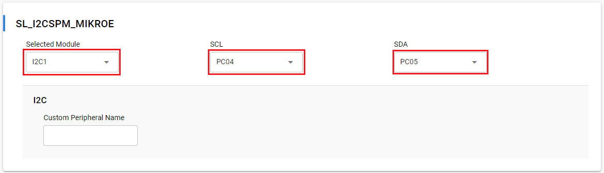

            **Sparkfun Thing Plus Matter - MGM240P**
            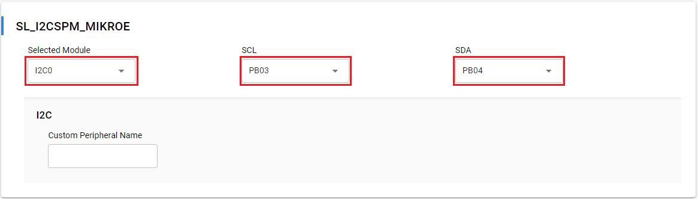

4. Install **printf float**

    - Open Properties of the project.

    - Select C/C++ Build → Settings → Tool Settings → GNU ARM C Linker → General. Check Printf float.
    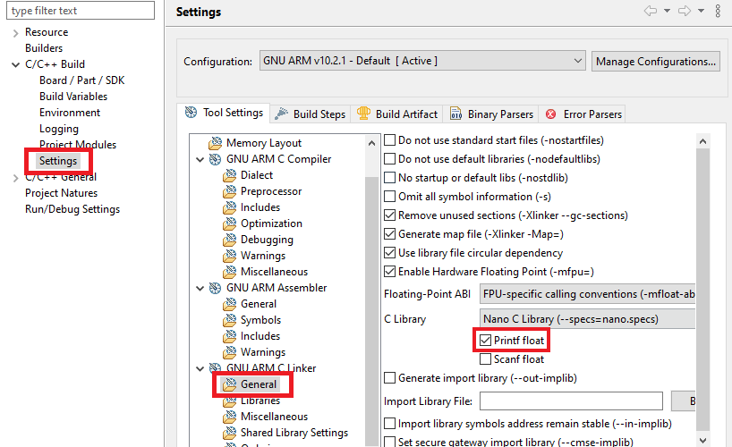

5. Build and flash the project to your board.

**Note:**

- Make sure the [Third Party Hardware Drivers extension](https://github.com/SiliconLabs/third_party_hw_drivers_extension) is added to the required SDK: [Preferences > Simplicity Studio > SDKs](https://github.com/SiliconLabs/third_party_hw_drivers_extension/blob/master/README.md#how-to-add-to-simplicity-studio-ide).

- SDK Extension must be enabled for the project to install **BTHOME v2** components.

- Do not forget to flash a bootloader to your board, see [Bootloader](https://github.com/SiliconLabs/bluetooth_applications/blob/master/README.md#bootloader) for more information.

## How It Works ##

### Application Initialization ###

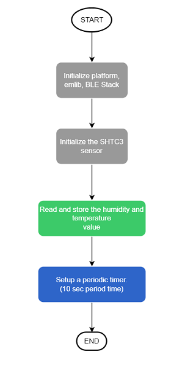

### Bluetooth Event ###

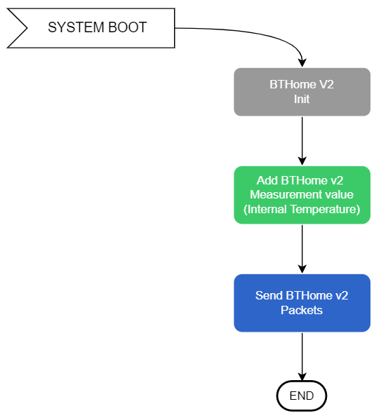

### Periodic Timer Callback ###

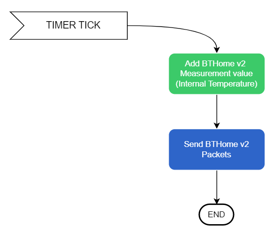

## Testing ##

To test this application and monitor the humidity and temperature, you need the following materials:

  - Raspberry Pi 4 runs Home Assistant OS.

  - Home Assistant application on a smartphone.
  
  - [BGM220 Bluetooth Module Explorer Kit](https://www.silabs.com/development-tools/wireless/bluetooth/bgm220-explorer-kit) runs the **BTHome v2 - Humidity and Temperature Monitor (SHTC3)** example.

  - [SparkFun Humidity Sensor Breakout - SHTC3 (Qwiic)](https://www.sparkfun.com/products/16467)

To test this example, you should follow some steps below:

1. Power on Raspberry Pi 4 and BTHome sensor device. After that, the BThome sensor device sends an advertisement packet every 10 seconds, which contains the humidity and temperature values. 

    You can launch Console that's integrated into Simplicity Studio or use a third-party terminal tool like TeraTerm to receive the data from the USB. A screenshot of the console output is shown in the figure below.

    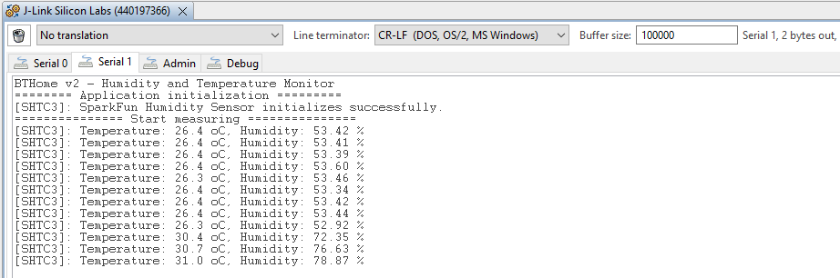

2. Open the Home Assistant application on your smartphone, select [Settings] → [Devices and Services] → [Add Integration]
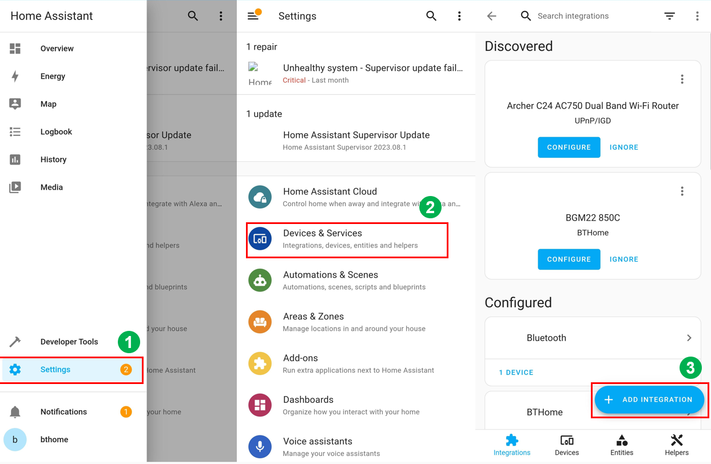

3. **Add Integration** with the name **'BTHome'**. You can see the list of devices, which are advertising in BTHome format. Choose your device with the correct name, e.g. **HumTemp 5E41** for this example, and submit the bindkey, which is defined in the firmware of the BTHome sensor device. 
 
- The device's name is `HumTemp`. 

- The bindkey is  `11112222333344445555666677778888`.

    **Note:** To be able to find your sensor device with the Home Assistant application, you need to use the same network on both Raspberry Pi 4 and your smartphone.

4. After adding your sensor device successfully with the Bindkey, select a suitable area where your sensor device is located.
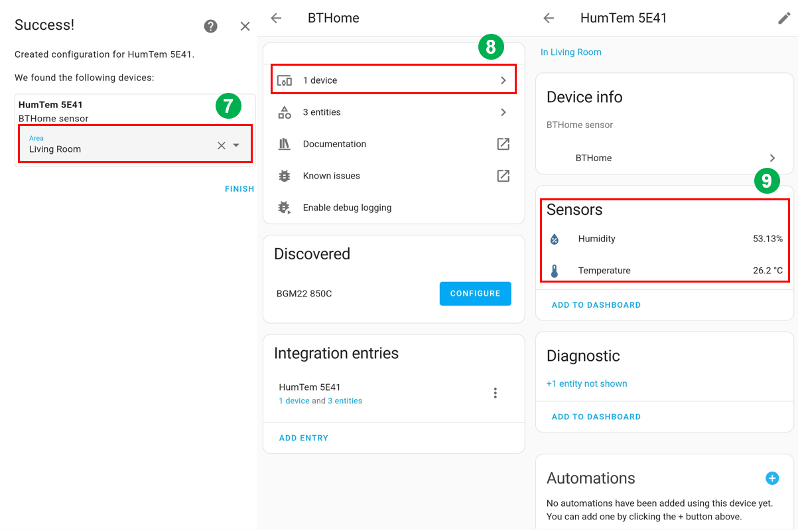

5. Now you can see your sensor device is already added to the Home Assistant system. You can track the humidity and temperature values from your sensor by selecting your device in BTHome.