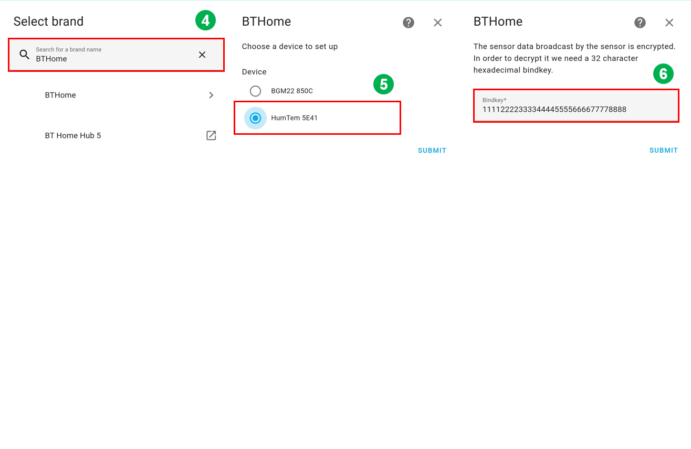

# Bluetooth - BTHome v2 - Humidity and Temperature Monitor (SHTC3) #

## Overview ##

The example showcases the implementation of BTHome support for Silicon Labs development kits.

The example application illustrates how BTHome can be effectively utilized with Silicon Labs development kits to communicate measured humidity and temperature values using SparkFun Humidity Sensor Breakout (SHTC3) to a Home Assistant system, which is running on a Raspberry Pi 4. This demonstration will provide developers with insights into integrating BTHome with Silicon Labs hardware for IoT applications.

The BTHome v2 sensor device is a BGM220 Explorer Kit that reads humidity and temperature values using SparkFun Humidity Sensor Breakout (SHTC3) via I2C communication and sends Bluetooth Low Energy advertisement packets in the BTHome v2 format.

Raspberry Pi 4 runs a Home Assistant OS that scans for and detects BTHome v2 devices. You can use the Home Assistant application on your smartphone to communicate with Raspberry Pi 4 to get advertisement packets of the BTHome v2 sensor device, parse those packets and display sensor values.

## SDK version ##

- [SiSDK v2024.12.0](https://github.com/SiliconLabs/simplicity_sdk)
- [Third Party Hardware Drivers v4.1.0](https://github.com/SiliconLabs/third_party_hw_drivers_extension)

## Software Required ##

- [Simplicity Studio v5 IDE](https://www.silabs.com/developers/simplicity-studio)
- [Home Assistant OS](https://www.home-assistant.io/)

## Hardware Required ##

- 1x [Bluetooth Low Energy Development Kit](https://www.silabs.com/development-tools/wireless/bluetooth). For simplicity, Silicon Labs recommends the [BGM220-EK4314A](https://www.silabs.com/development-tools/wireless/bluetooth/bgm220-explorer-kit)
- 1x [SparkFun Humidity Sensor Breakout - SHTC3 (Qwiic)](https://www.sparkfun.com/products/16467)
- 1x Raspberry Pi 4 running Home Assistant OS
- 1x smartphone running Home Assistant application

## Connections Required ##

The following picture shows the connection for this application:

## Setup ##

To test this application, you can either create a project based on an example project or start with a "Bluetooth - SoC iBeacon" project based on your hardware.

**NOTE**:

- Make sure that the [Third Party Hardware Drivers extension](https://github.com/SiliconLabs/third_party_hw_drivers_extension) is installed as part of the SiSDK and the [bluetooth_applications](https://github.com/SiliconLabs/bluetooth_applications) repository is added to [Preferences > Simplicity Studio > External Repos](https://docs.silabs.com/simplicity-studio-5-users-guide/latest/ss-5-users-guide-about-the-launcher/welcome-and-device-tabs).

- SDK Extension must be enabled for the project to install the required components.

### Create a project based on an example project ###

1. From the Launcher Home, add your product name to My Products, click on it, and click on the **EXAMPLE PROJECTS & DEMOS** tab. Find the example project filtering by **"bthome"** and **"shtc3"**.

2. Click the **Create** button on **Bluetooth - BTHome v2 - Humidity and Temperature Monitor (SHTC3)** example. Example project creation dialog pops up -> click Create and Finish and the project should be generated.

3. Build and flash this example to the board.

### Start with a "Bluetooth - SoC iBeacon" project ###

1. Create a **Bluetooth - SoC iBeacon** project for your hardware using Simplicity Studio 5.

2. Copy the `src/app.c` file into the project root folder (overwriting the existing file).

3. Install the software components:

    - Open the .slcp file in the project

    - Select the SOFTWARE COMPONENTS tab

    - Install the following components:

      - [Services] → [IO Stream] → [Driver] → [IO Stream: USART] → default instance name: **vcom**

      - [Application] → [Utility] → [Log]

      - [Driver] → [I2C] → [I2CSPM] → using instance name: **qwiic**
  
      - [Third-Party Hardware Drivers] → [Services] → [BTHome v2]

      - [Third-Party Hardware Drivers] → [Sensors] → [SHTC3 - Temp&Hum 9 Click (Mikroe)]

4. Install **printf float**

    - Open Properties of the project.

    - Select C/C++ Build → Settings → Tool Settings → GNU ARM C Linker → General. Check Printf float.
    

5. Build and flash the project to your board.

## How It Works ##

### Application Initialization ###

### Bluetooth Event ###

### Periodic Timer Callback ###

## Testing ##

To test this example, you should follow some steps below:

1. Power on Raspberry Pi 4 and BTHome sensor device. After that, the BThome sensor device sends an advertisement packet every 10 seconds, which contains the humidity and temperature values.

    You can launch Console that's integrated into Simplicity Studio or use a third-party terminal tool like TeraTerm to receive the data from the USB. A screenshot of the console output is shown in the figure below.

    

2. Open the Home Assistant application on your smartphone, select [Settings] → [Devices and Services] → [Add Integration]

3. **Add Integration** with the name **'BTHome'**. You can see the list of devices, which are advertising in BTHome format. Choose your device with the correct name, e.g. **HumTemp 5E41** for this example, and submit the bindkey, which is defined in the firmware of the BTHome sensor device.

    - The device's name is `HumTemp`.

    - The bindkey is  `11112222333344445555666677778888`.

    **Note:** To be able to find your sensor device with the Home Assistant application, you need to use the same network on both Raspberry Pi 4 and your smartphone.

    

4. After adding your sensor device successfully with the Bindkey, select a suitable area where your sensor device is located.

5. Now you can see your sensor device is already added to the Home Assistant system. You can track the humidity and temperature values from your sensor by selecting your device in BTHome.
