# Bluetooth - BTHome v2 - Internal Temperature Monitor #

## Overview ##

The example showcases the implementation of BTHome support for Silicon Labs development kits.

The example application illustrates how BTHome can be effectively utilized with Silicon Labs development kits to communicate internal temperature sensor values to a Home Assistant setup running on a Raspberry Pi 4. This demonstration will provide developers with insights into integrating BTHome with Silicon Labs hardware for IoT applications.

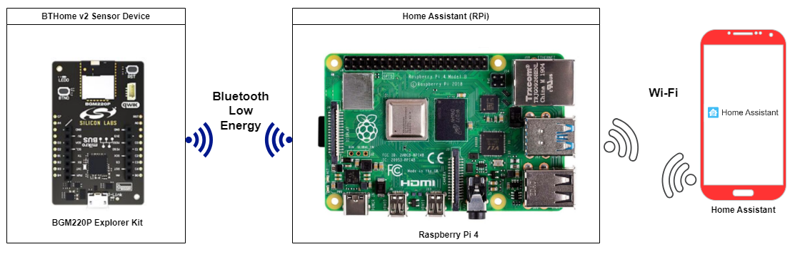

The BTHOME v2 sensor device is a BGM220 Explorer Kit that reads the internal temperature sensor and sends BLE advertisement packets in the BTHome v2 format.

Raspberry Pi 4 runs a Home Assistant OS that scans for and detects BTHome v2 sensor device. Users use the Home Assistant application on the smartphone to communicate with Raspberry Pi 4 to get the advertisement packet of the BTHome v2 sensor device, parse and display it on a smartphone.

## SDK version ##

- [SiSDK v2024.12.0](https://github.com/SiliconLabs/simplicity_sdk)
- [Third Party Hardware Drivers v4.1.0](https://github.com/SiliconLabs/third_party_hw_drivers_extension)

## Software Required ##

- [Simplicity Studio v5 IDE](https://www.silabs.com/developers/simplicity-studio)
- [Home Assistant OS](https://www.home-assistant.io/)

## Hardware Required ##

- 1x [Bluetooth Low Energy Development Kit](https://www.silabs.com/development-tools/wireless/bluetooth). For simplicity, Silicon Labs recommends the [BGM220-EK4314A](https://www.silabs.com/development-tools/wireless/bluetooth/bgm220-explorer-kit)
- 1x Raspberry Pi 4 running Home Assistant OS
- 1x smartphone running Home Assistant application

## Connections Required ##

The following picture shows the connection for this application:

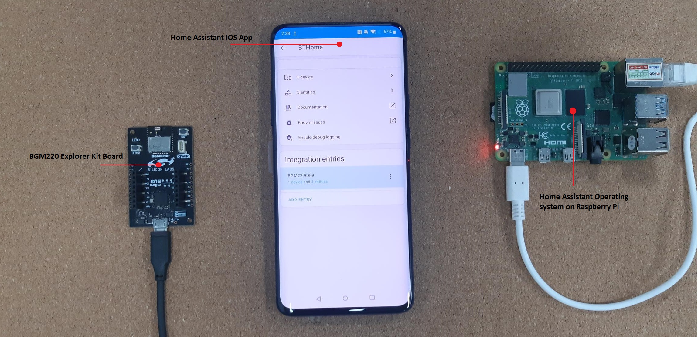

## Setup ##

To test this application, you can either create a project based on an example project or start with a "Bluetooth - SoC iBeacon" project based on your hardware.

**NOTE**:

- Make sure that the [Third Party Hardware Drivers extension](https://github.com/SiliconLabs/third_party_hw_drivers_extension) is installed as part of the SiSDK and the [bluetooth_applications](https://github.com/SiliconLabs/bluetooth_applications) repository is added to [Preferences > Simplicity Studio > External Repos](https://docs.silabs.com/simplicity-studio-5-users-guide/latest/ss-5-users-guide-about-the-launcher/welcome-and-device-tabs).

- SDK Extension must be enabled for the project to install the required components.

### Create a project based on an example project ###

1. From the Launcher Home, add your product name to My Products, click on it, and click on the **EXAMPLE PROJECTS & DEMOS** tab. Find the example project filtering by "bthome v2".

2. Click **Create** button on **Bluetooth - BTHome v2 - Internal Temperature Monitor** example. Example project creation dialog pops up -> click Create and Finish and the project should be generated.

    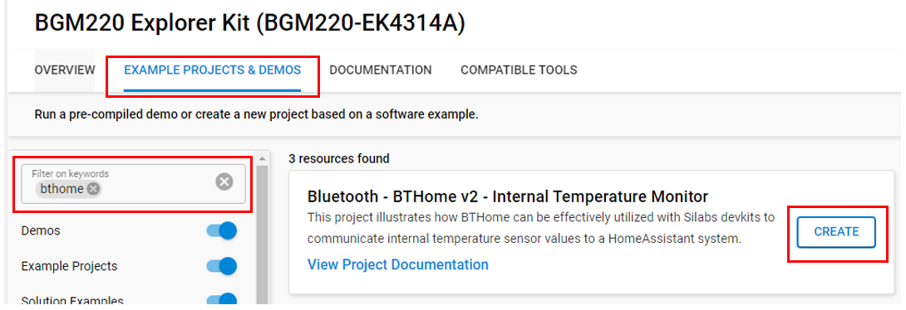

3. Build and flash this example to the board.

### Start with a "Bluetooth - SoC iBeacon" project ###

1. Create a **Bluetooth - SoC iBeacon** project for your hardware using Simplicity Studio 5.

2. Copy all the `src/app.c` file into the project root folder (overwriting the existing file).

3. Install the software components:

    - Open the .slcp file in the project

    - Select the SOFTWARE COMPONENTS tab

    - Install the following components:
      - [Services] → [IO Stream] → [Driver] → [IO Stream: USART] → default instance name: vcom
      - [Application] → [Utility] → [Log]
      - [Platform] → [Driver] → [TEMPDRV]
      - [Third-Party Hardware Drivers] → [Services] → [BTHome v2]

4. Build and flash the project to your board.

## How It Works ##

### Application Initialization ###

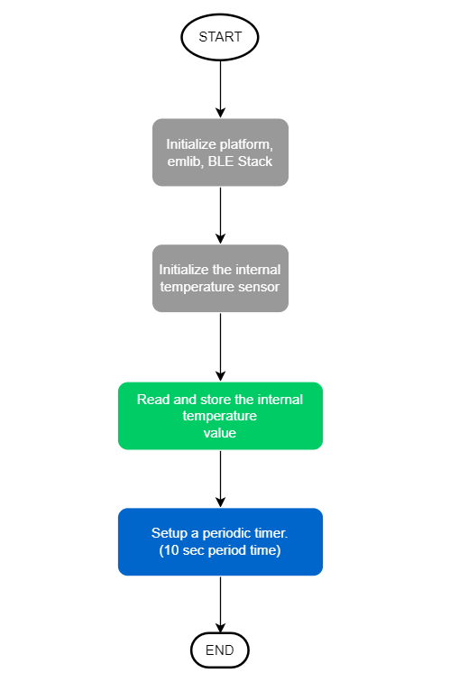

### BLE System Boot Event ###

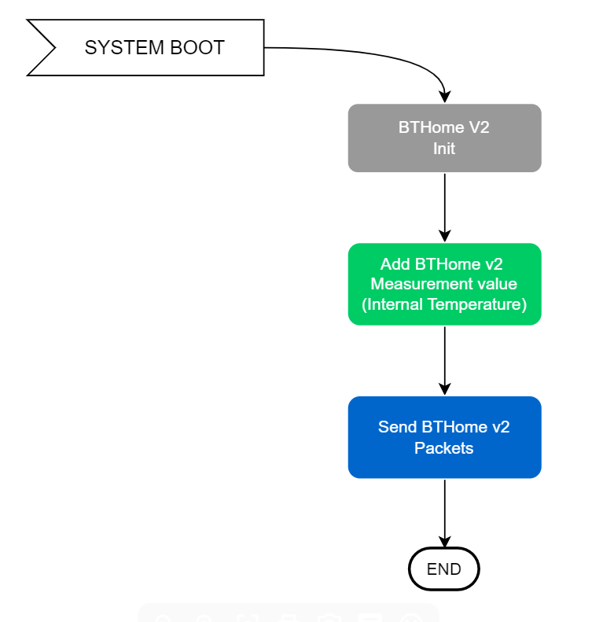

### Periodic Timer Callback ###

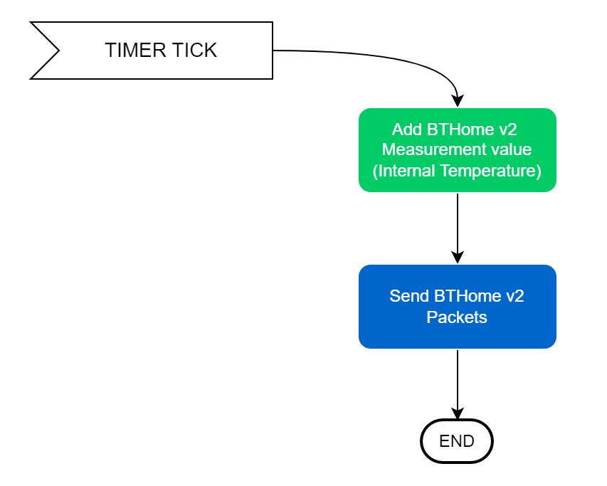

## Testing ##

*Note*: To utilize the BTHOME sensor device, you have two options. You can use Silicon Labs development kits and run either the "BTHome v2 - Internal Temperature Monitor" example or create your own project by following the instructions provided in the "Setup" section above.

1. Power on Raspberry Pi 4 and BTHOME sensor device. After powering on, the BTHOME sensor device sends the advertisement packet every 10 seconds that contains the temperature value.

    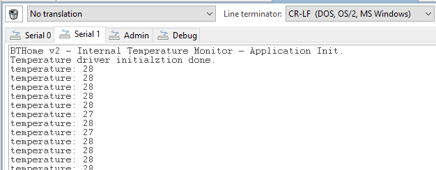

2. Open the Home Assistant application on the smartphone, select [Settings] → [Devices and Services] → [Add Integration]

    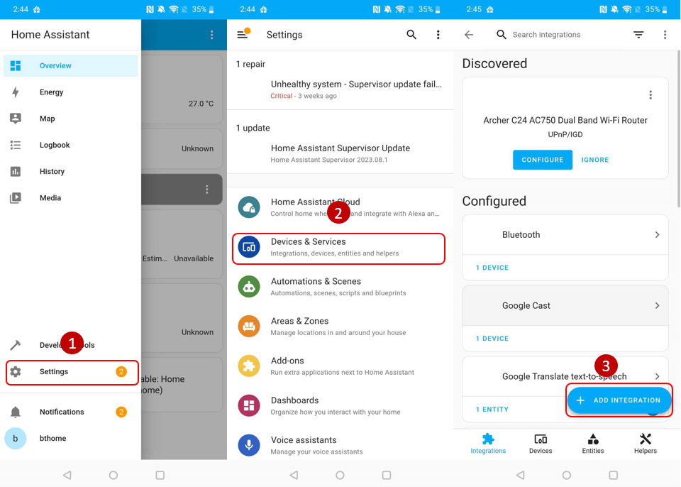

3. Add Integration with the name 'BTHome'. You can see the list of device, which is advertising in BTHome format. Choose your device with the correct name (it is 'Temp 79B4' in this example) and submit the Bindkey, which is defined in the firmware of the BTHOME sensor device. *Note: To be able to find your sensor device with the home assistant application, you need to use the same network on both Raspberry Pi 4 and the smartphone.*

    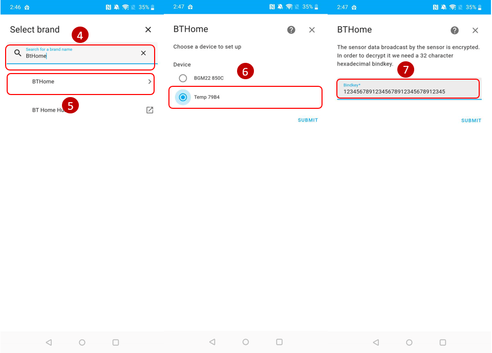

    The name and Bindkey in the firmware of the sensor device.

    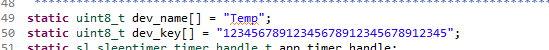

4. After adding your sensor device successfully with the Bindkey, select a suitable area where your sensor device is located.

    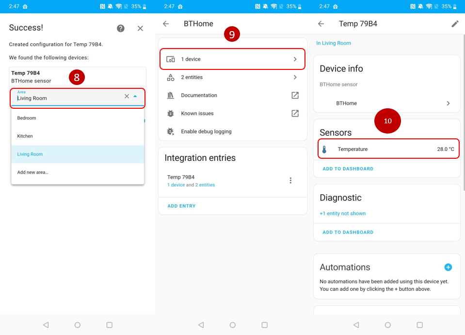

5. Now you can see your sensor is already added to the Home Assistant system. You can track the temperature value from your sensor by selecting your device in BTHome.
