# Bluetooth - BTHome v2 - Light

## Overview

BTHome is an energy-efficient, but flexible BT format for devices to broadcast their sensor data and button presses.

Devices can run over a year on a single battery. It allows data encryption and is supported by popular home automation platforms, like Home Assistant, out of the box.

For more information, please visit [BThome](https://bthome.io/).

This project aims to implement a BTHome v2-compatible light. The application provides a CLI to configure switches to control the onboard LED0, it supports the press event only.

One or more Switches can control a Light. Each Switch acts as a BTHome client which advertises a button press event to control Light. This device should use the *BTHome v2 - Switch* example for testing in this project.

The Light device acts as a BTHome v2 Client and Server (be implemented in this project with name: *BTHome v2 - Light*):

- As a server, it gathers the Button events from the registered devices to control Light.
- As a client, it reports the status of the Light to Home Assistant.

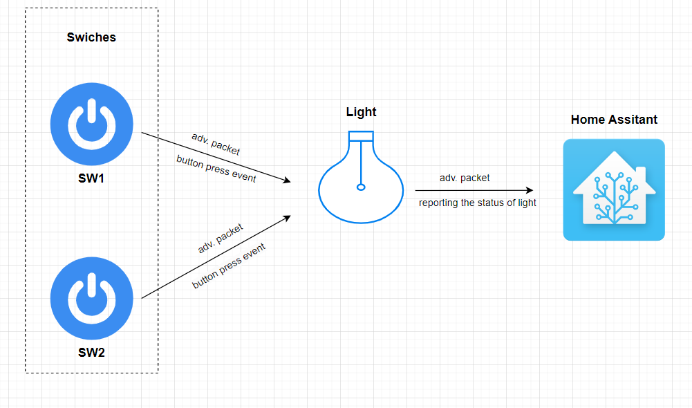

## SDK version

- [SiSDK v2024.12.0](https://github.com/SiliconLabs/simplicity_sdk)
- [Third Party Hardware Drivers v4.1.0](https://github.com/SiliconLabs/third_party_hw_drivers_extension)

## Software Required

- [Simplicity Studio v5 IDE](https://www.silabs.com/developers/simplicity-studio)
- [Home Assistant OS](https://www.home-assistant.io/)

## Hardware Required

- 2x [Bluetooth Low Energy Development Kit](https://www.silabs.com/development-tools/wireless/bluetooth). For simplicity, Silicon Labs recommends the [BGM220-EK4314A](https://www.silabs.com/development-tools/wireless/bluetooth/bgm220-explorer-kit)
  - 1x BGM220 running *BTHome v2 - Light*
  - 1x BGM220 running *BTHome v2 - Switch*
- 1x Raspberry Pi 4 running Home Assistant OS
- 1x smartphone running Home Assistant application

## Connections Required

The hardware connection is shown in the image below:

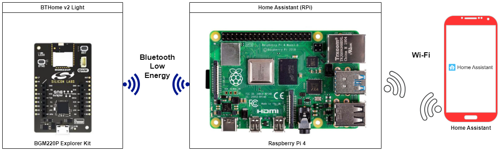

## Setup

To test this application, you can either create a project based on an example project or start with a "Bluetooth - SoC Empty" project based on your hardware.

**NOTE**:

- Make sure that the [Third Party Hardware Drivers extension](https://github.com/SiliconLabs/third_party_hw_drivers_extension) is installed as part of the SiSDK and the [bluetooth_applications](https://github.com/SiliconLabs/bluetooth_applications) repository is added to [Preferences > Simplicity Studio > External Repos](https://docs.silabs.com/simplicity-studio-5-users-guide/latest/ss-5-users-guide-about-the-launcher/welcome-and-device-tabs).

- SDK Extension must be enabled for the project to install the required components.

### Create a project based on an example project

1. From the Launcher Home, add your hardware to My Products, click on it, and click on the **EXAMPLE PROJECTS & DEMOS** tab. Find the example project filtering by "bthome".

2. Click **Create** button on **Bluetooth - BTHome v2 - Light** examples. Example project creation dialog pops up -> click Create and Finish and Project should be generated.
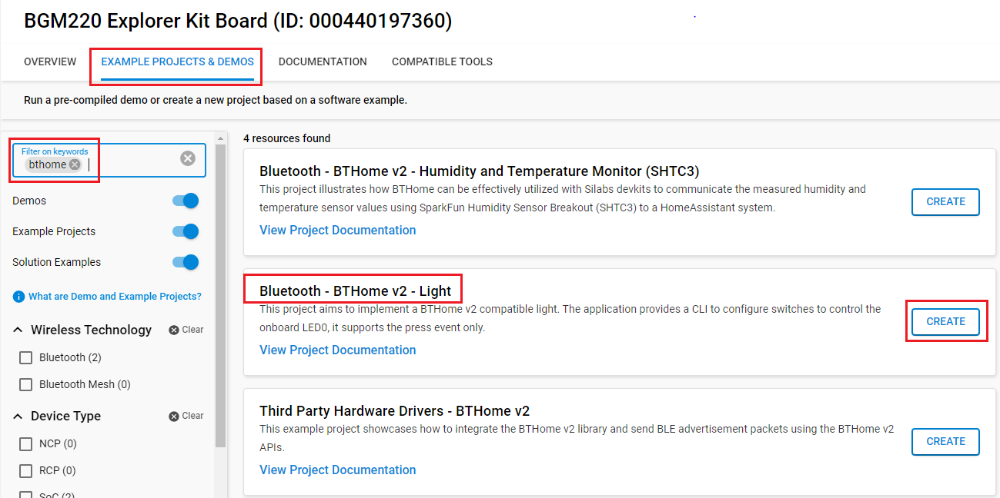

3. Build and flash this example to the board.

### Start with a "Bluetooth - SoC Empty" project

1. Create a **Bluetooth - SoC Empty** project for your hardware using Simplicity Studio 5.

2. Copy all the .h and .c files to the project root folder (overwriting the existing file).

3. Install the software components:

    - Open the .slcp file in the project

    - Select the SOFTWARE COMPONENTS tab

    - Install the following components:

      - [Platform] → [Driver] → [Button] → [Simple Button] → default instance name: btn0.
      - [Platform] → [Driver] → [LED] → [Simple LED] → default instance name: led0.
      - [Services] → [IO Stream] → [IO Stream: USART] → default instance name: vcom
      - [Services] → [Command Line Interface] → [CLI Instance(s)] → default instance name: inst
      - [Application] → [Utility] → [Log]
      - [Third-Party Hardware Drivers] → [Services] → [BTHome v2]
      - [Third-Party Hardware Drivers] → [Services] → [BTHome v2 - Server]

4. Build and flash the project to your device.

**Note:**

- A bootloader needs to be flashed to your board if the project starts from the "Bluetooth - SoC Empty" project, see [Bootloader](https://github.com/SiliconLabs/bluetooth_applications/blob/master/README.md#bootloader) for more information.

## How It Works

You have one or more switches controlling one light. You would use them in a hallway, where you have a switch at both ends of the hallway that controls the hallway light. You can switch the light on and off from either end of the hallway.

### Application Initialization

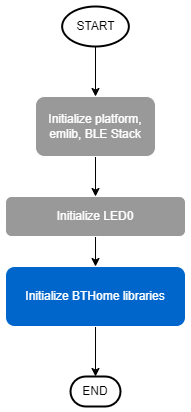

### BTHome v2 Events

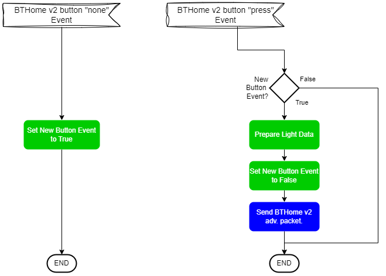

The example implements a CLI Interface that provides some features:

- Scan BLE network and list BTHome devices. List them with the following parameters:
  - MAC - Encryption (Yes/No) - Encryption Key Available (Yes/No)
- List registered devices
  - MAC - Encryption Key
- Register key by MAC
- Remove key by MAC
- Add device to the interested devices by MAC
- Remove device from the interested devices by MAC

## Testing

For testing, there should be at least two Silicon Labs boards. One acts as a Switch device which uses the "BTHome v2 - Switch" example. One acts as a Light device which uses the "BTHome v2 - Light" example.

### Silicon Labs Devices

1. Open a console or a terminal program (e.g., TeraTerm) and connect to the device to see the logs

2. Type `help` to see the supported commands:

    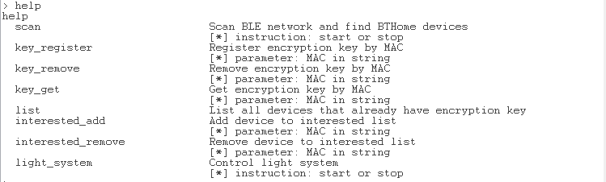

3. Start scanning to find BThome v2 devices. A continuous scan will update the newest data on devices. You can check if the device found is *BTHome v2 - Switch*

    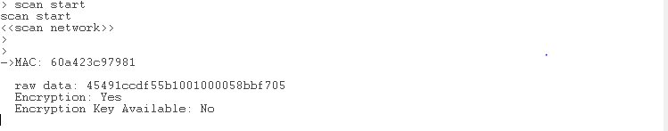

4. You can register the *BTHome v2 - Switch* device using the `key_register` command

    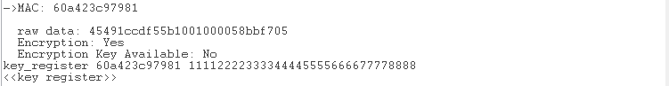

5. Now you can control the LED using a button from the *BTHome v2 - Switch* device

    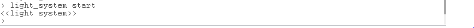

6. You can also add another button by following the same process.

### Home Assistant app

1. The **Home Assistant** application utilizes the Bluetooth adapter on your phone/tablet to scan BLE devices.

    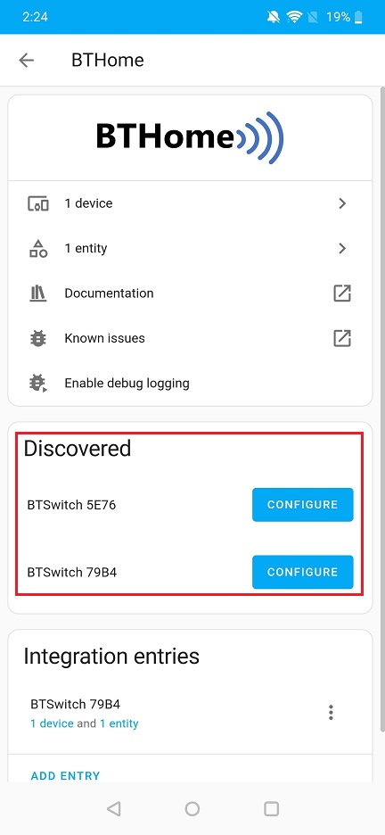

2. Open the *Home Assistant* application on your smartphone. Click [Settings] → [Devices & Services] → [BTHome], and you will see a list of nearby devices, which are sending BTHome advertisements. Find the one named "BTLight" and click the *ADD ENTRY*. Enter the BindKey then submit, add device to your home.

    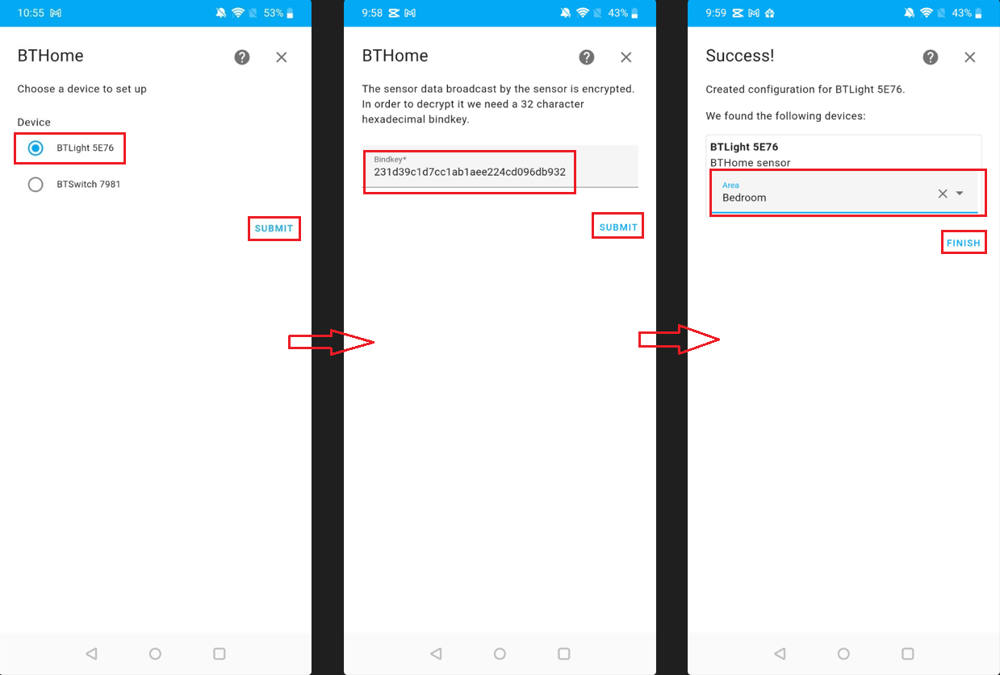

3. Automations in Home Assistant allow you to automatically respond to things that happen. You can check whenever the light is on or off. For this example, we will create two simple automations to receive signals from devices and show them on the dashboard.

    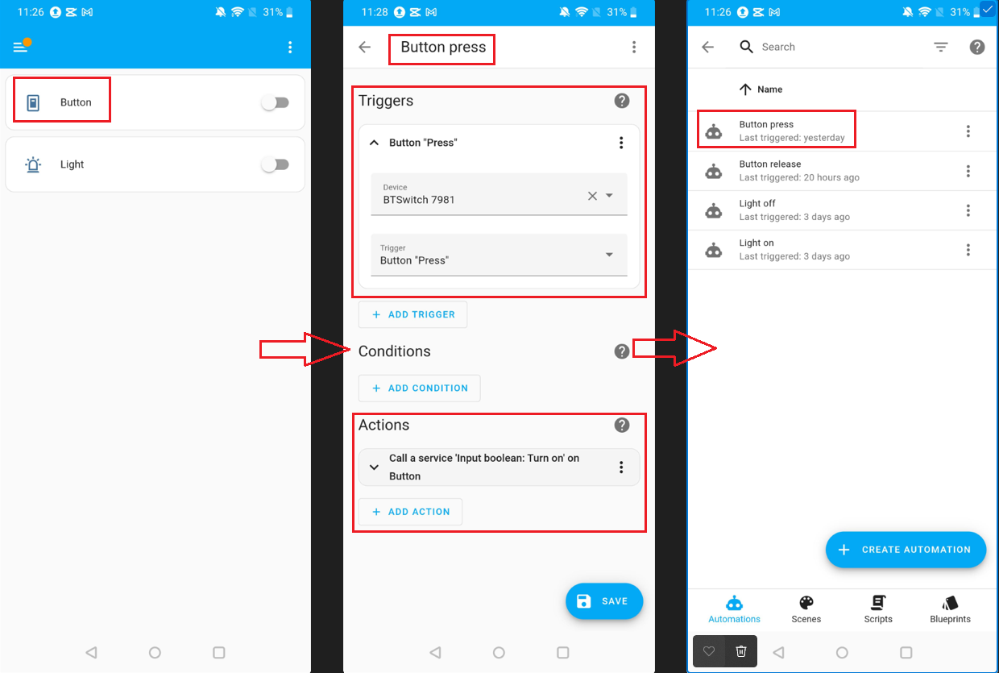

## Report Bugs & Get Support

To report bugs in the Application Examples projects, please create a new "Issue" in the "Issues" section of [bluetooth_applications](https://github.com/SiliconLabs/bluetooth_applications) repo. Please reference the board, project, and source files associated with the bug, and reference line numbers. If you are proposing a fix, also include information on the proposed fix. Since these examples are provided as-is, there is no guarantee that these examples will be updated to fix these issues.

Questions and comments related to these examples should be made by creating a new "Issue" in the "Issues" section of [bluetooth_applications](https://github.com/SiliconLabs/bluetooth_applications) repo.
