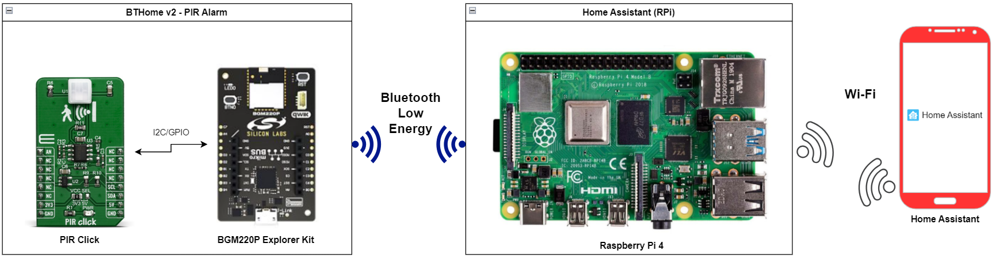

# Bluetooth - BTHome v2 - PIR Alarm #

## Overview ##

This project aims to implement a BTHome v2 compatible PIR alarm. The device reads the PIR sensor value and sends the motion information to the BTHome Server, which notifies the user if motion is detected.

The Home Assistant OS is installed and running on a Raspberry Pi 4 device, which scans for BTHome v2 devices. The Home Assistant application of your smartphone can communicate with the Raspberry Pi 4 (RPi 4). RPi4 receives advertisement packages from the BTHome v2 PIR alarm device and detects the movement.

## Gecko SDK Suite version ##

- GSDK v4.4.2

## Software requirements ##

- [Third Party Hardware Drivers v2.0.1](https://github.com/SiliconLabs/third_party_hw_drivers_extension)

- Home Assistant OS v12.3

## Hardware Required ##

- [**BGM220-EK4314A** BGM220 Bluetooth Module Explorer Kit](https://www.silabs.com/development-tools/wireless/bluetooth/bgm220-explorer-kit)

- [MikroE - PIR Click](https://www.mikroe.com/pir-click)

- Raspberry Pi 4 runs Home Assistant OS

**NOTE:**
Tested boards for working with this example:

| Board ID | Description  |
| -------- | ------ |
| BRD4314A | [BGM220 Bluetooth Module Explorer Kit - BGM220-EK4314A](https://www.silabs.com/development-tools/wireless/bluetooth/bgm220-explorer-kit?tab=overview)  |
| BRD2703A | [EFR32xG24 Explorer Kit - xG24-EK2703A ](https://www.silabs.com/development-tools/wireless/efr32xg24-explorer-kit?tab=overview)    |
| BRD4108A | [EFR32BG22 Explorer Kit - BG22-EK4108A](https://www.silabs.com/development-tools/wireless/bluetooth/bg22-explorer-kit?tab=overview)  |

## Connections Required ##

The following picture shows the connection for this application:

## Setup ##

To test this application, you can either create a project based on an example project or start with a "Bluetooth - SoC Empty" project based on your hardware.

### Create a project based on an example project ###

1. From the Launcher Home, add your product name to My Products, click on it, and click on the **EXAMPLE PROJECTS & DEMOS** tab. Find the example project filtering by "bthome" and "pir".

2. Click the **Create** button on **Bluetooth - BTHome v2 - PIR Alarm** example. Example project creation dialog pops up -> click Create and Finish and the project should be generated.

1. Build and flash this example to the board.

### Start with a "Bluetooth - SoC Empty" project ###

1. Create a **Bluetooth - SoC Empty** project for your hardware using Simplicity Studio 5.

2. Copy the `src/app.c` file into the project root folder (overwriting the existing file).
3. Install the software components:

    3.1 Open the .slcp file in the project

    3.2 Select the SOFTWARE COMPONENTS tab

    3.3 Install the following components:

      - [Services] → [IO Stream] → [Driver] → [IO Stream: USART] → default instance name: vcom

      - [Application] → [Utility] → [Log]
  
      - [Third-Party Hardware Drivers] → [Services] → [BTHome v2]

      - [Third-Party Hardware Drivers] → [Sensors] → [PL-N823-01 - PIR Click (Mikroe)]
  
4. Build and flash the project to your device.

**Note:**

- Make sure that the [Third Party Hardware Drivers extension](https://github.com/SiliconLabs/third_party_hw_drivers_extension) is added to the required SDK: [Preferences > Simplicity Studio > SDKs](https://github.com/SiliconLabs/third_party_hw_drivers_extension/blob/master/README.md#how-to-add-to-simplicity-studio-ide).

- SDK Extension must be enabled for the project to install **BTHOME v2** component.

- Do not forget to flash a bootloader to your board, see [Bootloader](https://github.com/SiliconLabs/bluetooth_applications/blob/master/README.md#bootloader) for more information.

## How It Works ##

### Application Initialization ###

### Motion detection ###

## Testing ##

To test this application and monitor the switch changes, you need the following materials:

- Raspberry Pi 4 runs Home Assistant OS

- Home Assistant application on your smartphone

- [BGM220 Bluetooth Module Explorer Kit](https://www.silabs.com/development-tools/wireless/bluetooth/bgm220-explorer-kit) runs the **Bluetooth - BTHome v2 - PIR Alarm** example

To test this example, you should follow the below steps:

1. Power on Raspberry Pi 4 and BTHome PIR alarm device. After that, the microcontroller reads the output of the sensor in millivolts (mV) periodically. If the value is lower than the configured threshold, then the microcontroller sends the updated advertisement packet. The advertisement packet contains information about the movement.

    You can launch Console, which is integrated into Simplicity Studio or you can use a third-party terminal tool like Tera Term to receive the data. Data is coming from the UART COM port. A screenshot of the console output is shown in the figure below.

    

2. Open the Home Assistant application on your smartphone, select [Settings] → [Devices and Services] → [Add Integration]

3. **Add Integration** with the name "BTHome". You can see the list of devices, which are advertising in BTHome v2 format. Choose your device with the correct name, for example **PIRAlarm 571E**, and submit the bindkey. Bindkey is defined in the firmware of the BTHome PIR device.

    - The name of the device is `PIRAlarm`

    - The bindkey is  `11112222333344445555666677778888`

    **Note:** To be able to find your switch device with the Home Assistant application, you need to use the same network on both Raspberry Pi 4 and your smartphone.
    

4. After adding your switch device successfully with the bindkey, select a suitable area where your device is located.

Now it is visible that the sensor device has already been added to the Home Assistant system. If you move in front of the sensor, the motion change is visible in the **Sensors** section.
