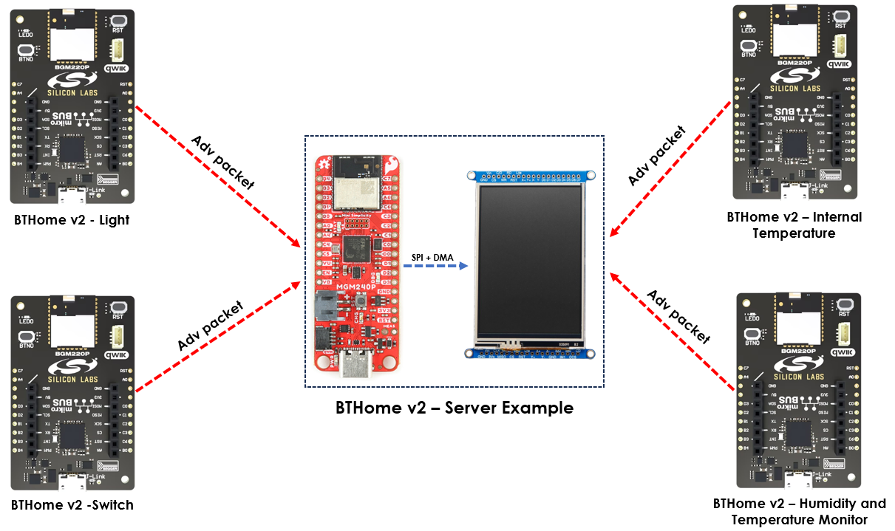
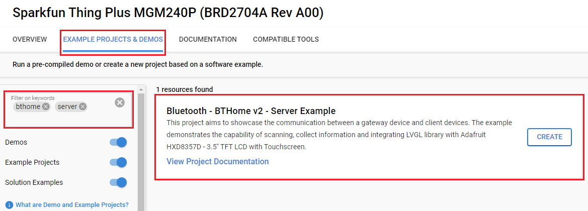
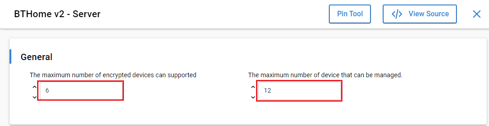
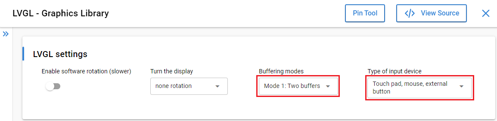
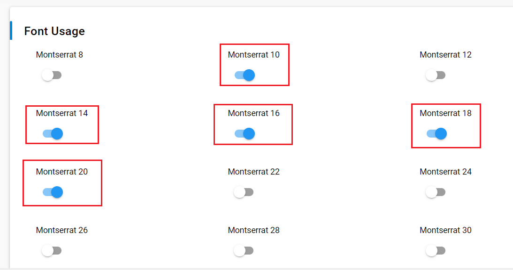
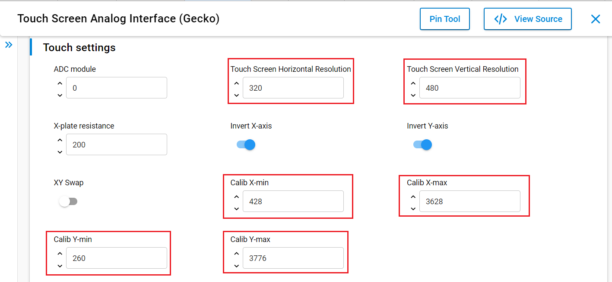
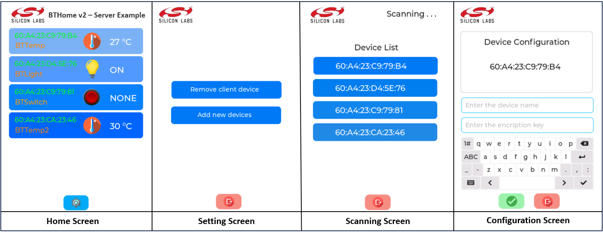
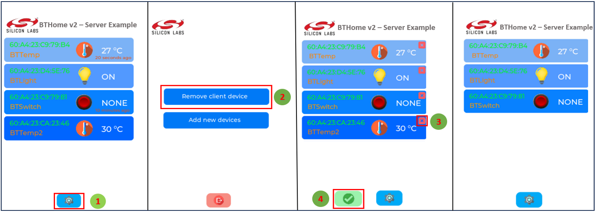
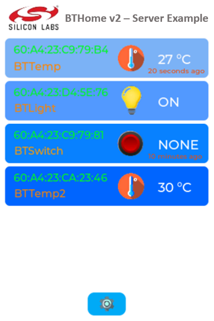

# Bluetooth - BTHome v2 - Server example #

## Overview ##

The example showcases the implementation of BTHome support for Silicon Labs development kits.

This project aims to implement a BTHome v2 server device. Integrated with the Adafruit HXD8357D - 3.5" TFT LCD with Touchscreen, the server/gateway device is able to show information on the screen and interact with users via touch directly on the screen. The example also demonstrates the scanning process, which allows configuring a device name and an encryption key as well as removing devices.

This example uses the source files which are generated from **[SquareLine Studio](https://squareline.io/)**. These files are provided in the `app_ui` folder. **SquareLine Studio** is a professional and easy-to-use UI editor software to speed up and simplify UI development. Visiting this page for more information

## SDK version ##

- [SiSDK v2024.12.0](https://github.com/SiliconLabs/simplicity_sdk)
- [Third Party Hardware Drivers v4.1.0](https://github.com/SiliconLabs/third_party_hw_drivers_extension)

## Software Required ##

- [Simplicity Studio v5 IDE](https://www.silabs.com/developers/simplicity-studio)

## Hardware Required ##

- 1x [SparkFun Thing Plus Matter - MGM240P](https://www.sparkfun.com/products/20270) running the 'BTHome v2 - Server' example
- 1x [Adafruit HXD8357D - 3.5" TFT LCD with Touchscreen](https://www.adafruit.com/product/2050)
- 1x [Bluetooth Low Energy Development Kit](https://www.silabs.com/development-tools/wireless/bluetooth) running the 'BTHome V2 Client' example.

## Connections Required ##

The following picture shows the connection for this application:

## Hardware Connection ##

To connect the Adafruit 3.5" TFT LCD (with Touchscreen) with the board running BTHome v2 - Server example, you can see the pins mapping table below.

**SparkFun Thing Plus Matter - MGM240P**

| Pin | Connection | Pin function |
|:---:|:-------------:|:---------------|
| PC0 | D/C | GPIO |
| PC1 | CS | SPI CS |
| PC2 | CLK | SPI SCK |
| PC6 | MISO | SPI MISO |
| PC3 | MOSI | SPI MOSI |
| PD2 | XP(X+) | AN |
| PA0 | YP(Y+) | AN |
| PD1 | YM(Y-) | AN |
| PD0 | XM(X-) | AN |

**EFR32xG24 Explorer Kit - xG24-EK2703A**

| Pin | Connection | Pin function |
|:---:|:-------------:|:---------------|
| PC8 | D/C | GPIO |
| PC0 | CS | SPI CS |
| PC1 | CLK | SPI SCK |
| PC2 | MISO | SPI MISO |
| PC3 | MOSI | SPI MOSI |
| PD5 | XP(X+) | AN |
| PD4 | YP(Y+) | AN |
| PB1 | YM(Y-) | AN |
| PA0 | XM(X-) | AN |

## Setup ##

To test this application, you can either create a project based on an example project or start with a "Bluetooth - SoC Empty" project based on your hardware.

**NOTE**:

- Make sure that the [Third Party Hardware Drivers extension](https://github.com/SiliconLabs/third_party_hw_drivers_extension) is installed as part of the SiSDK and the [bluetooth_applications](https://github.com/SiliconLabs/bluetooth_applications) repository is added to [Preferences > Simplicity Studio > External Repos](https://docs.silabs.com/simplicity-studio-5-users-guide/latest/ss-5-users-guide-about-the-launcher/welcome-and-device-tabs).

- SDK Extension must be enabled for the project to install the required components.

### Create a project based on an example project ###

1. From the Launcher Home, add your product name to My Products, click on it, and click on the **EXAMPLE PROJECTS & DEMOS** tab. Find the example project filtering by **"bthome"** and **"server"**.

2. Click the **Create** button on **Bluetooth - BTHome v2 - Server/Gateway** example. Example project creation dialog pops up -> click Create and Finish and the project should be generated.

3. Build and flash this example to the board.

### Start with a "Bluetooth - SoC Empty" project ###

1. Create a **Bluetooth - SoC Empty** project for your hardware using Simplicity Studio 5.

2. Copy all the files in `app_ui` folder and the app.c file in the `src` folder into the project root folder (overwriting the existing files).

3. Install the software components:

    - Open the .slcp file in the project

    - Select the SOFTWARE COMPONENTS tab

    - Install the following components:

      - [Services] → [IO Stream] → [Driver] → [IO Stream: EUSART] → default instance name: vcom.

      - [Application] → [Utility] → [Log]

      - [Third-Party Hardware Drivers] → [Display & LED] → [HXD8357D - TFT LCD Display (Adafruit) - SPI with DMA]

      - [Third-Party Hardware Drivers] → [Services] → [BTHome v2 - Server] → use the configuration as below:
      
  
      - [Third-Party Hardware Drivers] → [Services] → [LVGL - Graphics Library] → Using settings as below:
      
      

      - [Third-Party Hardware Drivers] → [Human Machine Interface] → [Touch Screen Analog Interface (Gecko)] → Using settings as below:
      

      - [Third-Party Hardware Drivers] → [Human Machine Interface] → [Touch Screen (Analog)]

4. Build and flash the project to your device.

**Note:**

- A bootloader needs to be flashed to your board if the project starts from the "Bluetooth - SoC Empty" project, see [Bootloader](https://github.com/SiliconLabs/bluetooth_applications/blob/master/README.md#bootloader) for more information.

## How It Works ##

The example provides a simple user interface, which allows interaction with the device by touching directly on the 3.5" TFT LCD with Touchscreen. It is designed with 4 pages.

The content and function of each page are described below:

- Home page : shows the information of client devices.

- Setting page : contains two buttons, which can help the user add new devices or remove existing devices.

- Scanning page : list all BTHome compatible devices with the MAC address. The user can add the new device by touching the device address.

- Device configuration page : The user can configure a device name and an encryption key for the new device. 

To verify how the example works, you should follow the guide below:

1. Because the example could support other examples, which relevant to the BTHome v2 format. You could prepare three or four client devices. These devices need to be flashed the existing BTHome v2 examples in this repository, which are available in this repository, including :

   - Bluetooth - BTHome v2 - Switch

   - Bluetooth - BTHome v2 - Light

   - Bluetooth - BTHome v2 - Internal Temperature Monitor

   - Bluetooth - BTHome v2 - Humidity and Temperature Monitor (SHTC3)

   **Note:** If you use BTHome switch and light devices, you need to configure the switch device as a client device and the light device to act as a server device.

2. You can add 6 client devices using **Add new devices** button on the screen. After that, the gateway device will list all the client devices, which are scanned. The example only supports 6 scanned devices. Then, you have to register an encryption key and the device name (optional). The following picture explains the adding process.

3. You can go back to the home screen, using the **exit button** on the bottom of each screen. After adding new client devices, the gateway device can decrypt the advertising packets, and get the information. On the home screen, the device shows the name, MAC address and device information of each client device. If there is no data updated, the screen will show the last time when the client device data was updated.

    

4. Moreover, the example allows users can remove the client devices. The removal process is illustrated in the following picture.

    