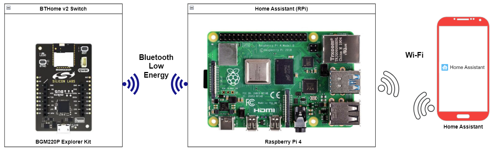
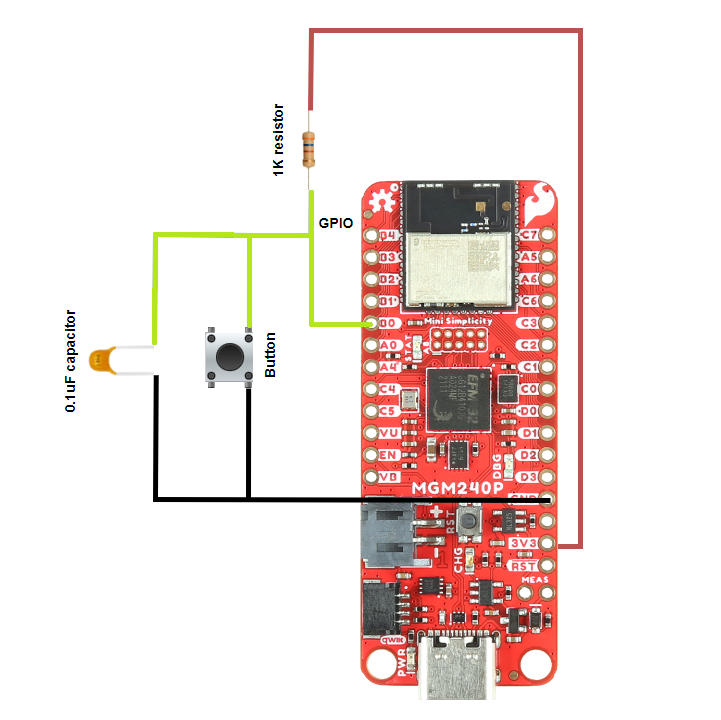
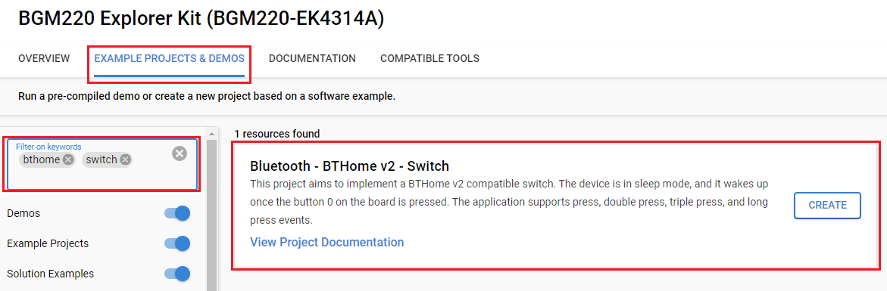
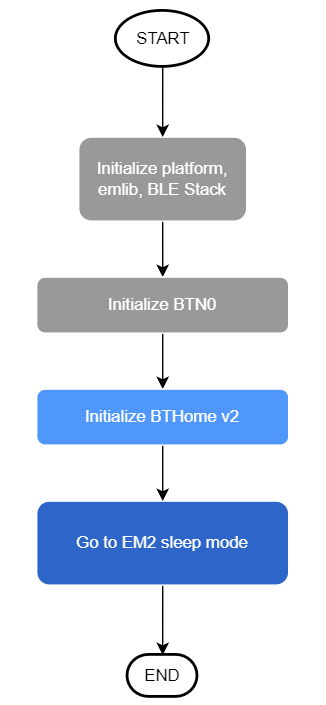
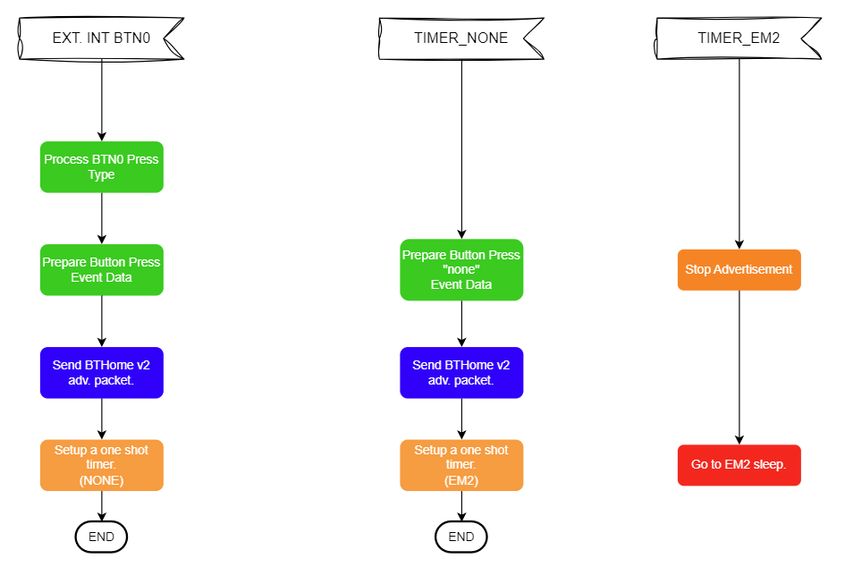
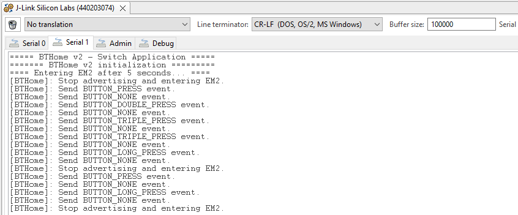
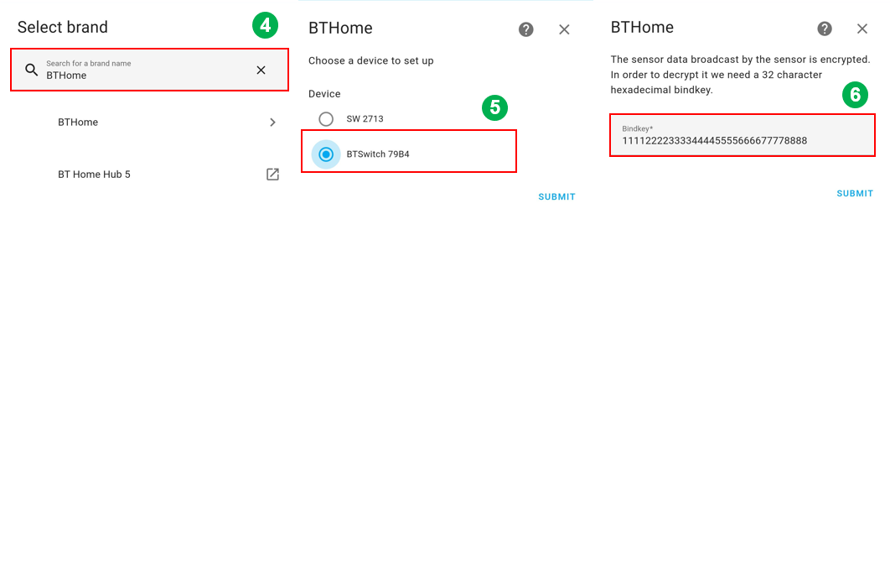
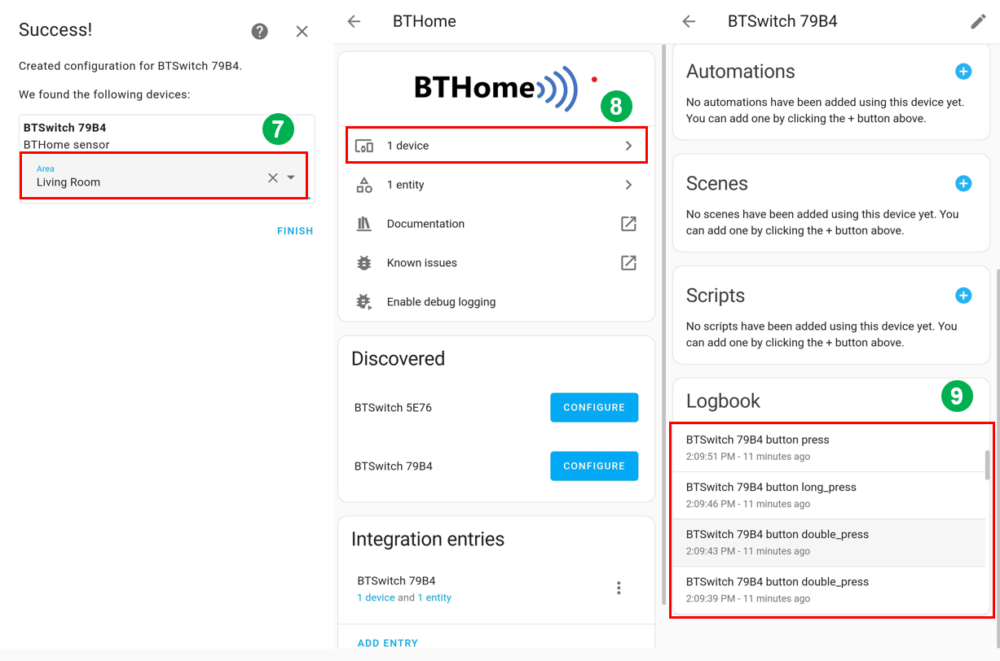

# Bluetooth - BTHome v2 - Switch #

## Overview ##

The example showcases the implementation of BTHome support for Silabs development kits.

This project aims to implement a BTHome v2 compatible switch. The device is in sleep mode to optimize power consumption. It wakes up once the button 0 on the board is pressed. The application supports press, double press, triple press, and long press events.

Raspberry Pi 4 runs a Home Assistant OS that scans for and detects BTHome v2 devices. You can use the Home Assistant application on your smartphone to communicate with the Raspberry Pi 4 to get advertisement packets from the BTHome v2 switch device, parse those packets, and recognize the button event.

## Gecko SDK Suite Version ##

- GSDK v4.3.1

- [Third Party Hardware Drivers v1.8.0](https://github.com/SiliconLabs/third_party_hw_drivers_extension)

## Hardware Required ##

- [**BGM220-EK4314A** BGM220 Bluetooth Module Explorer Kit](https://www.silabs.com/development-tools/wireless/bluetooth/bgm220-explorer-kit)

**NOTE:**
Tested boards for working with this example:

| Board ID | Description  |
| -------- | ------ |
| BRD4314A | [BGM220 Bluetooth Module Explorer Kit - BGM220-EK4314A](https://www.silabs.com/development-tools/wireless/bluetooth/bgm220-explorer-kit?tab=overview)  |
| BRD2703A | [EFR32xG24 Explorer Kit - xG24-EK2703A ](https://www.silabs.com/development-tools/wireless/efr32xg24-explorer-kit?tab=overview)    |
| BRD4108A | [EFR32BG22 Explorer Kit Board - BG22-EK4108A](https://www.silabs.com/development-tools/wireless/bluetooth/bg22-explorer-kit?tab=overview)  |
| BRD2704A | [SparkFun Thing Plus Matter - MGM240P](https://www.sparkfun.com/products/20270)  |

## Connections Required ##

The following picture shows the connection for this application:

**Note:**

- If you use **SparkFun Thing Plus Matter - MGM240P** to run this application, you have to set up an external button, because it has no integrated button. Please, connect this button to **PB0** pin on the SparkFun Thing Plus Matter board.

- To connect the external button to the board and make the project more stable, you should use a ceramic capacitor (ex: Ceramic Capacitor 104) and a resistor to avoid the anti-vibration button used in the project as below.
  

## Setup ##

To test this application, you can either create a project based on an example project or start with a "Bluetooth - SoC Empty" project based on your hardware.

### Create a project based on an example project ###

1. From the Launcher Home, add your product name to My Products, click on it, and click on the **EXAMPLE PROJECTS & DEMOS** tab. Find the example project with the filter **"bthome"** and **"switch"**.

2. Click the **Create** button on **Bluetooth - BTHome v2 - Switch** example. Example project creation dialog pops up -> click Create and Finish and the project should be generated.

3. Build and flash this example to the board.

### Start with a "Bluetooth - SoC Empty" project ###

1. Create a **Bluetooth - SoC Empty** project for your hardware using Simplicity Studio 5.

2. Copy the `src/app.c` file into the project root folder (overwriting the existing file).
3. Install the software components:

    - Open the .slcp file in the project

    - Select the SOFTWARE COMPONENTS tab

    - Install the following components:

      - [Services] → [IO Stream] → [Driver] → [IO Stream: USART] → default instance name: vcom.

      - [Application] → [Utility] → [Log]
  
      - [Platform] → [Driver] → [Button] → [Simple Button] → default instance name: btn0.
  
      - [Third-Party Hardware Drivers] → [Services] → [BTHome v2]
  
5. Build and flash the project to your device.

**Note:**

- Make sure the [Third Party Hardware Drivers extension](https://github.com/SiliconLabs/third_party_hw_drivers_extension) is added to the required SDK: [Preferences > Simplicity Studio > SDKs](https://github.com/SiliconLabs/third_party_hw_drivers_extension/blob/master/README.md#how-to-add-to-simplicity-studio-ide).

- SDK Extension must be enabled for the project to install **BTHOME v2** component.

- Do not forget to flash a bootloader to your board, see [Bootloader](https://github.com/SiliconLabs/bluetooth_applications/blob/master/README.md#bootloader) for more information.

## How It Works ##

### Application Initialization ###

### External Interrupt ###

## Testing ##

To test this application and monitor the switch changes, you need the following materials:

  - Raspberry Pi 4 runs Home Assistant OS.

  - Home Assistant application on your smartphone.
  
  - [BGM220 Bluetooth Module Explorer Kit](https://www.silabs.com/development-tools/wireless/bluetooth/bgm220-explorer-kit) runs the **Bluetooth - BTHome v2 - Switch** example.

To test this example, you should follow some steps below:

1. Power on Raspberry Pi 4 and BTHome switch device. After that, the BThome switch device sends an advertisement packet with `none` event. After 5 seconds, the device goes into sleep mode to reduce power consumption. It can be woken up by pressing BTN0 on the board. Then the switch device will send a button event to the server. This example supports many kinds of button events, including single press, double press, triple press and long press events. If there is no button event sent, the device will send a `none` event after 2 seconds. Then go again sleep mode in 5 seconds.

    You can launch Console that's integrated into Simplicity Studio or use a third-party terminal tool like TeraTerm to receive the data from the USB. A screenshot of the console output is shown in the figure below.

    

2. Open the Home Assistant application on your smartphone, select [Settings] → [Devices and Services] → [Add Integration]

1. **Add Integration** with the name **'BTHome'**. You can see the list of devices, which are advertising in BTHome format. Choose your device with the correct name, e.g. **BTSwitch 79B4** for this example, and submit the bindkey, which is defined in the firmware of the BTHome switch device. 
 
- The device's name is `BTSwitch`. 

- The bindkey is  `11112222333344445555666677778888`.

    **Note:** To be able to find your switch device with the Home Assistant application, you need to use the same network on both Raspberry Pi 4 and your smartphone.

4. After adding your switch device successfully with the Bindkey, select a suitable area where your device is located.

5. Now you can see your switch device is already added to the Home Assistant system. You can track the button events on the **Logbook** section.