# Bluetooth - Cellular Gateway #

## Overview ##

This project aims to implement a simple Bluetooth-Cellular Thin Gateway. The Gateway is a central device, it discovers and listens to the Thunderboard devices that are advertising and establish a connection with the nearest one. Once the connection is established, the Gateway device reads the temperature and humidity from the connected Thunderboard board and uploads the measured values to the cloud service.

The Gateway device periodically reads the location of this device from the connected LTE IoT 2 Click board and include this data in the data-set sending to the cloud service.

The block diagram of this application is shown in the image below:

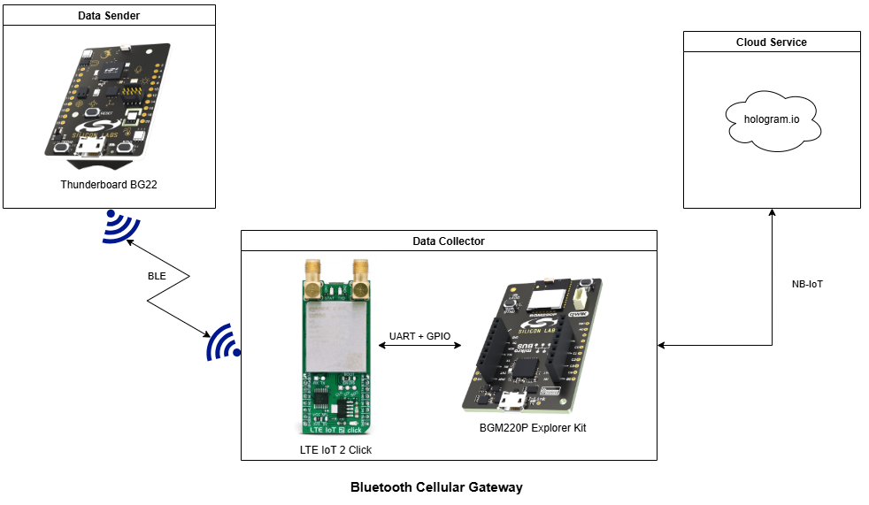

## SDK version ##

- [SiSDK v2024.12.0](https://github.com/SiliconLabs/simplicity_sdk)
- [Third Party Hardware Drivers v4.1.0](https://github.com/SiliconLabs/third_party_hw_drivers_extension)

## Software Required ##

- [Simplicity Studio v5 IDE](https://www.silabs.com/developers/simplicity-studio)
- [Hologram.io kit](https://www.hologram.io/)

## Hardware Required ##

- 1x [Bluetooth Low Energy Explorer Kit](https://www.silabs.com/development-tools/wireless/bluetooth). For example, [BGM220-EK4314A](https://www.silabs.com/development-tools/wireless/bluetooth/bgm220-explorer-kit)
- 1x [SLTB010A](https://www.silabs.com/development-tools/thunderboard/thunderboard-bg22-kit) EFR32BG22 Thunderboard Kit running the **Bluetooth - SoC Thunderboard EFR32BG22 (BRD4184A)** example (included in the SiSDK)
- 1x [LTE ToT 2 Click](https://www.mikroe.com/lte-iot-2-click) features the BG96 module which running on the firmware version: **BG96MAR02A07M1G**
- 1x [Hologram IoT sim card](https://www.hologram.io/products/global-iot-sim-card/)
- 1x [GSM/GPRS Antenna](https://www.mikroe.com/gsm-gprs-right-angle-rubber)
- 1x [Active GPS Antenna](https://www.mikroe.com/active-gps)

## Connections Required ##

- The **LTE ToT 2 Click** can be plugged into the **BGM220 Bluetooth Module Explorer Kit** via the mikroBus socket

   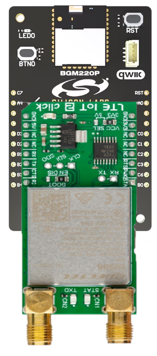

- Insert the SIM into the LTE IoT 2 Click. Ensure that the SIM is inserted properly.

- You need to attach the GSM and GPS antenna to the proper connectors (CN1 is the GSM one, and CN2 is the GPS antenna). Place the GNSS antenna to be able detect GPS satellites. GSM service is also required in the area.

## Setup ##

To test this application, you can either create a project based on an example project or start with a "Bluetooth - SoC Empty" project based on your hardware.

**NOTE**:

- Make sure that the [Third Party Hardware Drivers extension](https://github.com/SiliconLabs/third_party_hw_drivers_extension) is installed as part of the SiSDK and the [bluetooth_applications](https://github.com/SiliconLabs/bluetooth_applications) repository is added to [Preferences > Simplicity Studio > External Repos](https://docs.silabs.com/simplicity-studio-5-users-guide/latest/ss-5-users-guide-about-the-launcher/welcome-and-device-tabs).

- SDK Extension must be enabled for the project to install the required components.

### Create a project based on an example project ###

1. From the Launcher Home, add your device to My Products, click on it, and click on the **EXAMPLE PROJECTS & DEMOS** tab. Find the example project filtering by "cellular gateway".

2. Click **Create** button on **Bluetooth - Cellular Gateway** example. Example project creation dialog pops up -> click Create and Finish and Project should be generated.
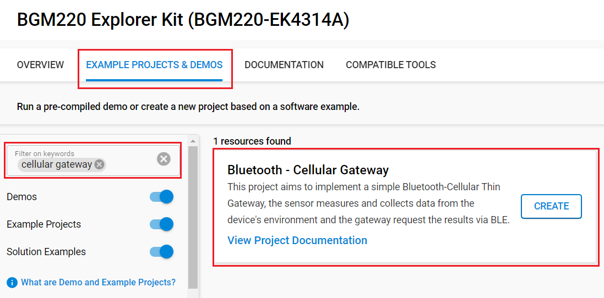

3. Build and flash this example to the board.

### Start with a "Bluetooth - SoC Empty" project ###

1. Create a **Bluetooth - SoC Empty** project for your hardware using Simplicity Studio 5.

2. Copy the *bg96_driver* folder and the *src/app.c* file into the project root folder (overwriting existing). Add the include directories into the project

   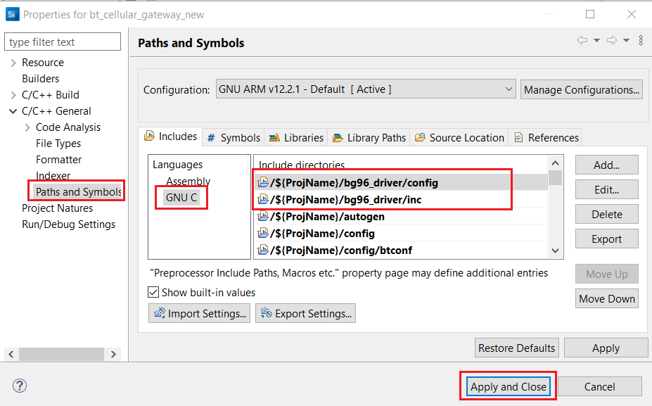

3. Open the .slcp file. Select the SOFTWARE COMPONENTS tab and install the software components:
   - [Services] → [IO Stream] → [IO Stream: EUSART] → default instance name: vcom
   - [Services] → [IO Stream] → [IO Stream: USART] → default instance name: mikroe. Set the "Receive buffer size" to 256
   - [Application] → [Utility] → [Log]
   - [Application] → [Utility] → [Timer]
   - [Platform] → [Utilities] → [Circular Queue] → Set "Max Queue Length" to 20
   - [Third Party Hardware Drivers] → [Services] → [mikroSDK 2.0 SDK - Peripheral Drivers] → [Digital I/O]
   - [Third Party Hardware Drivers] → [Services] → [mikroSDK 2.0 SDK - Peripheral Drivers] → [UART]

4. Open the `app.c` file. Replace the DEVICE_KEY with your Hologram token found here: <https://support.hologram.io/hc/en-us/articles/360035212714>

   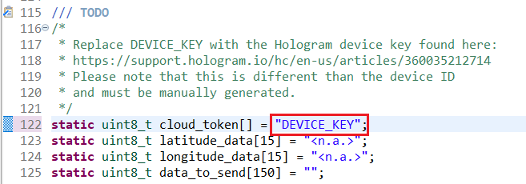

5. Build and flash this example to the Explorer Kit board.

6. From the Simplicity Studio 5 launcher, run the **Bluetooth - SoC Thunderboard EFR32BG22 (BRD4184A)** demo on the **Thunderboard EFR32BG22** board

   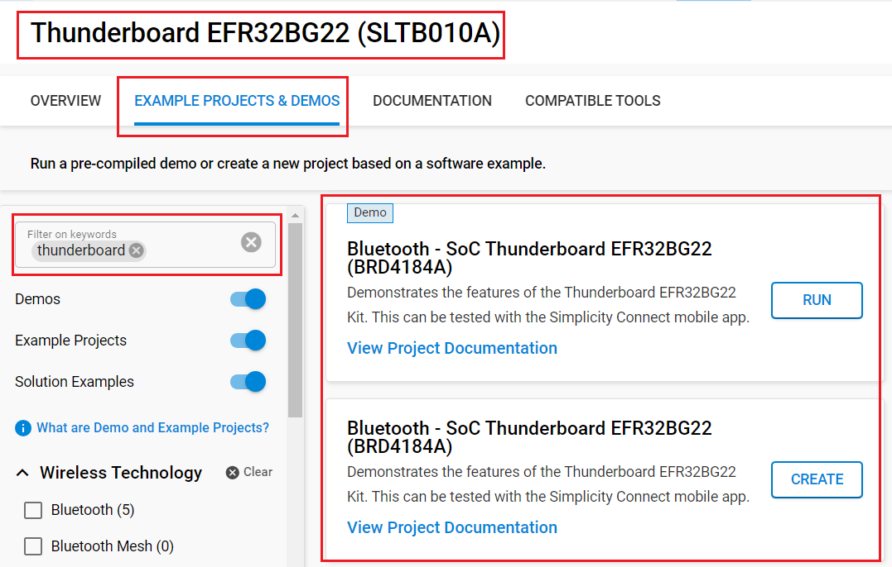

**Note:**

- A bootloader needs to be flashed to your board if the project starts from the "Bluetooth - SoC Empty" project, see [Bootloader](https://github.com/SiliconLabs/bluetooth_applications/blob/master/README.md#bootloader) for more information.

## How It Works ##

### Gateway Implementation ###

#### Application initialization ####

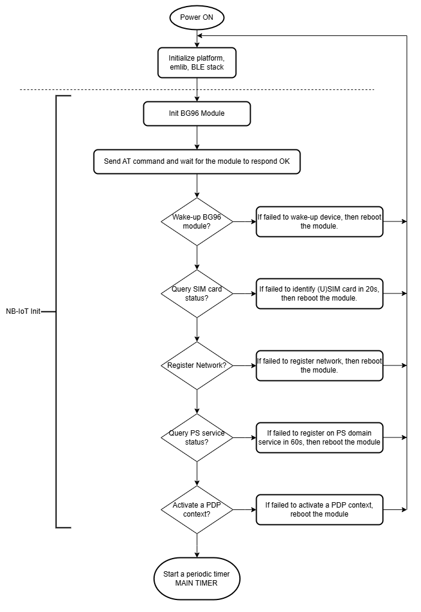

#### Data collection ####

Main periodic timer is main timer of the application, it is responsible for gathering sensor data, device location and send these data-set as a payload to the cloud service.

Sender periodic timer is intended to handle timeout for sensor and device location read functions and schedule the GNSS location retriever process.

Once the data-set is available or timeout occurs while at least sensor or location data is available the payload should be prepared and send to the cloud service.

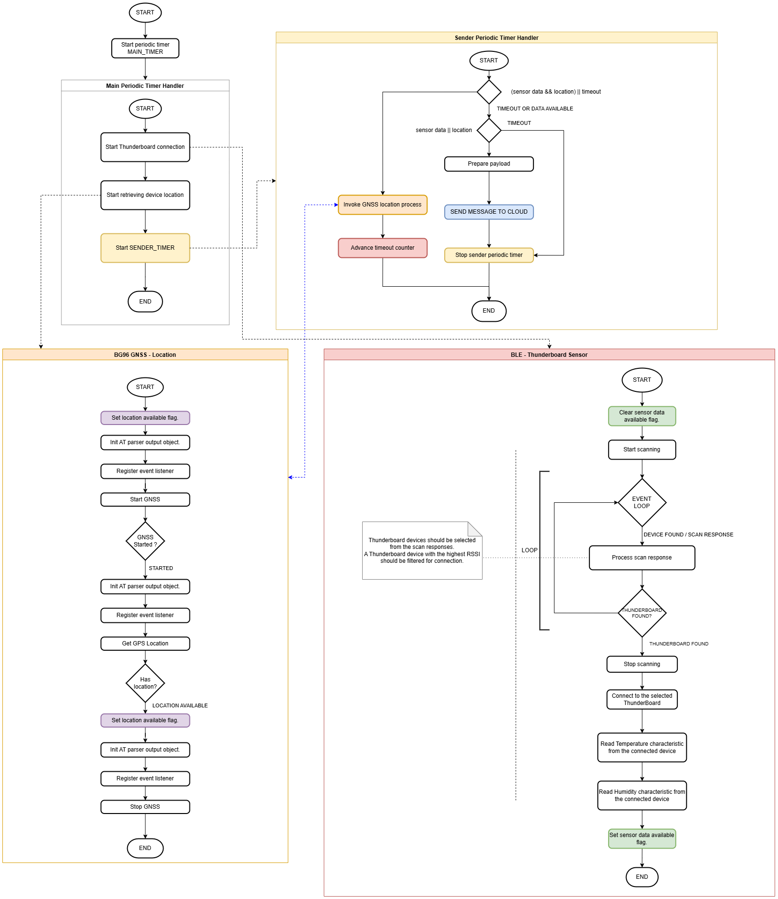

#### Sending a Message from the Gateway to the Hologram Dashboard ####

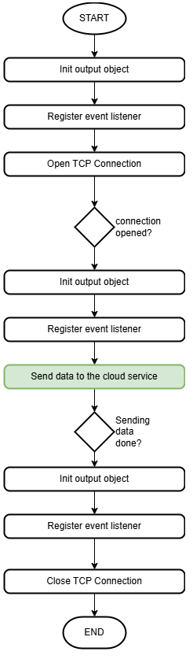

### Testing ###

- To test this application, you need one BGM220P board running the **Bluetooth - Cellular Gateway** example, and at least one Thunderboard BG22 board running the **Bluetooth - SoC Thunderboard EFR32BG22 (BRD4184A)** example. The topological setup for testing this example is shown in the [overview](#overview) section.

- Make sure that the Hologram SIM is activated on the Dashboard. Here is a [link](https://hologram.io/docs/guide/connect/connect-device/#sim-activation) that walks you through that process.

- Power the Thunderboard board. Connect the BMG220 with a micro usb cable to your computer, and open the Console that is integrated into Simplicity Studio to receive the data from the virtual COM port. You should expect a similar output to the one below.

   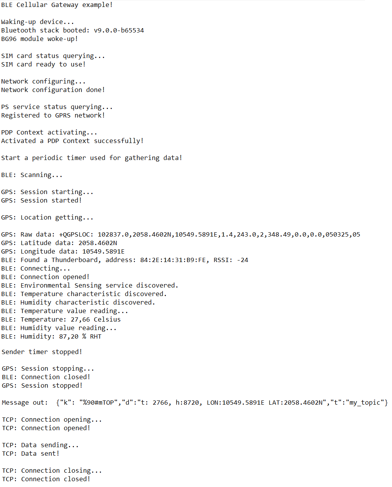

- Values: "t" is temperature, 27.3°C is represented as 2730, "h" is humidity, 66.13% RHT is represented as 6613. Latitude and Longitude values are also present (southern hemisphere S, northern hemisphere N, eastern longitude E, western longitude: W) after the valid GPS position was received.

- Navigate to the Hologram Dashboard and click All Activity at the bottom of the screen to expand the log. The message should appear, and that's it!

   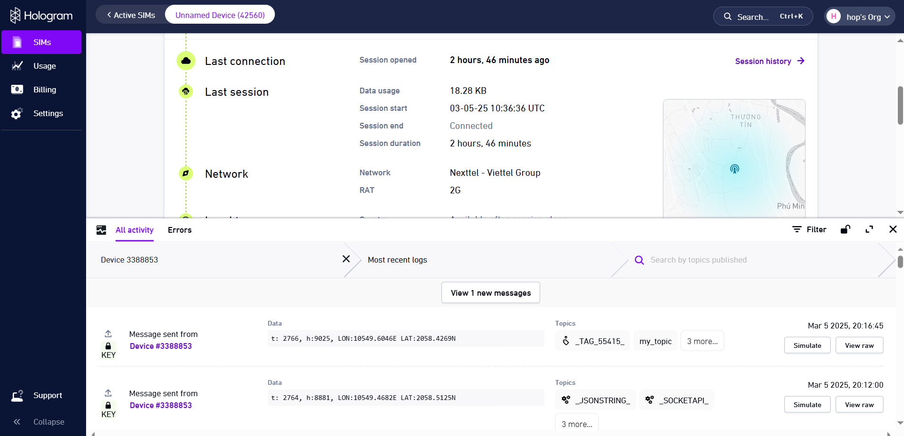

## Resources ##

- [BG96 AT Commands Manual](https://github.com/wwxxyx/Quectel_BG96/blob/master/BG96/Software/Quectel_BG96_AT_Commands_Manual_V2.2.pdf)

- [BG96 GNSS AT Commands Manual](https://github.com/wwxxyx/Quectel_BG96/blob/master/BG96/Software/Quectel_BG96_GNSS_AT_Commands_Manual_V1.1.pdf)

- [BG96 TCP/IP AT Commands Manual](https://github.com/wwxxyx/Quectel_BG96/blob/master/BG96/Software/Quectel_BG96_TCP(IP)_AT_Commands_Manual_V1.0.pdf)
