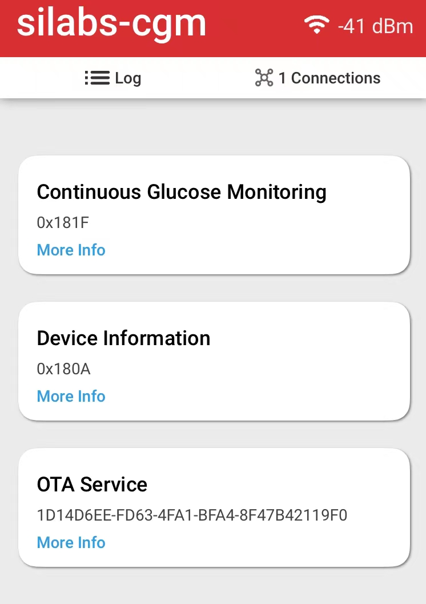
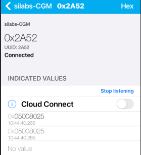
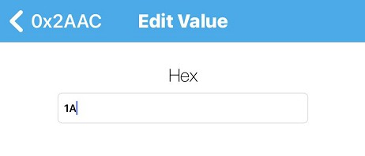
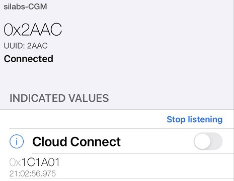
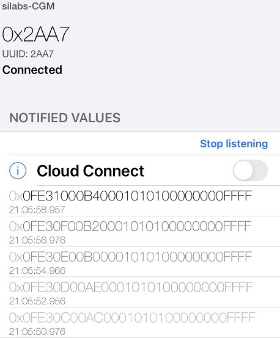

# Health Care - **Continuous Glucose Monitoring**

## Overview ##

This project shows an example of **Continuous Glucose Monitoring**  using the **Thunderboard EFR32BG22**

The project implemented the Bluetooth Continuous Glucose Monitoring Profile.

## Simplicity Studio and Gecko SDK Suite version ##

Simplicity Studio V5.3.1.0 and GSDK v4.0.1, if you use newer GSDK, it may need some code modification.

## Hardware Required ##

[Thunderboard EFR32BG22](https://www.silabs.com/development-tools/thunderboard/thunderboard-bg22-kit)

## Software Required

LightBlue app(version 4.2.1)/EFR connect app(version 2.4.2)

## How It Works ##

Please refer to [Bluetooth SIG CGM introduction.md](doc/Bluetooth SIG CGM introduction.md) in doc folder for more information.

If you want to create your project, please refer to section [Create from an SoC empty example](#create-from-an-soc-empty-example) of this document.

### Setup

1. Get a Thunderboard EFR32BG22, connect it to a PC,
3. Flash bootloader.s37 and Bluetooth - Continuous Glucose Monitoring .s37 in SimplicityStudio folder,
3. If the phone was bonded with the device before,  please remove the device from the Bluetooth setting in the phone.

### Test

Open EFR connect app, filter silabs-CGM, connect it.

There are two major services, Continuous Glucose Monitoring, and the OTA service.

##### OTA service

Used for OTA upgrade, please refer to [AN1086: Using the Gecko Bootloader with the Silicon Labs Bluetooth® Applications](https://www.silabs.com/documents/public/application-notes/an1086-gecko-bootloader-bluetooth.pdf) for more information.

##### CGM service

There are 7 characteristics: 

- CGM Measurement: UUID 0x2AA7 
- CGM feature: UUID 0x2AA8
- CGM status: UUID 0x2AA9
- CGM Session Start Timer: UUID 0x2AAA
- CGM Session Run Time: UUID 0x2AAB
- Record Access Control Point(RACP): UUID 0x2A52
- CGM Specific Ops Control Point(SOPS): UUID 0x2AAC

*Please refer to CGM specifications in doc folder for below process*

##### Report Number of Stored Records – ‘All records’

1. open LightBlue app, connect silabs-CGM,

2. find service Continuous Glucose Monitoring,

3. set indicate of 0x2AA7 characteristic(**CGM Measurement**) and 0x2A52 characteristic(**Record Access Control Point**),

4. write HEX 0401 to 0x2A52,

5. there will be 1 indication(0x05008025) in 0x2A52, it means there are 9600(0x2580) records by default.

   

There are two ways that a client can receive the CGM Measurement Characteristic values: periodic and requested

##### Get Glucose data periodically

4. set Notify of 0x2AA7 characteristic(**CGM Measurement**)
5. set indicate of 0x2AAC characteristic(**CGM Specific Ops Control Point**),
6. write HEX 1A to 0x2AAC, it means start session, you can find this test case in CGMS.TS.p6: CGMS/SEN/CGMCP/BV-22-C [CGM Specific Ops – ‘Start Session’

6. there will be 1 indication in 0x2AAC to show that start session success.

5. the sensor(Thunderboard) will continuous send notifications to 0x2AA7 characteristic until write 0x1B to 0x2AAC(stop session)

6. write "1B" to 0x2AAC to stop the session.

##### Get requested Glucose data records

3. set Notify of 0x2AA7 characteristic(**CGM Measurement**)
4. set indicate of 0x2A52 characteristic(**Record Access Control Point**),
5. write HEX  0105 to 0x2A52, it means to report the first record,
6. there will be 1 notification in 0x2AA7 which is the first record.

# Create from an SoC empty example #

1. create a SoC empty project,
3. install IO stream: USART(instance name: vcom), Log, Simple timer service,
5. import the CGM.btconf located in SimplicityStudio folder,
6. copy all files in the src folder to your SoC empty project folder.
5. build the project and flash to the Thunderboard

## .sls Project Used ##

Bluetooth - Continuous Glucose Monitoring.sls - This is the project. 

Also, precompiled binaries in S-Record format (.s37) are included for the projects above test the applications instantly. The files can be programmed using for example _Simplicity Studio Flash Programmer_ tool or _Simplicity Commander_ application. Remember to flash also the bootloader at least once.

# More information #

## PTS test ##

You can download CGM specifications from https://www.bluetooth.com/specifications/specs/, which are already in the doc folder of this repository.

Here is a video about Bluetooth PTS Test(Chinese): https://www.bilibili.com/video/BV1w44y1a7Hj?spm_id_from=333.999.0.0

