# Bluetooth SIG CGM introduction

This document is part of SIlicon Labs Healthcare CGM project. We use [Thunderboard EFR32BG22](https://www.silabs.com/development-tools/thunderboard/thunderboard-bg22-kit) to send the data to the smartphone.

This document provides an overview of the following aspects of CGM:

1. What is CGM,
2. The CGM service/profile specification,  
3. How to test CGM service/profile

# What is CGM

1. A continuous glucose monitor (CGM) is a device used for monitoring blood glucose on a continual basis by insulin-requiring people with diabetes, e.g. people with type I, type II diabetes or other types of diabetes (e.g. gestational diabetes).

   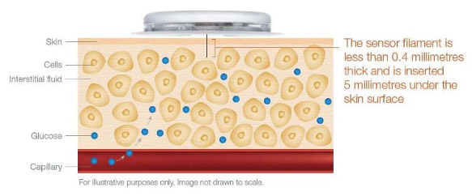

   ***This document focus on Bluetooth part, not the biological sensors and AFE. Generally, there are no common biological sensors and AFE solutions for the BGM/CGM product in marketing, some of the manufacturers have their own proprietary solutions.***

2. Continuous Glucose Monitoring (CGM) systems continually check glucose levels throughout the day and night and can alert you through ***Bluetooth***, if your glucose levels go too high or too low, the system will alert you.

3. the measurement unit is mmol/L(millimole per litre) or mg/DL(milligrams per deciliter), the conversion is:

```value [mg/dL] = 18.02 * value [mmol/L]```

4. The normal blood sugar (glucose) level for a healthy adult (without diabetes) should be less than 3.9-6.1 mmol/L (70-110 mg/DL) before meals.

# SIG CGM service/profile

In this section, I will explain the structure of the SIG CGM service/profile and how it works.

Basically, the profile contains all the collector and sensor's characteristics and behaviors, while the service focus on sensor's characteristics and behaviors.

## The structure of SIG CGM service/profile

The SIG published Continuous Glucose Monitoring Service and Continuous Glucose Monitoring Profile, and in additional, there are test case specifications called CGMS.TS and CGMP.TS. these documents are in doc folder of this repo.

The profile defines two roles: CGM Sensor and Collector. The CGM Sensor is the device that measures the Glucose level concentration and the Collector is the device that receives the Glucose measurement and other related data from a CGM Sensor.
• The CGM Sensor shall be a GATT Server.
• The Collector shall be a GATT Client.
At any given time, a CGM Sensor shall be connected to **only** one Collector.

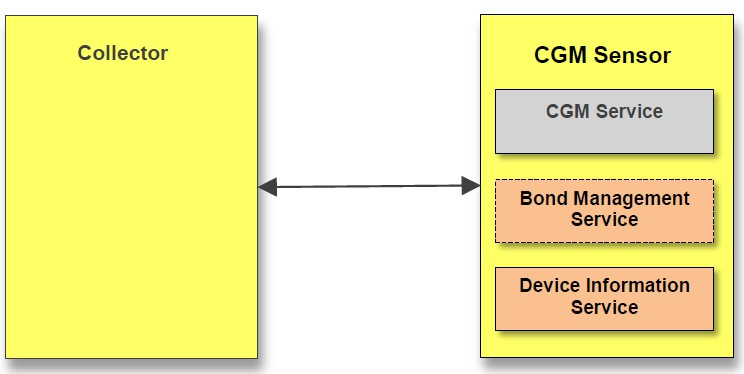

In the real situation, the collector maybe an APP runs on a smartphone. 

Below is a SIG CGM service, it includes many characteristics.

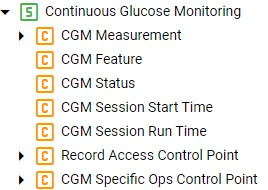

The Collector shall write to **CGM Specific Ops Control Point/Record Access Control Point** using one of the supported Op Codes to request a CGM Sensor to perform a procedure. 

## How SIG CGM works 

1. Prepare one CGM sensor and one collector, The CGM Sensor shall instantiate one and only one CGM Service.

2. The CGM Sensor will enter a GAP Connectable Mode and start advertising when it has data to send to the Collector. The Collector will typically execute a GAP connection establishment procedure such that it is scanning for the CGM Sensor. 
3. When a connection is established,  the Collector shall perform the GATT Discovery the service and characteristics, include below:

+ CGM Measurement Characteristic
+ CGM Feature Characteristic
+ CGM Status Characteristic
+ CGM Session Start Time Characteristic
+ CGM Session Run Time Characteristic
+ Record Access Control Point Characteristic
+ CGM Specific Ops Control Point Characteristic

4. The Collector shall bond with the CGM Sensor,

5. The Collector shall configure the Client Characteristic Configuration descriptor to enable notifications or indications as needed.
6. The Collector shall write the Set CGM **Communication Interval** Op Code to the **CGM Specific Ops Control Point**. For example, writing a parameter of 0x05 will set the CGM Communication Interval value to 5 minutes within the CGM Sensor. 
7. The Collector shall write the Op Code for **Start Session** to the **CGM Specific Ops Control Point**. 
8. The Collector shall send its actual time (user facing time) to the CGM Sensor  to enable the CGM Sensor **CGM Session Start Time** to calculate its Session Start Time. This should be done at least once after a Session is started. The session start time struct is Date time+time zone+DST offset.
9. the CGM measurement record contains two important fields: CGM Glucose Concentration Field which is CGM glucose concentration, and Time Offset Field, The Time Offset field is used in conjunction with the CGM Session Start Time to represent the time difference of the separate CGM measurements in relation to the session start time.
10. There are two ways that a collector can receive notifications from sensor **CGM Measurement** value: periodic and requested. 

+ **Periodic Notifications**: If a CGM session is running, the CGM Sensor measures the glucose level periodically in a device specific interval (Measurement time interval). When the CGM Communication Interval is set for periodic communication, the CGM Sensor periodically sends notifications of the most recent CGM measurements that have occurred since the last communication interval notification.
+ **Requested Notifications**: If a CGM session is running and the client misses some CGM measurements (e.g., due to link loss, or the CGM session is stopped), the client may write to the **Record Access Control Point** to request specific data from the patient record database, which triggers immediate notifications of the CGM Measurement characteristic value.

11. To stop the CGM session the Collector shall write the Op Code for **Stop Session** to the **CGM Specific Ops Control Point.** The CGM Sensor then stops the measurement.
12. When a connection is terminated due to link loss, a Collector should attempt to reconnect to the CGM Sensor.

# How to test CGM service/profile

[Thunderboard EFR32BG22](https://www.silabs.com/development-tools/thunderboard/thunderboard-bg22-kit) acts as CGM sensor role. Fore more information please refer to README.md in this repo.

***This document focus on how to use PTS, not the whole qualify process.***

## 1. PTS setup

The test includes hardware and software. The software is Profile Tuning Suit(PTS), you can go to [SIG website](https://apps.bluetooth.com/mysettings#/ptsdownload) to download, the latest version is 8.1.2, please note the PTS may have some issues, you can raise a ticket through PTS(click HELP->PTS issue).

The hardware is PTS dongle, you can purchase it in [SIG store](https://store.bluetooth.com/). The dongle acts as CGM collector. 

This document use the new LE only dongle(up to core v5.2 supported).

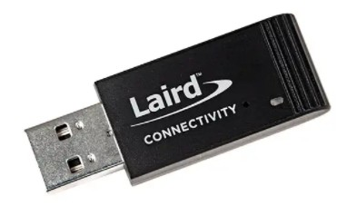


In additional, you need to download [PTS Firmware Upgrade Software](https://www.bluetooth.com/develop-with-bluetooth/qualification-listing/qualification-test-tools/profile-tuning-suite/), in case the dongle does not have the latest firmware.

## 2. Create a test workspace

Firstly, plug in the dongle to the PC, open PTS software,

then click "connect" to the dongle.

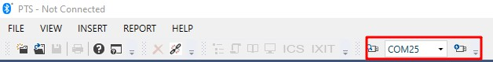

create a new workspace for testing.

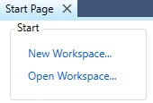

make sure the Thunderboard is working now, then choose the CGM sensor, in this case, the CGM sensor's name is "silabs-CGM", click next, 

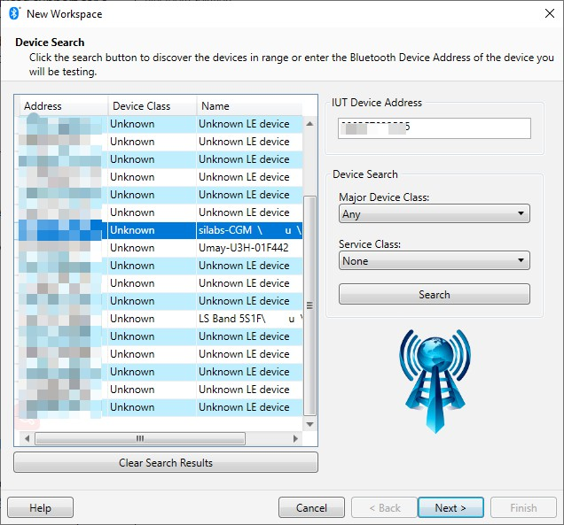

in this test, we select CGMP and CGMS to the test Suite, click finish.

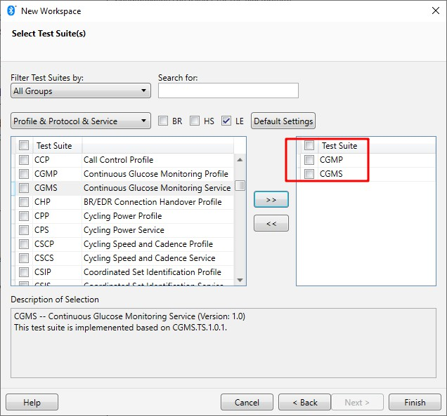

remember select TSPC_ALL to unlock all the test cases.

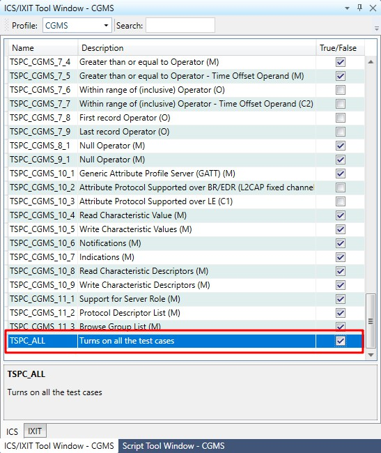

expand all the test cases in this panel, you should pass all the CGM service and the sensor part of the CGM profile,


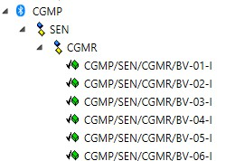

the whole picture is below,

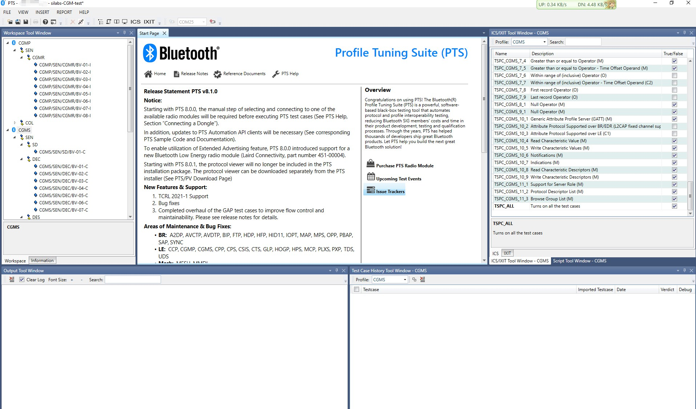

# 3. start to test

The test case is associated with the SIG test suite, let's take CGMS/SEN/RAR/BV-01-C as an example. It is described in  CGMS.TS.p6 section 4.12 CGMS/SEN/RAR/BV-01-C [Report Stored Records – ‘All records’].

After test, the test item will have a PASS flag shown below,

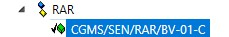

if something got wrong, the test item will have a failed flag as below,

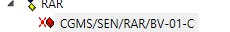

and it is time to check the log, 

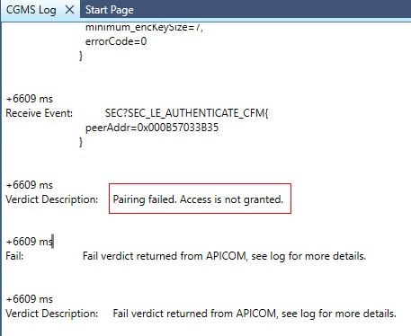

from the log, we can find that the CGM sensor has paired with the collector before, while the collector did not remember this or the key is removed by accident, after erase the sensor's flash, the sensor and collector return to initial mode, the test case can be passed.

# Reference

All of the specifications of CGM can be found at the Bluetooth SIG website https://www.bluetooth.com/specifications/specs/, search CGM, 

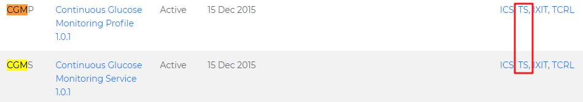

click CGMP and CGMS to download the specification, click TS to download the test case specification.

For your convenience, all the documents are in the doc folder of this repo.

