# Bluetooth - CO Monitor (MQ7)

[%20board-green)](https://www.sparkfun.com/products/14532)

## Summary

This project aims to implement a CO application using Silicon Labs development kits and external sensors integrated with the BLE wireless stack. It can be used to monitor and track carbon monoxide levels in various environments. Users can use this system for monitoring CO levels in offices, warehouses, factories... The wireless CO system incorporates an MQ7 sensor and client devices. The sensor periodically measures the CO level and advertises the processed CO level value to the client devices.

**Sensor:**

The sensor device is an EFR32 xG24 Explorer Kit connected to a Mikroe CO Click sensor board. This device periodically measures the CO level and advertises the processed CO level value to the client devices.

The advertisement package contains a measurement counter value and the processed CO level in ppm.

**Client:**

The client device is an EFR32 xG24 Explorer Kit connected to a BUZZ 2 Click buzzer and a Sparkfun Micro OLED Display. This device provides two operational modes.

If the BTN0 is pressed during the initialization sequence then the application boots into the configuration mode. In this operational mode, the device sends normal advertisement packages and is connectable to other BLE devices. Users can connect to the client via the Simplicity Connect mobile application. This mode provides BLE characteristics to configure the volume of the connected buzzer, the CO alarm threshold level, and notification status.

If the BTN0 is released or not pressed during the initialization phase, the application starts scanning the BLE network. The application periodically scans the BLE network looking for a sensor device. The application logic and display updating features are invoked when a sensor device is found and receives at least five advertisement packages from it and each package has different sample counter values.

## SDK version

- [SiSDK v2024.12.0](https://github.com/SiliconLabs/simplicity_sdk)
- [Third Party Hardware Drivers v4.1.0](https://github.com/SiliconLabs/third_party_hw_drivers_extension)

## Software Required

- [Simplicity Studio v5 IDE](https://www.silabs.com/developers/simplicity-studio)
- [Simplicity Connect Mobile App](https://www.silabs.com/developer-tools/simplicity-connect-mobile-app)

## Hardware Required

**Sensor:**

- 1x [Bluetooth Low Energy Development Kit](https://www.silabs.com/development-tools/wireless/bluetooth). For example, [XG24-EK2703A](https://www.silabs.com/development-tools/wireless/efr32xg24-explorer-kit?tab=overview) EFR32xG24 Explorer Kit
- 1x [CO CLICK](https://www.mikroe.com/co-click)
- 1x smartphone running the 'Simplicity Connect' mobile app

**Client:**

- 1x [Bluetooth Low Energy Development Kit](https://www.silabs.com/development-tools/wireless/bluetooth). For example, [XG24-EK2703A](https://www.silabs.com/development-tools/wireless/efr32xg24-explorer-kit?tab=overview) EFR32xG24 Explorer Kit
- 1x [SparkFun Micro OLED Breakout (Qwiic) board](https://www.sparkfun.com/products/14532)
- 1x [Buzzer 2 Click Board](https://www.mikroe.com/buzz-2-click)

## Connections Required

The hardware connection is shown in the image below:

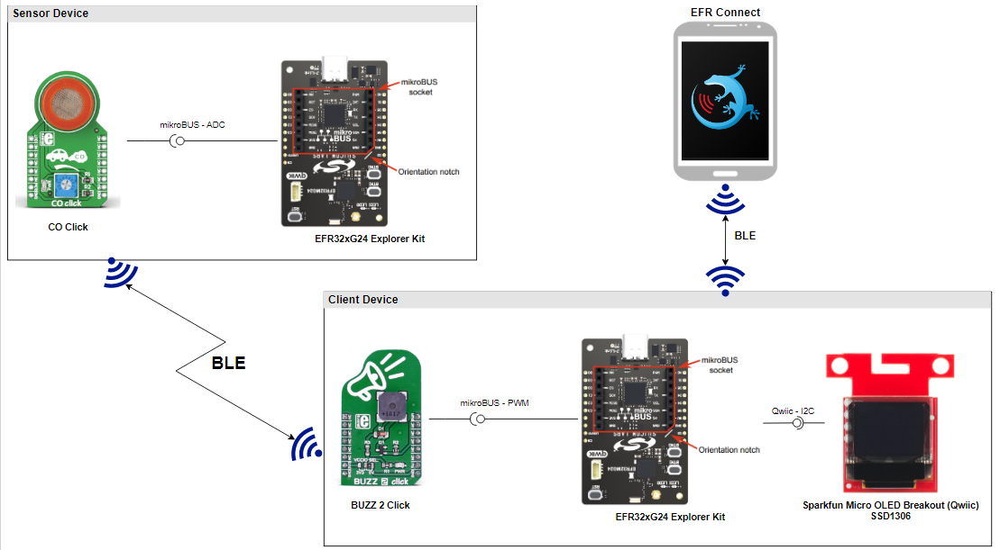

**Sensor:**

The CO click board can be easily connected to the EFR32 xG24 Explorer Kit via a MikroE connection.

**Client:**

The Sparkfun OLED Display board can be easily connected to the EFR32 xG24 Explorer Kit by using a Qwiic cable. The Buzzer 2 Click connects to the EFR32 xG24 Explorer Kit using PWM via a MikroE connection.

## Setup

To test this application, you can either create a project based on an example project or start with a "Bluetooth - SoC Empty" project based on your hardware.

**NOTE**:

- Make sure that the [Third Party Hardware Drivers extension](https://github.com/SiliconLabs/third_party_hw_drivers_extension) is installed as part of the SiSDK and the [bluetooth_applications](https://github.com/SiliconLabs/bluetooth_applications) repository is added to [Preferences > Simplicity Studio > External Repos](https://docs.silabs.com/simplicity-studio-5-users-guide/latest/ss-5-users-guide-about-the-launcher/welcome-and-device-tabs).

- SDK Extension must be enabled for the project to install the required components.

### Create a project based on an example project

1. From the Launcher Home, add your hardware to My Products, click on it, and click on the **EXAMPLE PROJECTS & DEMOS** tab. Find the example project filtering by "co".

2. Click **Create** button on both **Bluetooth - CO Monitor (MQ7) - Client** and **Bluetooth - CO Monitor (MQ7) - Sensor** examples. Example project creation dialog pops up -> click Create and Finish and Project should be generated.
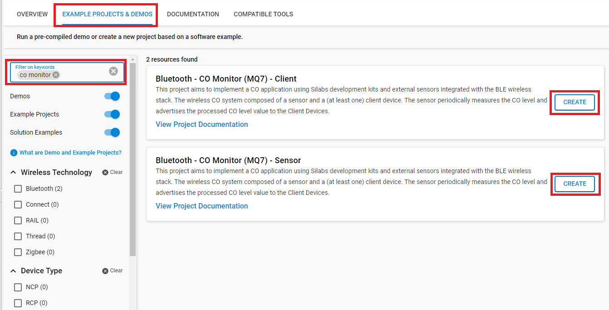

3. Build and flash this example to the board.

### Start with a "Bluetooth - SoC Empty" project

1. Create a **Bluetooth - SoC Empty** project for your hardware using Simplicity Studio 5.

2. copy all the .h and .c files to the following directory of the project root folder (overwriting existing file).

    - With **sensor** device: [bt_co_sensor](bt_co_sensor)

    - With **client** device: [bt_co_client](bt_co_client)

3. Install the software components:

    - Open the .slcp file in the project.

    - Select the SOFTWARE COMPONENTS tab.

    - Install the following components for **sensor** device:

        - [Application] → [Utility] → [Timer]
        - [Services] → [IO Stream] → [IO Stream: USART] → default instance name: vcom
        - [Application] → [Utility] → [Log]
        - [Third Party] → [Tiny printf]
        - [Third Party Hardware Drivers] → [Sensors] → [MQ7 - CO Click (Mikroe)]

    - Install the following components for **client** device:

        - [Services] → [IO Stream] → [IO Stream: USART] → default instance name: vcom
        - [Application] → [Utility] → [Log]
        - [Third Party] → [Tiny printf]
        - [Platform] → [Driver] → [Button] → [Simple Button] → default instance name: btn0
        - [Platform] → [Driver] → [I2C] → [I2CSPM] → default instance name: qwiic
        - [Platform] → [Driver] → [PWM] → [PWM] → default instance name: mikroe
        - [Third Party Hardware Drivers] → [Display & LED] → [SSD1306 - Micro OLED Breakout (Sparkfun) - I2C]
        - [Third Party Hardware Drivers] → [Audio & Voice] → [CMT_8540S_SMT - Buzz 2 Click (Mikroe)]
        - [Third Party Hardware Drivers] → [Services] → [GLIB - OLED Graphics Library]

4. Import the GATT configuration:

    - Open the .slcp file in the project again.
    - Select the CONFIGURATION TOOLS tab and open the "Bluetooth GATT Configurator".
    - Find the Import button and import the  gatt_configuration.btconf file.
        - Client: `bt_co_client/config/btconf/gatt_configuration.btconf`
    - Save the GATT configuration (ctrl-s).

5. Build and flash this example to the board.

**Note:**

- A bootloader needs to be flashed to your board if the project starts from the "Bluetooth - SoC Empty" project, see [Bootloader](https://github.com/SiliconLabs/bluetooth_applications/blob/master/README.md#bootloader) for more information.

## How it Works

### Sensor

#### How to calibrate sensor

- Note: Because the EFR32xG24 Explorer Kit can only measure the voltage range from 0 V to 3.3 V, so you have to turn the rheostat on the CO click to 0 Ohm.

The graph below shows the dependence between Rs/R0 and the value of Ppm

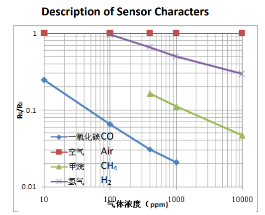

Datasheet has a graph for sensitivity characteristic, following the equation

    ppm(Rs/R0) = coefficient_A * Rs/R0 ^ (coefficient_B) (*)

with

    Rs means resistance in target gas with different concentrations.
    R0 means resistance of sensor in clean air.

From the blue line, select 2 points and replace the above equation, you will be able to calculate coefficient A and coefficient B. You will calculate the value as follows:

    coefficient_A = 0.14
    coefficient_B = -2.26

The R0 is calculated by assuming clean air (approx 10 ppm of carbon monoxide) -- it is therefore best to perform this calibration outside. Place the sensor in a place where the air is clean and assume the value of carbon monoxide is 10ppm. Substituting into equation (*) you get the ratio Rs/R0. Then call the function mq7_read_rs to calculate Rs. From Rs and the ratio Rs/R0 you will be able to calculate R0.

#### Sensor overview

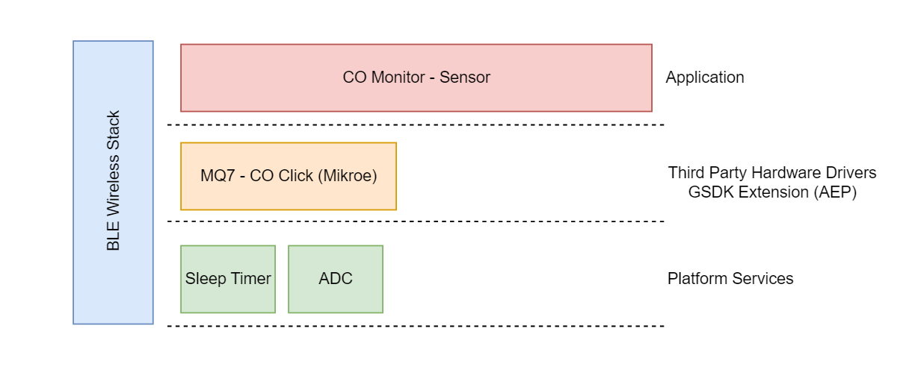

#### Sensor Implementation

**Application initialization:**

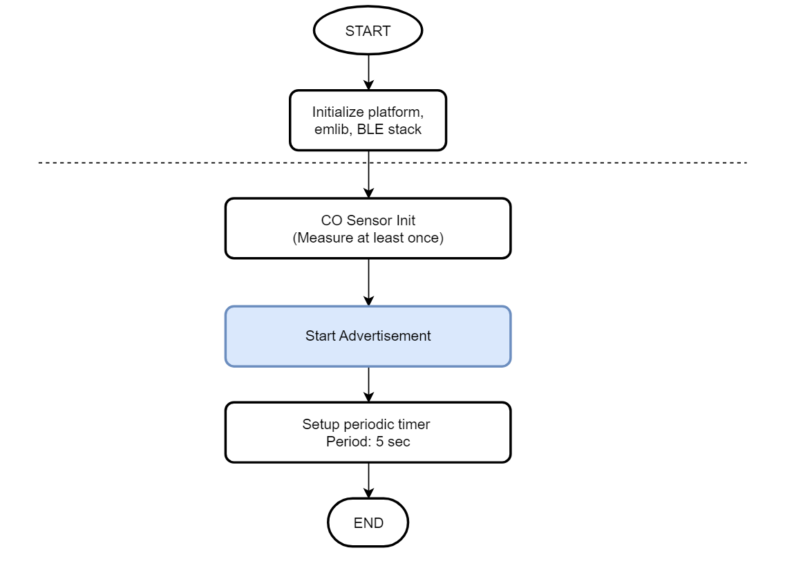

**On Timer callback:**

This handler called when the timer expires in every configured process period time.

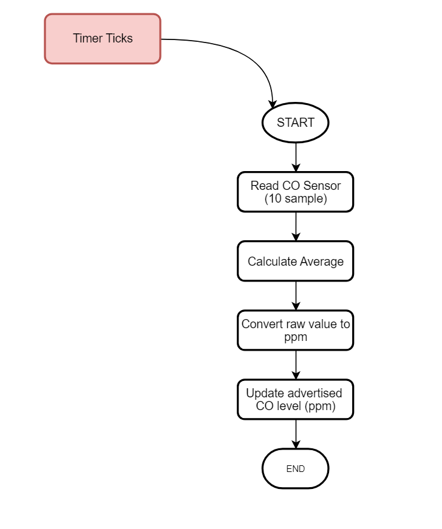

**Advertisement Packet:**

AdvData field in the advertisement packet is as table below:

| DeviceName | SampleCounter | COLevel |
|-----|-----|-----|
| CO_S_< MAC unique 2 byte >| 4 byte | 4 byte |

- SampleCounter: Device increases the counter value for each new measurement
- CoLevel: Calculated CO level in ppm
- Device is not connectable. It sends [manufacturer specific advertisement](https://github.com/SiliconLabs/bluetooth_stack_features/tree/master/advertising/advertising_manufacturer_specific_data) packets.

### Client

#### Client overview

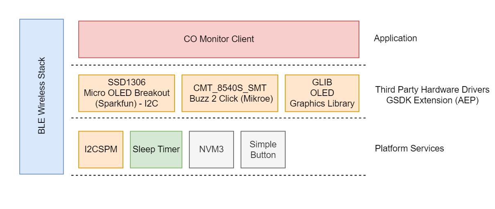

#### Client GATT Database

Advertisement Packet
Device name: CO_Client

GATT Database

- Device name: CO_Client

- **[Service]** CO Client
  - **[Char]** Threshold CO ppm
    - **[R]** Get alarm threshold value
    - **[W]** Set alarm threshold value - alarm_threshold (e.g.: 100 => 100 ppm)
  - **[Char]** Notification
    - **[R]** Get Notification Sound Status
    - **[W]** Set Notification Sound Status value - notification_status (0 - disabled, 1 - enabled)
  - **[Char]** Buzzer volume
    - **[R]** Get Buzzer volume
    - **[W]** Set Buzzer volume value (0 - 10)

#### Client Implementation

**Application initialization:**

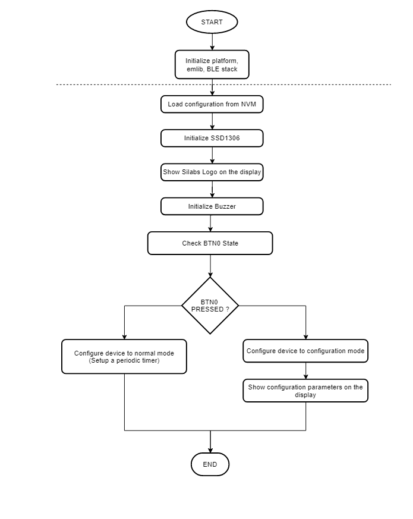

**Runtime - Configuration Mode:**

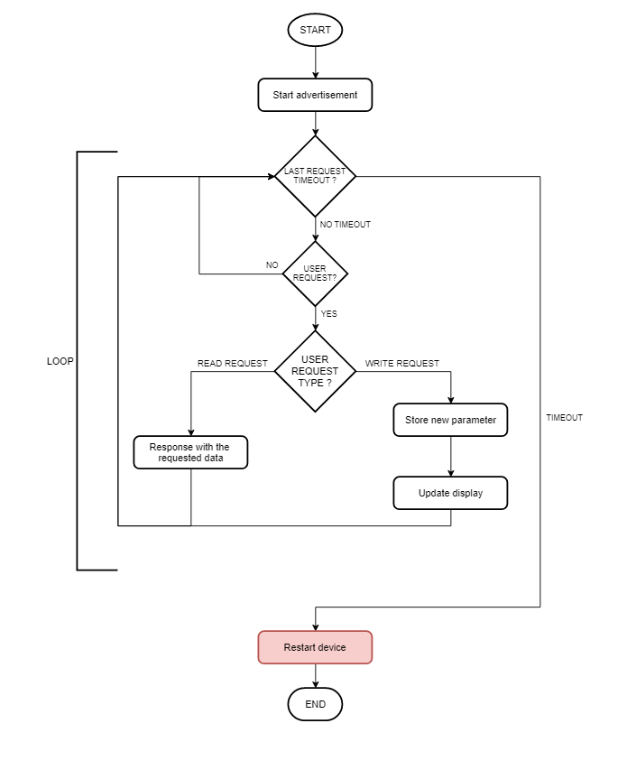

**Runtime - Normal Mode:**

*Client events:*

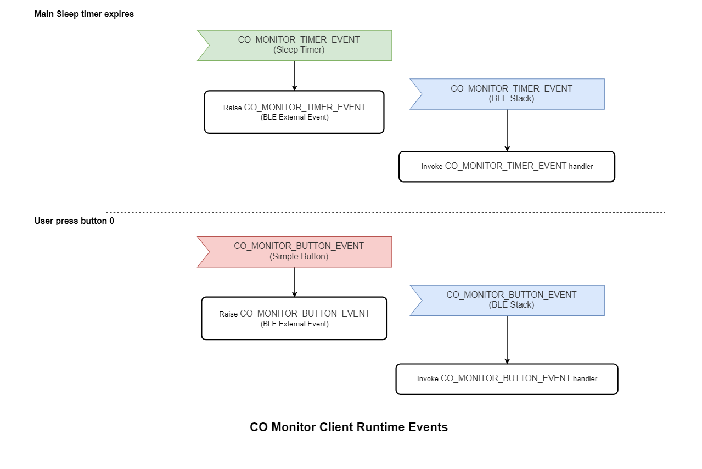

*Event Handler:*

co_monitor_callback is a function invoked periodically by the sleep timer service with the configured time period.

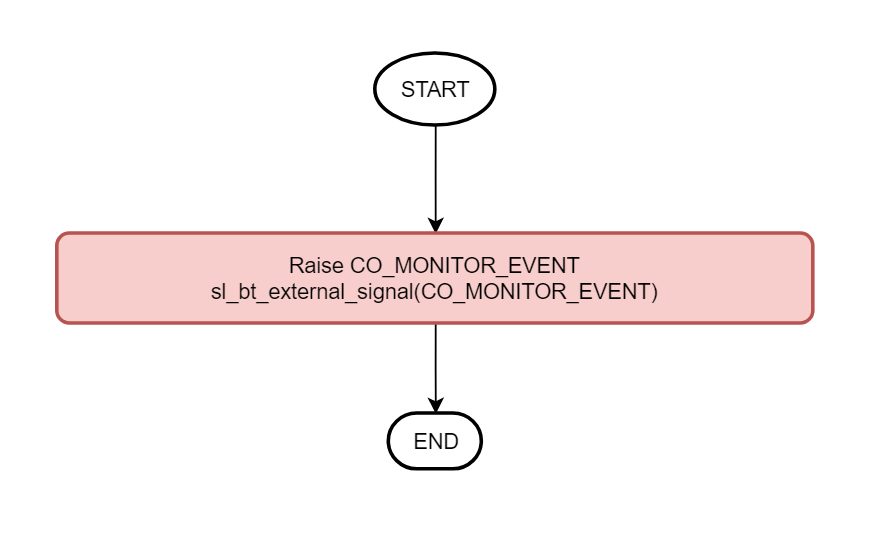

*BLE External Event Handler:*

CO monitor event handler retrieves and processes the CO level data.

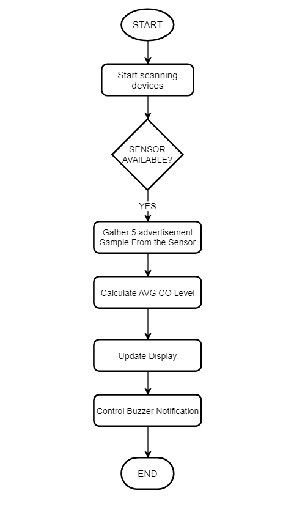

*CO Notification Event:*

This function processes the measured values, checks the values against the configured thresholds.  

If the measured value(s) are above the configured thresholds => the buzzer will be activated.

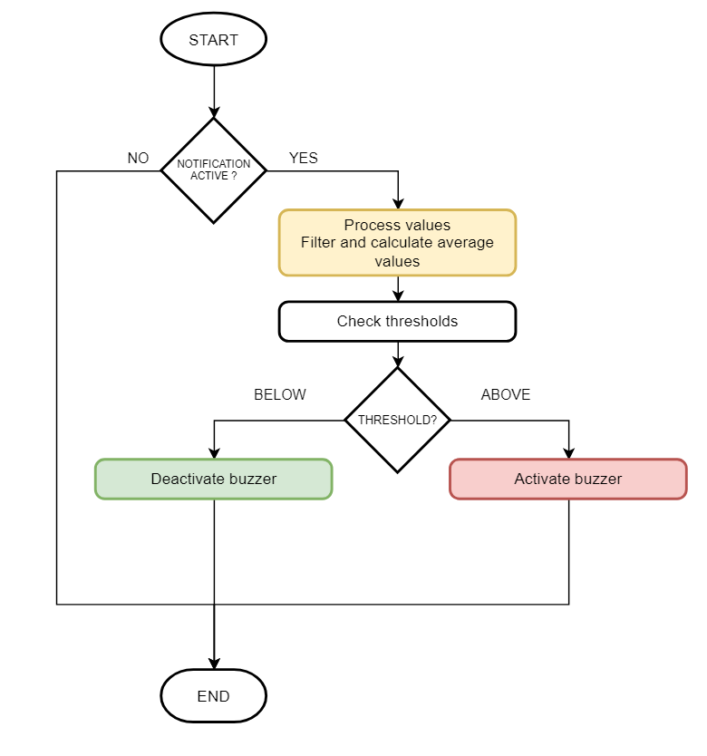

*Event Handler for button:*

This event handler checks the BTN0's status. When the button is released, it checks the notification feature status, and buzzer state in accordance with the flowchart below.

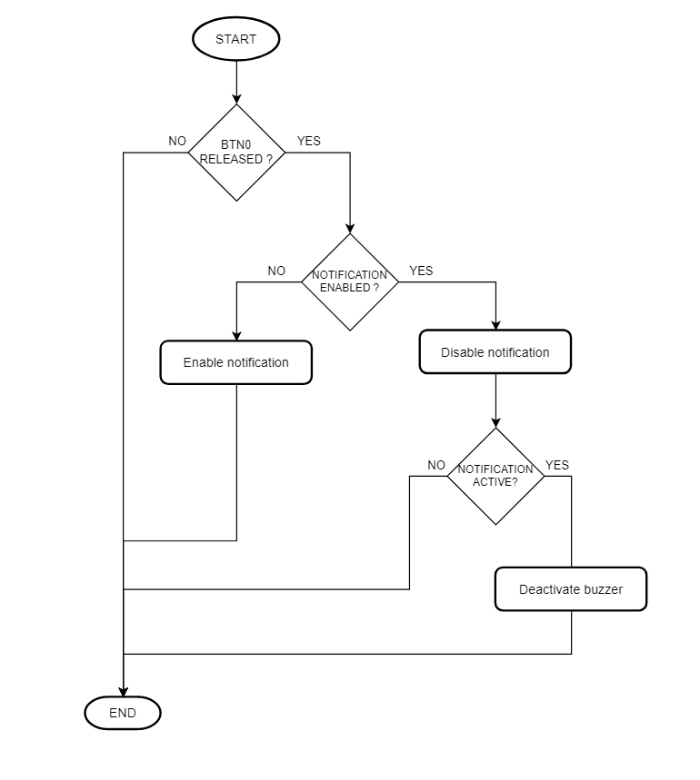

**Display:**

If the Client is in the configuration mode, the OLED will show threshold and status of Alarm (ON or OFF)

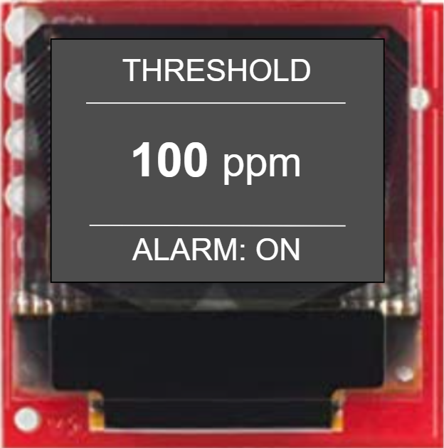

If the Client is in the normal mode, the OLED will show CO level and threshold CO value

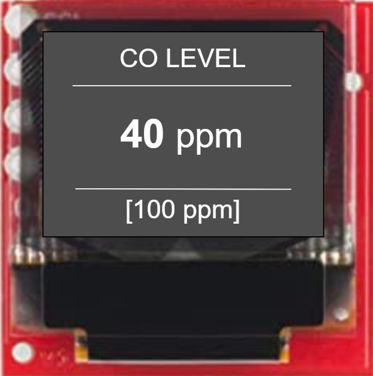

### Testing

#### Sensor

You can use a smartphone application such as the Simplicity Connect application, to see the advertising packet from the Sender.

Follow the below steps to test the example with the Simplicity Connect application:

- Open the Simplicity Connect app on your smartphone and allow the permission requested the first time it is opened.

- Find your device in the Bluetooth Browser, advertising as *CO_S*.

- Click on the instance of CO_S_\<address>. Now, you should see the counter and the CO ppm value on the Manufacturer Specific Data row. Please have a look at the red highlighted area below in the result pictures.

    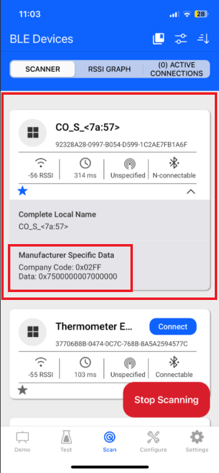

- After flashing the code to the sensor board, a similar output from the serial terminal as shown below

    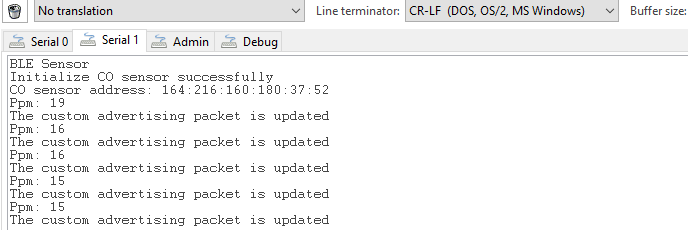

#### Client

**Configuration mode**

This mode allows to configure CO threshold for warning, buzzer volume and notification. Default timeout for every step is 25 seconds. If the timer expires, it will reboot to normal mode.

- To enter the configuration mode, press PB0 during startup (power-on or reset)
   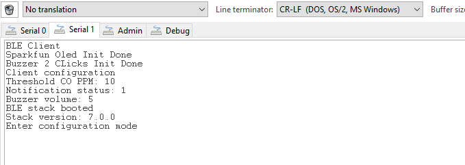
- Using Simplicity Connect Mobile App to connect and configure parameters. The device name is 'CO client'.
   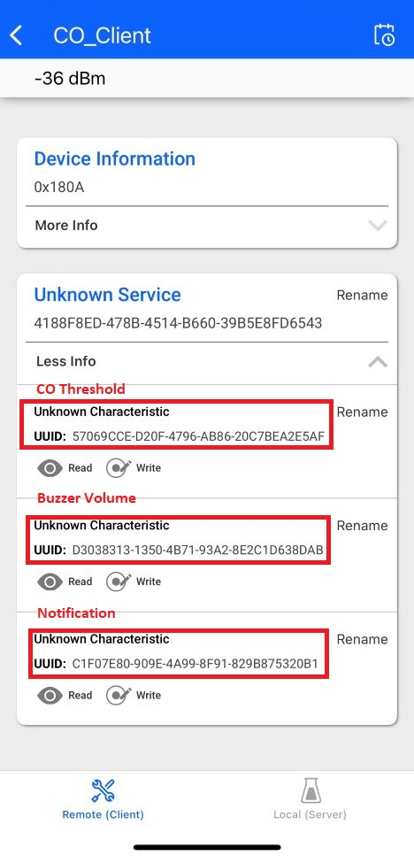
- If you are done with the configuration, wait for the timeout or press reset button on the board to go to normal mode.

**Normal mode**

- Upon reset, the application will display the Silicon Labs logo on the OLED screen for a few seconds.

- After the firmware is configured, the device starts in normal mode. In this state, it starts scanning advertising devices.

- Open your terminal emulator and connect to your client device over its serial port. Set the baud rate to 115200. A similar output as below

    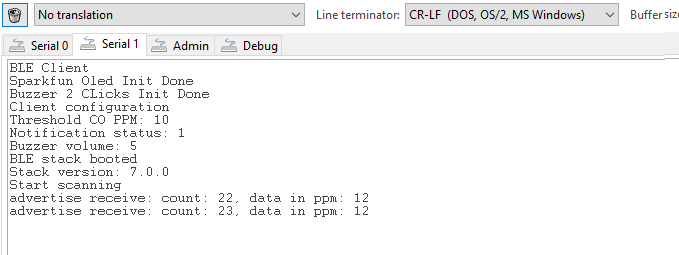

- You should raise the CO level higher than configured CO threshold, enable notification to make the buzzer works for the warning. Feel free to change threshold lower for testing purpose during configuration step.

**Note:** Button PB0 should be pressed during startup (power-on or reset) to run the client in Configuration Mode. The terminal will display the information as below
