# Bluetooth - Container Level Detection (VL53L1X)

## Overview

This project proposes the development of an application that uses the Silabs xG24 Explorer kits and Sparkfun Distance sensor breakout and Adafruit IS31FL3741 components to monitor the levels of two containers and display the information graphically. The application will use BLE for wireless communication between the devices

The following picture shows the overview of application:

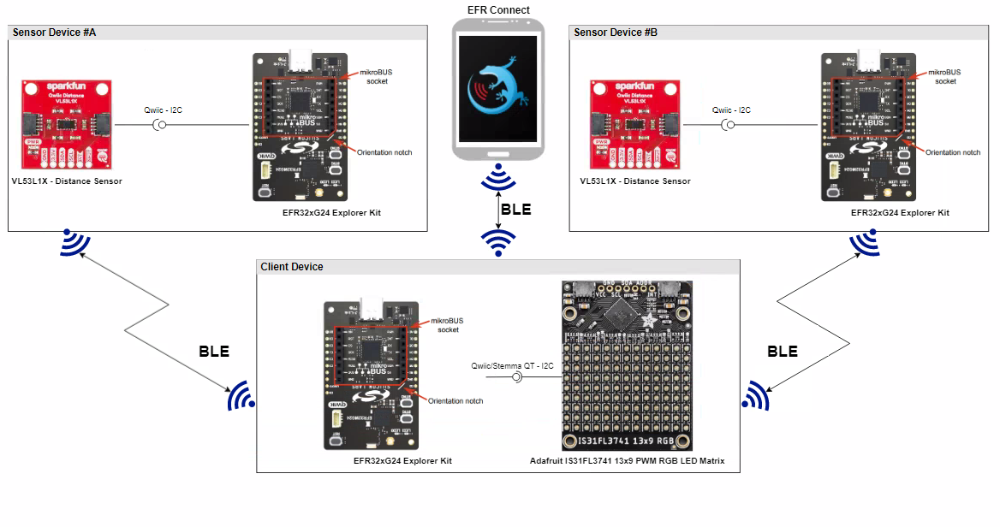

**Sensor:**

The sensor device measures the distance between the distance sensor and the content of the container. The sensor device calculates the average distance and advertises it via BLE

**Client:**

The client device scans the BLE devices and reads the measured distance values from the sensor devices advertisement package. The client device displays the container level on the display using a vertical bar.

The client device can display levels of up to 4 container level sensors. The lowest and highest level values can be configured for each container slot. 

Once measurement data is not updated for a slot within a time period, the client device show NO DATA on the display for that.

## Gecko SDK Suite version

- GSDK v4.2.2
- [Third Party Hardware Drivers](https://github.com/SiliconLabs/third_party_hw_drivers_extension)

## Hardware Required

**Sensor:**

- [EFR32xG24 Explorer Kit - XG24-EK2703A](https://www.silabs.com/development-tools/wireless/efr32xg24-explorer-kit?tab=overview)

- [SparkFun Distance Sensor Breakout - VL53L1X](https://www.sparkfun.com/products/14722#:~:text=Each%20VL53L1X%20sensor%20features%20a,of%20this%20sensor%20is%204cm.)

**Client:**

- [EFR32xG24 Explorer Kit - XG24-EK2703A](https://www.silabs.com/development-tools/wireless/efr32xg24-explorer-kit?tab=overview)

- [IS31FL3741 - 13x9 PWM RGB LED Matrix (Adafruit)](https://www.adafruit.com/product/5201)

**NOTE:**
Tested boards for working with this example:

| Board ID | Description  |
| ---------------------- | ------ |
| BRD2703A | [EFR32xG24 Explorer Kit - XG24-EK2703A](https://www.silabs.com/development-tools/wireless/efr32xg24-explorer-kit?tab=overview)    |
| BRD4108A | [BG22 Bluetooth SoC Explorer Kit - BG22-EK4108A](https://www.silabs.com/development-tools/wireless/bluetooth/bg22-explorer-kit?tab=overview) |
| BRD4314A | [BGM220 Bluetooth Module Explorer Kit - BGM220-EK4314A](https://www.silabs.com/development-tools/wireless/bluetooth/bgm220-explorer-kit?tab=overview)   |
| BRD2601B | [EFR32xG24 Dev Kit Board - xG24 -EK2601B](https://www.silabs.com/development-tools/wireless/efr32xg24-dev-kit?tab=overview)   |
| BRD2704A | [Sparkfun Thing Plus MGM240P - EK2704A](https://www.sparkfun.com/products/20270)   |
## Connections Required

The hardware connection is shown in the images below:

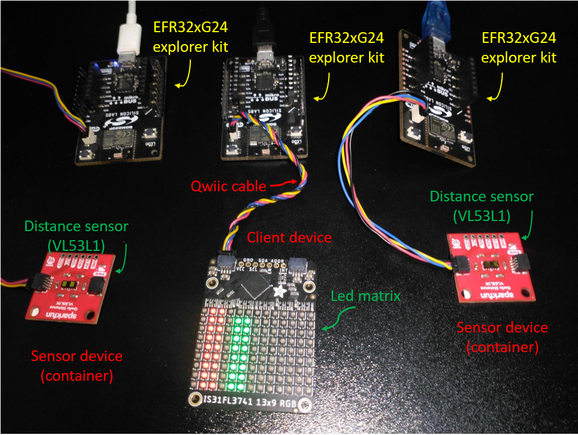

**Sensor:**

The Distance sparkfun sensor can be easily connected to the EFR32 xG24 Explorer Kit via Qwiic connection.
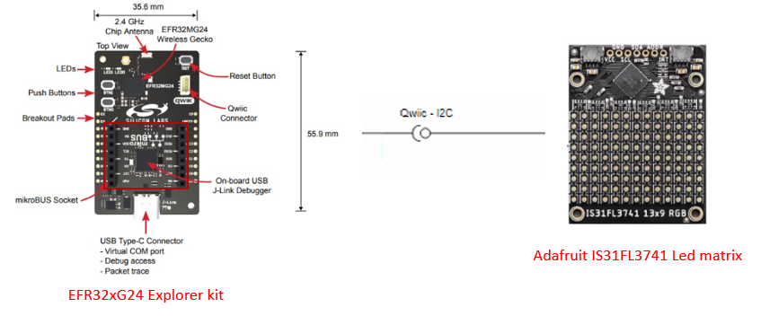

**Client:**

The Adafruit RGB LED Matrix board can be easily connected to the EFR32 xG24 Explorer Kit by using a Qwiic cable.
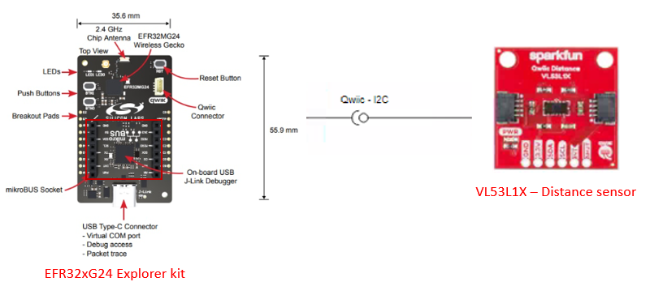

## Setup

To test this application, you can either create a project based on a example project or start with an "Bluetooth - SoC Empty" project based on your hardware.

### Create a project based on a example project

1. From the Launcher Home, add the your hardware to My Products, click on it, and click on the **EXAMPLE PROJECTS & DEMOS** tab. Find the example project with filter "container".

2. Click **Create** button on both **Bluetooth - Container Level Dectection Sensor** and **Bluetooth - Container Level Dectection Client** examples. Example project creation dialog pops up -> click Create and Finish and Project should be generated.

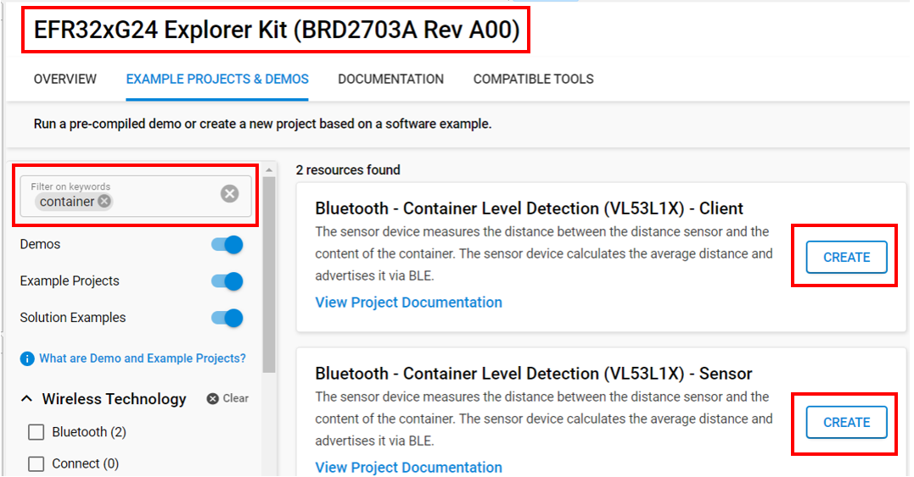

3. Build and flash these examples to the boards.

### Start with an "Bluetooth - SoC Empty" project

1. Create a **Bluetooth - SoC Empty** project for your hardware using Simplicity Studio 5.

2. copy all the .h and .c files to the following directory of the project root folder (overwriting existing file).

    - With **sensor** device: 
      - [Header files](inc/sensor/)
      - [Source files](src/sensor/)
    - With **client** device: 
      - [Header files](inc/client/)
      - [Source files](src/client/)

3. Install the software components:

    - Open the .slcp file in the project.

    - Select the SOFTWARE COMPONENTS tab.

    - Install the following components for **sensor** device:

        - [Services] →  [Sleep Timer]
        - [Bluetooth] → [NVM] → NVM Support
        - [Services] →  [NVM3] → NVM3 Core
        - [Services] →  [NVM3] → NVM3 Default Instance
        - [Services] →  [IO Stream] → [IO Stream: USART] → vcom
        - [Application] →  [Utility] → Log
        - [Platform] →  [Driver]→ [I2C] →  [I2CSPM] → qwiic
        - [Third Party Hardware Drivers] → [Sensors] → VL53L1X - Distance Sensor Breakout (Sparkfun)
        - [bluetooth] → [OTA] → [In-Place OTA DFU] → uninstall
        - [Platform] → [Bootloader Application Interface] → uninstall.

    - Install the following components for **client** device:

        - [Services] →  [Sleep Timer]
        - [Bluetooth] → [NVM] → NVM Support
        - [Services] →  [NVM3] → NVM3 Core
        - [Services] →  [NVM3] → NVM3 Default Instance
        - [Services] →  [IO Stream] → [IO Stream: USART] → vcom
        - [Application] →  [Utility] → Log
        - [Platform] → [Driver] → [Button] → [Simple Button] → btn0
        - [Platform] →  [Driver]→ [I2C] →  [I2CSPM] → qwiic
        - [Third Party Hardware Drivers] → [Display & LED] → IS31FL3741 - 13x9 PWM RGB LED Matrix (Adafruit) - I2C
        - [Third Party Hardware Drivers] → [Services] → GLIB - OLED Graphics Library
        - [bluetooth] → [OTA] → [In-Place OTA DFU] → uninstall
        - [Platform] → [Bootloader Application Interface] → uninstall.

4. Import the GATT configuration:

    - Open the .slcp file in the project again.
    - Select the CONFIGURATION TOOLS tab and open the "Bluetooth GATT Configurator".
    - Find the Import button and import the  gatt_configuration.btconf file.
        - Sensor: [gatt_configuration.btconf](config/btconf/sensor/gatt_configuration.btconf)
        - Client: [gatt_configuration.btconf](config/btconf/client/gatt_configuration.btconf)
    - Save the GATT configuration (ctrl-s).

5. Build and flash these projects to the boards.

**Note:**

- Make sure the [SDK extension](https://github.com/SiliconLabs/third_party_hw_drivers_extension/blob/master/README.md) already be installed and this repository is added to [Preferences > Simplicity Studio > External Repos](https://docs.silabs.com/simplicity-studio-5-users-guide/latest/ss-5-users-guide-about-the-launcher/welcome-and-device-tabs).

- SDK Extension must be enabled for the project to install some components for co monitor sensor and client projects.

- Do not forget to flash a bootloader to your board, see [Bootloader](https://github.com/SiliconLabs/bluetooth_applications/blob/master/README.md#bootloader) for more information.

## How it Works

This application have 2 roles: **Client** and **Sensor**.

Normally, Sensor devices send the advertisement packets frequently in the BLE network. Client device which read container's information from sensor devices, will show the level of containers in the led matrix. The client provide 2 operational mode:

- Config mode: When the BTN0 is pressed during the initialization sequence. the client boots into the configuration mode. The Client advertises itself to connect to another device such as a smartphone. In that, user can configure container's configuration like ID, highest, lowest level.

- Normal mode: When the BTN0 is released during the initialization phase, This device start scanning the advertisement packet of the sensor devices which have the name be started with 'CON_LEV_S_'. It analysis this packet and get containers's information. After that it will calculate to correspond value and update to the led matrix which show status of containers.

#### Sensor overview

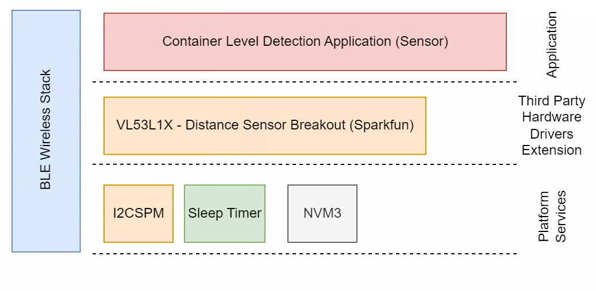

#### Sensor Implementation

**Application initialization:**

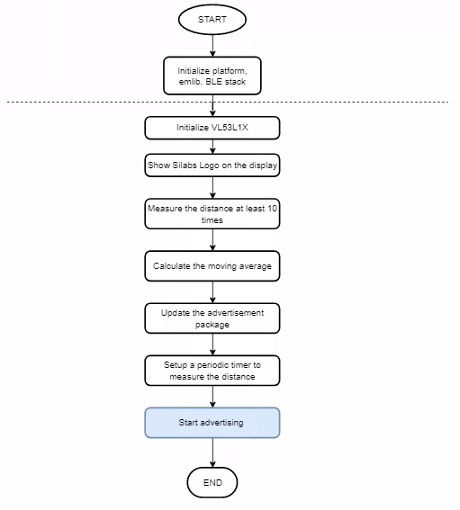

**On Timer callback:**

This handler called when the timer expires in every configured process period time.

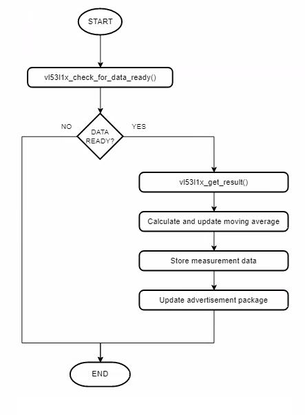

**Advertisement Packet:**

AdvData field in the advertisement packet is as table below:

| DeviceName | SampleCounter | Distance |
|-----|-----|-----|
| CON_LEV_S_< MAC unique 2 byte >| 4 byte | 4 byte |

- SampleCounter: Device increase the counter value for each new measurement
- Distance: Calculate level of container
- Device is not connectable. It sends [manufacturer specific advertisement](https://github.com/SiliconLabs/bluetooth_stack_features/tree/master/advertising/advertising_manufacturer_specific_data) packets.

### Client

#### Client overview

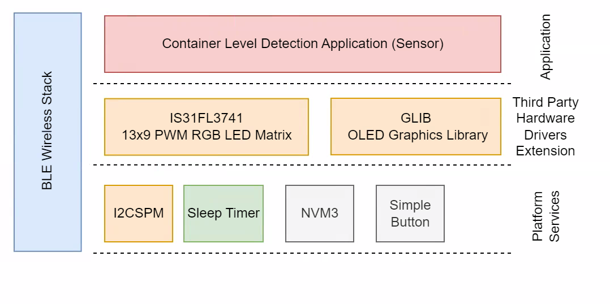

#### Client GATT Database

GATT Database

- [Service] Container Level Detection
    - [Char] Select Container to configure
        - [R] Get selected container slot
        - [W] Set selected container slot (0-3)
    - [Char] Container Slot Configuration
        - [R] Get the selected container slot configuration
        - [W] Set the selected container slot configuration (2 bytes - the MAC last 2 bytes e.g.: AABB)
    - [Char] Container Lowest Level
        - [R] Get the lowest level value for the selected container
        - [W] Set the lowest level value for the selected container (40-4000 is the valid range)
    - [Char] Container Highest Level
        - [R] Get the highest level value for the selected container
        - [W] Set the highest level value for the selected container (40-4000 is the valid range)

#### Client Implementation

**Application initialization:**

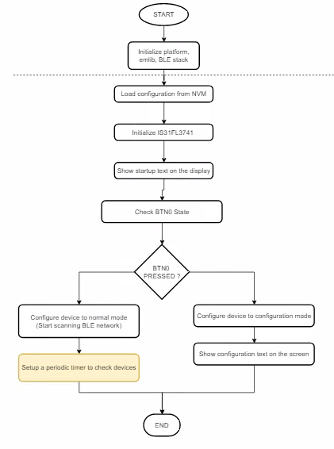

**Runtime - Configuration Mode:**

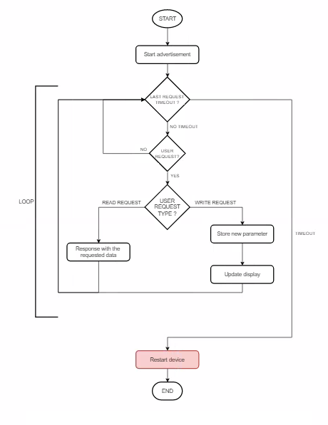

**Runtime - Normal Mode:**

*Client events:*

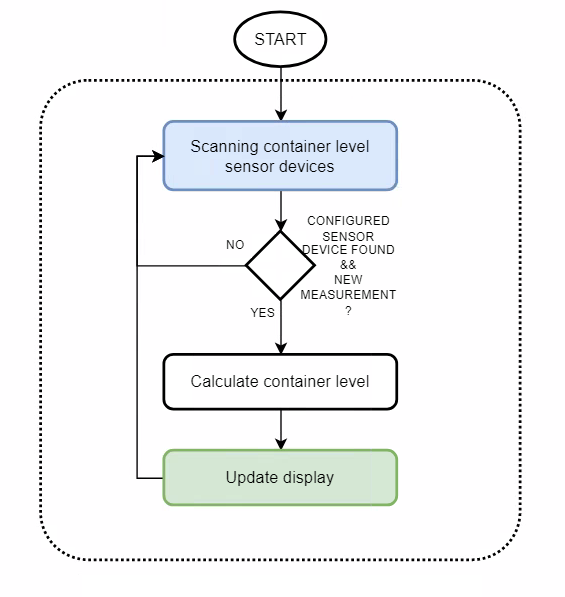
Sleep timer expries
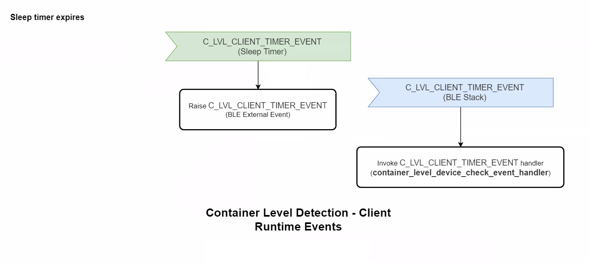

*BLE External Event Handler:*

Container level device check event handler check and update the new container level data.

app_sleep_timer_main_callback is a function invoked periodically by the sleep timer service with the configured time period.
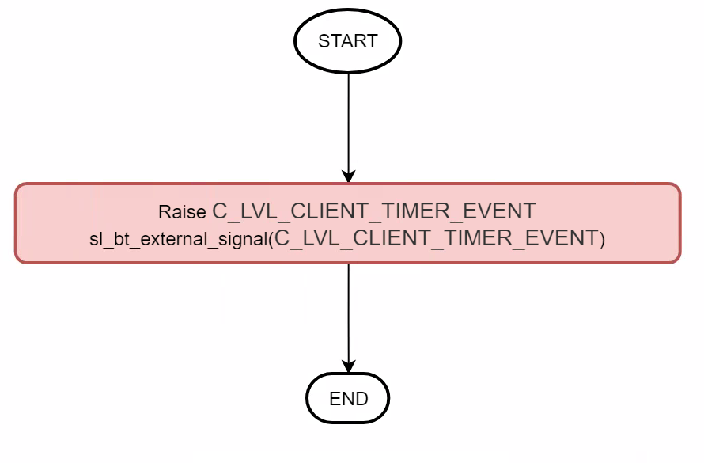

Container level detection event handler retrieve and process the measured distance data.
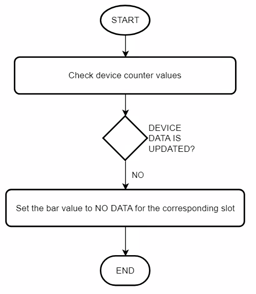

**Display:**

If the Client is in the normal mode, the LED matrix will show container's level to the corresponding slot which express the status of container.

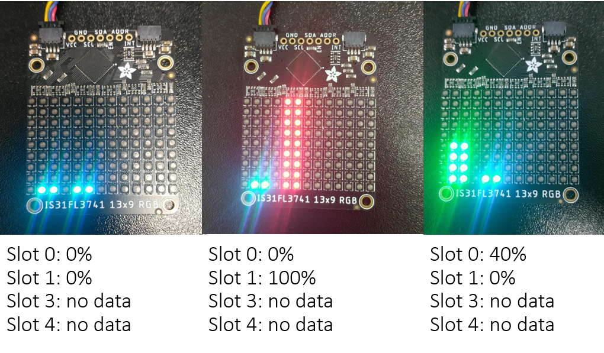

### Testing

**Sensor:**

You can use a smart phone app such as the EFR Connect app, to see the advertising packet from the Sender.

- Open the EFR Connect app.

- Open the Bluetooth Browser.

- Find the device advertising as CON_LEV_S_<>.

- Click on the instance of CON_LEV_S_<>. Now, you should see the counter and the container level value on the Manufacturer Specific Data row. Please have a look at the red highlighted area below in the result pictures.

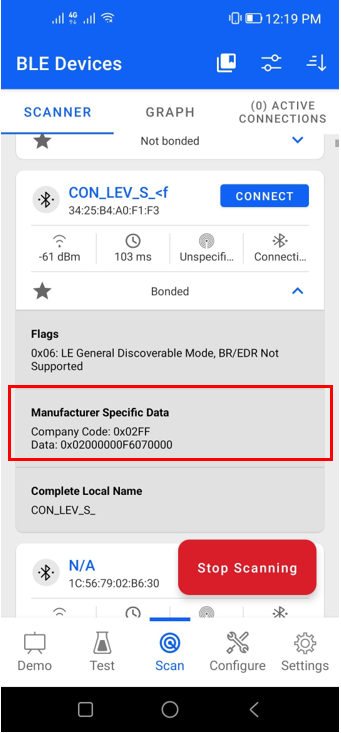

- After flasing code to the sensor board, a output from serial terminal as shown below

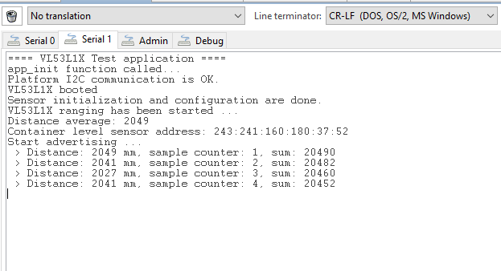

**Client:**

- Upon reset, the application will display the Silicon Labs logo on the LED matrix screen for a few seconds.

- After the firmware is configured, the device starts in normal mode. In this state, it starts scanning advertising devices.

- Open your terminal emulator and connect to your client device over its serial port. Set baud rate to 115200. In the console log, the information of sensor device will be shown.

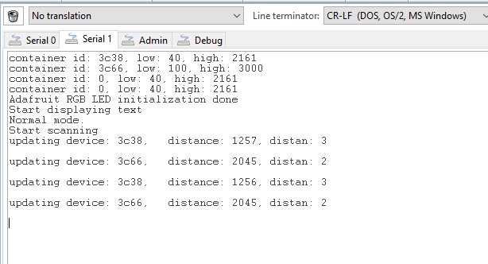

- **Note:** Button PB0 should be pressed during startup (power-on or reset) to run the client in Configuration Mode. The terminal will display information as below

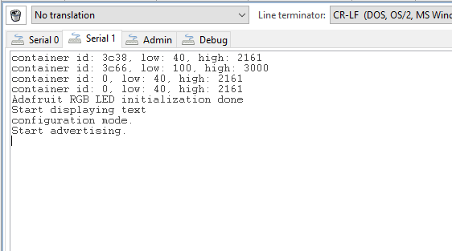
