# Bluetooth - Container Level Detection (VL53L1X)

## Overview

This project proposes the development of an application that uses the Silicon Labs development kits, Sparkfun Distance sensor breakout and Adafruit IS31FL3741 components to monitor the levels of two containers and display the information graphically. The application uses BLE for wireless communication between the devices.

The following picture shows the overview of the application:

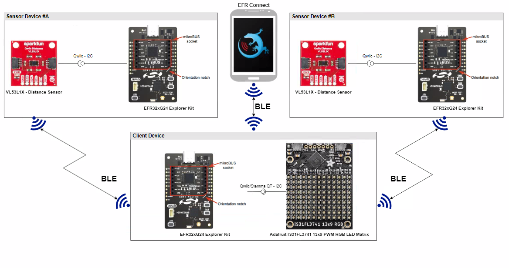

**Sensor:**

The sensor device measures the distance between the distance sensor and the content of the container. The sensor device calculates the average distance and advertises it via BLE

**Client:**

The client device scans the BLE devices and reads the measured distance values from the sensor device advertisement package. The client device displays the container level on the display using a vertical bar.

The client device can display levels of up to 4 container level sensors. The lowest and highest level values can be configured for each container slot.

Once measurement data is not updated for a slot within a period, the client device shows NO DATA on the display for that.

## SDK version

- [SiSDK v2024.12.0](https://github.com/SiliconLabs/simplicity_sdk)
- [Third Party Hardware Drivers v4.1.0](https://github.com/SiliconLabs/third_party_hw_drivers_extension)

## Software Required

- [Simplicity Studio v5 IDE](https://www.silabs.com/developers/simplicity-studio)
- [Simplicity Connect Mobile App](https://www.silabs.com/developer-tools/simplicity-connect-mobile-app)

## Hardware Required

**Sensor:**

- 1x [Bluetooth Low Energy Development Kit](https://www.silabs.com/development-tools/wireless/bluetooth). For example, [XG24-EK2703A](https://www.silabs.com/development-tools/wireless/efr32xg24-explorer-kit?tab=overview) EFR32xG24 Explorer Kit
- 1x [SparkFun Distance Sensor Breakout - VL53L1X](https://www.sparkfun.com/sparkfun-distance-sensor-breakout-4-meter-vl53l1x-qwiic.html)
- 1x smartphone running the 'Simplicity Connect' mobile app

**Client:**

- 1x [Bluetooth Low Energy Development Kit](https://www.silabs.com/development-tools/wireless/bluetooth). For example, [XG24-EK2703A](https://www.silabs.com/development-tools/wireless/efr32xg24-explorer-kit?tab=overview) EFR32xG24 Explorer Kit
- 1x [IS31FL3741 - 13x9 PWM RGB LED Matrix (Adafruit)](https://www.adafruit.com/product/5201)

## Connections Required

The hardware connection is shown in the images below:

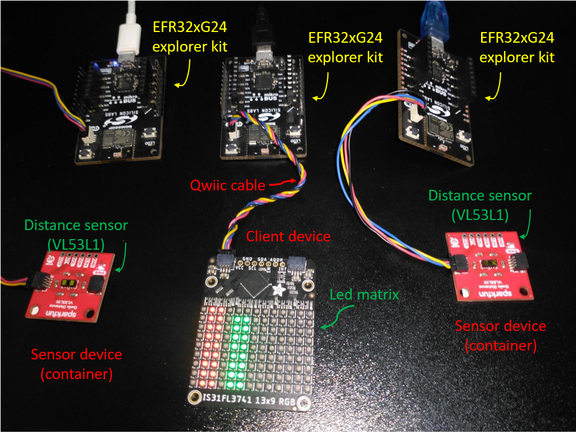

**Sensor:**

The Distance Sparkfun sensor can be easily connected to the EFR32 xG24 Explorer Kit via Qwiic connection.
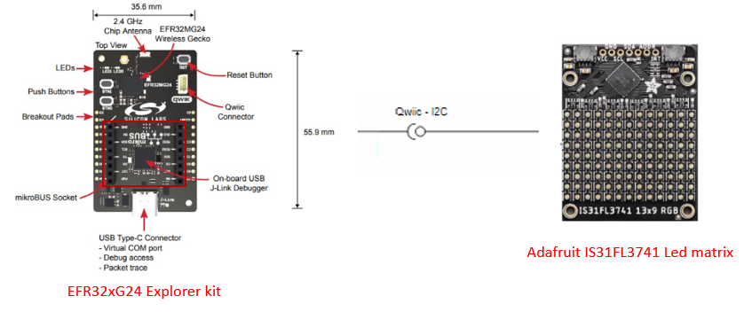

**Client:**

The Adafruit RGB LED Matrix board can be easily connected to the EFR32 xG24 Explorer Kit by using a Qwiic cable.
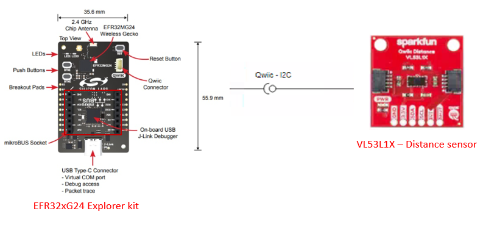

## Setup

To test this application, you can either create a project based on an example project or start with a "Bluetooth - SoC Empty" project based on your hardware.

**NOTE**:

- Make sure that the [Third Party Hardware Drivers extension](https://github.com/SiliconLabs/third_party_hw_drivers_extension) is installed as part of the SiSDK and the [bluetooth_applications](https://github.com/SiliconLabs/bluetooth_applications) repository is added to [Preferences > Simplicity Studio > External Repos](https://docs.silabs.com/simplicity-studio-5-users-guide/latest/ss-5-users-guide-about-the-launcher/welcome-and-device-tabs).

- SDK Extension must be enabled for the project to install the required components.

### Create a project based on an example project

1. From the Launcher Home, add your product name to My Products, click on it, and click on the **EXAMPLE PROJECTS & DEMOS** tab. Find the example project filtering by "container".

2. Click **Create** button on both **Bluetooth - Container Level Dectection Sensor** and **Bluetooth - Container Level Dectection Client** examples. Example project creation dialog pops up -> click Create and Finish and Project should be generated.

    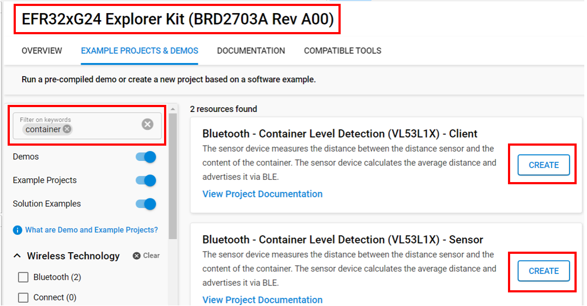

3. Build and flash these examples to the boards.

### Start with a "Bluetooth - SoC Empty" project

1. Create a **Bluetooth - SoC Empty** project for your hardware using Simplicity Studio 5.

2. copy all the .h and .c files to the following directory of the project root folder (overwriting the existing files).

    - With **sensor** device:
      - [Header files](inc/sensor/)
      - [Source files](src/sensor/)
    - With **client** device:
      - [Header files](inc/client/)
      - [Source files](src/client/)

3. Install the software components:

    - Open the .slcp file in the project.

    - Select the SOFTWARE COMPONENTS tab.

    - Install the following components for **sensor** device:

        - [Services] → [Timers] → [Sleep Timer]
        - [Services] → [IO Stream] → [IO Stream: USART] → default instance name: vcom
        - [Application] → [Utility] → [Log]
        - [Third Party Hardware Drivers] → [Sensors] → [VL53L1X - Distance Sensor Breakout (Sparkfun)]
        - [Bluetooth] → [OTA] → [In-Place OTA DFU] → uninstall
        - [Platform] → [Bootloader Application Interface] → uninstall.

    - Install the following components for **client** device:

        - [Services] → [Timers] → [Sleep Timer]
        - [Services] → [IO Stream] → [IO Stream: USART] → default instance name: vcom
        - [Application] → [Utility] → [Log]
        - [Platform] → [Driver] → [Button] → [Simple Button] → default instance name: btn0
        - [Platform] → [Driver]→ [I2C] → [I2CSPM] → default instance name: qwiic
        - [Third Party Hardware Drivers] → [Display & LED] → [IS31FL3741 - 13x9 PWM RGB LED Matrix (Adafruit) - I2C]
        - [Third Party Hardware Drivers] → [Services] → [GLIB - OLED Graphics Library]
        - [Bluetooth] → [OTA] → [In-Place OTA DFU] → uninstall
        - [Platform] → [Bootloader Application Interface] → uninstall.

4. Import the GATT configuration:

    - Open the .slcp file in the project again.
    - Select the CONFIGURATION TOOLS tab and open the "Bluetooth GATT Configurator".
    - Find the Import button and import the  gatt_configuration.btconf file.
        - Client: `config/btconf/client/gatt_configuration.btconf`
    - Save the GATT configuration (ctrl-s).

5. Build and flash these projects to the boards.

**Note:**

- A bootloader needs to be flashed to your board if the project starts from the "Bluetooth - SoC Empty" project, see [Bootloader](https://github.com/SiliconLabs/bluetooth_applications/blob/master/README.md#bootloader) for more information.

## How It Works

This application has 2 roles: **Client** and **Sensor**.

Normally, Sensor devices send the advertisement packets frequently in the BLE network. The client device which reads the information of the container from sensor devices, will show the level of containers in the led matrix. The client provides 2 operational modes:

- Config mode: When the BTN0 is pressed during the initialization sequence. the client boots into the configuration mode. The Client advertises itself to connect to another device such as a smartphone. In that, user can configure the configuration of the container like ID, highest and lowest level.

- Normal mode: When the BTN0 is released during the initialization phase, This device starts scanning the advertisement packet of the sensor devices which have the name started with 'CON_LEV_S_'. It analyzes this packet and gets the information of the container. After that, it will calculate to corresponding value and update the led matrix which shows the status of containers.

### Sensor Overview

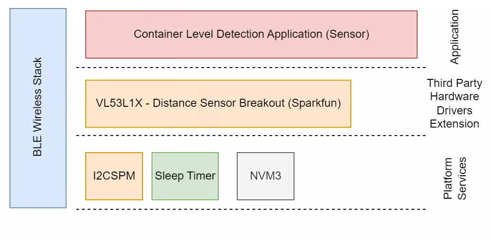

#### Sensor Implementation

**Application initialization:**

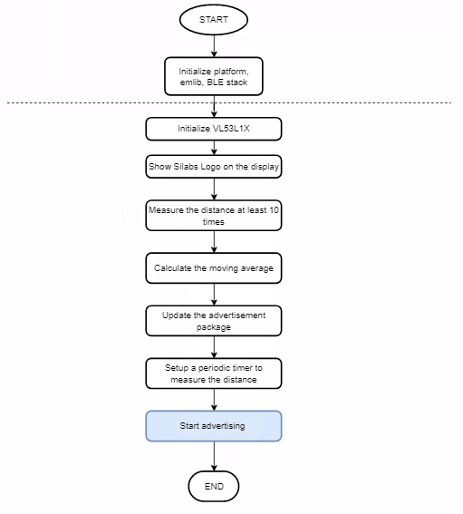

**On Timer callback:**

This handler is called when the timer expires in every configured process period time.

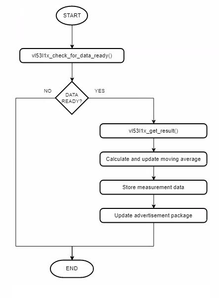

**Advertisement Packet:**

The AdvData field in the advertisement packet is as the table below:

| DeviceName | SampleCounter | Distance |
|-----|-----|-----|
| CON_LEV_S_< MAC unique 2 byte >| 4 byte | 4 byte |

- SampleCounter: the device increases the counter value for each new measurement
- Distance: Calculate the level of the container
- The device is not connectable. It sends [manufacturer-specific advertisement](https://github.com/SiliconLabs/bluetooth_stack_features/tree/master/advertising/advertising_manufacturer_specific_data) packets.

### Client

#### Client Overview

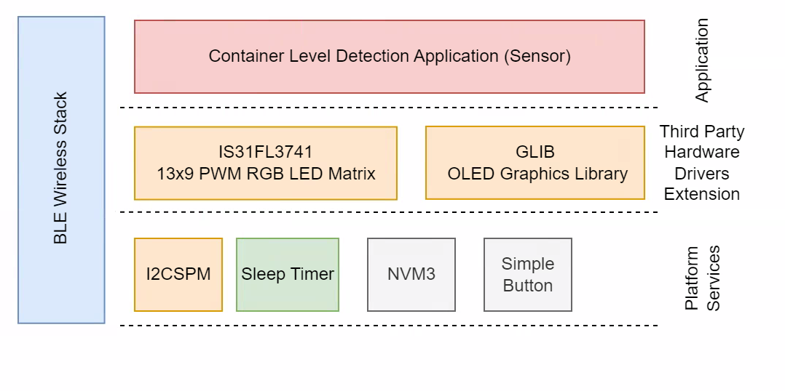

#### Client GATT Database

**GATT Database:**

- [Service] Container Level Detection
  - [Char] Select Container to configure
    - [R] Get selected container slot
    - [W] Set selected container slot (0-3)
  - [Char] Container Slot Configuration
    - [R] Get the selected container slot configuration
    - [W] Set the selected container slot configuration (2 bytes - the MAC last 2 bytes e.g.: AABB)
  - [Char] Container Lowest Level
    - [R] Get the lowest level value for the selected container
    - [W] Set the lowest level value for the selected container (40-4000 is the valid range)
  - [Char] Container Highest Level
    - [R] Get the highest level value for the selected container
    - [W] Set the highest level value for the selected container (40-4000 is the valid range)

#### Client Implementation

**Application initialization:**

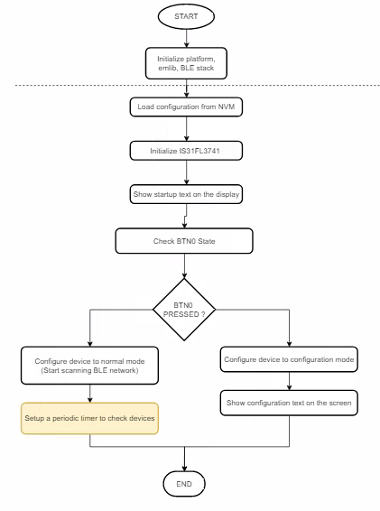

**Runtime - Configuration Mode:**

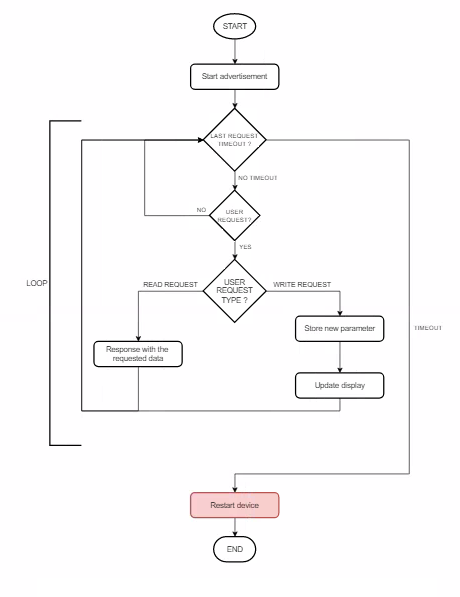

**Runtime - Normal Mode:**

*Client events:*

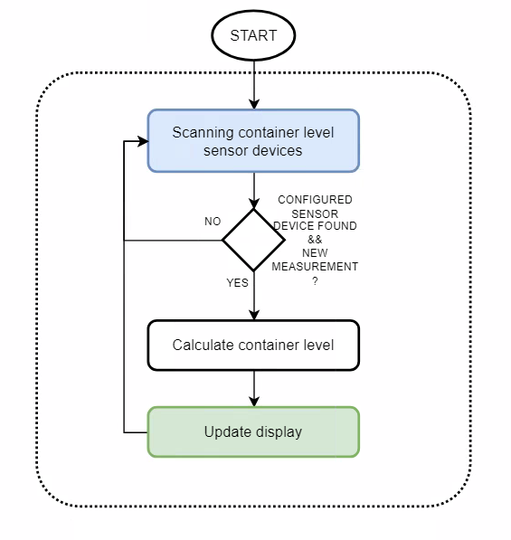

Sleep timer expires
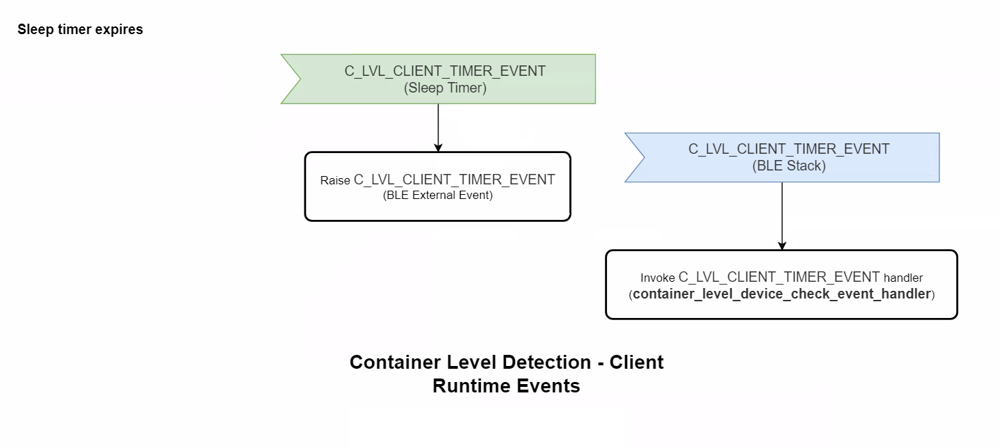

*BLE External Event Handler:*

Container level device check event handler check and update the new container level data.

app_sleep_timer_main_callback is a function invoked periodically by the sleep timer service with the configured period.
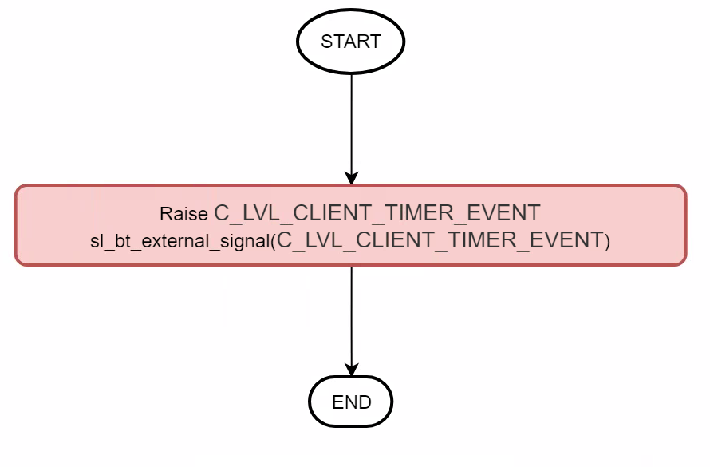

Container level detection event handler retrieves and processes the measured distance data.
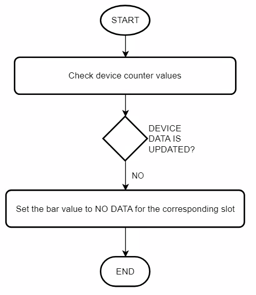

**Display:**

If the Client is in the normal mode, the LED matrix will show the level of the container to the corresponding slot which expresses the status of the container.

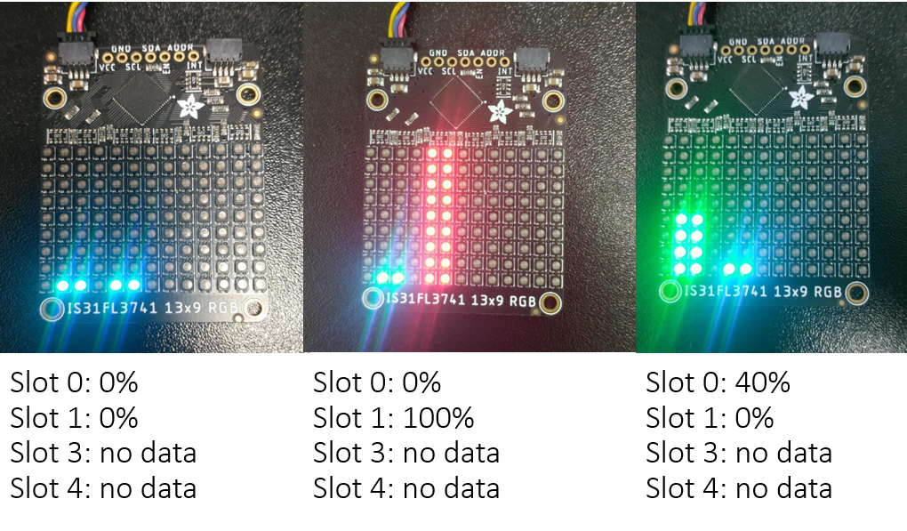

### Testing

**Sensor:**

Follow the below steps to test the Sensor with the Simplicity Connect application:

- Open the Simplicity Connect app on your smartphone and allow the permission requested the first time it is opened.

- Find your device in the Bluetooth Browser, advertising as *CON_LEV_S_<>*.

- Click on the instance of CON_LEV_S_<>. Now, you should see the counter and the container level value on the Manufacturer Specific Data row. Please have a look at the red highlighted area below in the result pictures.

    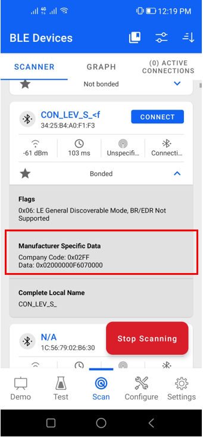

- After flashing code to the sensor board, an output from a serial terminal as shown below

    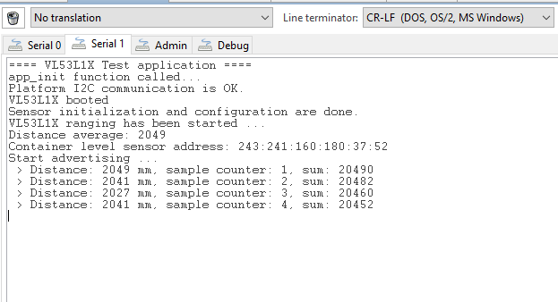

**Client:**

- Upon reset, the application will display the Silicon Labs logo on the LED matrix screen for a few seconds.

- After the firmware is configured, the device starts in normal mode. In this state, it starts scanning advertising devices.

- Open your terminal emulator and connect to your client device over its serial port. Set baudrate to 115200. In the console log, the information of the sensor device will be shown.

    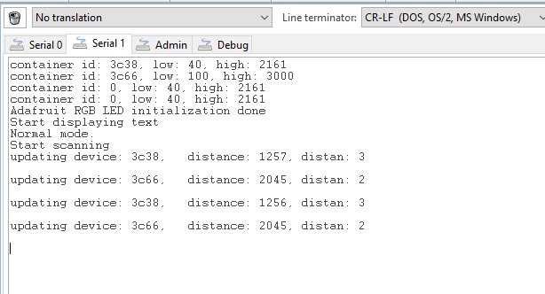

- **Note:** Button PB0 should be pressed during startup (power-on or reset) to run the client in Configuration Mode. The terminal will display the information like below

    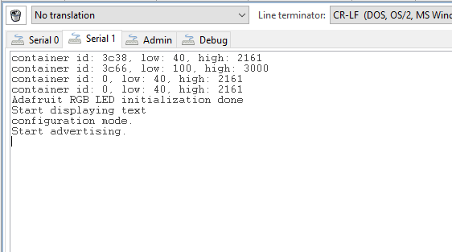
