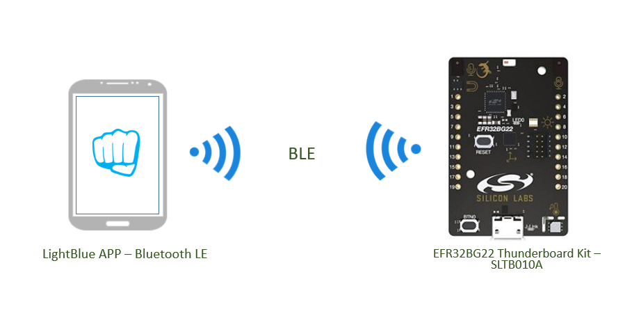
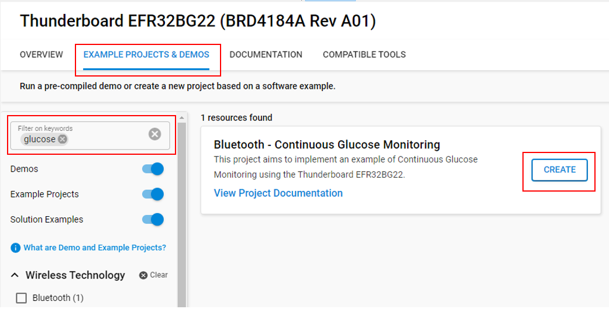
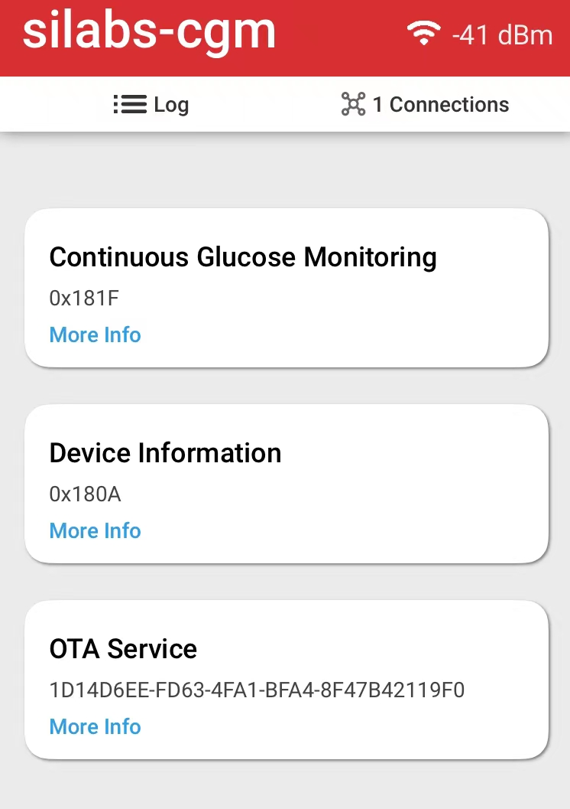
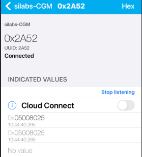
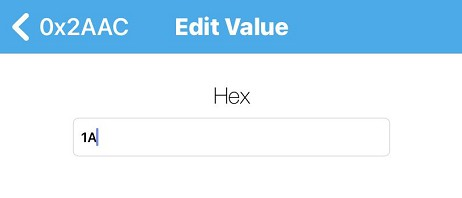
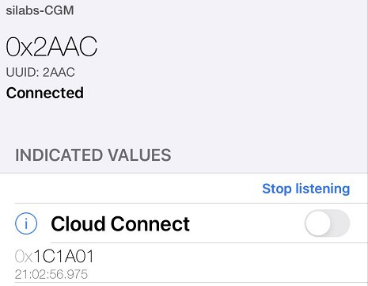
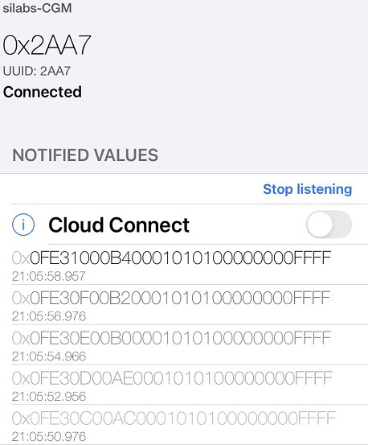

# Bluetooth - Continuous Glucose Monitoring #


## Overview ##

This application aims to implement an example of **Continuous Glucose Monitoring**  in The Bluetooth SIG CGM Profile using the Thunderboard EFR32BG22

The Bluetooth SIG CGM Profile is a Bluetooth Low Energy (BLE) profile that can help people with diabetes to more efficiently manage their blood sugar levels. By providing users with real-time glucose data, this profile helps them to detect low/high blood sugar levels earlier, which can prevent serious complications.

This project focuses on managing and interacting with the Continuous Glucose Monitoring service in Bluetooth part, not about the used biological sensors and analog front-end (AFE). Generally, there are no common biological sensors and AFE solutions for the BGM/CGM product in the market; manufacturers have their own proprietary solutions.

## Gecko SDK Version ##

- GSDK v4.3.1

## Hardware Required ##

[EFR32BG22 Thunderboard Kit - SLTB010A Board](https://www.silabs.com/development-tools/thunderboard/thunderboard-bg22-kit)

**NOTE:**
Tested boards for working with this example:

| Board ID | Description  |
| -------- | ------ |
| SLTB010A | [EFR32BG22 Thunderboard Kit – SLTB010A](https://www.silabs.com/development-tools/thunderboard/thunderboard-bg22-kit)   |
| BRD4166A | [Thunderboard Sense 2 - EFR32MG12 - EK4166A](https://www.silabs.com/documents/public/user-guides/ug309-sltb004a-user-guide.pdf)   |

## Connections Required ##

This application uses the LightBlue App to connect to the Thunderboard EFR32BG22 via Bluetooth for continuous glucose monitoring.



## Setup ##

To test this application, you can either create a project based on an example project or start with a "Bluetooth - SoC Empty" project based on your hardware.

### Create a project based on an example project ###

1. From the Launcher Home, add your product name to My Products, click on it, and click on the **EXAMPLE PROJECTS & DEMOS** tab. Find the example project with the filter "glucose".

2. Click **Create** button on **Bluetooth - Continuous Glucose Monitoring** example. Example project creation dialog pops up -> click Create and Finish and Project should be generated.

   

3. Build and flash this example to your board.

### Start with a "Bluetooth - SoC Empty" project ###

1. Create a **Bluetooth - SoC Empty** project for your hardware using Simplicity Studio 5.

2. Copy all the .h and .c files in [*inc*](inc/) and [*src*](src/) folders into the project root folder (overwriting all existing files).

3. Import the GATT configuration:

   - Open the .slcp file in the project.

   - Select the **CONFIGURATION TOOLS** tab and open the **Bluetooth GATT Configurator**.

   - Find the Import button and import the attached [gatt_configuration.btconf](config/btconf/gatt_configuration.btconf) file.

   - Save the GATT configuration (ctrl-s).

4. Install the software components:

    - Open the .slcp file in the project.

    - Select the SOFTWARE COMPONENTS tab.

    - Install the following components:
        - [Application] → [Timers] → [Sleep timer]
        - [Services] → [IO Stream] → [IO Stream: USART] → default instance name: vcom
        - [Application] → [Utility] → [Log]
        - [Platform] → [Board] → [Board Control]: Enable Virtual COM UART.

5. Build and flash this project to your board.

**Note:** Do not forget to flash a bootloader to your board, see [Bootloader](https://github.com/SiliconLabs/bluetooth_applications/blob/master/README.md#bootloader) for more information.

## How It Works ##

The application is based on the Bluetooth - SoC Empty example. Since the example already has the Bluetooth GATT server, advertising, and connection mechanisms, only minor changes are required.

There are two major services: Continuous Glucose Monitoring service and OTA service.

### Continuous Glucose Monitoring (CGM) Service ###

The Continuous Glucose Monitoring (CGM) Service exposes glucose measurement and other data related to a personal CGM sensor for healthcare applications. This service has UUID ```0x181F``` and contains 7 characteristics.

- [Service] **Continuous Glucose Monitoring** - `0x181F`
  - [Char] **CGM Measurement** - `2AA7`
    - [N] Notify the Continuous Glucose Monitoring reports
  - [Char] **CGM Feature** - `2AA8`
    - [R] Get the CGM service feature
  - [Char] **CGM Status** - `2AA9`
    - [R] Get the current status from the CGM Sensor
  - [Char] **CGM Session Start Time** - `2AAA`
    - [R] Get Measurement Session Start Time
    - [W] Set Measurement Session Start Time
  - [Char] **CGM Session Run Time** - `2AAB`
    - [R] Get Measurement Session Run Time
  - [Char] **Record Access Control Point** - `2A52`
    - [W] Enables functions including counting records, transmitting records and clearing records based on filter criterion
    - [I] Get status from the function requests
  - [Char] **CGM Specific Ops Control Point** - `2AAC`
    - [W] Set CGM-specific settings of the device
    - [I] Get status from the CGM settings

Where R = Readable, W = Writeable, N = Notify and I = Indicate.

### OTA service ###

Used for OTA upgrade, please refer to [AN1086: Using the Gecko Bootloader with the Silicon Labs Bluetooth® Applications](https://www.silabs.com/documents/public/application-notes/an1086-gecko-bootloader-bluetooth.pdf) for more information.

### Application Operation ###

This application has two roles:

1. A CGM sensor
2. A collector, which is typically a smartphone or tablet.

After the application is initialized, the collector scans for the CGM sensor device with the advertising name: "silabs-cgm" and connects to it. Once the connection is established, the collector configures the CGM Specific Ops Control Point characteristic to set CGM-specific functionality and settings on the sensor device, such as the CGM Communication Interval or sending a calibration value to the device.

After configuration, the collector uses the Record Access Control Point characteristic to enable functions such as counting records, transmitting records, and clearing records based on filter criteria. The filter criteria in the Operand field are defined by the service that references this characteristic, and they specify the format of a record (which may be comprised of one or more characteristics) and the sequence of transferred records.

When the measurement session ends, the measurement reports can be displayed in the CGM Measurement characteristic.

Please refer to [Bluetooth SIG CGM introduction.md](doc/Bluetooth_SIG_CGM_Introduction.md) in the doc folder for more information.

## Test ##

Open the LightBlue app, filter silabs-CGM and connect it.



*Please refer to CGM specifications in the [doc](doc/) folder for below process*

### Report Number of Stored Records – ‘All records’ ###

1. Open the LightBlue app, connect silabs-CGM.

2. Find the Continuous Glucose Monitoring service.

3. Set indicate of 0x2AA7 characteristic (**CGM Measurement**) and 0x2A52 characteristic (**Record Access Control Point**).

4. Write HEX 0401 to 0x2A52.

5. There will be 1 indication (0x05008025) in 0x2A52, which means that there are 9600 (0x2580) records by default.

   

There are two ways that a client can receive the CGM Measurement Characteristic values:

1. Periodic
2. Requested

### Get Glucose data periodically ###

1. Set Notify of 0x2AA7 characteristic (CGM Measurement)
2. Set indicate of 0x2AAC characteristic (CGM Specific Ops Control Point).
3. Write HEX 1A to 0x2AAC, which means start session - you can find this test case in CGMS.TS.p6: CGMS/SEN/CGMCP/BV-22-C [CGM Specific Ops – ‘Start Session'].

   

4. There will be 1 indication in 0x2AAC to show start session success.

   


5. The sensor (Thunderboard) will continuously send the notifications to 0x2AA7 characteristic until writing 0x1B to 0x2AAC (stop session).

   

6. Write "1B" to 0x2AAC to stop the session.

### Get requested Glucose data records ###

1. Set Notify of 0x2AA7 characteristic (CGM Measurement)
2. Set indicate of 0x2A52 characteristic (Record Access Control Point),
3. Write HEX 0105 to 0x2A52, which means the reporting of the first record.
4. There will be 1 notification in 0x2AA7, which is the first record.

## PTS test ##

You can download the CGM specification from https://www.bluetooth.com/specifications/specs/, which is already in the doc folder of this repository.

Here you can watch a tutorial video about the Bluetooth PTS Test in Chinese: https://www.bilibili.com/video/BV1w44y1a7Hj?spm_id_from=333.999.0.0