# Controlling LEDs from a Smartphone


## Description

An effective way to become familiar with the Silicon Labs Bluetooth stack and a Wireless Starter Kit (WSTK) is to create a simple software example to control the WSTK's LEDs with a mobile phone app, as shown in this code example.

There are 3 main tasks, as follows:

* [Editing the GATT Database](#Editing-the-GATT-Database).
* [Controlling the LEDs](#Controlling-the-LEDs) on the board using **Simple LED** driver.
* [Reacting on Bluetooth events](#Reacting-to-Bluetooth-Events), when a remote device reads/writes the GATT database.

### Editing the GATT Database

Editing the GATT database of the Bluetooth device is made easy with **Silicon Labs Bluetooth SDK** using the GATT Configurator as an easy-to-use graphical tool. This example shows how to add a standard characteristic, adopted by the Bluetooth SIG, to the database, the so-called **Digital characteristic**.

> To see the format and requirements of adopted characteristics, see the list [here](https://www.bluetooth.com/specifications/gatt/characteristics/).

The **Digital characteristic** is designed to control and poll the state of digital I/Os. See the [Setup](#setup) section to learn how to add this characteristic to your database.

### Controlling the LEDs

This application using the **Simple LED driver**, which is integrated in **Silicon Labs Bluetooth SDK**. It provides very simple API functions to initialize, control on/off, and read the state of the LEDs:

```C
// initialize simple LED
sl_led_init(&simple_led_inst0);
 
// turn on LED, turn off LED, and toggle
sl_led_turn_on(&simple_led_inst0);
sl_led_turn_off(&simple_led_inst0);
sl_led_toggle(&simple_led_inst0);
 
// get the state of the led
sl_led_state_t state = sl_led_get_state(&simple_led_instance0);
```

The [Setup](#setup) section will show how to add the driver to the project by installing in the **Software Components**.

Note that when the **Simple LED** driver is installed, the function `sl_led_init` is automatically added in `sl_sysem_init` function.

### Reacting to Bluetooth Events

When the mobile app performs a read or write on the Digital characteristic, it triggers **sl_bt_evt_gatt_server_user_write_request** or  **sl_bt_evt_gatt_server_user_read_request** events and we can handle them in our application.

The code below processes the event **sl_bt_evt_gatt_server_user_write_request**: receive the state, control the LED then send the response to the client.

```C
case sl_bt_evt_gatt_server_user_write_request_id:
      // Automation IO digital control
      if (evt->data.evt_gatt_server_user_write_request.characteristic == gattdb_led0) {
          // Write user supplied value to LEDs.
          if(evt->data.evt_gatt_server_attribute_value.value.data[0] != 0){
              sl_app_log("turn on led 0 \n");
              sl_led_turn_on(&sl_led_led0);
          }
          else{
              sl_app_log("turn off led 0 \n");
              sl_led_turn_off(&sl_led_led0);
          }
          sc = sl_bt_gatt_server_send_user_write_response(evt->data.evt_gatt_server_user_write_request.connection,
                                                          gattdb_led0,
                                                          SL_STATUS_OK);
          sl_app_assert(sc == SL_STATUS_OK,
                        "[E: 0x%04x] Failed to send response \n",
                        (int)sc);
      }

      if (evt->data.evt_gatt_server_user_write_request.characteristic == gattdb_led1) {
          // Write user supplied value to LEDs.
          if(evt->data.evt_gatt_server_attribute_value.value.data[0] != 0){
              sl_app_log("turn on led 1 \n");
              sl_led_turn_on(&sl_led_led1);
          }
          else{
              sl_app_log("turn off led 1 \n");
              sl_led_turn_off(&sl_led_led1);
          }
          sc = sl_bt_gatt_server_send_user_write_response(evt->data.evt_gatt_server_user_write_request.connection,
                                                          gattdb_led1,
                                                          SL_STATUS_OK);
          sl_app_assert(sc == SL_STATUS_OK,
                        "[E: 0x%04x] Failed to send response \n",
                        (int)sc);
      }
      break;
```

The code below processes the event **sl_bt_evt_gatt_server_user_read_request**: read the LEDs statuses and send the status byte to the client in response.

```C
case sl_bt_evt_gatt_server_user_read_request_id:
      // Automation IO digital control
      if (evt->data.evt_gatt_server_user_read_request.characteristic == gattdb_led0) {
          sl_app_log("read led 0 \n");
          led_status = sl_led_get_state(&sl_led_led0);
          sc = sl_bt_gatt_server_send_user_read_response(evt->data.evt_gatt_server_user_read_request.connection,
                                                         gattdb_led0,
                                                         SL_STATUS_OK,
                                                         1,
                                                         &led_status,
                                                         &sent_len);
          sl_app_assert(sc == SL_STATUS_OK,
                        "[E: 0x%04x] Failed to send response \n",
                        (int)sc);
      }

      if (evt->data.evt_gatt_server_user_read_request.characteristic == gattdb_led1) {
          sl_app_log("read led 1 \n");
          led_status = sl_led_get_state(&sl_led_led1);
          sc = sl_bt_gatt_server_send_user_read_response(evt->data.evt_gatt_server_user_read_request.connection,
                                                         gattdb_led1,
                                                         SL_STATUS_OK,
                                                         1,
                                                         &led_status,
                                                         &sent_len);
          sl_app_assert(sc == SL_STATUS_OK,
                        "[E: 0x%04x] Failed to send response \n",
                        (int)sc);
      }
      break;
```

All of the above is implemented in the attached app.c file. After setting up the GATT database as described in the previous section, replace the default app.c with the attached one for a quicker example setup.

## Gecko SDK version ##

- GSDK v3.1.1

## Hardware Required ##

- One WSTK board: BR4001A
- One Bluetooth radio board, e.g: BRD4162A

## Setup

1. Create a new **SoC-Empty** project.

2. Copy the attached **app.c** file into the project folder (replacing the existing one).

3. Config **Software components**, add **Simple LED** driver, and **Print log** driver.

    - Install **Simple LED** driver with two default instances `led0` and `led1`.  
    Install **Simple LED** driver with first instance name `led0`.  
    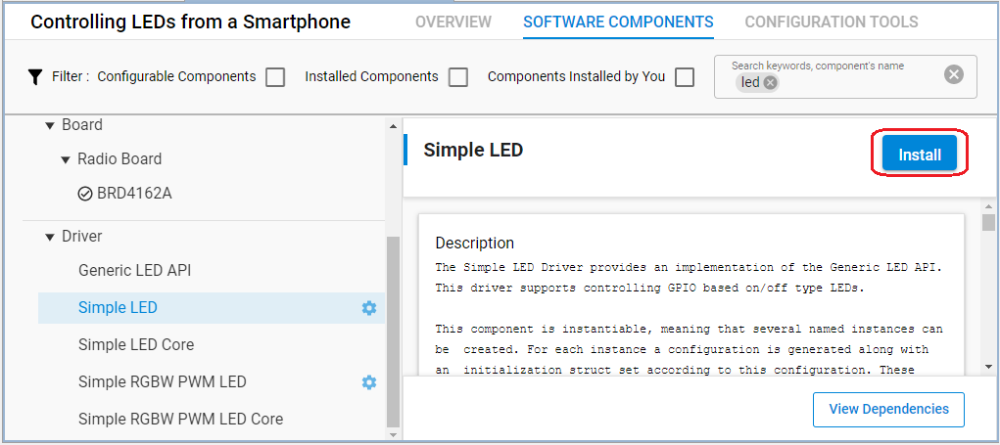  
    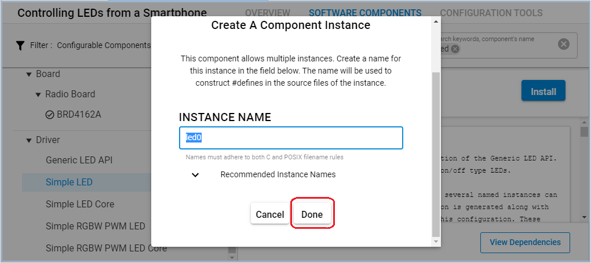  
    Add the second instance name `led1`:  
    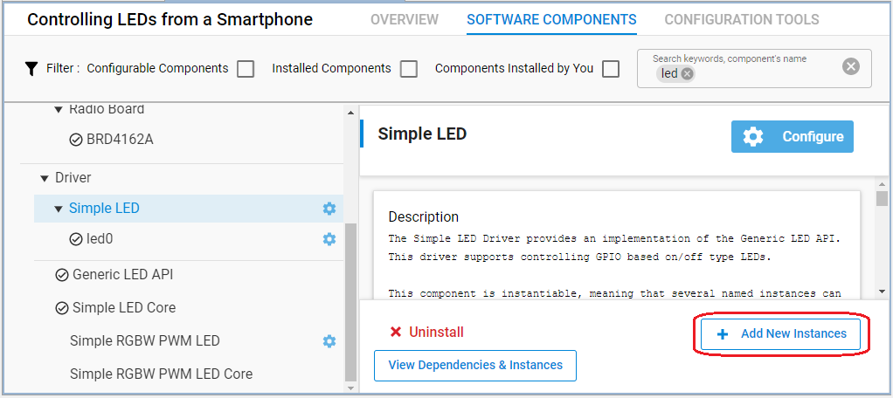  
      

    - Install **IO Stream: USART** component with the default instance name: **vcom**  
    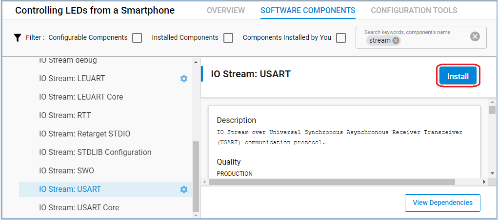
    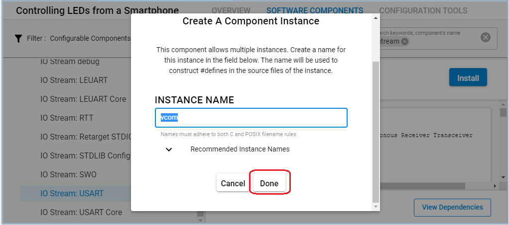

    - Enable *Virtual COM UART* the **Board Control** component  
    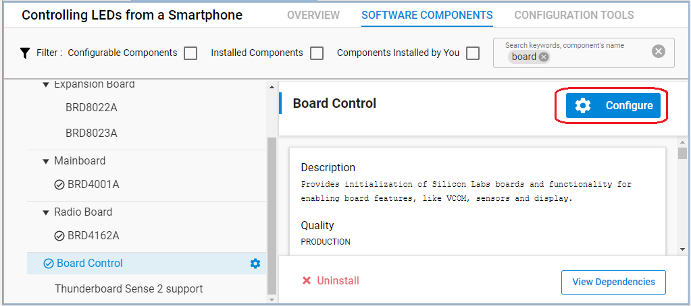  
    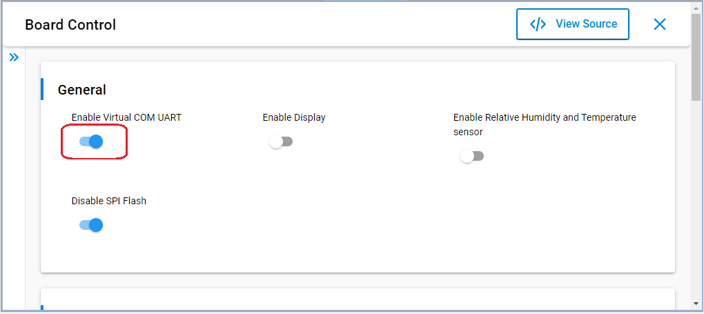  

    - Install the **Log** component (found under Bluetooth > Utility group)
    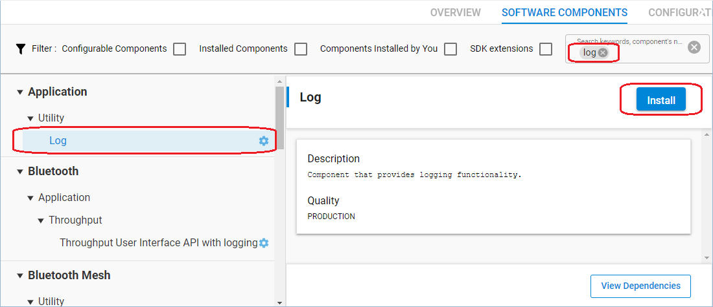  

4. Config **GATT** using **Bluetooth GATT Configurator** tool.

    - Open **Bluetooth GATT Configurator** tool.  
    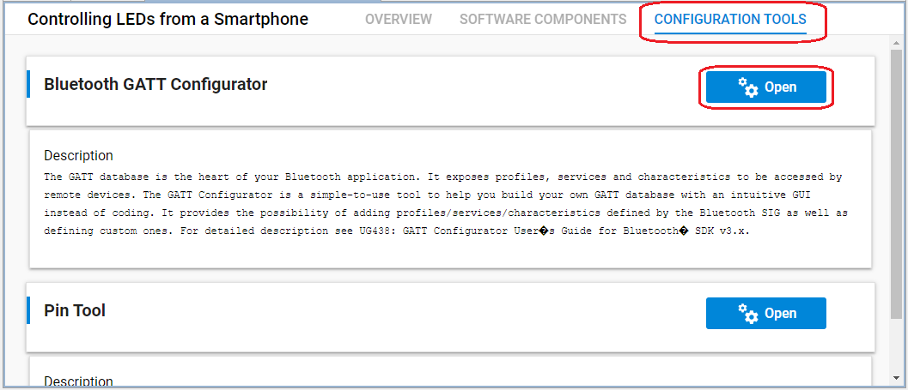

    - Add **Automation IO** service.  
    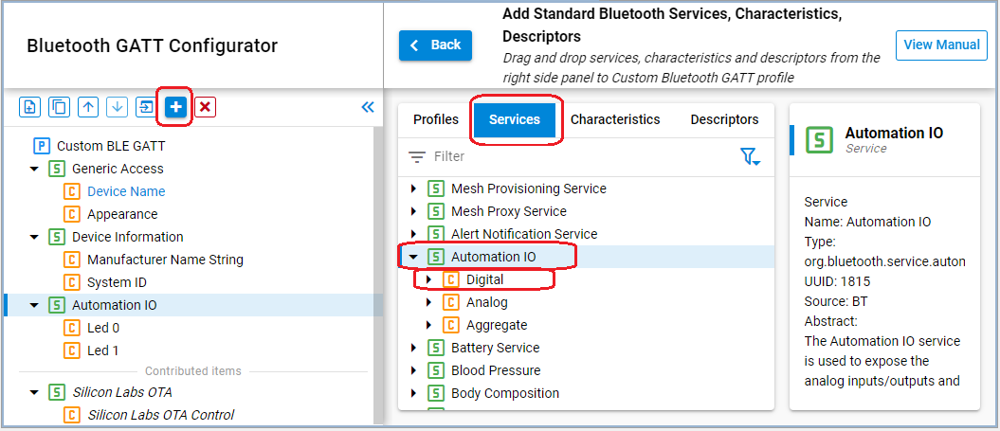  
    Keep the **Digital Characteristic** and remove Analog and Aggregate.

    - Setting the **Digital Characteristic**:  
    Change the name from **Default name** to **LED 0**.  
    Change the ID from **Default ID** to `led0` (this step is important because this ID will be used in the code).
    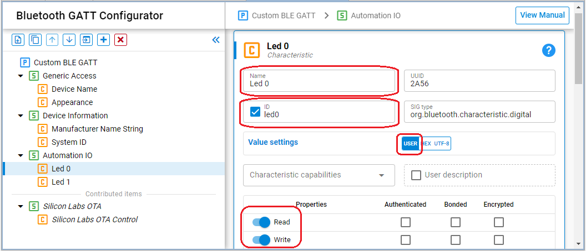  
    Turn on **Read** and **Write** properties (this step is important too).

4. **Save and close** then the tool will auto-generate to code.

5. Build and flash the project to your devices.

## Usage

1. Start `EFR Connect` application on your smartphone

    Note that both Bluetooth and Location are required to use this App.

2. Select `Bluetooth Browser`.

3. Find the device called "LEDs Control" and press `Connect` button to connect.

4. In the Automation IO service, there are two Digital characteristics.  
    The first Digital characteristic is used for the LED 0, the second is used for LEd 1.

5. Press the `Write` button of the first characteristic then change the state to Active or Inactive. You should see LED 0 turning on or off.  
Do the same thing to control LED 1.

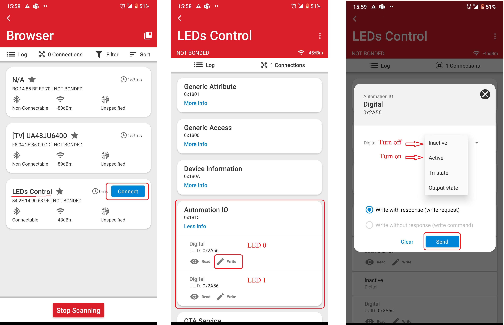

## Source

- [app.c](src/app.c)
- [gatt_configuration.btconf](config/gatt_configuration.btconf)