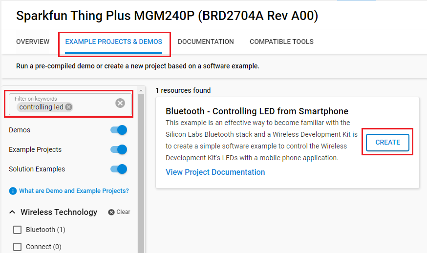
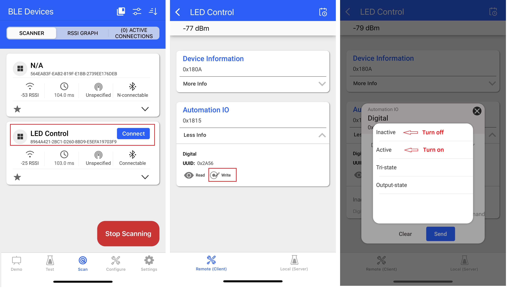

# Bluetooth - Controlling LED from Smartphone #


## Description ##

This example is an effective way to become familiar with the Silicon Labs Bluetooth stack and a Wireless Development Kit. The example shows how to develop a simple software to control the Wireless Development Kit's LEDs with a mobile phone application.

There are 3 main tasks, as follows:

- [Editing the GATT Database](#editing-the-gatt-database).
- [Controlling the LED](#controlling-the-led) on the board using **Simple LED** driver.
- [Reacting on Bluetooth events](#reacting-to-bluetooth-events), when a remote device reads/writes the GATT database.

### Editing the GATT Database ###

Editing the GATT database of the Bluetooth device is made easy with **Silicon Labs Bluetooth SDK** using the GATT Configurator as an easy-to-use graphical tool. This example shows how to add a standard characteristic, adopted by the Bluetooth SIG, to the database, the so-called **Digital characteristic**.

  To see the format and requirements of adopted characteristics, see the list [here](https://www.bluetooth.com/specifications/gatt/characteristics/).

The **Digital characteristic** is designed to control and poll the state of digital I/Os. See the [Setup](#setup) section to learn how to add this characteristic to your database.

### Controlling the LED ###

This application uses the **Simple LED driver**, which is integrated into **Silicon Labs Bluetooth SDK**. It provides very simple API functions to initialize, control on/off, and read the state of the LEDs:

```C
// initialize simple LED
sl_led_init(&sl_led_led0);
 
// turn on LED, turn off LED, and toggle
sl_led_turn_on(&sl_led_led0);
sl_led_turn_off(&sl_led_led0);
sl_led_toggle(&sl_led_led0);
 
// get the state of the led
sl_led_state_t state = sl_led_get_state(&sl_led_led0);
```

The [Setup](#setup) section will show how to add the driver to the project by installing in the **Software Components**.

Note that when the **Simple LED** driver is installed, the function `sl_led_init` is automatically added in `sl_system_init` function.

### Reacting to Bluetooth Events ###

When the mobile app performs a read or write on the Digital characteristic, it triggers **sl_bt_evt_gatt_server_user_write_request** or  **sl_bt_evt_gatt_server_user_read_request** events and we can handle them in our application.

The code below processes the event **sl_bt_evt_gatt_server_user_write_request**: receive the state, control the LED then send the response to the client.

```C
case sl_bt_evt_gatt_server_user_write_request_id:
  // Automation IO digital control
  if (evt->data.evt_gatt_server_user_write_request.characteristic
      == gattdb_led_control) {
    // Write user supplied value to LEDs.
    // Both HEX and ASCII formats are supported to control the LED.
    if ((evt->data.evt_gatt_server_attribute_value.value.data[0] == 1)
        || (evt->data.evt_gatt_server_attribute_value.value.data[0] == 0x31)) {
      app_log("Turn on led\n");
      sl_led_turn_on(&sl_led_led0);
    } else if ((evt->data.evt_gatt_server_attribute_value.value.data[0] == 0)
        || (evt->data.evt_gatt_server_attribute_value.value.data[0] == 0x30)){
      app_log("Turn off led\n");
      sl_led_turn_off(&sl_led_led0);
    } else {
      app_log("Invalid attribute value\n");
    }
    sc = sl_bt_gatt_server_send_user_write_response(
      evt->data.evt_gatt_server_user_write_request.connection,
      gattdb_led_control,
      SL_STATUS_OK);
    app_assert_status(sc);
  }
  break;
```

The code below processes the event **sl_bt_evt_gatt_server_user_read_request**: read the LEDs statuses and sends the status byte to the client in response.

```C
case sl_bt_evt_gatt_server_user_read_request_id:
  // Automation IO digital control
  if (evt->data.evt_gatt_server_user_read_request.characteristic
      == gattdb_led0) {
    app_log("read led 0 \n");
    led_status = sl_led_get_state(&sl_led_led0);
    sc = sl_bt_gatt_server_send_user_read_response(
      evt->data.evt_gatt_server_user_read_request.connection,
      gattdb_led0,
      SL_STATUS_OK,
      1,
      &led_status,
      &sent_len);
    app_assert_status(sc);
  }
  break;
```

All of the above is implemented in the attached app.c file. After setting up the GATT database as described in the previous section, replace the default app.c with the attached one for a quicker example setup.

## SDK version ##

- [SiSDK v2024.12.0](https://github.com/SiliconLabs/simplicity_sdk)

## Software Required ##

- [Simplicity Studio v5 IDE](https://www.silabs.com/developers/simplicity-studio)
- [Simplicity Connect Mobile App](https://www.silabs.com/developer-tools/simplicity-connect-mobile-app)

## Hardware Required ##

- 1x [Bluetooth Low Energy Development Kit](https://www.silabs.com/development-tools/wireless/bluetooth). For simplicity, Silicon Labs recommends the [BGM220-EK4314A](https://www.silabs.com/development-tools/wireless/bluetooth/bgm220-explorer-kit)
- 1x smartphone running the 'Simplicity Connect' mobile app

## Connections Required ##

- Connect the Bluetooth Development Kits to the PC through a compatible-cable. For example, a micro USB cable for the BGM220 Bluetooth Module Explorer Kit.

## Setup ##

To test this application, you can either create a project based on an example project or start with a "Bluetooth - SoC Empty" project based on your hardware.

**NOTE**:

- Make sure that the [bluetooth_applications](https://github.com/SiliconLabs/bluetooth_applications) repository is added to [Preferences > Simplicity Studio > External Repos](https://docs.silabs.com/simplicity-studio-5-users-guide/latest/ss-5-users-guide-about-the-launcher/welcome-and-device-tabs).

### Create a project based on an example project ###

1. From the Launcher Home, add your hardware to My Products, click on it, and click on the **EXAMPLE PROJECTS & DEMOS** tab. Find the example project filtering by "controlling led".

2. Click **Create** button on the **Bluetooth - Controlling LED from Smartphone** example. Example project creation dialog pops up -> click Create and Finish and Project should be generated.


3. Build and flash this example to the board.

### Start with a "Bluetooth - SoC Empty" project ###

1. Create a new **Bluetooth - SoC Empty** project.

2. Copy all attached files in *inc* and *src* folders into the project root folder (overwriting existing).

3. Import the GATT configuration:

   - Open the .slcp file in the project.

   - Select the **CONFIGURATION TOOLS** tab and open the **Bluetooth GATT Configurator**.

   - Find the Import button and import the attached config/btconf/gatt_configuration.btconf file.

   - Save the GATT configuration (ctrl-s).

4. Open the .slcp file. Select the SOFTWARE COMPONENTS tab and install the software components:

   - [Services] → [IO Stream] → [IO Stream: EUSART] → default instance name: vcom
   - [Platform] → [Board] → [Board Control] → enable *Virtual COM UART*
   - [Application] → [Utility] → [Log]
   - [Platform] → [Driver] → [LED] → [Simple LED] → default instance name: led0

5. Build and flash the project to your device.

**Note:**

- A bootloader needs to be flashed to your board if the project starts from the "Bluetooth - SoC Empty" project, see [Bootloader](https://github.com/SiliconLabs/bluetooth_applications/blob/master/README.md#bootloader) for more information.

## How It Works ##

Follow the below steps to test the example with the Simplicity Connect application:

1. Open the Simplicity Connect app on your smartphone and allow the permission requested the first time it is opened.

2. Find your device in the Bluetooth Browser, advertising as *LED Control*, and tap Connect.

3. In the Automation IO service, find the Digital characteristic.  

4. Press the `Write` button of the characteristic then change the state to Active or Inactive. You should see the LED turning on or off.  

