# Bluetooth - Data Logger SD Card

[%20board-green)](https://www.sparkfun.com/products/14532)

## Overview

This project aims to implement a data logger application using Silicon Laboratories development kits integrated with the BLE wireless stack and humidity & temperature sensors (si72xx).

The block diagram of this application is shown in the image below:

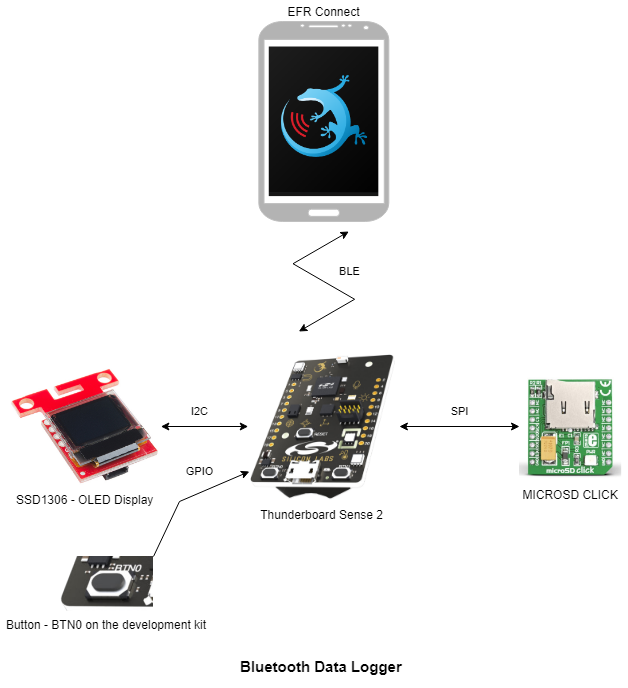

More detailed information can be found in the section [How it works](#how-it-works).

This code example referred to the following code examples. More detailed information can be found here:

- [SSD1306 - SparkFun Micro OLED Breakout](https://github.com/SiliconLabs/third_party_hw_drivers_extension/tree/master/driver/public/silabs/micro_oled_ssd1306)
- [External Storage - microSD Click (Mikroe)](https://github.com/SiliconLabs/third_party_hw_drivers_extension/tree/master/driver/public/mikroe/microsd)

## Gecko SDK version

- GSDK v4.3.1
- [Third-Party Hardware Drivers v1.8.0](https://github.com/SiliconLabs/third_party_hw_drivers_extension)

## Hardware Required

- [Thunderboard Sense 2](https://www.silabs.com/development-tools/thunderboard/thunderboard-sense-two-kit)
- [SparkFun Micro OLED Breakout (Qwiic) board](https://www.sparkfun.com/products/14532)
- [MICRO SD CLICK](https://www.mikroe.com/microsd-click)
- [Silabs Click Shield](https://www.mikroe.com/silabs-click-shield)

## Connections Required

The hardware connection is shown in the image below:

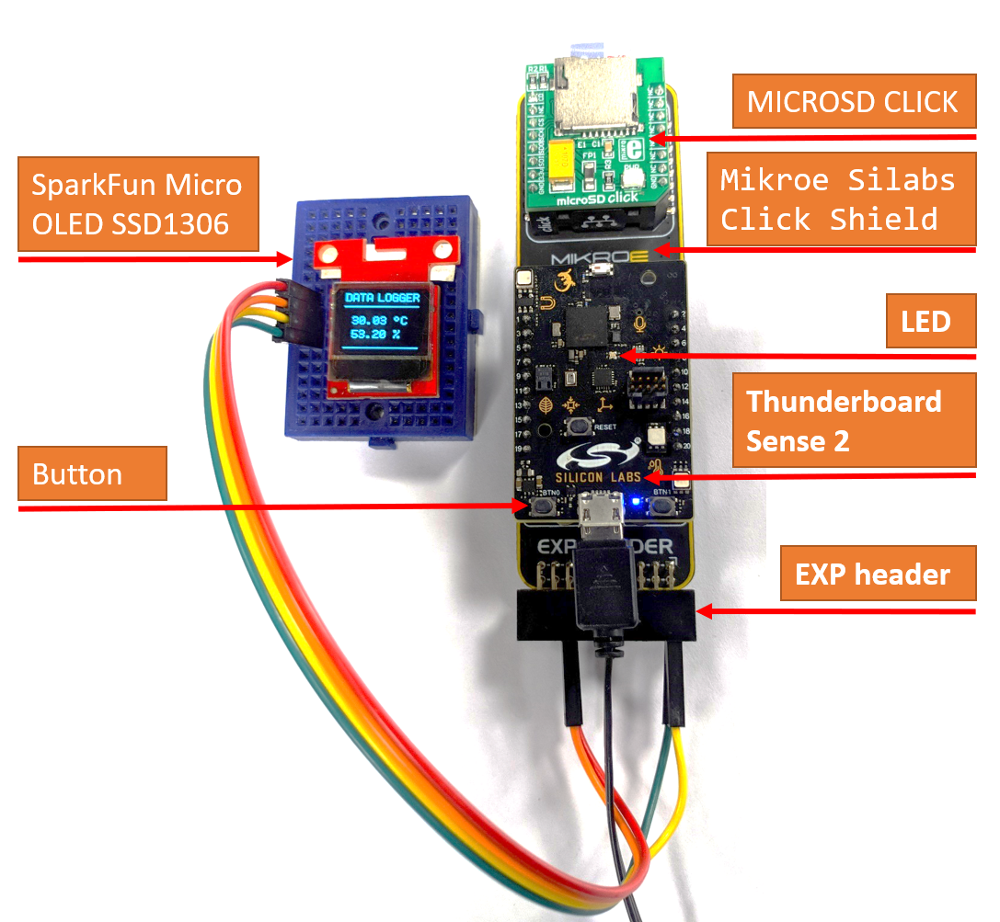

- The **Thunderboard Sense 2** and the **MICRO SD CLICK** can be plugged into the [Mikroe Silabs Click Shield](https://www.mikroe.com/silabs-click-shield) via the Thunderboard socket and the mikroBus respectively or we can use some **female-to-female jumper wire** to connect them directly as shown in the table below

  | Thunderboard sense 2 | MICRO SD CLICK |
  | --- | --- |
  | EXP10 - SPI_CS - PA5 (pin 10) | CS |
  | EXP8 - SPI_SCLK - PF7 (pin 8) | SCK |
  | EXP6 - SPI_MISO - PK2 (pin 6) | SDO |
  | EXP4 - SPI_MOSI - PK0 (pin 4) | SDI |
  | PA6 - EXP7 (pin 7) | CD |
  | GND - EXP1 (pin 1) | GND |
  | EXP2 - VMCU (pin 2) | +3V3 |

  The Thunderboard Sense 2  and MICRO SD CLICK pinout diagram is shown below:
  | Thunderboard sense 2 | MICRO SD CLICK |
  | --- | --- |
  | 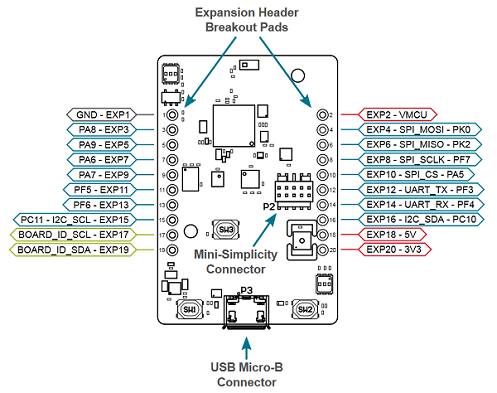 | 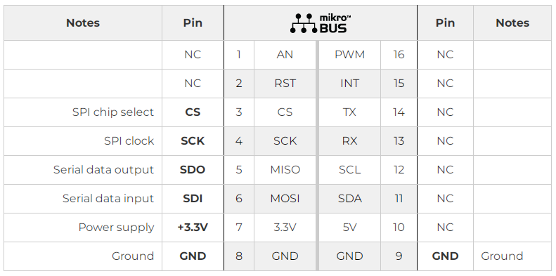  

- We can use some **female-to-female jumper wire** to connect **Micro OLED** and the **Thunderboard sense 2** or we can connect them through the [Mikroe Silabs Click Shield EXP header](https://www.mikroe.com/silabs-click-shield) with some **male-to-female jumper wire** as shown in the table below:

  | Thunderboard sense 2 | Micro OLED 2.5mm Header |
  | --- | --- |
  | PC11 - I2C_SCL - EXP15 (pin 15) | SCL (pin 4) |
  | EXP16 - I2C_SDA - PC10 (pin 16) | SDA (pin 3) |
  | EXP2 - VMCU (pin 2) | 3V3 (pin 2) |
  | GND - EXP1 (pin 1) | GND (pin 1) |

  Mikroe Silabs Click Shield EXP header pinout diagram is shown below:

  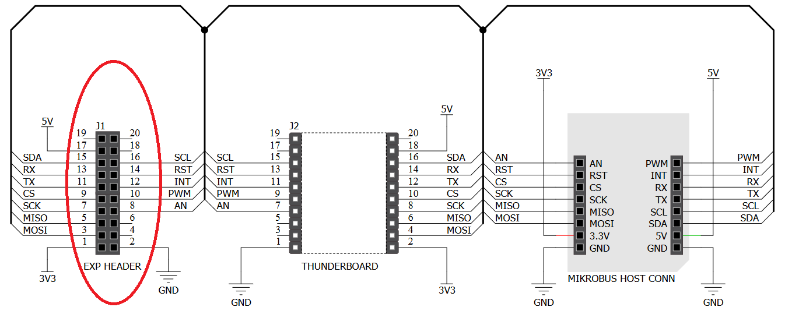

  Micro OLED 2.5mm Header pinout diagram is shown below:

  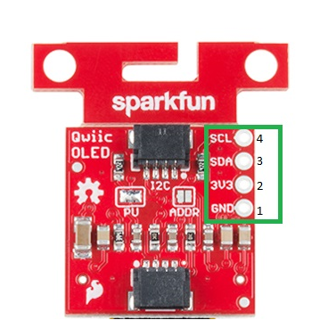

## Setup

To test this application, you can either create a project based on an example project or start with a "Bluetooth - SoC Empty" project based on your hardware. You should connect the Thunderboard Sense 2 Sensor-to-Cloud Advanced IoT Kit to the PC using a MicroUSB cable.

### Create a project based on an example project

1. From the Launcher Home, add the BRD4166A  to My Products, click on it, and click on the **EXAMPLE PROJECTS & DEMOS** tab. Find the example project with the filter 'data logger'.

   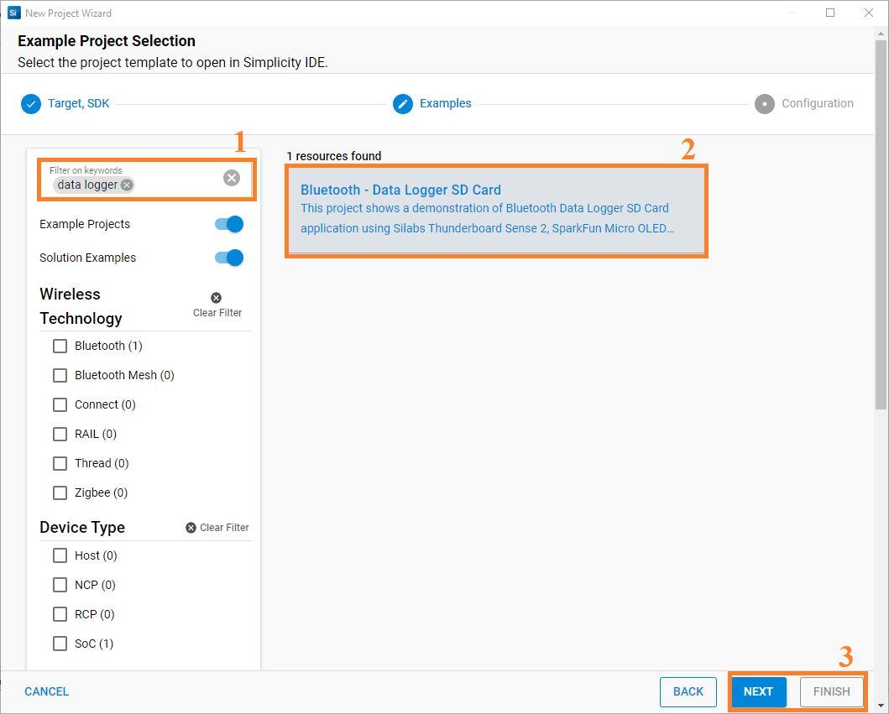

2. Click **Create** button on the **Bluetooth - Data Logger SD Card** example. Example project creation dialog pops up -> click Create and Finish and Project should be generated.

3. Build and flash this example to the board.

### Start with a "Bluetooth - SoC Empty" project

1. Create a **Bluetooth - SoC Empty** project for the **Thunderboard Sense 2** using Simplicity Studio 5.

2. Copy all attached files in the "inc" and the "src" folders into the project root folder (overwriting existing files).

3. Import the GATT configuration:

   - Open the .slcp file in the project.

   - Select the **CONFIGURATION TOOLS** tab and open the **Bluetooth GATT Configurator**.

   - Find the Import button and import the attached [gatt_configuration.btconf](config/btconf/gatt_configuration.btconf) file.

   - Save the GATT configuration (ctrl-s).

4. Install the software components:

   - Open the .slcp file in the project.

   - Select the SOFTWARE COMPONENTS tab.

   - Install the following components:

      - [Services] →  [Timers] →  [Sleep Timer]
      - [Bluetooth] → [Bluetooth Host (Stack)] → [Additional Features] → [NVM Support]
      - [Bluetooth] → [Application] → [Miscellaneous] → [Relative Humidity and Temperature sensor]
      - [Services] →  [NVM3]
      - [Services] →  [IO Stream] → [IO Stream: USART] → vcom
      - [Application] →  [Utility] → [Log]
      - [Platform] →  [Driver] → [I2C] →  [I2CSPM] → qwiic
      - [Platform] →  [Driver] → [I2C] →  [I2CSPM] → sensor
      - [Platform] →  [Driver] → [SPI] →  [SPIDRV] → exp
      - [Platform] →  [Driver] → [Button] →  [Simple Button] → btn0
      - [Platform] →  [Board Driver] → [Si70xx - Temperature/Humidity Sensor]
      - [Platform] →  [Board] → [Board Control] →  Enable Relative Humidity and Temperature sensor
      - [Third Party Hardware Drivers] → [Storage] → microSD - microSD Click (Mikroe)
      - [Third Party Hardware Drivers] → [Display & LED] → [SSD1306 - Micro OLED Breakout (Sparkfun) - I2C]
      - [Third Party Hardware Drivers] → [Services] → GLIB - OLED Graphics Library
      - [Third Party Hardware Drivers] → [Services] → FatFS - Generic FAT Filesystem
      - [Bluetooth] → [OTA] → [In-Place OTA DFU] → uninstall
      - [Platform] → [Bootloader Application Interface] → uninstall.

5. Build and flash the project to your device.

    *Note*: Flash the application image to the device by using the .hex or .s37 output file.

## How it Works

### Application Overview

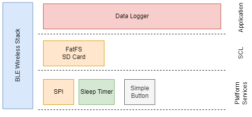

### GATT Configurator

The application is based on the Bluetooth - SoC Empty example. Since the example already has the Bluetooth GATT server, advertising, and connection mechanisms, only minor changes are required.

The GATT re-uses the [SPP over BLE](https://github.com/SiliconLabs/bluetooth_applications/tree/master/bluetooth_secure_spp_over_ble) custom service:

- [Service] **SPP Service**: UUID `4880c12c-fdcb-4077-8920-a450d7f9b907`
  - [Char] **SPP Data**: UUID `fec26ec4-6d71-4442-9f81-55bc21d658d6`
    - [**Notifiable**] - Get notification of log data

### Data logger Implementation

#### Application initialization

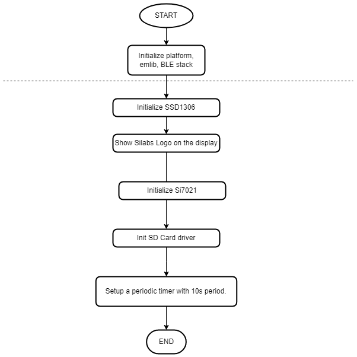  

#### Device connect event

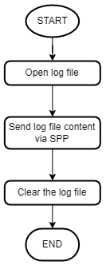  

#### Periodic timer event

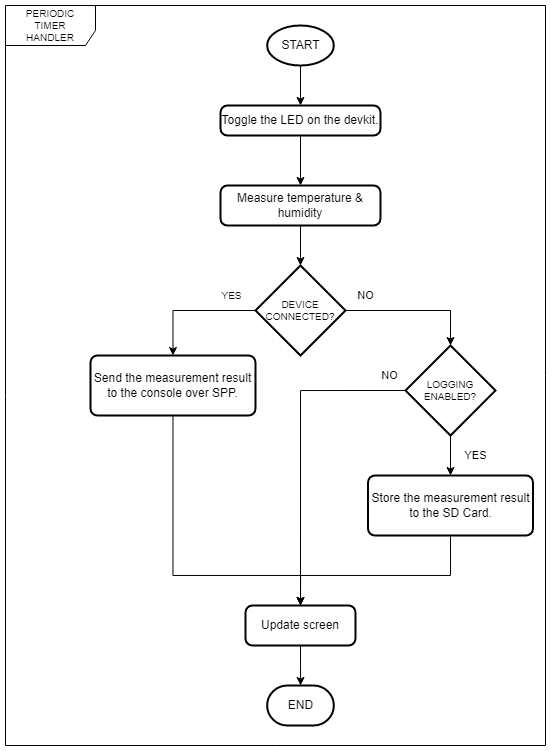

#### Application Workflows

1. Initialize the peripherals, the Bluetooth stack

2. Get the logger to enable configuration from nvm

3. Initialize the OLED display

4. Mount file system on the SD card

    - If failure to mount the file system then re-format it (make a new file system on the SD card)

5. Initialize the humidity & temperature sensor si7021

6. Start a periodic timer with period 10s. The timer callback will fire an external event to the BLE stack and the event handler will do:

    - Get the sensor humidity & temperature sample.
    - Update the OLED display with the sensor data
    - Make a log entry from sensor data.
    - Check the state of the BLE connection:
      - If the receiver is connected and the notification is enabled then send the log entry to the receiver over the BLE notification
      - If no BLE connection is made or the notification is not enabled:
        - If the logger is enabled then append the log entry to the sd card

7. When a new BLE connection is made and notification of the **SPP data** characteristic is enabled then:
    - If the log file exists on the sd card then all the logs on that file will be sent line by line over BLE notification of the **SPP data** characteristic. After that, the log file will be deleted
    - If the log file does not exist or after sending all the log data from a file, the new log data is continuing sent over BLE notification of the **SPP data** characteristic

8. When pressing button 0 the callback will fire an external event to the BLE stack and the event handler will do:
  
    - If the logger has been disabled then enable the data logger and save the config to the NVM.
    - If the logger has been enabled then disable the data logger and save the config to the NVM.

### OLED Display

- Display current sensor data
  
  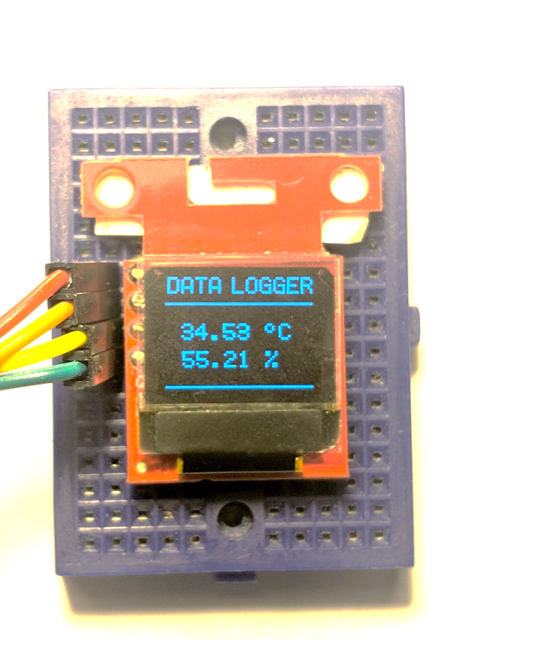

### Button

- Press the button to enable/disable the logger

### LED

- Indicate wether the logger is enabled or disabled

### Log data format

- The log data is sent line by line. They are separated by a line feed character.
- The log line format:

> yyyy/mm/dd hh:mm:ss Humidity = \<humidity_value_percentage\> RH, Temperature = \<temperature_value_degree\> C

### SPP Data notification

- To view the log data, we have 2 options:

  - Use **EFR Connect Mobile Application** to enable notification, the log data is received as an ASCII string

  - Use the [BLE SPP app for Windows](https://github.com/SiliconLabs/bluetooth_applications/tree/master/bluetooth_spp_with_windows) on a laptop or PC that has a Bluetooth adapter. First, we need to enter the name of the data logger (the default name is **"Data Logger"**). You should expect a similar output to the one below.

    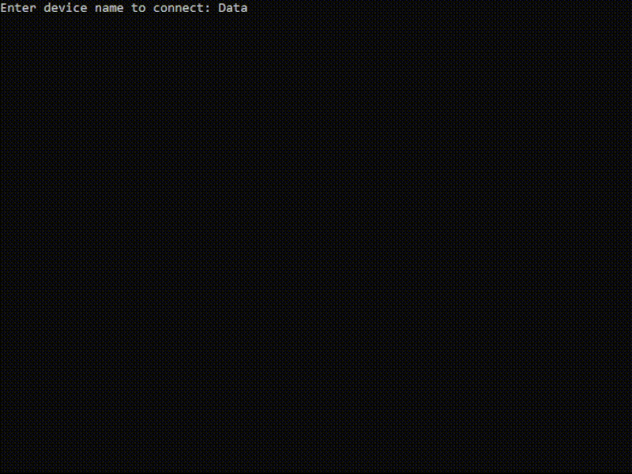
