# Distance Monitor example application using VL53L1X distance sensor and BLE #

## Overview ##
This project shows the demonstration of a Bluetooth distance monitor application using [Silabs BGM220 Explorer Kit Board BRD4314A](https://www.silabs.com/development-tools/wireless/bluetooth/bgm220-explorer-kit), [SparkFun Distance Sensor Breakout - 4 Meter, VL53L1X (Qwiic)](https://www.sparkfun.com/products/14722) [SparkFun Micro OLED Breakout (Qwiic) board](https://www.sparkfun.com/products/14532), [BUZZ 2 click Mikroe board](https://www.mikroe.com/buzz-2-click).

The block diagram of this application is shown in the image below:

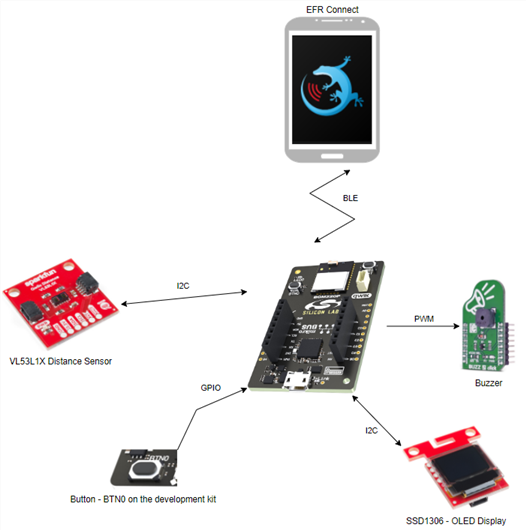

This code example referred to the following code examples. More detailed information can be found here:

- [VL53L1X Distance sensor driver](https://github.com/SiliconLabs/platform_hardware_drivers/tree/master/distance_vl53l1x)
- [OLED SSD1306 driver](https://github.com/SiliconLabs/platform_hardware_drivers/tree/master/oled_ssd1306_i2c)
- [Buzzer driver](https://github.com/SiliconLabs/platform_hardware_drivers/tree/master/magnetic_buzzer)
- [Bluetooth security feature](https://github.com/SiliconLabs/bluetooth_stack_features_staging/tree/master/security)

## Gecko SDK version ##

GSDK v4.0.2
## Hardware Required ##

- [BGM220 Explorer Kit board](https://www.silabs.com/development-tools/wireless/bluetooth/bgm220-explorer-kit)
- [SparkFun Distance Sensor Breakout - 4 Meter, VL53L1X (Qwiic)](https://www.sparkfun.com/products/14722) or [MikroE LIGHTRANGER 4 Click](https://www.mikroe.com/lightranger-4-click)
- [SparkFun Micro OLED Breakout (Qwiic) board](https://www.sparkfun.com/products/14532)
- [Mikroe BUZZ 2 Click board](https://www.mikroe.com/buzz-2-click)

## Connections Required ##

Sensor boards can be easily connected via qwiic and microbus connectors to the BGM220P explorer kit.

## Setup ##

To test this application, you should connect the BGM220 Explorer Kit Board to the PC using a microUSB cable. 

You can either import the provided **bluetooth_distance_monitor.sls** project file or start with an empty example project as basis:

1. Create a "Bluetooth - SoC Empty" project for the "BGM220 Explorer Kit Board" using Simplicity Studio 5. Use the default project settings. Be sure to connect and select the BGM220 Explorer Kit Board from the "Debug Adapters" on the left before creating a project.

2. Copy all attached files in *inc* and *src* folders into the project root folder (overwriting existing app.c).

3. Import the GATT configuration:

   - Open the .slcp file in the project.

   - Select the **CONFIGURATION TOOLS** tab and open the **Bluetooth GATT Configurator**.

   - Click on the Import button and import the attached [gatt_configuration.btconf](config/gatt_configuration.btconf) file.

   - Save the GATT configuration (ctrl-s).

4. Install the software components:

   - Open the .slcp file in the project.

   - Select the **SOFTWARE COMPONENTS** tab.

   - Install the following components
      - [Services] →  [Sleep Timer]
      - [Services] →  [NVM3] → NVM3 Core
      - [Services] →  [NVM3] → NVM3 Default Instance
      - [Services] →  [IO Stream] → [IO Stream: USART] → instance name: **vcom** 
      - [Bluetooth] → [NVM] → NVM Support
      - [Application] →  [Utility] → [Log]
      - [Platform] →  [Driver]→ [I2C] →  [I2CSPM] → instance name: **qwiic**

        Selected Module → I2C1

        SCL → PD02

        SDA → PD03
      - [Platform] →  [Driver]→ [Button] →  [Simple Button] -> instance name: **notification** 
      
        SL_SIMPLE_BUTTON_SENSOR_INT_MODE → Interrupt
        Selected Module → PB03

    ***

5. Build and flash the project to your device.

> ***
> **BOOTLOADER**
>
>The BGM220 Explorer Kit Board also requires a bootloader to run the application. \
You can either use the provided [bootloader-storage-internal-single-512k_bgm220p.s37](bootloader/>bootloader-storage-internal-single-512k_bgm220p.s37) file or perform the instructions below to create a bootloader executable:
>
>1. Create an **Internal Storage Bootloader (single image on 512kB device)** project for the **BGM220 Explorer Kit Board** using Simplicity Studio v5 with the default project settings. \
Make sure to connect and select the BGM220 Explorer Kit Board from the **Debug Adapters** on the left before creating a project.
>
>   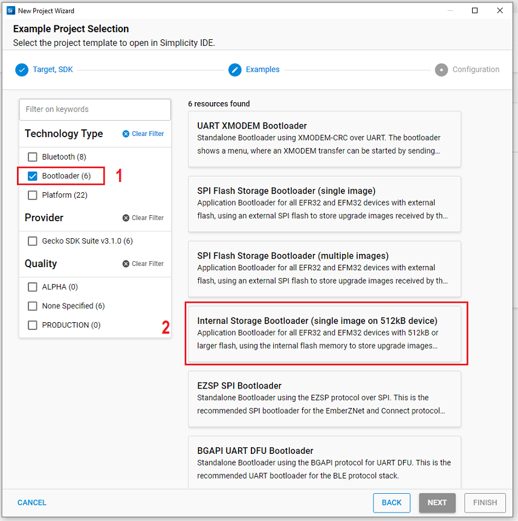
>
>2. Save the files, build and be ready to flash. To build the project from the **Simplicity IDE**, press the hammer sign from the above toolbar. \
>If there is no warning, it will have a Binaries-folder in the project. Expand the folder and click with the right mouse button on the .s37 file then select **Flash to Device**. \
The Flash Programmer dialog should be opened, in the dialog select the bootloader executable from the binaries folder (*.hex or *.s37), click on the program button to flash it to the device.
>
> ***

## How It Works ##

## Application Overview ###

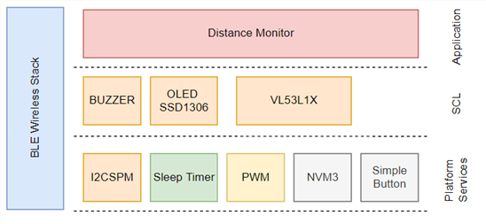
### Initialization ###
Application logic initialization function is invoked from the _app_init()_ function at startup.

### BLE User Request Events ###
BLE Characteristic user read/write requests processed in accordance with the following flowchart.

**BLE GATT Database**
 - [Service] Distance Monitor - `84b256e1-8292-4a07-b3d8-77d1f4bdb80e`
    - [Char] Lower Threshold Value (50-4000) - `bf393a58-b4c7-11ec-b909-0242ac120002`
      - [R] Get the lower threshold value
      - [W] Set the lower threshold value
    - [Char] Upper Threshold Value (50-4000) - `bf393cd8-b4c7-11ec-b909-0242ac120002`
      - [R]  Get the upper threshold value
      - [W] Set the lower threshold value
    - [Char] Threshold Mode (0-3) - `bf393e2c-b4c7-11ec-b909-0242ac120002`
      - [R]  Get the threshold mode
      - [W] Set the threshold mode
    - [Char] Buzzer volume (0-10) - `bf393f6c-b4c7-11ec-b909-0242ac120002`
      - [R] Get configured buzzer volume
      - [W] Set buzzer volume
    - [Char] Range Mode (1,2) - `bf3940ac-b4c7-11ec-b909-0242ac120002`
      - [R] Get configured range mode
      - [W] Set range mode
    - [Char] Notification Status (0,1) - `bf3941d8-b4c7-11ec-b909-0242ac120002`
      - [R] Get configured notification status
      - [W] Set notification status

Where R = Readable, W = Writeable with response.

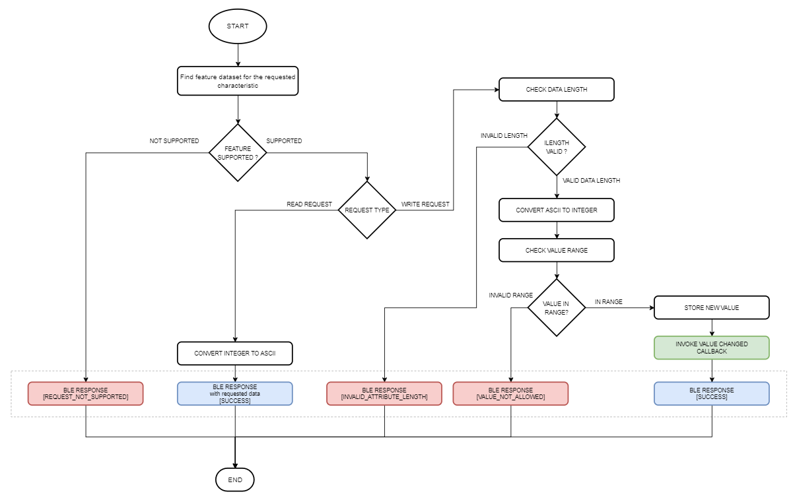

### External Runtime Events ###
 - Application Logic main timer expires => 100 ms
 - Screen update timer expires => 200 ms
 - User press button (BTN0)

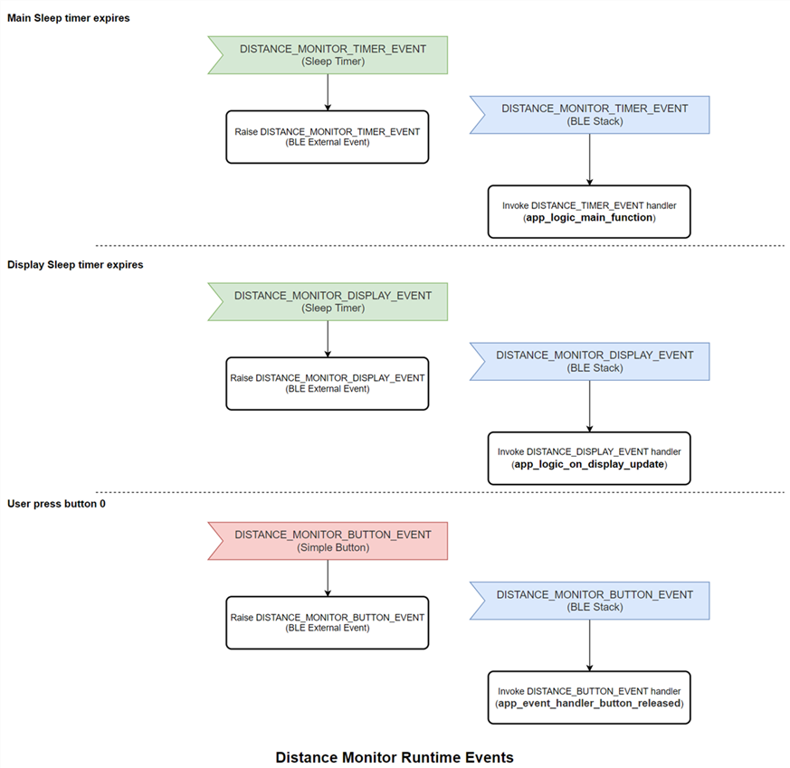
### Application Main Function ###
Application logic main function is executed periodically when the main periodic timer expires and raise an external event to the BLE stack in every 100 ms. Then the BLE external event handler invokes this function in which the measured distance is processed and the calculated average value checked against the configured thresholds in accordance with the selected threshold mode and notification status.

### Screen Update ###
Screen update function is a periodically invoked function. It updates the information displayed on the screen and handles buzzer toggling when the notification is active.

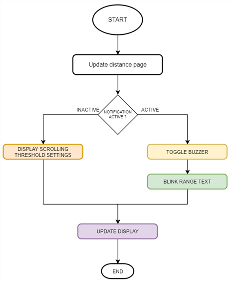
### Button Pressed ###

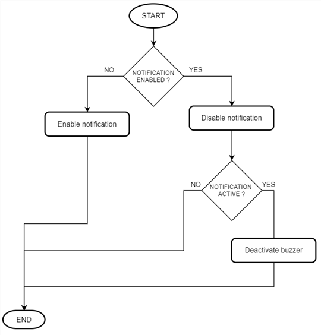

### Application main source files ###
 - [gatt_configuration.btconf](config/gatt_configuration.btconf): BLE GATT Database

 - [app_config.h](inc/app_config.h): Application configuration parameters (e.g.: BLE Passkey) and BLE GATT Characteristic <-> Application feature binding.

 - [app_logic.c](src/app_logic.c): Implements the applications's main logical blocks.

 - [app_callbacks.c](src/app_callbacks.c): Implements callback functions for platform drivers. (Timers, Buttons)

 - [app_ble_events.c](src/app_ble_events.c): Configures BLE stack and handles BLE events.

 - [app_events.c](src/app_events.c): Application specific event handlers. (BLE User requests, timer events, button events come from the BLE stack.)

### Testing ###
Upon reset, the application will display the Silicon Labs logo on the OLED screen for a few seconds. \
After the distance sensor is booted up and its configuration is done, the application starts the periodic distance measurement and gather the configured samples. \
While the samples are gathered the display shows the **SENSOR INIT.** text. Once the application is gathered enough measurement data to calculate the average distance then the application will update the screen with the latest available averaged distance.

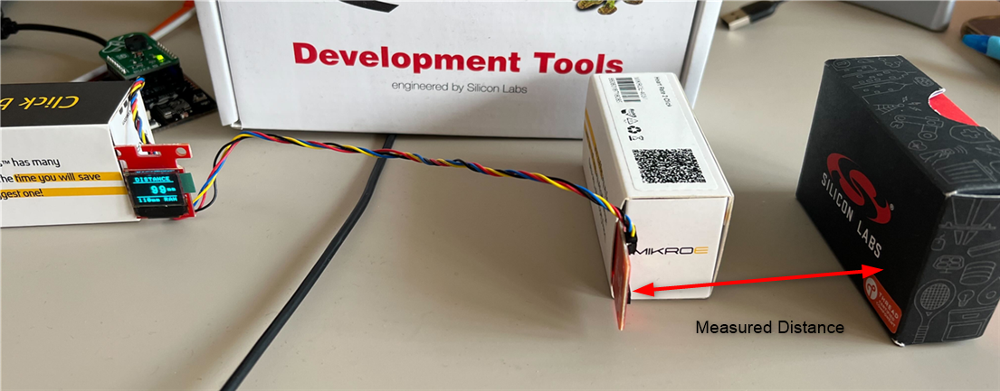

### Configuration with the EFR Connect Mobile Application ###

  - Open EFR Connect Mobile Application
  - Scan devices
  - Select Distance Monitor device

**Connect to the device**

The Silicon Labs EFR Connect application utilizes the Bluetooth adapter on your phone/tablet to scan, connect and interact with BLE devices. To run this example, an iOS or Android smartphone with the EFR Connect app installed is required.

Open the EFR Connect application on your smartphone and **allow the permission request** when opened for the first time. Click [Develop] -> [Browser] and you will see a list of nearby devices which are sending Bluetooth advertisements. Find the one named **Distance** and click the connect button on the right side. For iOS devices, enter the passkey (passkey default as **123456** (app_config.h: DISTANCE_MONITOR_PASSKEY)) to confirm authentication for the pairing process for the first time. For Android devices, the user must accept a pairing request first and do as above. After that, wait for the connection to be established and the GATT database to be loaded.

_Note_: The pairing process on Android and iOS devices is different. For more information, refer to [bluetooth security](https://github.com/SiliconLabs/bluetooth_stack_features/tree/master/security).

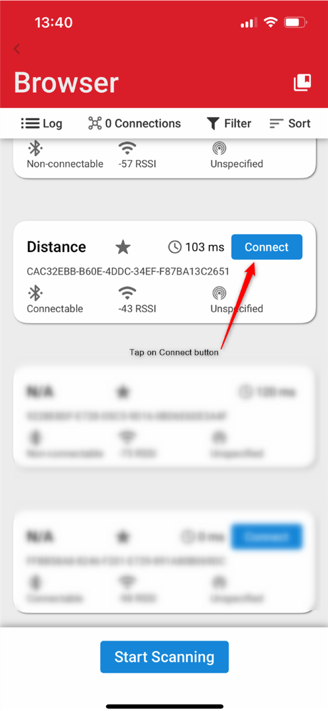

**Read/Write characteristics**

The parameters of this example application can be easly configured via BLE characteristics.
Values for the characteristics are handled by the application as ASCII strings.
Tap on the main service to see the available characteristics. 

***Read***

Push read button to request the value of a characteristic. (See ASCII fields.)

***Write***

For setting a parameter select a characteristic and tap on its write button. Type a new value in the ASCII field and push the Send button.

|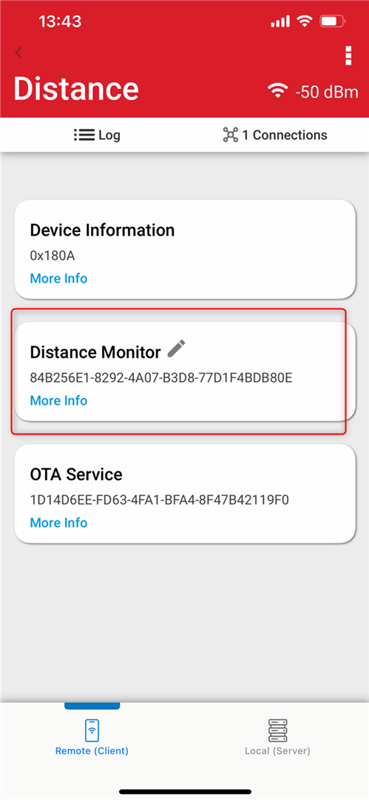|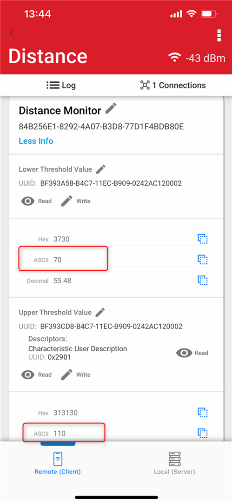|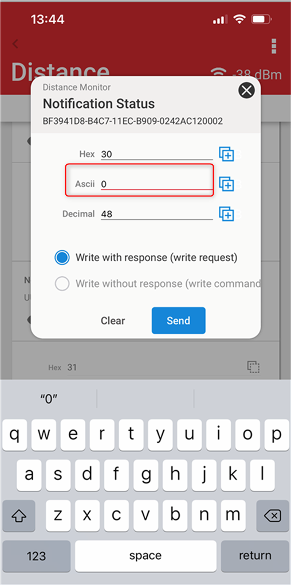|
|-|-|-|
### Summary ###
By default, the application is configured to notify the user if the measured distance is below the configured lower threshold (default: 250 mm). The notification is muted by default, it can be enabled via either pushing the BTN0 button on the development kit or through a write request to the corresponding BLE characteristic. 
Buzzer volume, threshold modes (below lower threshold, above upper threshold, inside, outside of the threshold limits) and threshold limits [50-4000 mm] can be configured too. If the measured average value is outside of the sensor's valid range [40-1300/4000 mm] the notification system is inactive and the "OUT OF RANGE" label displayed on the screen.

This application only aims to demonstrate the basic capabilities of this distance sensor with the Silicon Labs BLE wireless stack. This means that the notification status in the application logic is not debounce filtered and the configured threshold parameters are not checked against the sensor's range mode configuration (upper distance limit :short range mode = 1300 mm, long range mode = 4000 mm).

### .sls Projects Used ###

- `bluetooth_distance_monitor.sls`