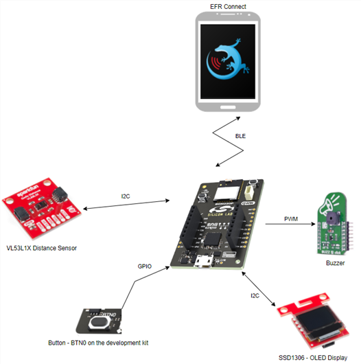
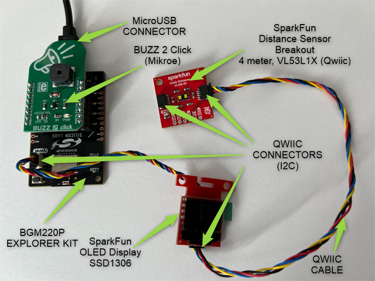
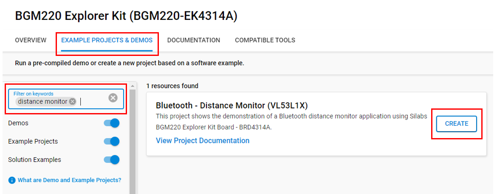
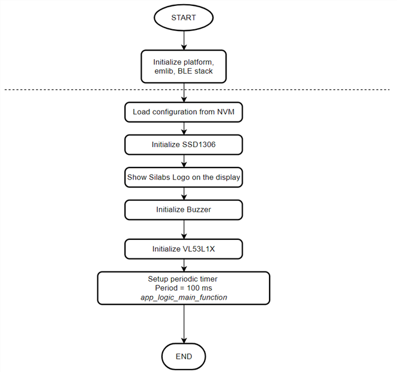
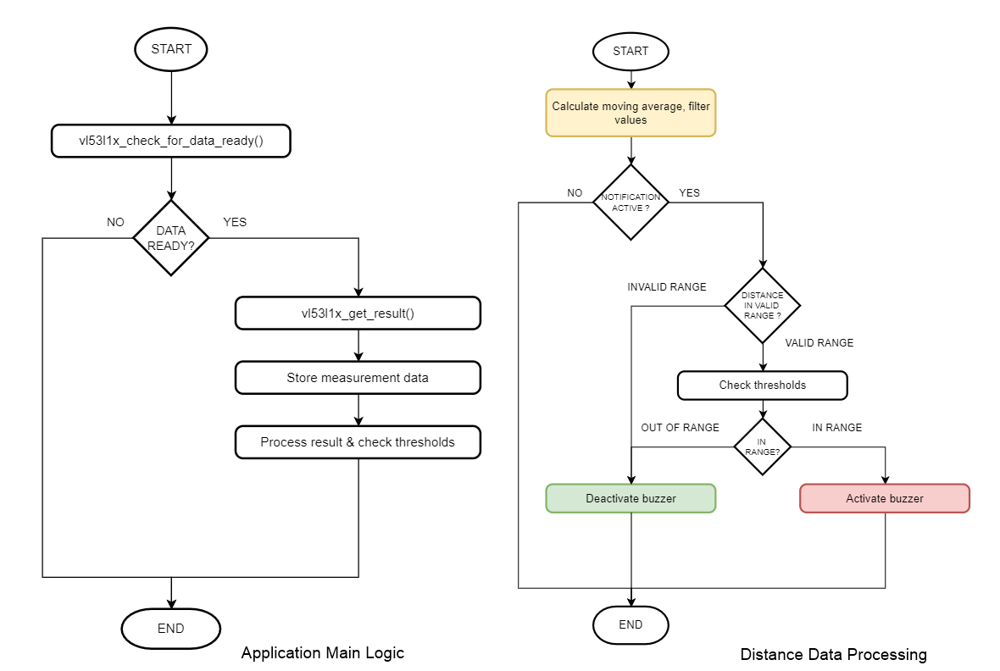
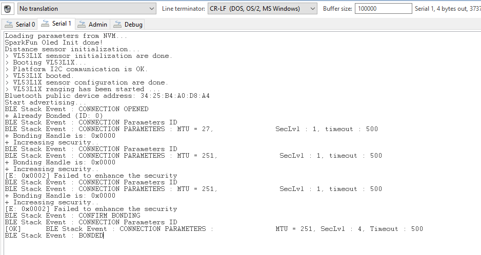
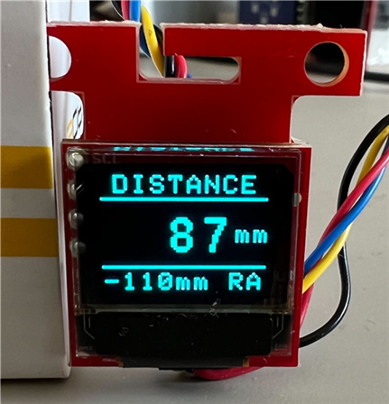
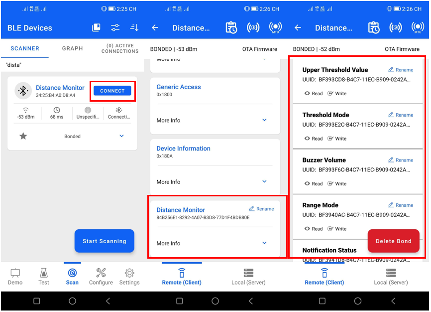

# Bluetooth - Distance Monitor (VL53L1X) #

## Overview ##
This project shows the demonstration of a Bluetooth distance monitor application using SparkFun Distance Sensor Breakout - VL53L1X and BGM220 Explorer Kit Board BRD4314A with the BLE wireless stack.

The block diagram of this application is shown in the image below:

In normal operation, the sensor device uses the BGM220 Explorer Kit board to get the distance value from the VL53L1X sensor periodically and show it on the SparkFun Micro Oled. To monitor the distance, the user can turn on the notification status by pressing the button 0 on the BGM220 board. After that, the Buzzer 2 Click will be active every time the distance value matches the threshold value.

This device can be connected to EFR connect app that allows users configuration the threshold mode, range mode, threshold value, buzzer volume, and notification status.

## Gecko SDK Version ##

- GSDK v4.3.1
- [Third Party Hardware Drivers v1.6.0](https://github.com/SiliconLabs/third_party_hw_drivers_extension)

## Hardware Required ##

- [BGM220 Explorer Kit board](https://www.silabs.com/development-tools/wireless/bluetooth/bgm220-explorer-kit)
- [SparkFun Distance Sensor Breakout - 4 Meter, VL53L1X (Qwiic)](https://www.sparkfun.com/products/14722)
- [SparkFun Micro OLED Breakout (Qwiic) board](https://www.sparkfun.com/products/14532)
- [Mikroe BUZZ 2 Click board](https://www.mikroe.com/buzz-2-click)

**NOTE:**
Tested boards for working with this example:

| Board ID | Description  |
| -------- | ------ |
| BRD2703A | [EFR32xG24 Explorer Kit - XG24-EK2703A](https://www.silabs.com/development-tools/wireless/efr32xg24-explorer-kit?tab=overview)    |
| BRD4108A | [BG22 Bluetooth SoC Explorer Kit - BG22-EK4108A](https://www.silabs.com/development-tools/wireless/bluetooth/bg22-explorer-kit?tab=overview) |
| BRD4314A | [BGM220 Bluetooth Module Explorer Kit - BGM220-EK4314A](https://www.silabs.com/development-tools/wireless/bluetooth/bgm220-explorer-kit?tab=overview)   |

## Connections Required ##

Sensor boards can be easily connected via qwiic and microbus connectors to the BGM220P explorer kit.

## Setup ##

To test this application, you can either create a project based on an example project or start with a "Bluetooth - SoC Empty" project based on your hardware.

### Create a project based on an example project ###

1. From the Launcher Home, add your hardware to My Products, click on it, and click on the **EXAMPLE PROJECTS & DEMOS** tab. Find the example project with the filter "distance monitor".

2. Click **Create** button on **Bluetooth - Distance Monitor (VL53L1X)** example. From the project creation dialog pops up, click Create and Finish and source code should be generated.

3. Build and flash this example to the board.

### Start with a "Bluetooth - SoC Empty" project ###

1. Create a **Bluetooth - SoC Empty** project for your hardware using Simplicity Studio 5.

2. Copy all the [source](src/) and [header](inc/) files to the following directory of the project root folder (overwriting existing files).

3. Install the software components:

   - Open the .slcp file in the project.

   - Select the SOFTWARE COMPONENTS tab.

   - Install the following components:
      - [Services] →  [Sleep Timer]
      - [Services] →  [NVM3] → NVM3 Core
      - [Services] →  [NVM3] → NVM3 Default Instance
      - [Services] →  [IO Stream] → [IO Stream: USART] → instance name: **vcom** 
      - [Bluetooth] → [Bluetooth Host (Stack)] → [Additional Features] → NVM Support
      - [Application] →  [Utility] → [Log]
      - [Platform] →  [Driver]→ [I2C] →  [I2CSPM] → instance name: **qwiic**
      - [Platform] →  [Driver]→ [Button] →  [Simple Button] -> instance name: btn0
      - [Third Party Hardware Drivers] → [Display & LED] → [SSD1306 - Micro OLED Breakout (Sparkfun) - I2C]
      - [Third Party Hardware Drivers] → [Audio & Voice] → [CMT_8540S_SMT - Buzz 2 Click (Mikroe)]
      - [Third Party Hardware Drivers] → [Sensors] → [VL53L1X - Distance Sensor Breakout (Sparkfun)]
      - [Third Party Hardware Drivers] → [Services] → [GLIB - OLED Graphics Library]
      - [Third Party Hardware Drivers] → [Services] → [mikroSDK 2.0 SDK - Peripheral Drivers] → [Digital I/O]
      - [Third Party Hardware Drivers] → [Services] → [mikroSDK 2.0 SDK - Peripheral Drivers] → [PWM]

4. Import the GATT configuration:

    - Open the .slcp file in the project again.
    - Select the CONFIGURATION TOOLS tab and open the "Bluetooth GATT Configurator".
    - Find the Import button and import the [gatt_configuration.btconf](config/btconf/gatt_configuration.btconf) file.
    - Save the GATT configuration (ctrl-s).

5. Build and flash the project to the board.

**Note:**

- Make sure the [Third-Party Hardware Drivers extension](https://github.com/SiliconLabs/third_party_hw_drivers_extension/blob/master/README.md) already be installed and this repository is added to [Preferences > Simplicity Studio > SDKs](https://docs.silabs.com/simplicity-studio-5-users-guide/latest/ss-5-users-guide-about-the-launcher/welcome-and-device-tabs).

- SDK Extension must be enabled for the project to install some components.

- Do not forget to flash a bootloader to your board, see [Bootloader](https://github.com/SiliconLabs/bluetooth_applications/blob/master/README.md#bootloader) for more information.

## How It Works ##

### Application Overview ###

### Initialization ###

Application logic initialization function is invoked from the _app_init()_ function at startup.

### BLE User Request Events ###

Where R = Readable, W = Writeable with response.

**BLE GATT Database**
 - [Service] Distance Monitor - `84b256e1-8292-4a07-b3d8-77d1f4bdb80e`
    - [Char] Lower Threshold Value (50-4000) - `bf393a58-b4c7-11ec-b909-0242ac120002`
      - [R] Get the lower threshold value
      - [W] Set the lower threshold value
    - [Char] Upper Threshold Value (50-4000) - `bf393cd8-b4c7-11ec-b909-0242ac120002`
      - [R]  Get the upper threshold value
      - [W] Set the lower threshold value
    - [Char] Threshold Mode (0-3) - `bf393e2c-b4c7-11ec-b909-0242ac120002`
      - [R]  Get the threshold mode
      - [W] Set the threshold mode
    - [Char] Buzzer volume (0-10) - `bf393f6c-b4c7-11ec-b909-0242ac120002`
      - [R] Get configured buzzer volume
      - [W] Set buzzer volume
    - [Char] Range Mode (1,2) - `bf3940ac-b4c7-11ec-b909-0242ac120002`
      - [R] Get configured range mode
      - [W] Set range mode
    - [Char] Notification Status (0,1) - `bf3941d8-b4c7-11ec-b909-0242ac120002`
      - [R] Get configured notification status
      - [W] Set notification status

BLE Characteristic user read/write requests are processed as the following flowchart.

### External Runtime Events ###

 - Application Logic main timer expires => 100 ms
 - Screen update timer expires => 200 ms
 - User press button (BTN0)

### Application Main Function ###

The application logic main function is executed periodically when the main periodic timer expires and raises an external event to the BLE stack every 100 ms. Then the BLE external event handler invokes this function in which the measured distance is processed and the calculated average value is checked against the configured thresholds by the selected threshold mode and notification status.

### Screen Update ###

The screen update function is invoked periodically. It updates the information displayed on the screen and handles buzzer toggling when the notification is active.

### Button Pressed ###

### Application main source files ###

 - [gatt_configuration.btconf](config/btconf/gatt_configuration.btconf): BLE GATT Database

 - [app_config.h](inc/app_config.h): Application configuration parameters (e.g.: BLE Passkey) and BLE GATT Characteristic <-> Application feature binding.

 - [app_logic.c](src/app_logic.c): Implements the applications's main logical blocks.

 - [app_callbacks.c](src/app_callbacks.c): Implements callback functions for platform drivers. (Timers, Buttons)

 - [app_ble_events.c](src/app_ble_events.c): Configures BLE stack and handles BLE events.

 - [app_events.c](src/app_events.c): Application specific event handlers. (BLE User requests, timer events, and button events come from the BLE stack.)

## Testing ##
Upon reset, the application will display the Silicon Labs logo on the OLED screen for a few seconds. \
After the distance sensor is booted up and its configuration is done, the application starts the periodic distance measurement and gathers the configured samples. \
While the samples are gathered the display shows the **SENSOR INIT.** text. Once the application is gathered enough measurement data to calculate the average distance then the application will update the screen with the latest available average distance.

### Configuration with the EFR Connect Mobile Application ###

  - Open EFR Connect Mobile Application
  - Scan devices
  - Select the 'Distance Monitor' device

**Connect to the device**

The Silicon Labs EFR Connect application utilizes the Bluetooth adapter on your phone/tablet to scan, connect and interact with BLE devices. To run this example, an iOS or Android smartphone with the EFR Connect app installed is required.

Open the EFR Connect application on your smartphone and **allow the permission request** when opened for the first time. Click [Develop] -> [Browser] and you will see a list of nearby devices which are sending Bluetooth advertisements. Find the one named **Distance** and click the connect button on the right side. For iOS devices, enter the passkey (passkey default as **123456** (app_config.h: DISTANCE_MONITOR_PASSKEY)) to confirm authentication for the pairing process for the first time. For Android devices, the user must accept a pairing request first and do as above. After that, wait for the connection to be established and the GATT database to be loaded.

_Note_: The pairing process on Android and iOS devices is different. For more information, refer to [bluetooth security](https://github.com/SiliconLabs/bluetooth_stack_features/tree/master/security).

**Read/Write characteristics**

The parameters of this example application can be easily configured via BLE characteristics.
Values for the characteristics are handled by the application as ASCII strings.
Tap on the main service to see the available characteristics. 

***Read***

Push the read button to request the value of a characteristic. (See ASCII fields.)

***Write***

For setting a parameter select a characteristic and tap on its write button. Type a new value in the ASCII field and push the Send button.

By default, the application is configured to notify the user if the measured distance is below the configured lower threshold (default: 250 mm). The notification is muted by default, it can be enabled via either pushing the BTN0 button on the development kit or through a write request to the corresponding BLE characteristic. 
Buzzer volume, threshold modes (below the lower threshold, above the upper threshold, inside, outside of the threshold limits), and threshold limits [50-4000 mm] can be configured too. If the measured average value is outside of the sensor's valid range [40-1300/4000 mm] the notification system is inactive and the "OUT OF RANGE" label is displayed on the screen.

This application only aims to demonstrate the basic capabilities of this distance sensor with the Silicon Labs BLE wireless stack. This means that the notification status in the application logic is not debounce filtered and the configured threshold parameters are not checked against the sensor's range mode configuration (upper distance limit: short range mode = 1300 mm, long range mode = 4000 mm).
