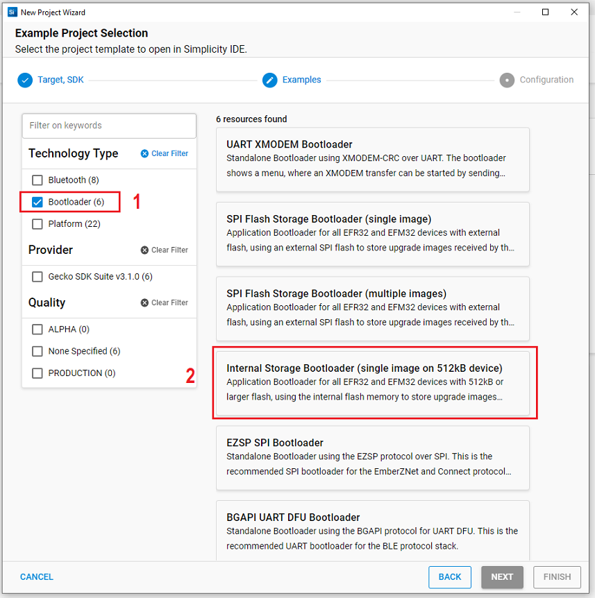

# Door lock example application with BLE

## Overview

This project shows a demonstration of **Bluetooth door lock application** using [Silabs BGM220 Explorer Kit Board BRD4314A](https://www.silabs.com/development-tools/wireless/bluetooth/bgm220-explorer-kit), [SparkFun Micro OLED Breakout (Qwiic) board](https://www.sparkfun.com/products/14532), [Cap Touch 2 Click MikroE board](https://www.mikroe.com/cap-touch-2-click), and [BUZZ 2 click Mikroe board](https://www.mikroe.com/buzz-2-click).

In this example, we use some security features of BLE such as pairing, bonding and set up the attribute permissions for higher reliability.

The block diagram of this application is shown in the image below:

More detailed information can be found in the section [How it works](#how-it-works)

This code example referred to the following code examples. More detailed information can be found here:

- [OLED SSD1306 driver](https://github.com/SiliconLabs/platform_hardware_drivers/tree/master/oled_ssd1306_i2c)
- [Cap Touch 2 Click driver](https://github.com/SiliconLabs/platform_hardware_drivers_staging/tree/master/cap1166_capacitive_touch)
- [Bluetooth security feature](https://github.com/SiliconLabs/bluetooth_stack_features_staging/tree/master/security)

## Gecko SDK Suite version

GSDK v3.2.3

## Hardware Required

- [**BGM220-EK4314A**(BGM220 Bluetooth Module Explorer Kit)](https://www.silabs.com/development-tools/wireless/bluetooth/bgm220-explorer-kit)

- [SparkFun Micro OLED Breakout (Qwiic) board](https://www.sparkfun.com/products/14532)

- [Cap Touch 2 Click MikroE board](https://www.mikroe.com/cap-touch-2-click)

- [BUZZ 2 click](https://www.mikroe.com/buzz-2-click)

## Connections Required

The hardware connection is shown in the image below:

The SparkFun Micro OLED Breakout (Qwiic) board can be easily connected by using a Qwiic cable. Use jumper wires to connect the Explorer kit with the Cap touch board and Buzzer board.

The pin connection is shown in the image below:

## Setup

To test this application, you should connect the BMG220 Explorer Kit Board to the PC using a MicroUSB cable.

You can either import the provided `bluetooth_door_lock.sls` project file or start with an empty example project as the following:

1. Create a **Bluetooth - SoC Empty** project for the **BGM220 Explorer Kit Board** using Simplicity Studio 5. Use the default project settings. Make sure to connect and select the BGM220 Explorer Kit Board from the **Debug Adapters** on the left before creating a project.

   

2. Copy all attached files in _inc_ and _src_ folders into the project root folder (overwriting existing app.c).

3. Import the GATT configuration:

   - Open the .slcp file in the project.
   - Select the **CONFIGURATION TOOLS** tab and open the **Bluetooth GATT Configurator**.
   - Find the Import button and import the attached [gatt_configuration.btconf](config/gatt_configuration.btconf) file.
   - Save the GATT configuration (ctrl-s).

   

4. Open the .slcp file again. Select the **SOFTWARE COMPONENTS** tab and do the following changes:

   **Platform:**

   - Install **SPIDRV** component with the instance name: **mikroe**.

     

   - Install **I2CSPM** component with the instance name: **qwiic**.

     

   - Install **PWM** component with the instance name: **mikroe**.

     

   - Install **simple LED** component with the default instance

     

   - Install **Simple Button** component with the instance name: **sensor_int**.

     

    - Change the pin configuration of the **sensor_int** instance to `PB3`.

   **Services:**

   - Install **IO Stream: USART** component with the default instance name: **vcom**.

     

   - Install **IO Stream: Retarget STDIO** component.

   - Install the **Sleep Timer** component.

   **Bluetooth:**

   - Install **NVM Support** component.

   **Utility:**

   - Install the **Log** component.

   => Build and flash the project to your device.

5. Don't forget to flash a bootloader to your board, if you haven't done so already. See the [special Notes](#special-notes).

## How it Works

### Unlock Door

The following diagram shows the main flowchart of this demo:

Once the password is entered, the buzzer plays a sound, and the OLED displays the password with the '\*' character. The user should enter the password to unlock the door from the capacitive sensor. If the password is correct, the LED will turn on, the OLED will show **Unlock** for a few seconds. If wrong, it will display **Lock** and allow to re-enter it from the beginning. Users can change the door unlock password over BLE, see the
[Change door unlock password](#change-door-unlock-password).

### GATT Configurator

The application is based on the Bluetooth - SoC Empty example. Since the example already has the Bluetooth GATT server, advertising, and connection mechanisms, only minor changes are required.

The GATT changes were adding a new custom service using UUID `02AE647B-83B7-45AA-AA59-D3DDFEE325E9` that has a characteristic UUID `8AF6DEB2-B277-49F9-A4F2-14210C6766CF`. The **new_password** characteristic only has a write property with permission level **encrypted** and **bonded**, which means that the characteristic can be written only on encrypted and bonded connections. This protects against password alteration by a third party. The **new_password** characteristic has a **user data** type and 6 bytes length.

The GATT should contain the following service and characteristics:

| Name      | UUID                                 |
| --------- | ------------------------------------ |
| door_lock | 02AE647B-83B7-45AA-AA59-D3DDFEE325E9 |

Characteristic properties:

| Name         | Value Type | UUID                                 | Security                     | Properties |        Comment         |
| ------------ | ---------- | ------------------------------------ | ---------------------------- | ---------- | :--------------------: |
| new_password | User data  | 8AF6DEB2-B277-49F9-A4F2-14210C6766CF | Pairing and bonding required | Write      | Write with a response. |

### Use EFR Connect Mobile Application

#### Connect to the door

The Silicon Labs EFR Connect application utilizes the Bluetooth adapter on your phone/tablet to scan, connect and interact with BLE devices. To run this example, an iOS or Android smartphone with the EFR Connect app installed is required.

Open the EFR Connect application on your smartphone and **allow the permission request** when opened for the first time. Click [Develop] -> [Browser] and you will see a list of nearby devices which are sending Bluetooth advertisements. Find the one named **Door Lock** and click the connect button on the right side. For iOS devices, enter the passkey `(passkey default as 686868) ` to confirm authentication for the pairing process for the first time. For Android devices, the user must accept a pairing request first and do as above. After that, wait for the connection to be established and the GATT database to be loaded.

_Note_: The pairing process on Android and iOS devices is different. For more information, refer to [bluetooth security](https://github.com/SiliconLabs/bluetooth_stack_features_staging/tree/master/security).

#### Change door unlock password and the passkey

The door unlock password and the passkey to connect with the mobile device will both be changed and will be the same with each other when updating the **new_password** characteristic.

To change both of them, the user must write a new password which has 6 bytes to the **Ascii string** field in the **new_password** characteristic. If the length of the new password is not 6 bytes then, an `INVALID ATTRIBUTE VALUE LENGTH` error will be thrown out. If the user writes to the new_password characteristic successfully, a new password will be updated in non-volatile memory. By contrast, the password will not be updated.

### .sls Projects Used

- `bluetooth_door_lock.sls`

## Special Notes

The BGM220 Explorer Kit Board also requires a bootloader to run the application. You can either use the provided [bootloader-storage-internal-single-512k_bgm220p.hex](bootloader/bootloader-storage-internal-single-512k.hex) file or perform the instructions below to create a bootloader file:

1. Create an **Internal Storage Bootloader (single image on 512kB device)** project for the **BGM220 Explorer Kit Board** using Simplicity Studio v5 with the default project settings. Make sure to connect and select the BGM220 Explorer Kit Board from the **Debug Adapters** on the left before creating a project.

   

2. If you use Gecko SDK v3.2 or earlier, open file _bootloader-storage-internal-single-512k_4.isc_ then click _Generate_ as picture below.

   

3. Save the files, build and be ready to flash. To build the project from the **Simplicity IDE**, press the hammer sign from the above toolbar. If there is no warning, it will have a Binaries-folder in the project. Expand the folder and click the right mouse on the .s37 file then select **Flash to Device**. Flash Programmer dialog should be opened then, select the correct file to flash the program.
