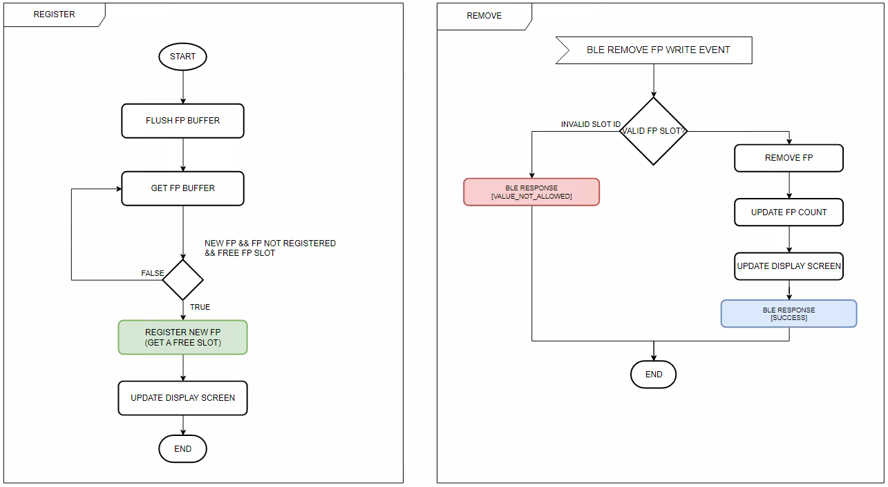

# Bluetooth - Door Lock Fingerprint (A-172-MRQ) #

[-green)](https://www.sparkfun.com/products/14532)

## Overview ##

This example is used for a BLE-based device lock system using one Silicon Labs EFR32xG24 Explorer kit and various hardware components such as MikroE Fingerprint Click 2 (A-172-MRQ) and SparkFun Micro OLED Breakout (Qwiic). The system is using BLE for wireless communication. This example also is the foundation to develop a secure and convenient device system using biometric authentication (fingerprint) and LED display indication. The system will use BLE for wireless communication between the Silicon Labs board and the Simplicity connect mobile application.

## SDK version ##

- [SiSDK v2024.12.0](https://github.com/SiliconLabs/simplicity_sdk)
- [Third Party Hardware Drivers v4.1.0](https://github.com/SiliconLabs/third_party_hw_drivers_extension)

## Software Required ##

- [Simplicity Studio v5 IDE](https://www.silabs.com/developers/simplicity-studio)
- [Simplicity Connect Mobile App](https://www.silabs.com/developer-tools/simplicity-connect-mobile-app)

## Hardware Required ##

- 1x [Bluetooth Low Energy Explorer Kit](https://www.silabs.com/development-tools/wireless/bluetooth). For example, [EFR32xG24-EK2703A Explorer Kit Board](https://www.silabs.com/development-tools/wireless/efr32xg24-explorer-kit?tab=overview)
- 1x [SparkFun Micro OLED Breakout (Qwiic)](https://www.sparkfun.com/products/14532)
- 1x [A-172-MRQ - Fingerprint 2 Click](https://www.mikroe.com/fingerprint-2-click)
- 1x smartphone running the 'Simplicity Connect' mobile app

## Connections Required ##

The following picture shows the system view of how it works.

The SparkFun OLED Display board can be easily connected to the EFR32 xG24 Explorer Kit by using a Qwiic cable. The Fingerprint 2 Click connects to the EFR32xG24 Explorer Kit using USART via MikroE connection.

## Setup ##

To test this application, you can either create a project based on an example project or start with a "Bluetooth - SoC Empty" project based on your hardware.

**NOTE**:

- Make sure that the [Third Party Hardware Drivers extension](https://github.com/SiliconLabs/third_party_hw_drivers_extension) is installed as part of the SiSDK and the [bluetooth_applications](https://github.com/SiliconLabs/bluetooth_applications) repository is added to [Preferences > Simplicity Studio > External Repos](https://docs.silabs.com/simplicity-studio-5-users-guide/latest/ss-5-users-guide-about-the-launcher/welcome-and-device-tabs).

- SDK Extension must be enabled for the project to install the required components.

### Create a project based on an example project ###

1. From the Launcher Home, add your hardware to **My Products**, click on it, and click on the **EXAMPLE PROJECTS & DEMOS** tab. Find the example project filtering by "door lock fingerprint".

2. Click **Create** button on the **Bluetooth - Door Lock Fingerprint (A-172-MRQ)** example. Example project creation dialog pops up -> click Create and Finish and Project should be generated.

    

3. Build and flash this example to the board.

### Start with a "Bluetooth - SoC Empty" project ###

1. Create a **Bluetooth - SoC Empty** project for your hardware using Simplicity Studio 5.

2. Copy all attached files in *inc* and *src* folders into the project root folder (overwriting existing).

3. Import the GATT configuration:

    - Open the .slcp file in the project.

    - Select the **CONFIGURATION TOOLS** tab and open the **Bluetooth GATT Configurator**.

    - Find the Import button and import the attached [gatt_configuration.btconf](config/btconf/gatt_configuration.btconf) file.

    - Save the GATT configuration (ctrl-s).

4. Open the .slcp file. Select the **SOFTWARE COMPONENTS** tab and install the software components:

    - [Services] → [IO Stream] → [IO Stream: EUSART] → default instance name: **vcom**

    - [Services] → [IO Stream] → [IO Stream: USART] → default instance name: **mikroe** → Set "Receive buffer size" to 800

    - [Application] → [Utility] → [Log]

    - [Platform] → [Driver] → [I2C] → [I2CSPM] → default instance name: **qwiic**

    - [Platform] → [Driver] → [LED] → [Simple LED] → default instance name: **led0**

    - [Third Party Hardware Drivers] → [Human Machine Interface] → [A-172-MRQ - Fingerprint 2 Click (Mikroe)]

    - [Third Party Hardware Drivers] → [Display & LED] → [SSD1306 - Micro OLED Breakout (Sparkfun) - I2C]

    - [Third Party Hardware Drivers] → [Services] → [GLIB - OLED Graphics Library]

5. Build and flash the project to your device.

**Note:**

- A bootloader needs to be flashed to your board if the project starts from the "Bluetooth - SoC Empty" project, see [Bootloader](https://github.com/SiliconLabs/bluetooth_applications/blob/master/README.md#bootloader) for more information.

## How It Works ##

### Application Overview ###

### Application Logic ###

### GATT Database ###

Advertisement Packet Device name: **FINGERPRINT DOORLOCK**

**GATT Database:**

- Device name: **FINGERPRINT DOORLOCK**

- [Service]: **Fingerprint Door Lock**
  - [Char] **Mode**
    - [R] Get mode value.
    - [W] Set operation mode (0 - normal, 1 - register, remove, 2 - show).
  - [Char] **Remove Authorized Fingerprint**
    - [W] Provide authorized fingerprint ID to remove it from the authorized fingerprints.
  - [Char] **Get Fingerprint ID**
    - [W] Select the index.
    - [R] Provide the status of the index (**EMPTY** or **EXISTS**).
  - [Char] **Open Lock**
    - [W] Write 1 to open lock.

### Application initialization ###

### Runtime - Normal Mode ###

### Runtime - Configuration Mode 1 - Register/Remove Fingerprint ###

### Runtime - Configuration Mode 2 - Show Authorized Fingerprints ###

### Display ###

In normal mode, the OLED displays the BLE connection status (CONNECTED or DISCONNECTED) as well as the door status (LOCKED or UNLOCKED). If the door is unlocked by a user's fingerprint, the screen will display the index of this fingerprint.

In configuration mode 1, the OLED will show "CONFIG" on the screen and the number of fingerprints that have already been authorized. There are two methods in this mode:

- When the user adds the new fingerprint, the screen will show the "ADDED" label and the index of this fingerprint.

- Otherwise, when the fingerprint is removed by the user, the OLDE will show the "REMOVED" label and the index of the removed fingerprint, which was stored on the Fingerprint 2 Click board and NVM memory.

    

In configuration mode 2, if the fingerprints were stored in NVM memory and on the Fingerprint 2 Click board, the OLED would show the index of each fingerprint in 4 seconds. If do not have any authorized fingerprints, the OLED will show "-" and "NO FPs".

### Testing ###

Upon reset, the application will display the Silicon Labs logo on the OLED screen for a few seconds. After the firmware is configured, the device starts in normal mode. In this state, it starts advertising devices. Open your terminal emulator and connect to your client device over its serial port. Set baudrate to 115200. A similar output as below:

Follow the below steps to test the example with the Simplicity Connect application:

1. Open the Simplicity Connect app on your smartphone and allow the permission requested the first time it is opened.

2. Find your device in the Bluetooth Browser, advertising as *FINGERPRINT DOORLOCK*, and tap Connect.

- Click on **Connect** button.

    

#### Normal Mode ####

When you place your finger on the sensor in normal mode, the system compares your fingerprint and returns the result. Please see the terminal output as follows:

#### Configuration Mode 1 ####

In configuration mode 1, you can get the index of authorized fingerprints by reading **Get Fingerprint ID** characteristic. After that, you can delete the fingerprint that you no longer use. The terminal output is as follows:

Moreover, in this mode, when you place the new finger, that is not authorized. The system will then assist you in registering this fingerprint if it has enough storage space. The terminal output is as follows:

#### Configuration Mode 2 ####

The OLED screen will show the index of the authorized fingerprints. Please take a look at the picture in the paragraph marked **Display**.
