# Bluetooth - Door Lock RFID (ID-12LA) #

[-green)](https://www.sparkfun.com/products/14532)

## Overview ##

This project aims to implement a doorlock system using Silicon Labs development Kits and external sensors integrated with the BLE wireless stack.

More detailed information can be found in the section [How it works](#how-it-works).

This code example referred to the following code examples. More detailed information can be found here:

- [OLED SSD1306 driver](https://github.com/SiliconLabs/third_party_hw_drivers_extension/blob/master/driver/public/mikroe/oledw_ssd1306)
- [Bluetooth security feature](https://github.com/SiliconLabs/bluetooth_stack_features/tree/master/security)
- [SparkFun RFID Qwiic Kit - ID12LA driver](https://github.com/SiliconLabs/third_party_hw_drivers_extension/blob/master/driver/public/silabs/rfid_id12la)

## SDK version ##

- [SiSDK v2024.12.0](https://github.com/SiliconLabs/simplicity_sdk)
- [Third Party Hardware Drivers v4.1.0](https://github.com/SiliconLabs/third_party_hw_drivers_extension)

## Software Required ##

- [Simplicity Studio v5 IDE](https://www.silabs.com/developers/simplicity-studio)
- [Simplicity Connect Mobile App](https://www.silabs.com/developer-tools/simplicity-connect-mobile-app)

## Required Hardware ##

- 1x [Bluetooth Low Energy Development Kit](https://www.silabs.com/development-tools/wireless/bluetooth). For example, [SparkFun Thing Plus Matter - MGM240P - BRD2704A](https://www.sparkfun.com/products/20270)
- 1x [SparkFun RFID Qwiic Kit - ID12LA Board](https://www.sparkfun.com/products/15209)
- 1x [SparkFun Micro OLED Breakout (Qwiic)](https://www.sparkfun.com/products/14532)
- 1x smartphone running the 'Simplicity Connect' mobile app

## Connections Required ##

The hardware connection is shown in the image below:

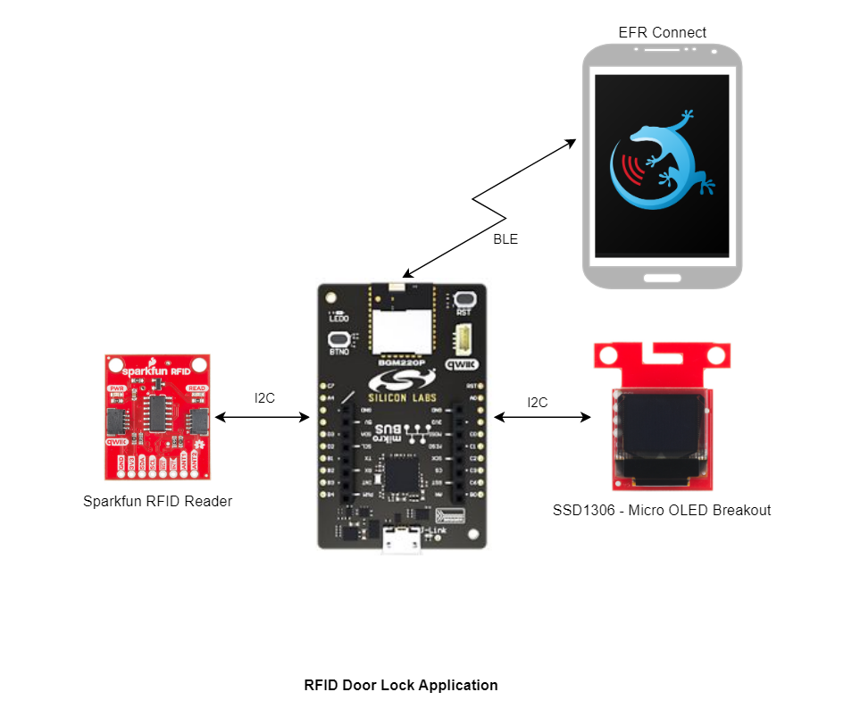

The I2C connection is made from the Silicon Labs's Kit to the RFID board and the Micro OLED Breakout by using the *qwiic* cable.

Listed below are the port and pin mappings for working with this example.

- Board: **BRD2704A - SparkFun Thing Plus Matter - MGM240P**

    | GPIO Pin | Connection | Pin function |
    |:---:|:-------------:|:---------------|
    | GPIOB | PB00 | GPIO input |
    | SCL | PB03 | I2C Clock |
    | SDA | PB04 | I2C Data |

- Board: **BRD2601B - EFR32xG24 Dev Kit- xG24**

    | GPIO Pin | Connection | Pin function |
    |:---:|:-------------:|:---------------|
    | GPIOB | PB02 | GPIO input |
    | SCL | PC04 | I2C Clock |
    | SDA | PC05 | I2C Data |

- Board: **BRD2703A - EFR32xG24 Explorer Kit - XG24**

    | GPIO Pin | Connection | Pin function |
    |:---:|:-------------:|:---------------|
    | GPIOB | PB02 | GPIO input |
    | SCL | PC04 | I2C Clock |
    | SDA | PC05 | I2C Data |

- Board: **BRD4108A - BG22 Bluetooth SoC Explorer Kit - BG22**

    | GPIO Pin | Connection | Pin function |
    |:---:|:-------------:|:---------------|
    | GPIOB | PC07 | GPIO input |
    | SCL | PD02 | I2C Clock |
    | SDA | PD03 | I2C Data |

- Board: **BRD4314 Bluetooth Module Explorer Kit**

    | GPIO Pin | Connection | Pin function |
    |:---:|:-------------:|:---------------|
    | GPIOB | PB00 | GPIO input |
    | SCL | PD02 | I2C Clock |
    | SDA | PD03 | I2C Data |

## Setup ##

To test this application, you can either create a project based on an example project or start with a "Bluetooth - SoC Empty" project based on your hardware.

**NOTE**:

- Make sure that the [Third Party Hardware Drivers extension](https://github.com/SiliconLabs/third_party_hw_drivers_extension) is installed as part of the SiSDK and the [bluetooth_applications](https://github.com/SiliconLabs/bluetooth_applications) repository is added to [Preferences > Simplicity Studio > External Repos](https://docs.silabs.com/simplicity-studio-5-users-guide/latest/ss-5-users-guide-about-the-launcher/welcome-and-device-tabs).

- SDK Extension must be enabled for the project to install the required components.

### Create a project based on an example project ###

1. From the Launcher Home, add your hardware to MyProducts, click on it, and click on the **EXAMPLE PROJECTS & DEMOS** tab. Find the example project filtering by "rfid".

2. Click the **Create** button on the **Bluetooth - Door Lock RFID (ID-12LA)** example. Example project creation dialog pops up -> click Create and Finish and Project should be generated.
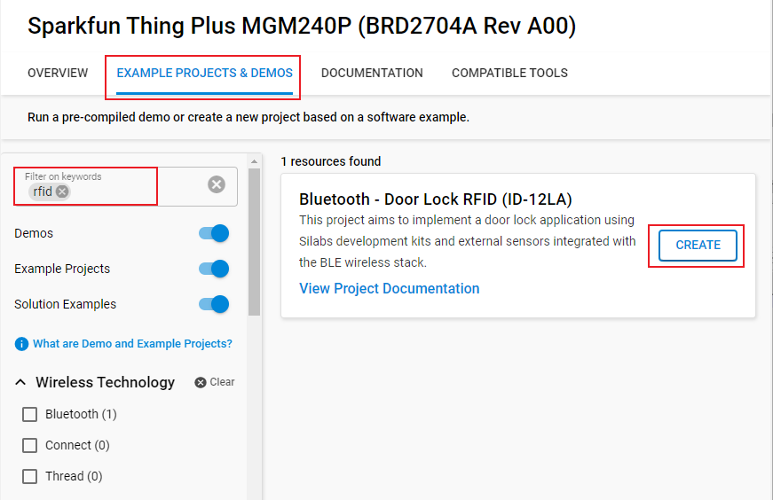

### Start with a "Bluetooth - SoC Empty" project ###

1. Create a "Bluetooth - SoC  Empty" using Simplicity Studio v5. Use the default project settings.

2. Copy all attached files in *inc* and *src* folders into the project root folder (overwriting existing the app.c file).

3. Install the software components:

    - Open the .slcp file in the project.

    - Select the SOFTWARE COMPONENTS tab.

    - Install the following components:

        - [Services] → [Timers] → [Sleep Timer]
        - [Bluetooth] → [Bluetooth Host (Stack)] → [Additional Features] → [NVM Support]
        - [Services] → [IO Stream] → [IO Stream: USART] → default instance name: **vcom**
        - [Application] → [Utility] → [Log]
        - [Platform] → [Driver] → [I2C] → [I2CSPM] → instance name: **qwiic**. Configure this instance to suit your hardware.
        - [Third Party Hardware Drivers] → [Display & LED] → [SSD1306 - Micro OLED Breakout (Sparkfun) - I2C]
        - [Third Party Hardware Drivers] → [Service] → [GLIB - OLED Graphics Library]
        - [Third Party Hardware Drivers] → [Wireless Connectivity] → [ID-12LA - RFID Reader (Sparkfun) - I2C]

4. Import the GATT configuration:

   - Open the .slcp file in the project.

   - Select the **CONFIGURATION TOOLS** tab and open the **Bluetooth GATT Configurator**.

   - Click on the Import button and import the attached [gatt_configuration.btconf](config/btconf/gatt_configuration.btconf) file.

   - Save the GATT configuration (ctrl-s).

5. Build and flash this example to the board.

**NOTE:**

- A bootloader needs to be flashed to your board if the project starts from the "Bluetooth - SoC Empty" project, see [Bootloader](https://github.com/SiliconLabs/bluetooth_applications/blob/master/README.md#bootloader) for more information.

## How it Works ##

### Application overview ###

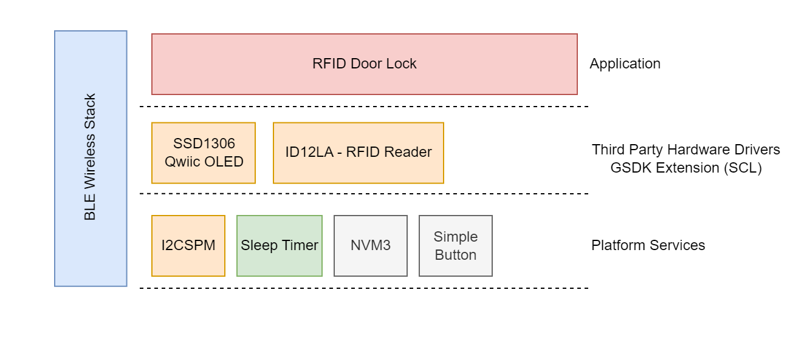

### GATT Configurator ###

The application is based on the Bluetooth - SoC Empty example. Since the example already has the Bluetooth GATT server, advertising, and connection mechanisms, only minor changes are required.

The GATT changes were adding a new custom service (RFID Door Lock) which are 4 characteristics:

- **Mode**:

  - [**Readable**] - Get mode value

  - [**Writable**] - Set operation mode (0 - normal, 1 - register, remove, 2 - show)

- **Remove Card**:

  - [**Writable**] - Provide card slot id to remove it from the registered cards.

- **Get card ID**:

  - [**Readable**] - Get selected card's ID
  - [**Writable**] - Set selected card slot (default is 0).

- **Open Lock**:

  - [**Writable**] - Write 1 to open the lock.

### Doorlock Implementation ###

#### Application initialization ###

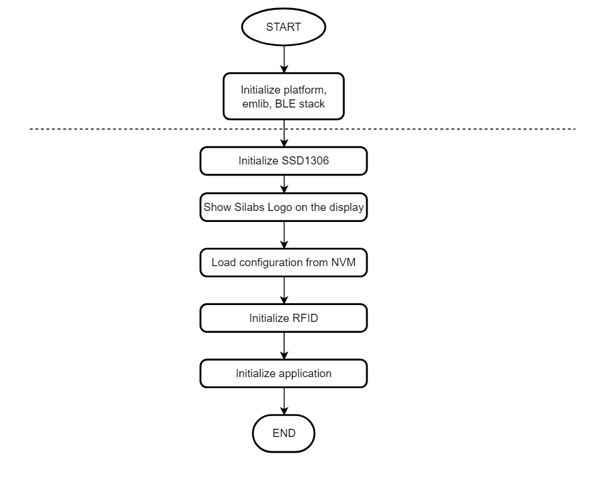  

#### Application Workflows ####

1. Initialize the peripherals, the Bluetooth stack

2. Initialize the OLED display, show the 'Silabs' logo on the screen

3. Initialize and load the NVM3 configurations

4. Wait for the sensor to be booted and initialize the sensor with the configurations from NVM3:

5. Initialize RFID

6. Initialize application

7. After the *sl_bt_evt_system_boot_id* event arrives, the application sets up the security manager to bond with an iOS/Android device. And then start advertising.

8. Handle GATT event to help users configure the [Use Simplicity Connect Mobile Application](#use-simplicity-connect-mobile-application) and get the result from the algorithm calculation over the *EFR32 connect* mobile application

#### Application logic ####

| 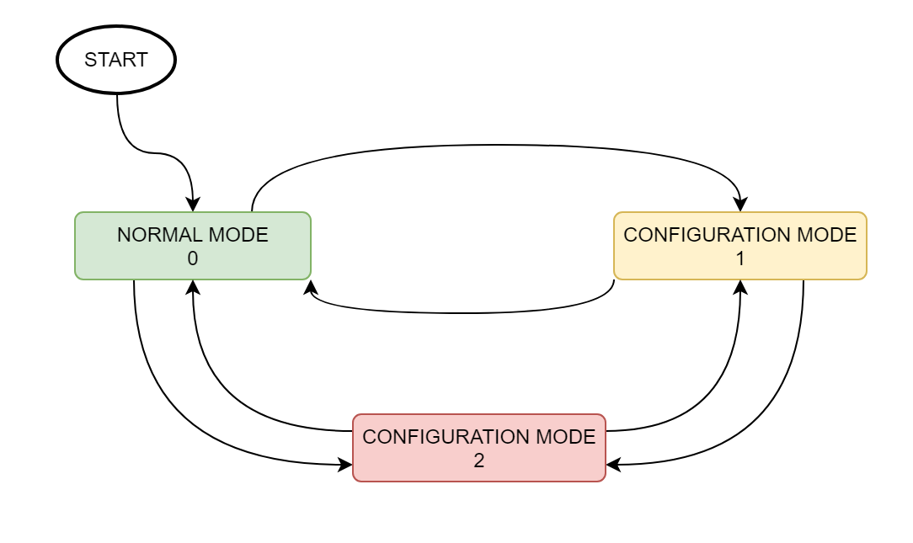 | 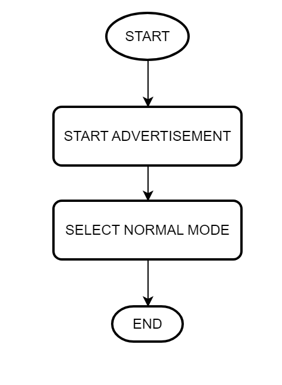||
| - | - | -|

#### Normal Mode 0 ####
  
  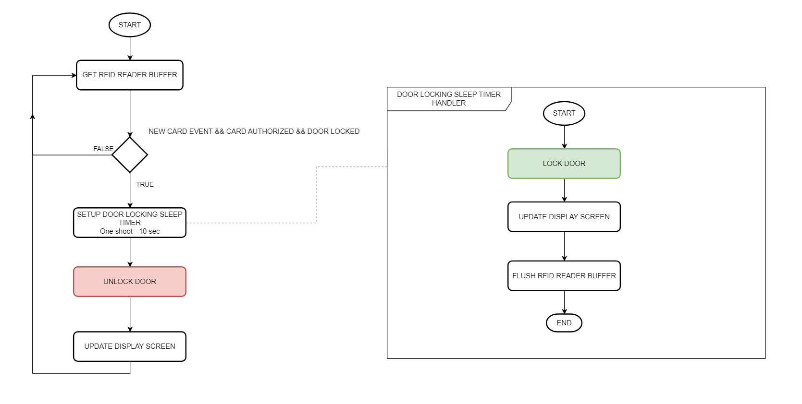

#### Configuration Mode 1 - Register Card/Remove Card ####
  
  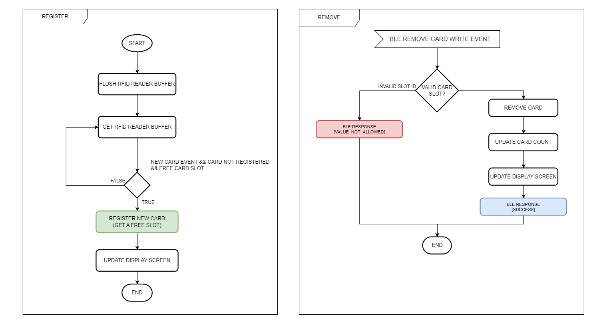

#### NConfiguration Mode 2 - Show Registered Cards ####
  
  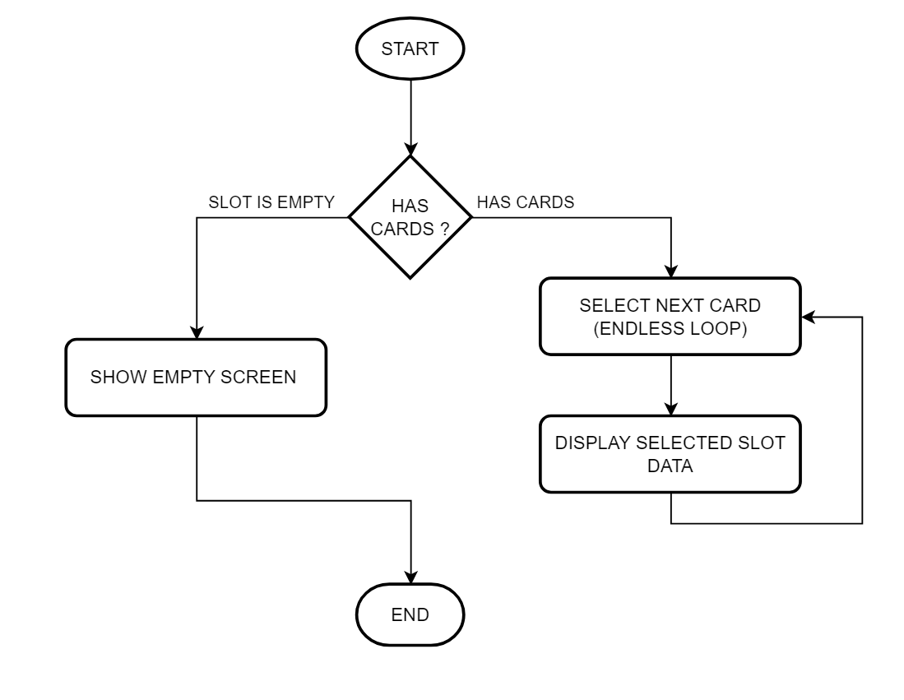

### Display on OLED ###

#### Normal mode ####

- Show LOCKED/UNLOCKED label
- LOCKED
  - Show BLE connection status
- UNLOCKED
  - RFID Card
    - Show the used card's ID
  - BLE
    - Show CONNECTED label

#### Configuration mode 1 - Register/Remove ####

- Show CONFIG label
- Show the number of registered cards (max. 10)

#### Remove ####

    - Show REMOVED label
    - Show the number of registered cards (max. 10)

#### Adding new card ####

    - Show ADDED label
    - Show added/removed card's ID

#### Configuration mode 2 - Show Cards ####

- Has registered cards
  - Show each slot data for 4 seconds
    - Show slot index.
    - Show card ID
- Card slot is empty
  - Show NO CARDS and "-" labels

Below are illustrations for each case

  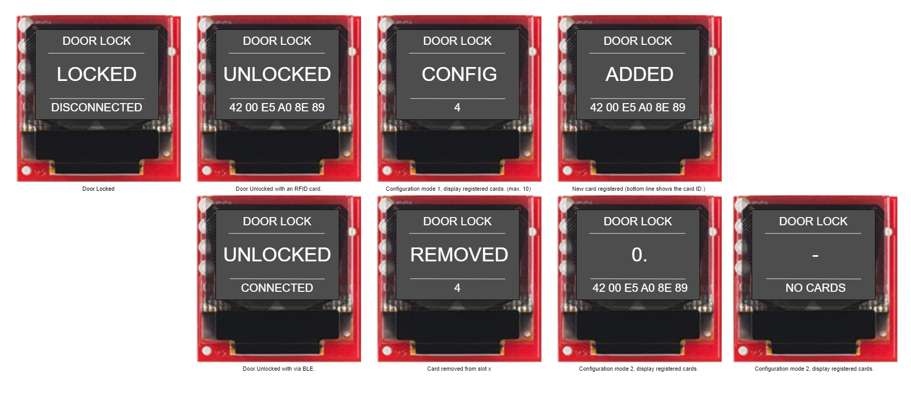

### Use Simplicity Connect Mobile Application ###

#### Connect to the device ####

Follow the below steps to test the example with the Simplicity Connect application:

1. Open the Simplicity Connect app on your smartphone and allow the permission requested the first time it is opened.

2. Find your device in the Bluetooth Browser, advertising as *RFID Door Lock*, and tap Connect. Then you need accept the pairing request when connected for the first time.

**Note**: The pairing process on Android and iOS devices is different. For more information, refer to Bluetooth security.

| 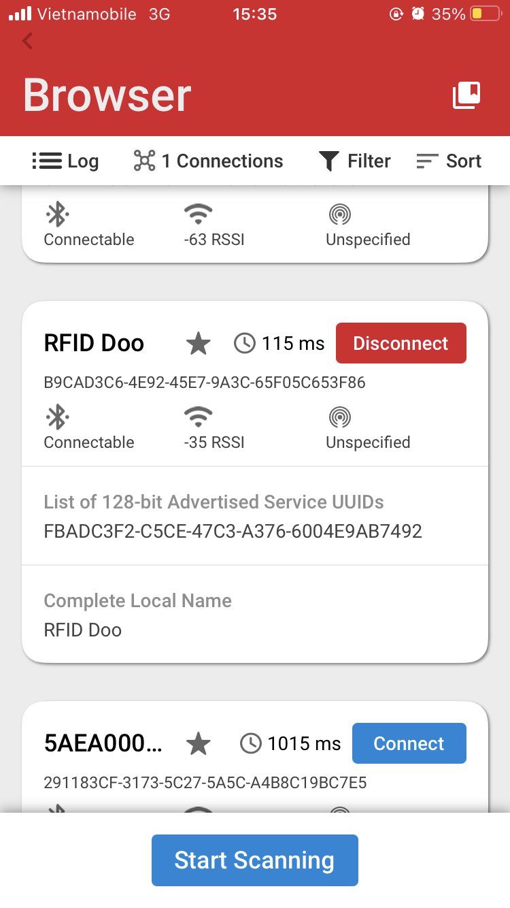 | 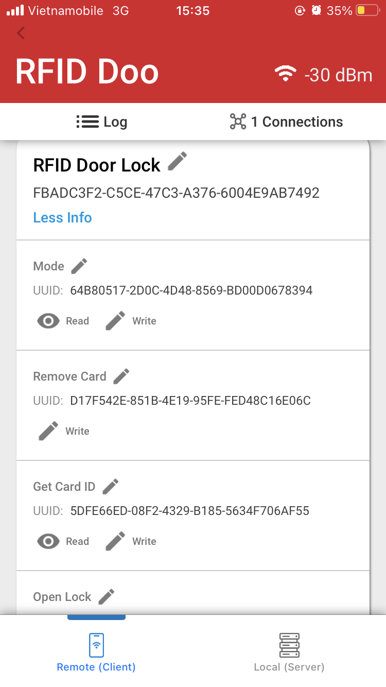||
| - | - | -|

#### Read/Write characteristics ####

The parameters of this example application can be easily configured via BLE characteristics. Values for the characteristics are handled by the application as ASCII strings. Tap on the main service to see the available characteristics. Please refer [GATT Configurator](#gatt-configurator) to choose the correct characteristic.
**Read**

Push the read button to request the value of a characteristic. (See ASCII fields.)
**Write**

For setting a parameter select a characteristic and tap on its write button. Type a new value in the ASCII field and push the **Send** button.
