# RFID Door Lock (ID-12LA) with BLE #

## Summary ##

This project aims to implement a doorlock system using Silabs development kits and external sensors integrated with the BLE wireless stack.

The block diagram of this application is shown in the image below:

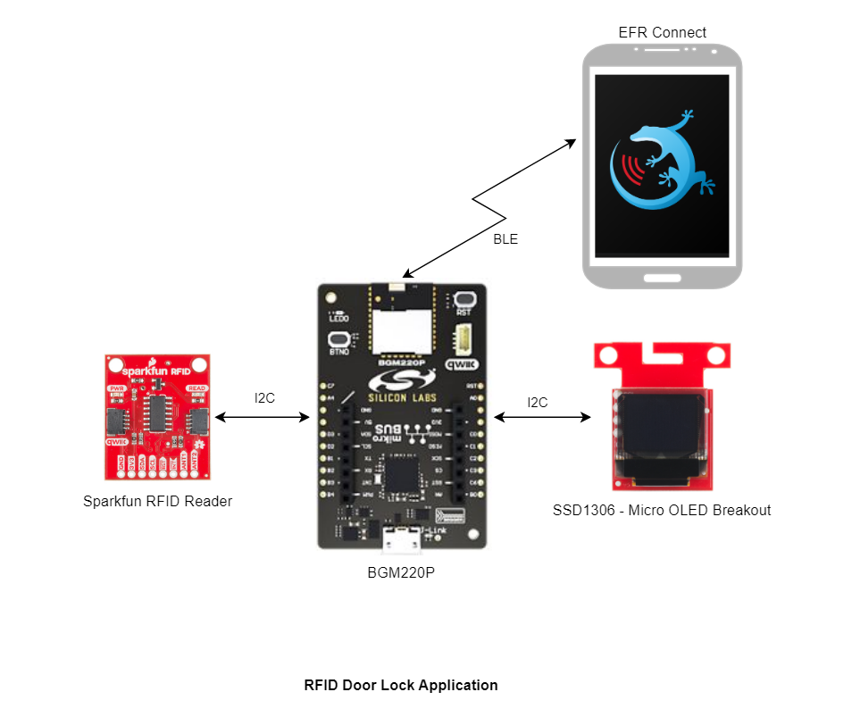

More detailed information can be found in the section [How it works](#how-it-works).

This code example referred to the following code examples. More detailed information can be found here:`

- [OLED SSD1306 driver](https://github.com/SiliconLabs/third_party_hw_drivers_extension/blob/master/driver/public/mikroe/oledw_ssd1306)
- [Bluetooth security feature](https://github.com/SiliconLabs/bluetooth_stack_features_staging/tree/master/security)
- [SparkFun RFID Qwiic Kit - ID12LA driver](https://github.com/SiliconLabs/third_party_hw_drivers_extension/blob/master/driver/public/silabs/rfid_id12la)

## Required Hardware ##

- [BGM220 Bluetooth Module Explorer Kit](https://www.silabs.com/development-tools/wireless/bluetooth/bgm220-explorer-kit)

- [SparkFun RFID Qwiic Kit - ID12LA Board](https://www.sparkfun.com/products/15209)

- [OLED Display - SSD1306](https://www.sparkfun.com/products/14532)

## Hardware Connection ##

The hardware connection is shown in the image below:

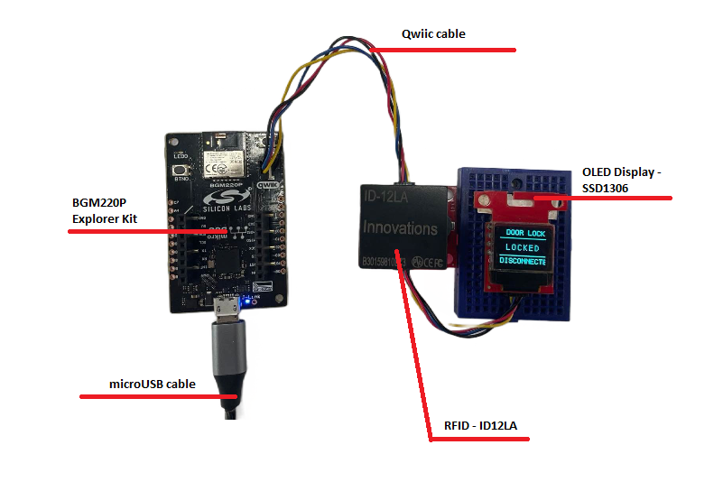

The I2C connection is made from the BGM220 Bluetooth Module Explorer Kit to the RFID board and the Micro OLED Breakout by using the qwiic cable.

## Setup ##

To test this application, you can either import the provided bluetooth_doorlock_rfid.sls project file or start with an empty example project as the following:

1. Create an "Bluetooth - SoC  Empty" for the "BGM220 Explorer Kit Board" using Simplicity Studio v5. Use the default project settings.

2. Copy all attached files in *inc* and *src* folders into the project root folder (overwriting existing app.c).

3. Install the software components:

    - Open the .slcp file in the project.

    - Select the SOFTWARE COMPONENTS tab.

    - Install the following components for device:

        - [Services] → [Sleep Timer]
        - [Services] →  [NVM3] → NVM3 Core
        - [Services] →  [NVM3] → NVM3 Default Instance
        - [Services] → [IO Stream] → [IO Stream: USART] → default instance name: vcom
        - [Application] → [Utility] → [Log]
        - [Application] → [Utility] → [Assert]
        - [Third Party Hardware Drivers] →  [Display & LED] → [SSD1306 - Micro OLED Breakout (Sparkfun) - I2C]
        - [Third Party Hardware Drivers] → [Service] → [GLIB - OLED Graphics Library]
        - [Third Party Hardware Drivers] → [Wireless Connectivity] → [ID-12LA - RFID Reader (Sparkfun) - I2C]

4. Import the GATT configuration:

   - Open the .slcp file in the project.

   - Select the **CONFIGURATION TOOLS** tab and open the **Bluetooth GATT Configurator**.

   - Click on the Import button and import the attached [gatt_configuration.btconf](config/gatt_configuration.btconf) file.

   - Save the GATT configuration (ctrl-s).

5. Build and flash this example to the board.
Note:

- The example projects above are built on the BRD4314A board. So users should add the BRD4314A to MyProducts to able be see them on the Launcher Home of Simplicity Studio IDE.

- Once an example project is generated, a Readme file under the Markdown format should be opened in the Simplicity IDE perspective. This is a file containing information about the example project. Users can follow it.

Note:

- The example projects above are built on the BRD4314A board. So users should add the BRD4314A to MyProducts to able be see them on the Launcher Home of Simplicity Studio IDE.

- Once an example project is generated, a Readme file under the Markdown format should be opened in the Simplicity IDE perspective. This is a file containing information about the example project. Users can follow it.

## How it Works ##

### Application overview ###

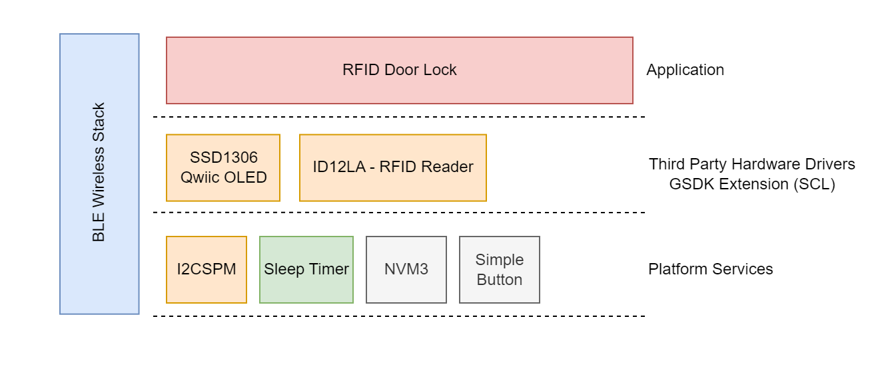

### GATT Configurator ###

The application is based on the Bluetooth - SoC Empty example. Since the example already has the Bluetooth GATT server, advertising, and connection mechanisms, only minor changes are required.

The GATT changes were adding a new custom service (RFID Door Lock) which are 4 characteristics:

- **Mode**:

  - [**Readable**] - Get mode value

  - [**Writable**] - Set operation mode (0 - normal, 1 - register, remove, 2 - show)

- **Remove Card**:

  - [**Writable**] - Provide card slot id to remove it from the registered cards.

- **Get card ID**:

  - [**Readable**] - Get selected card's ID
  - [**Writable**] - Set selected card slot (default is 0).

- **Open Lock**:

  - [**Writable**] - Write 1 to open the lock.

### Doorlock Implementation ###

#### Application initialization ###

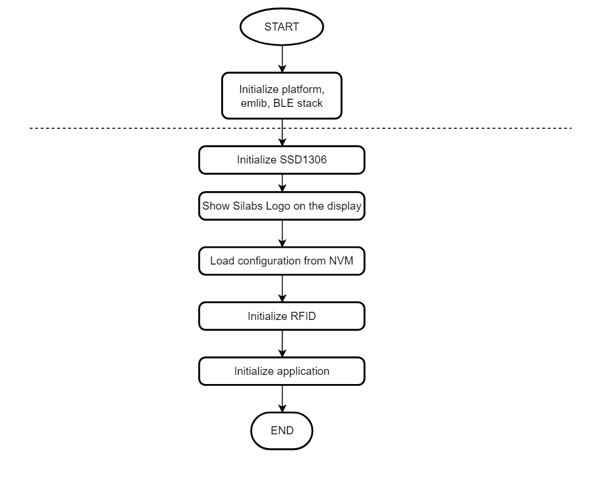  

#### Application Workflows ####

1. Initialize the peripherals, the Bluetooth stack

2. Initialize the OLED display, show Silabs Logo on the screen

3. Initialize and load the NVM3 configurations

4. Wait for the sensor is booted and initialize the sensor with the configurations from NVM3:

5. Initialize RFID

6. Initialize application

7. After the *sl_bt_evt_system_boot_id* event arrives, App sets up the security manager to bond with an iOS/Android device. And then start advertising.

8. Handle GATT event to help user configure the [Use EFR Connect Mobile Application](#use-efr-connect-mobile-application) and get the result from the algorithm calculation over the *EFR32 connect* mobile app

#### Application logic ####

|  | 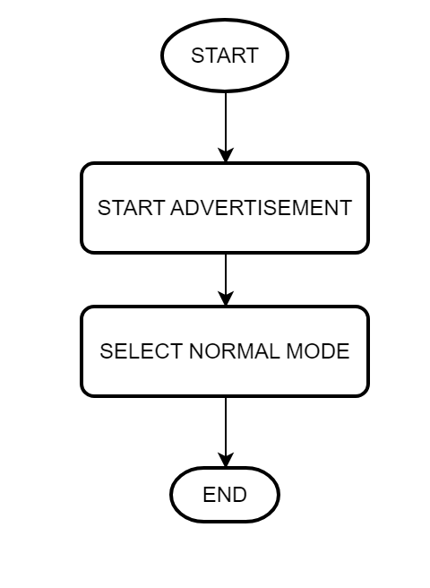||
| - | - | -|

#### Normal Mode 0 ####
  
  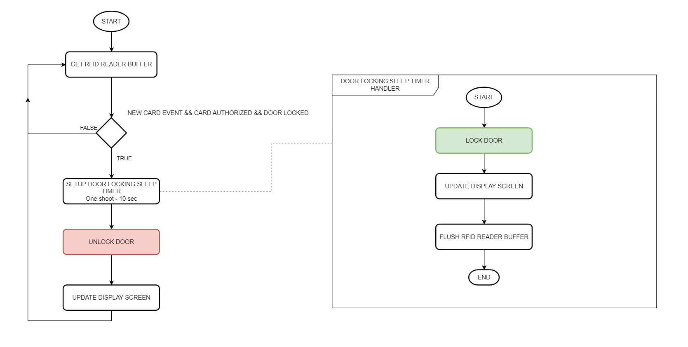

#### Configuration Mode 1 - Register Card/Remove Card ####
  
  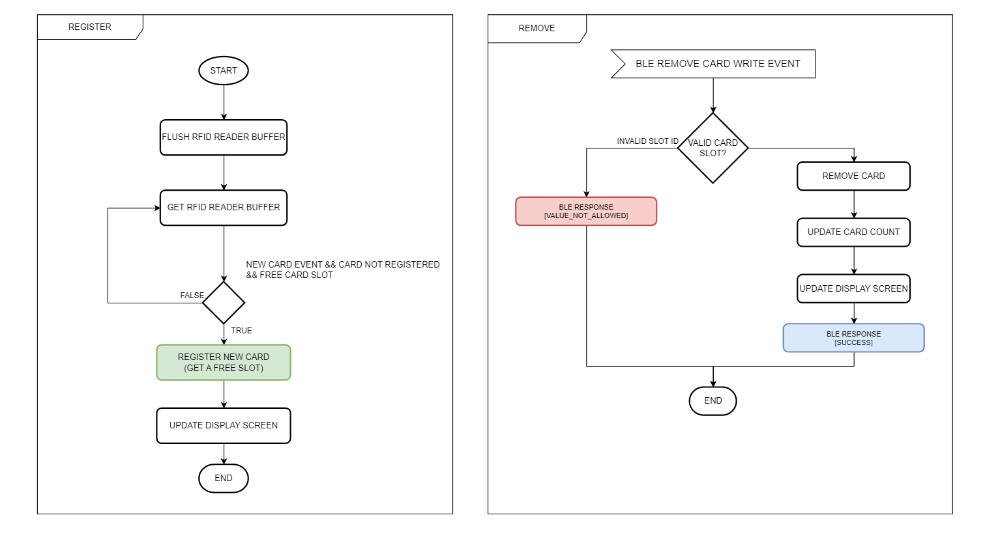

#### NConfiguration Mode 2 - Show Registered Cards ####
  
  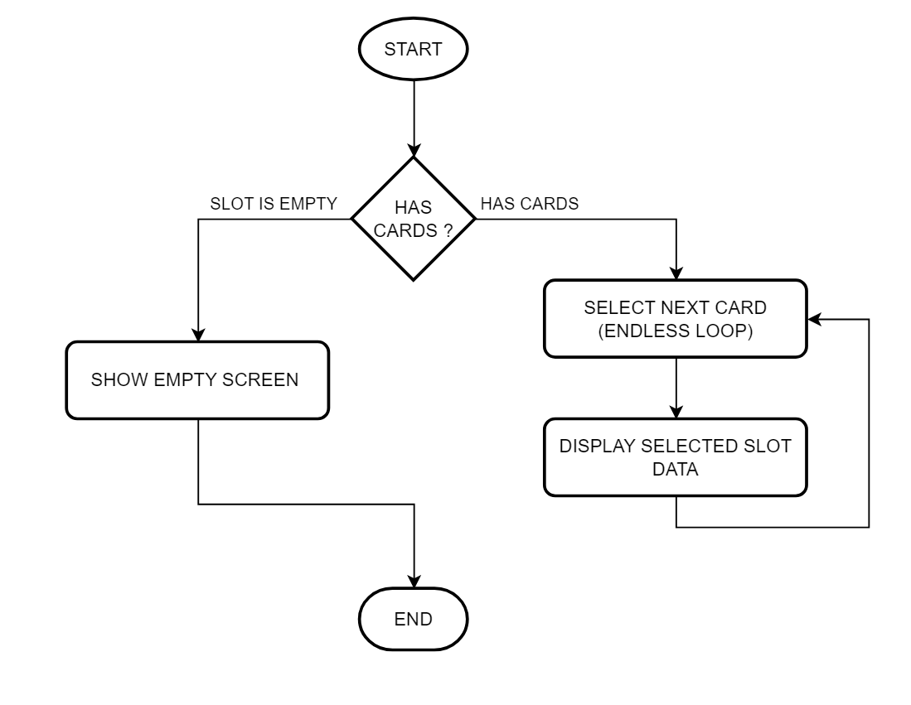

### Display on OLED ###

#### Normal mode ####

- Show LOCKED/UNLOCKED label
- LOCKED
  - Show BLE connection status
- UNLOCKED
  - RFID Card
    - Show the used card's ID
  - BLE
    - Show CONNECTED label

#### Configuration mode 1 - Register/Remove ####

- Show CONFIG label
- Show number of registered cards (max. 10)

#### Remove ####

    - Show REMOVED label
    - Show number of registered cards (max. 10)

#### Adding new card ####

    - Show ADDED label
    - Show added/removed card's ID

#### Configuration mode 2 - Show Cards ####

- Has registered cards
  - Show each slot data for 4 seconds
    - Show slot index.
    - Show card ID
- Card slot is empty
  - Show NO CARDS and "-" labels

Below are illustrations for each case

  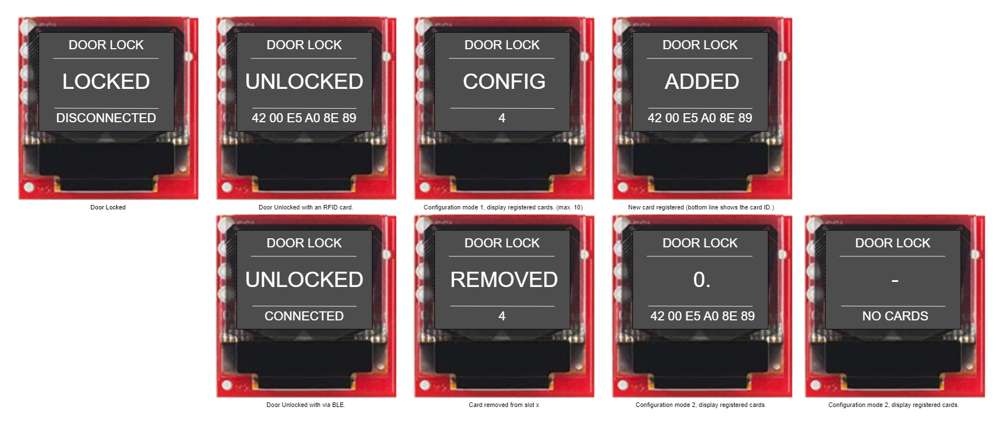

### Use EFR Connect Mobile Application ###

#### Connect to the device ####

The Silicon Labs EFR Connect application utilizes the Bluetooth adapter on your phone/tablet to scan, connect and interact with BLE devices. To run this example, an iOS or Android smartphone with the EFR Connect app installed is required.

Open the EFR Connect application on your smartphone and allow the permission request when opened for the first time. Click [Develop] -> [Browser] and you will see a list of nearby devices which are sending Bluetooth advertisements. Find the one named *People Counting* and click the connect button on the right side. If app show the pairing request dialog, press **Pair** button to confirm authentication for the pairing process. After that, wait for the connection to be established and the GATT database to be loaded.

**Note**: The pairing process on Android and iOS devices is different. For more information, refer to bluetooth security.

| 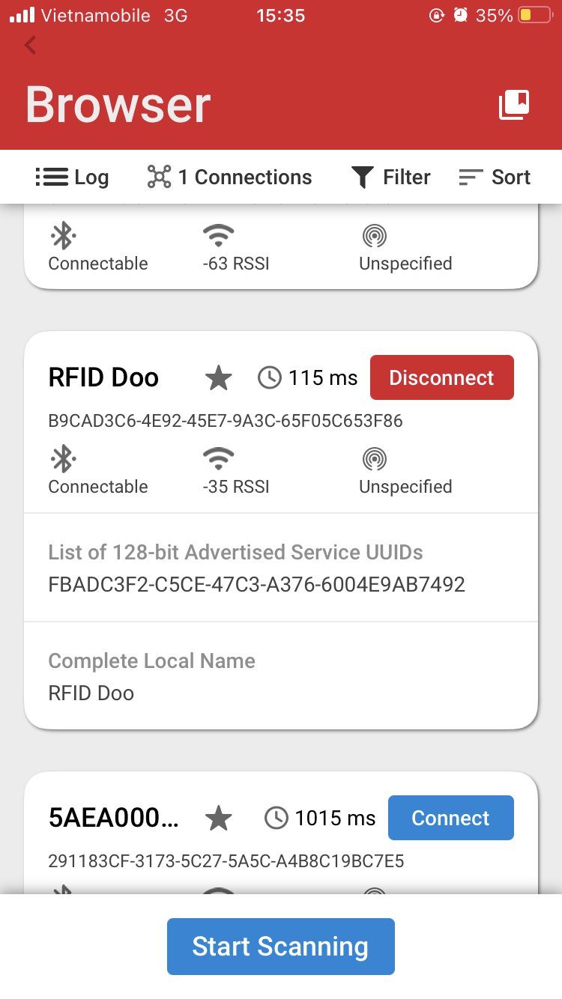 | 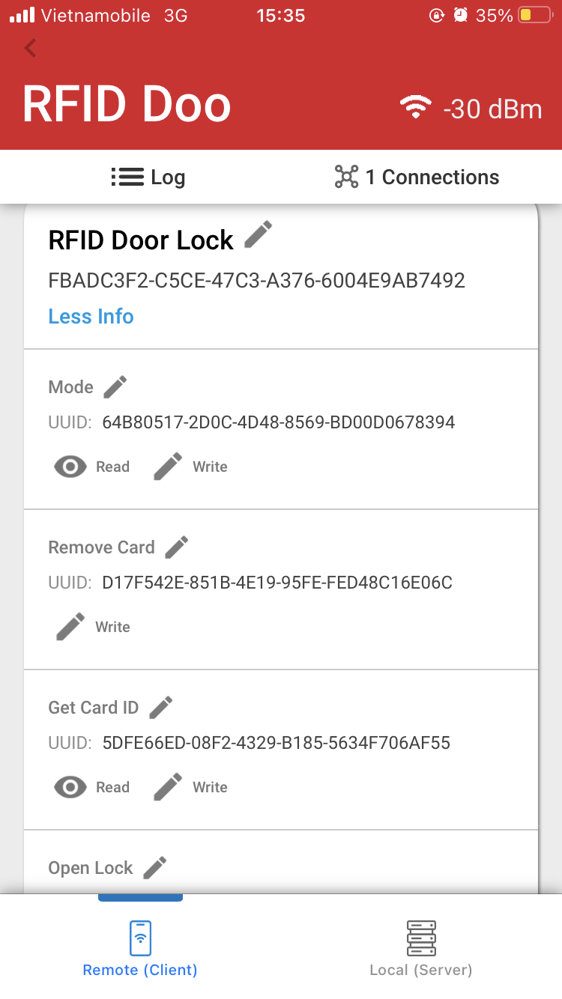||
| - | - | -|

#### Read/Write characteristics ####

The parameters of this example application can be easly configured via BLE characteristics. Values for the characteristics are handled by the application as ASCII strings. Tap on the main service to see the available characteristics. Please refer [GATT Configurator](#gatt-configurator) to choose correct characteristic.
**Read**

Push read button to request the value of a characteristic. (See ASCII fields.)
**Write**

For setting a parameter select a characteristic and tap on its write button. Type a new value in the ASCII field and push the **Send** button.

## Report Bugs & Get Support ##

To report bugs in the Application Examples projects, please create a new "Issue" in the "Issues" section of [third_party_hw_drivers_extension](https://github.com/SiliconLabs/third_party_hw_drivers_extension) repo. Please reference the board, project, and source files associated with the bug, and reference line numbers. If you are proposing a fix, also include information on the proposed fix. Since these examples are provided as-is, there is no guarantee that these examples will be updated to fix these issues.

Questions and comments related to these examples should be made by creating a new "Issue" in the "Issues" section of [third_party_hw_drivers_extension](https://github.com/SiliconLabs/third_party_hw_drivers_extension) repo.
