# Dosimeter with BLE

## Summary

This project aims to implement a dosimeter application using Silabs development kits and external sensors integrated with the BLE wireless stack.

The block diagram of this application is shown in the image below:

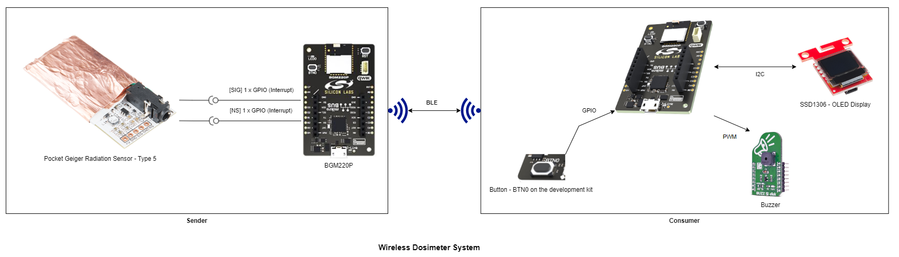

The wireless dosimeter system composed of a sender and a (at least one) consumer device. The sender device continuously monitors the ambient radiation and calculates it in uSv/h unit.

**Sender:**

This device broadcasts the calculated ambient radiation level in the advertisement package.  A timestamp (a simple counter) value included in the advertisement pack to indicate that a new radiation event occurred and the calculated radiation value is updated.

The counter (timestamp) value provides trigger for the consumer to notify the user about the radiation. (e.g.: activate a buzzer).  The sender device also provides characteristics to read the calculated ambient radiation and get explicitly notified about the radiation events.

**Consumer:**

The consumer device scans periodically the BLE network. Once it found the sender device, it tries to connect to it and read the radiation characteristic and show the radiation level on the connected OLED display. Optionally it can produce a "click" noise by activating the buzzer, to notify the user about the radiation event. Consumer device subscribes to the radiation characteristic to get notifications about changes in the measured radiation level.

Note: Any other BLE capable device can be a consumer device, (e.g.: like a simple mobile phone).

## Hardware Required

**Sender:**

- [BGM220 Bluetooth Module Explorer Kit - BGM220-EK4314A](https://www.silabs.com/development-tools/wireless/bluetooth/bgm220-explorer-kit)

- [Pocket Geiger Radiation Sensor - Type 5](https://www.sparkfun.com/products/14209)

**Consumer:**

- [BGM220 Bluetooth Module Explorer Kit - BGM220-EK4314A](https://www.silabs.com/development-tools/wireless/bluetooth/bgm220-explorer-kit)

- [OLED Display - SSD1306](https://www.sparkfun.com/products/14532)

- [Buzzer 2 Click Board](https://www.mikroe.com/buzz-2-click)

## Connections Required

The hardware connection is shown in the image below:

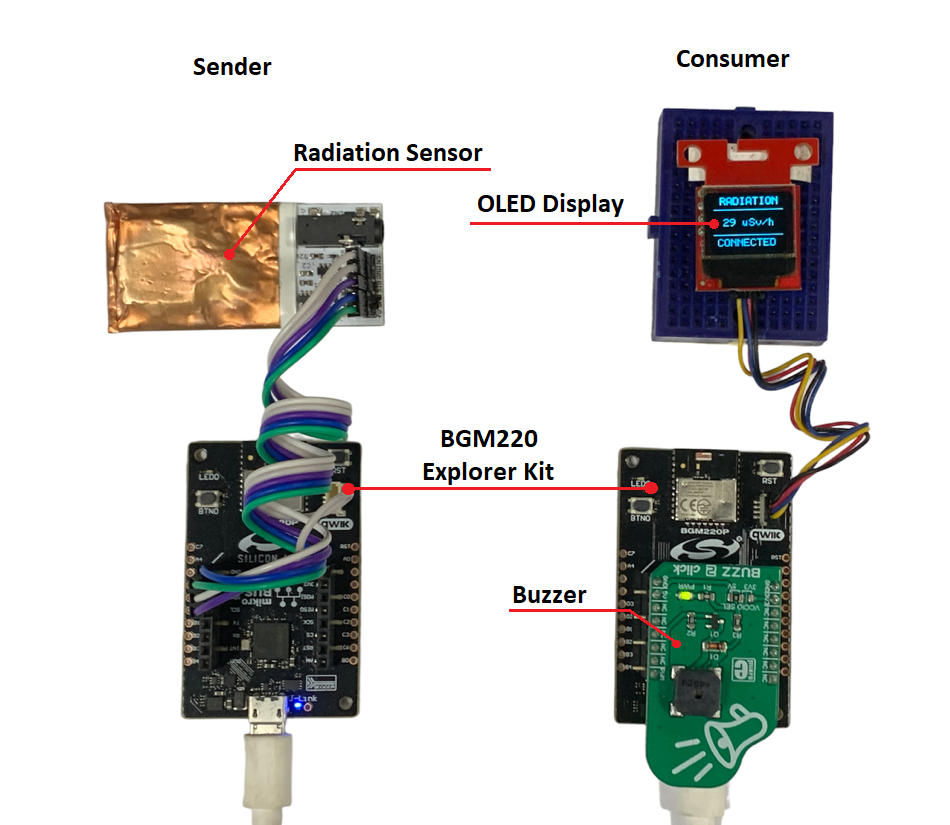

**Sender:**

Users can use some [Wire Jumpers Male to Male](https://www.mikroe.com/wire-jumpers-male-to-male-15cm-10pcs) to connect between the BGM220 Bluetooth Module Explorer Kit and the Pocket Geiger Radiation Sensor as shown below.

| Explorer Kit markings     |  Pocket Geiger Radiation Sensor markings |
|---------------------------|:----------------------------------------:|
|   GND                     |        GND                               |
|   PD03 - SDA              |        SN                                |
|   PD02 - SCL              |        SIG                               |
|   5V                      |        +V                                |

**Consumer:**

The Sparkfun OLED Display board can be easily connected to the BGM220 Bluetooth Module Explorer Kit by using a Qwiic cable. The Buzzer 2 Click connects to the BGM220 Bluetooth Module Explorer kit using SPI protocol via mikroe connection.

## Setup

You can either import the provided bluetooth_thermostat.sls project file or start with an empty example project as the following:

1. Create an "Bluetooth - SoC  Empty" for the "BGM220 Explorer Kit Board" using Simplicity Studio v5. Use the default project settings.

2. copy all the .h and .c files in the following directory into the project root folder (overwriting existing file).

    - With **sender** device: [bt_dosimeter_sender](../../../example/bluetooth_dosimeter/bt_dosimeter_sender)

    - With **consumer** device: [bt_dosimeter_consumer](../../../example/bluetooth_dosimeter/bt_dosimeter_consumer)

3. Install the software components:

    - Open the .slcp file in the project.

    - Select the SOFTWARE COMPONENTS tab.

    - Install the following components for **sender** device:

        - [Services] → [Sleep Timer]
        - [Services] → [IO Stream] → [IO Stream: USART] → default instance name: vcom
        - [Application] → [Utility] → [Log]
        - [Application] → [Utility] → [Assert]
        - [Third Party] → [Tiny printf]
        - [Third Party Hardware Drivers] → [Sensors] → [Type 5 - Poket Geiger Radiation (Sparkfun)]

    - Install the following components for **consumer** device:

        - [Services] → [Sleep Timer]
        - [Services] →  [NVM3] → NVM3 Core
        - [Services] →  [NVM3] → NVM3 Default Instance
        - [Services] → [IO Stream] → [IO Stream: USART] → default instance name: vcom
        - [Application] → [Utility] → [Log]
        - [Application] → [Utility] → [Assert]
        - [Third Party] → [Tiny printf]
        - [Platform] → [Driver] → [Button] → [Simple Button] → default instance name: btn0
        - [Platform] → [Driver] → [I2C] → [I2CSPM] → default instance name: qwiic
        - [Platform] → [Driver] → [PWM] → [PWM] → default instance name: mikroe
        - [Third Party Hardware Drivers] → [Display & LED] → [SSD1306 - Micro OLED Breakout (Sparkfun) - I2C]
        - [Third Party Hardware Drivers] → [Audio & Voice] → [CMT_8540S_SMT - Buzz 2 Click (Mikroe)]
        - [Third Party Hardware Drivers] → [Services] → [GLIB - OLED Graphics Library]

4. Import the GATT configuration:

    - Open the .slcp file in the project again.
    - Select the CONFIGURATION TOOLS tab and open the "Bluetooth GATT Configurator".
    - Find the Import button and import the  gatt_configuration.btconf file.
        - Sender: [gatt_configuration.btconf](../../../example/bluetooth_dosimeter/bt_dosimeter_sender/gatt_configuration.btconf)
        - Consumer: [gatt_configuration.btconf](../../../example/bluetooth_dosimeter/bt_dosimeter_consumer/gatt_configuration.btconf)
    - Save the GATT configuration (ctrl-s).

5. Build and flash this example to the board.

**Note:**

- Make sure the SDK extension already be installed. If not please follow [this documentation](https://github.com/SiliconLabs/third_party_hw_drivers_extension/blob/master/README.md).

- SDK Extension must be enabled for the project to install any components.

- The example project are built on the BRD4314A board. So users should add the BRD4314A to MyProducts to able be see them on the Launcher Home of Simplicity Studio IDE.

## How it Works

### Sender

#### Sender overview

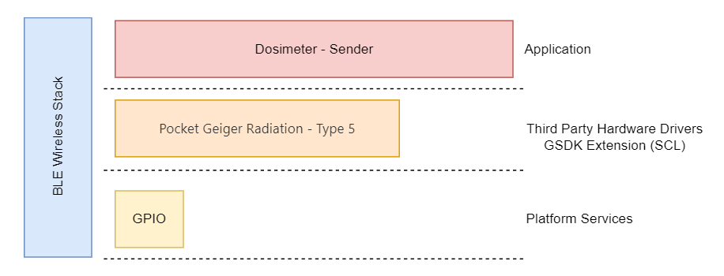

#### Sender GATT Database

- [Service] Dosimeter Sender

  - [Char] Radiation
    - [R] Get current radiation value (e.g.: 25 => 25 nSv/h)
    - [N] Notify subscriber

#### Sender Implementation

**Application initialization:**

**On Radiation Callback:**

This handler called when the driver calculates the current radiation level in every configured process period time.

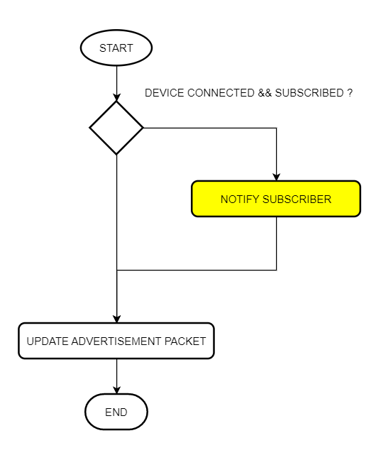

**Advertisement Packet:**

AdvData field in the advertisement packet is as table below:

| DeviceName | DataCounter | RadiationLevel |
|-----|-----|-----|
| DM_SENDER | 4 byte | 4 byte |

- DataCounter: This counter starts from 0, and incremented by 1 each time the advertisement packet content is updated. (Each invocation of the onRadiation event callback.)
- RadiationLevel: Radiation level in nSv/h unit
- Device is not connectable. It sends [manufacturer specific advertisement](https://github.com/SiliconLabs/bluetooth_stack_features/tree/master/advertising/advertising_manufacturer_specific_data) packets.

### Consumer

#### Consumer overview

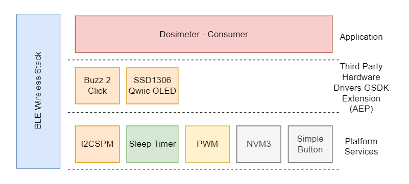

#### Consumer GATT Database

Advertisement Packet
Device name: DM_CONSUMER

GATT Database

- Device name: DM_CONSUMER

- **[Service]** Dosimeter Consumer
  - **[Char]** Alarm Threshold
    - **[R]** Get alarm threshold value
    - **[W]** Set alarm threshold value - alarm_threshold (e.g.: 25 => 25 nSv/h)
  - **[Char]** Notification Status
    - **[R]** Get Notification Sound Status
    - **[W]** Set Notification Sound Status value - notification_status (0 - disabled, 1 - enabled)
  - **[Char]** Click Noise Status
    - **[R]** Get Click Noise Status
    - **[W]** Set Click Noise Status  value - click_noise_status(0 - disabled, 1 - enabled)

#### Consumer Implementation

**Application initialization:**

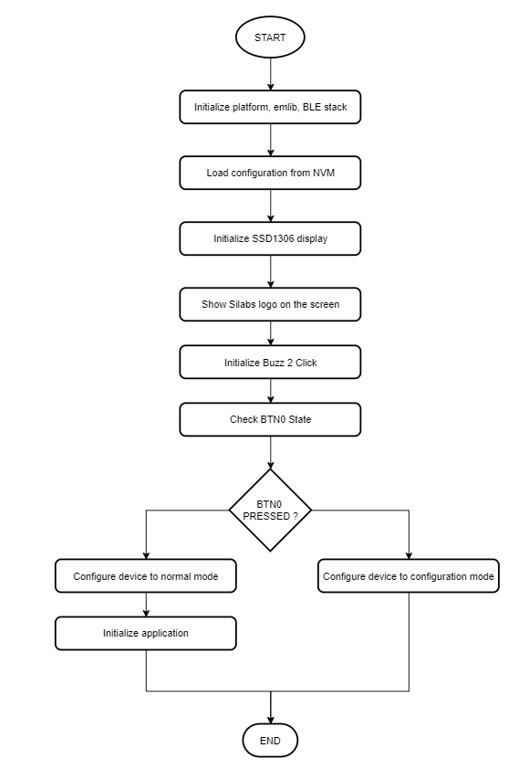

**Runtime - Configuration Mode:**

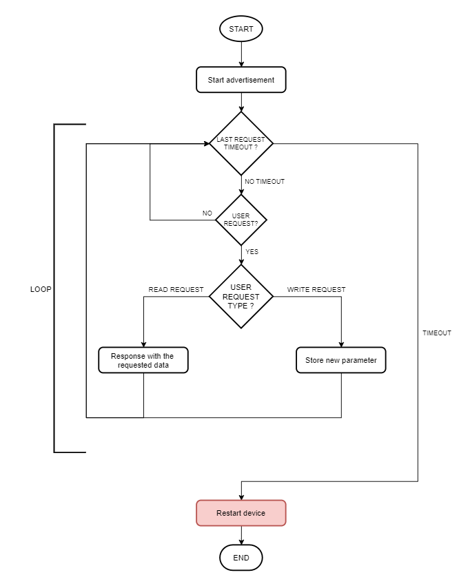

**Runtime - Normal Mode:**

*Consumer events:*

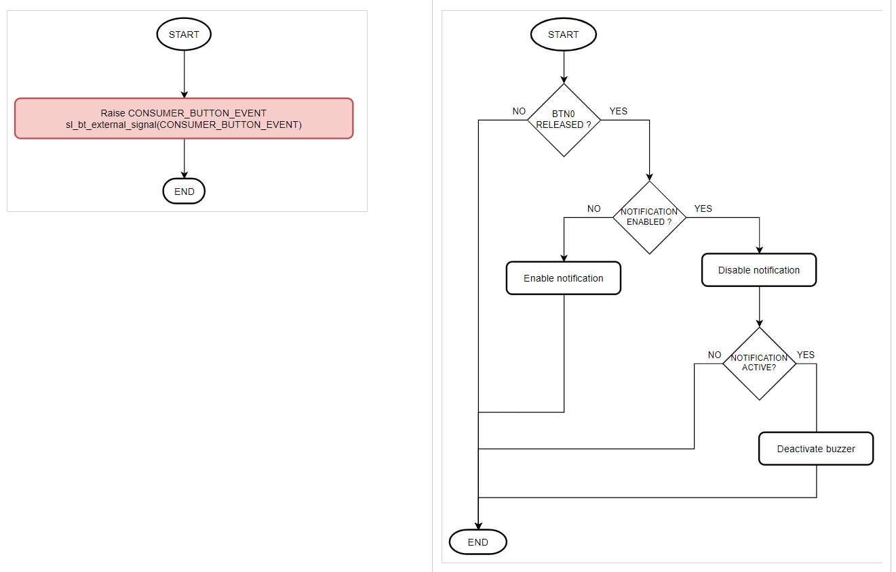

*Logic blocks:*

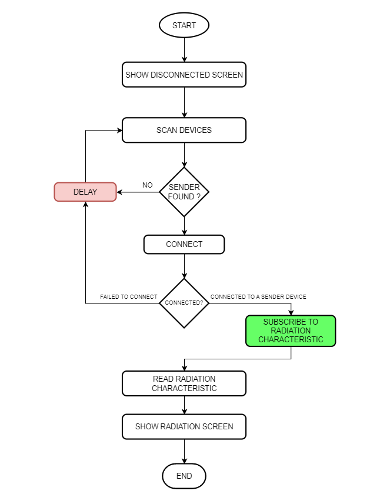

*Radiation Characteristic Notification Event:*

**Display:**

If the consumer is in the configuration mode, the OLED will display **config mode**.

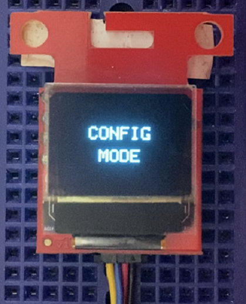

If the consumer device is not connected to sender device, the OLED will display **disconnected**

The application shows the received current radiation value on the display in nSv/h or uSv/h unit depending on the measured radiation level.

- \< 1 uSv/h => nSv/h (no decimals)
- \>=  1 uSv/h => uSv/h (2 decimals)

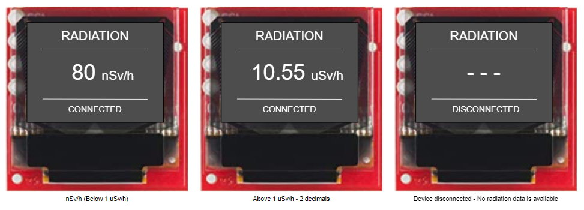

### Testing

**Sender:**

You can use a smart phone app such as the EFR Connect app, to see the advertising packet from the Sender.

- Open the EFR Connect app.

- Open the Bluetooth Browser.

- Find the device advertising as DM_CONSUMER.

- Click on the instance of DM_CONSUMER. Now, you should see the counter and the radiation value on the Manufacturer Specific Data row. Please have a look at the red highlighted area below in the result pictures.

    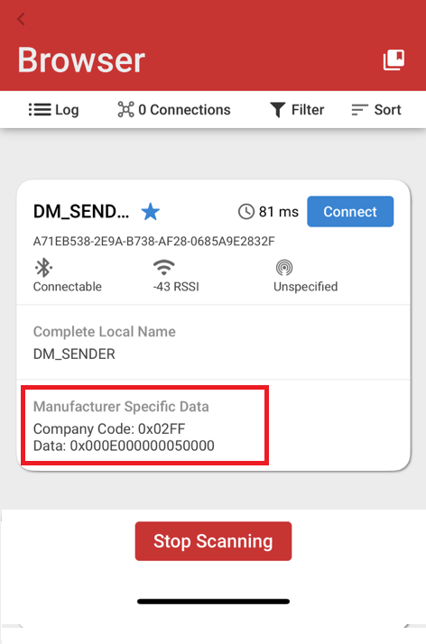

- After a connection is established, a similar output from serial terminal as shown below

    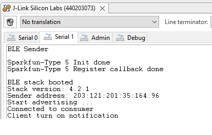

**Consumer:**

- Upon reset, the application will display the Silicon Labs logo on the OLED screen for a few seconds.

- After the firmware is configured, the device starts in normal mode. In this state, it starts Sanning/Discovering advertising devices. It initiates a connection with those devices that contain the DM_SENDER name in their advertising packets.

- After a connection is established, the consumer discovers the service by UUID from the remote GATT database. After the service discovery is completed, the consumer discovers the radiation characteristics and enables notification sent from a remote GATT sender. The application shows the received current radiation value on the display.

- Open your terminal emulator and connect to your consumer device over its serial port. Set baud rate to 115200. A similar output as below.

    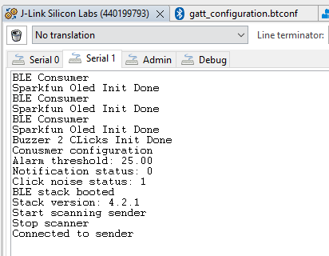

- **Note:** Button PB0 should be pressed during startup (power-on or reset) to run the consumer in Configuration Mode. The terminal will display infomation as below and the Oled will also display "CONFIG MODE".

    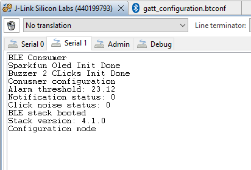

## Report Bugs & Get Support

To report bugs in the Application Examples projects, please create a new "Issue" in the "Issues" section of [third_party_hw_drivers_extension](https://github.com/SiliconLabs/third_party_hw_drivers_extension) repo. Please reference the board, project, and source files associated with the bug, and reference line numbers. If you are proposing a fix, also include information on the proposed fix. Since these examples are provided as-is, there is no guarantee that these examples will be updated to fix these issues.

Questions and comments related to these examples should be made by creating a new "Issue" in the "Issues" section of [third_party_hw_drivers_extension](https://github.com/SiliconLabs/third_party_hw_drivers_extension) repo.