# Bluetooth - Dosimeter (Sparkfun Type 5) #

[-green)](https://www.sparkfun.com/products/14532)

## Overview ##

This project aims to implement a dosimeter application using Silicon Labs development kits and external sensors integrated with the BLE wireless stack.

The block diagram of this application is shown in the image below:

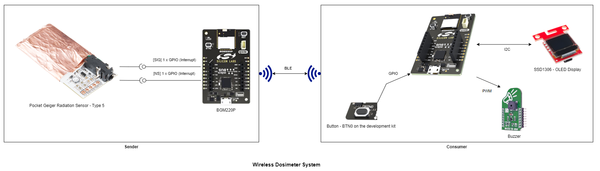

The wireless dosimeter system is composed of a sensor and a (at least one) client device. The sensor device continuously monitors the ambient radiation and calculates it in uSv/h unit and then reports this value to a client device via BLE (Bluetooth Low Energy).

**Sensor:**

This device broadcasts the calculated ambient radiation level in the advertisement package. A timestamp (a simple counter) value is included in the advertisement pack to indicate that a new radiation event occurred and the calculated radiation value is updated.

The counter (timestamp) value provides a trigger for the client to notify the user about the radiation. (e.g.: activate a buzzer). The sensor device also provides characteristics to read the calculated ambient radiation and get explicitly notified about the radiation events.

**Client:**

The client device scans periodically the BLE network. Once the sensor device is found, the client device tries to connect to it and read the radiation characteristic and show the radiation level on the connected OLED display. Optionally it can produce a "click" noise by activating the buzzer, to notify the user about the radiation event. The client device subscribes to the radiation characteristic to get notifications about changes in the measured radiation level.

Note: Any other BLE capable device can be a client device, (e.g.: a simple mobile phone).

## SDK version ##

- [SiSDK v2024.12.0](https://github.com/SiliconLabs/simplicity_sdk)
- [Third Party Hardware Drivers v4.1.0](https://github.com/SiliconLabs/third_party_hw_drivers_extension)

## Software Required ##

- [Simplicity Studio v5 IDE](https://www.silabs.com/developers/simplicity-studio)
- [Simplicity Connect Mobile App](https://www.silabs.com/developer-tools/simplicity-connect-mobile-app)

## Hardware Required ##

**Sensor:**

- 1x [Bluetooth Low Energy Development Kit](https://www.silabs.com/development-tools/wireless/bluetooth). For simplicity, Silicon Labs recommends the [BGM220-EK4314A](https://www.silabs.com/development-tools/wireless/bluetooth/bgm220-explorer-kit)

- 1x Pocket Geiger Radiation Sensor - Type 5

- 1x smartphone running the 'Simplicity Connect' mobile app

**Client:**

- 1x [Bluetooth Low Energy Development Kit](https://www.silabs.com/development-tools/wireless/bluetooth). For simplicity, Silicon Labs recommends the [BGM220-EK4314A](https://www.silabs.com/development-tools/wireless/bluetooth/bgm220-explorer-kit)

- 1x [SparkFun Micro OLED Breakout (Qwiic)](https://www.sparkfun.com/products/14532)

- 1x [Buzzer 2 Click Board](https://www.mikroe.com/buzz-2-click)

## Connections Required ##

The hardware connection is shown in the image below:

|**Sensor** | **Client**|
|:-------------------------:|:-------------------------:|
|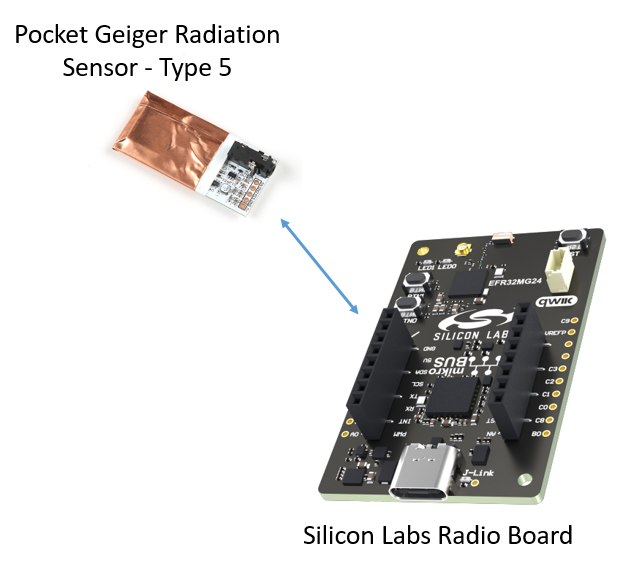 | 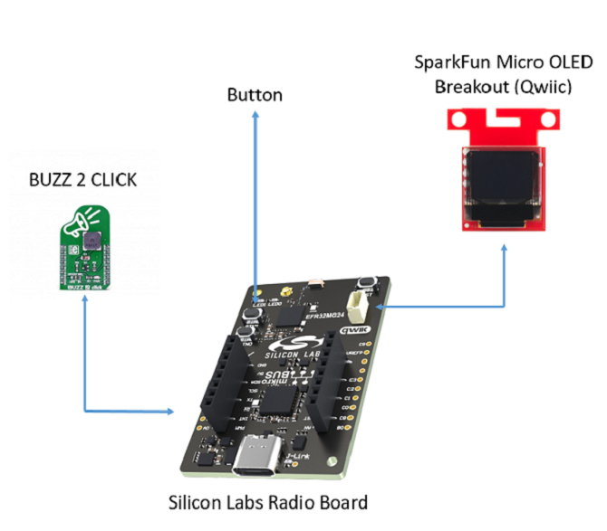|

The Sparkfun OLED Display board can be easily connected to these boards above by using a Qwiic cable while the Buzzer 2 Click connects to them using SPI protocol via a Mikroe connection.

**NOTE:** Please configure the sensor pin assignment as follows.

| Sparkfun Thing Plus Matter  | xG24 Explorer Kit  |BGM220P/BG22  Explorer Kit    |  Pocket Geiger Radiation Sensor markings |
|------------------------------|----------|---------------------------|----------------------------------------|
|5V                            |5V        |   5V                      |        +V                                |
|GND                           |GND       |   GND                     |        GND                               |
|PB01                    |PB01 - INT|   PB03 - INT              |        SIG                               |
|PB00                     |PD05 - RX |   PB02 - RX               |        SN                                |

## Setup ##

To test this application, you can either create a project based on an example project or start with a "Bluetooth - SoC Empty" project based on your hardware.

**NOTE**:

- Make sure that the [Third Party Hardware Drivers extension](https://github.com/SiliconLabs/third_party_hw_drivers_extension) is installed as part of the SiSDK and the [bluetooth_applications](https://github.com/SiliconLabs/bluetooth_applications) repository is added to [Preferences > Simplicity Studio > External Repos](https://docs.silabs.com/simplicity-studio-5-users-guide/latest/ss-5-users-guide-about-the-launcher/welcome-and-device-tabs).

- SDK Extension must be enabled for the project to install the required components.

### Create a project based on an example project ###

1. From the Launcher Home, add your hardware to MyProducts, click on it, and click on the EXAMPLE PROJECTS & DEMOS tab. Find the example project filtering by "dosimeter".

2. Click **Create** button on both **Bluetooth - Dosimeter (Sparkfun Type 5) - Sensor** and **Bluetooth - Dosimeter (Sparkfun Type 5) - Client** examples. Example project creation dialog pops up -> click Create and Finish and the projects will be generated.

    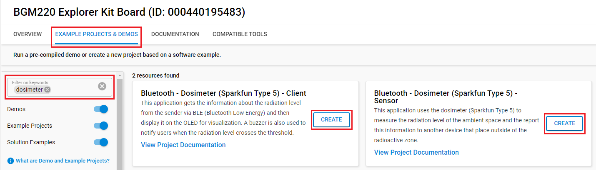

3. Build and flash the examples to the board.

### Start with a "Bluetooth - SoC Empty" project ###

1. Create **Bluetooth - SoC Empty** projects for your hardware using Simplicity Studio 5 (for both sensor and client devices).

2. Copy all attached files in *inc* and *src* folders into the project root folder (overwriting existing).

    - With **sensor** device: [bluetooth sensor device](https://github.com/SiliconLabs/bluetooth_applications/tree/master/bluetooth_dosimeter/bluetooth_dosimeter_sensor)
    - With **client** device: [bluetooth client device](https://github.com/SiliconLabs/bluetooth_applications/tree/master/bluetooth_dosimeter/bluetooth_dosimeter_client)

3. Import the GATT configuration:

    - Open the .slcp file in the project.

    - Select the **CONFIGURATION TOOLS** tab and open the **Bluetooth GATT Configurator**.

    - Find the Import button and import the attached gatt_configuration.btconf file.

        - With **sensor** device: [sensor gatt_configuration.btconf](https://github.com/SiliconLabs/bluetooth_applications/tree/master/bluetooth_dosimeter/bluetooth_dosimeter_sensor/config/btconf/gatt_configuration.btconf)
        - With **client** device: [client gatt_configuration.btconf](https://github.com/SiliconLabs/bluetooth_applications/tree/master/bluetooth_dosimeter/bluetooth_dosimeter_client/config/btconf/gatt_configuration.btconf)

    - Save the GATT configuration (ctrl-s).

4. Open the .slcp file. Select the **SOFTWARE COMPONENTS** tab and install the software components:

    - For **sensor** device:
        - [Services] → [Timers] → [Sleep Timer]
        - [Services] → [IO Stream] → [IO Stream: USART] → default instance name: **vcom**
        - [Application] → [Utility] → [Log]
        - [Application] → [Utility] → [Assert]
        - [Third Party] → [Tiny printf]
        - [Third Party Hardware Drivers] → [Sensors] → [Type 5 - Poket Geiger Radiation (Sparkfun)]

    - For **client** device:
        - [Services] → [Timers] → [Sleep Timer]
        - [Services] → [IO Stream] → [IO Stream: USART] → default instance name: **vcom**
        - [Application] → [Utility] → [Log]
        - [Application] → [Utility] → [Assert]
        - [Third Party] → [Tiny printf]
        - [Platform] → [Driver] → [Button] → [Simple Button] → default instance name: **btn0**
        - [Platform] → [Driver] → [I2C] → [I2CSPM] → default instance name: **qwiic**
        - [Platform] → [Driver] → [PWM] → [PWM] → default instance name: **mikroe**
        - [Third Party Hardware Drivers] → [Display & LED] → [SSD1306 - Micro OLED Breakout (Sparkfun) - I2C]
        - [Third Party Hardware Drivers] → [Audio & Voice] → [CMT_8540S_SMT - Buzz 2 Click (Mikroe)]
        - [Third Party Hardware Drivers] → [Services] → [GLIB - OLED Graphics Library]

5. Build and flash the project to your device.

**Note:**

- A bootloader needs to be flashed to your board if the project starts from the "Bluetooth - SoC Empty" project, see [Bootloader](https://github.com/SiliconLabs/bluetooth_applications/blob/master/README.md#bootloader) for more information.

## How it Works ##

### Sensor ###

#### Sensor overview ###

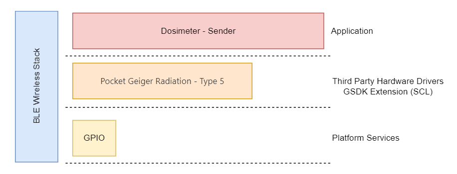

#### Sensor GATT Database ###

- [Service] Dosimeter Sensor

  - [Char] Radiation
    - [R] Get current radiation value (e.g.: 25 => 25 nSv/h)
    - [N] Notify subscriber

#### Sensor Implementation ###

**Application initialization:**

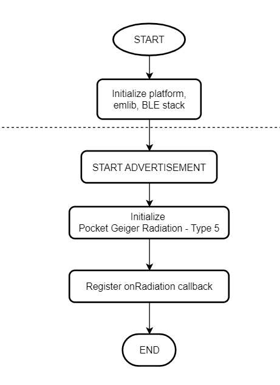

**On Radiation Callback:**

This handler is called when the driver calculates the current radiation level in every configured process period time.

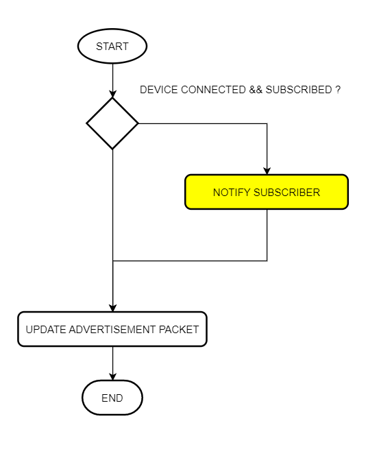

**Advertisement Packet:**

The AdvData field in the advertisement packet is as table below:

| DeviceName | DataCounter | RadiationLevel |
|-----|-----|-----|
| DM_SENSOR | 4 byte | 4 byte |

- DataCounter: This counter starts from 0, and incremented by 1 each time the advertisement packet content is updated (Each invocation of the onRadiation event callback).
- RadiationLevel: Radiation level in nSv/h unit.
- Device is not connectable. It sends [manufacturer specific advertisement](https://github.com/SiliconLabs/bluetooth_stack_features/tree/master/advertising/advertising_manufacturer_specific_data) packets.

### Client ###

#### Client overview ####

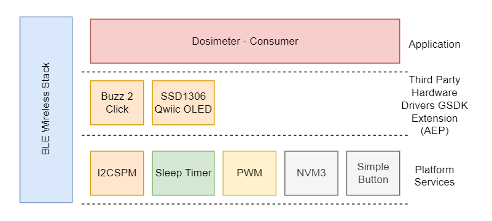

#### Client GATT Database ####

Advertisement Packet
Device name: DM_CLIENT

GATT Database

- Device name: DM_CLIENT

- **[Service]** Dosimeter client
  - **[Char]** Alarm Threshold
    - **[R]** Get alarm threshold value
    - **[W]** Set alarm threshold value - alarm_threshold (e.g.: 25 => 25 nSv/h)
  - **[Char]** Notification Status
    - **[R]** Get Notification Sound Status
    - **[W]** Set Notification Sound Status value - notification_status (0 - disabled, 1 - enabled)
  - **[Char]** Click Noise Status
    - **[R]** Get Click Noise Status
    - **[W]** Set Click Noise Status  value - click_noise_status(0 - disabled, 1 - enabled)

#### Client Implementation ####

**Application initialization:**

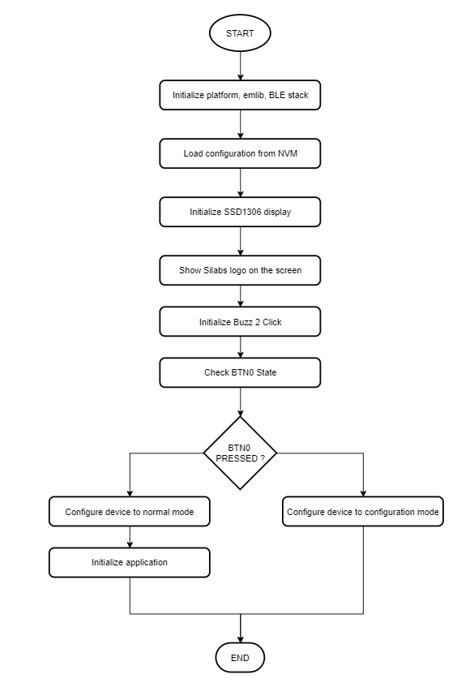

**Runtime - Configuration Mode:**

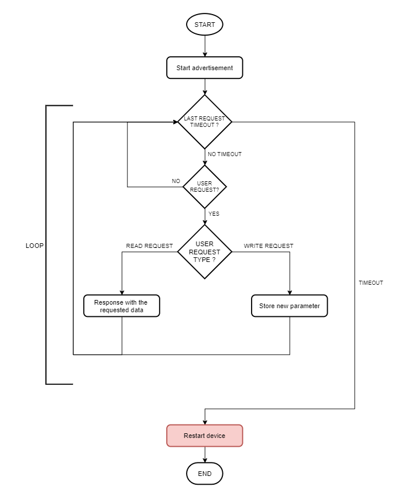

**Runtime - Normal Mode:**

*Client events:*

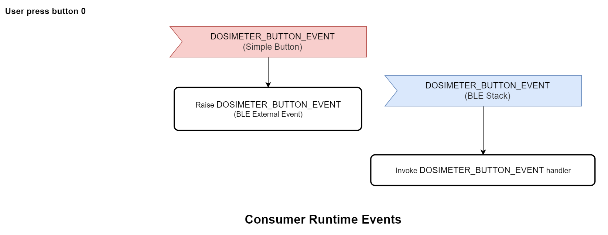

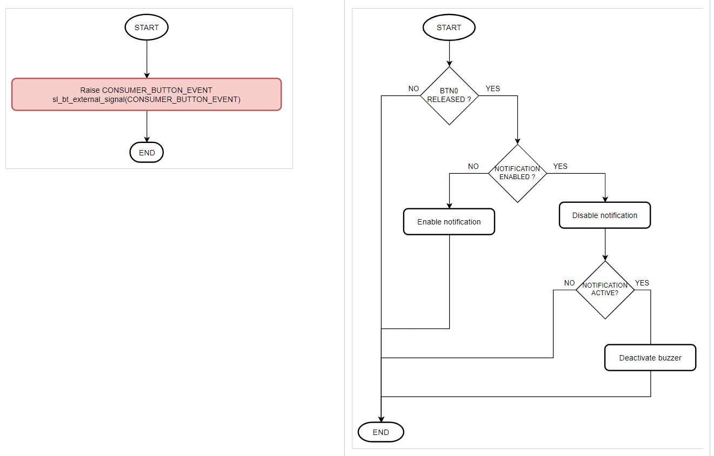

*Logic blocks:*

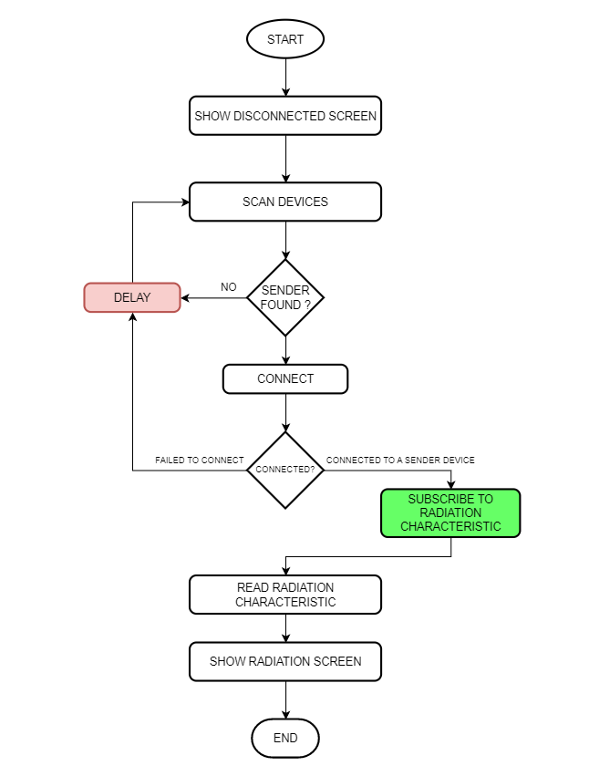

*Radiation Characteristic Notification Event:*

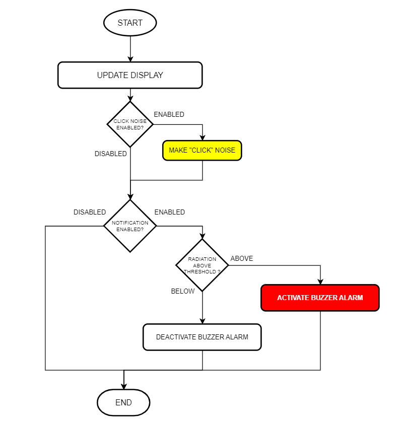

**Display:**

The OLED will display **config mode** and **disconnected** respectively if the client device is in the configuration mode and disconnected to sensor device.

|**Configuration Mode** | **Disconnected to sensor**|
|:-------------------------:|:-------------------------:|
|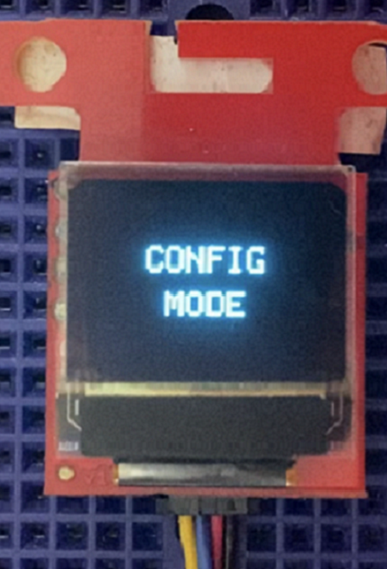 | |

The application shows the received current radiation value on the display in nSv/h or uSv/h unit depending on the measured radiation level.

- \< 1 uSv/h => nSv/h (no decimals)
- \>=  1 uSv/h => uSv/h (2 decimals)

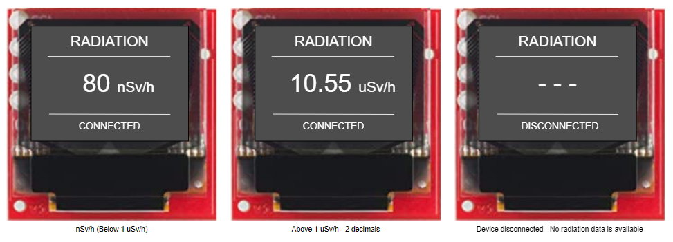

### Testing ###

**Sensor:**

Follow the below steps to test the Sensor with the Simplicity Connect application:

1. Open the Simplicity Connect app on your smartphone and allow the permission requested the first time it is opened.

2. Find your device in the Bluetooth Browser, advertising as *DM_SENSOR*.

- Click on the instance of **DM_SENSOR**. Now, you should see the counter and the radiation value on the Manufacturer Specific Data row. Please have a look at the red highlighted area below in the result pictures.

    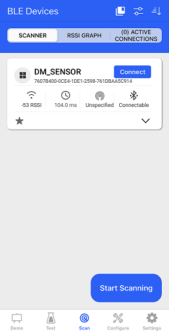

- After a connection is established, a similar output from a serial terminal as shown below

    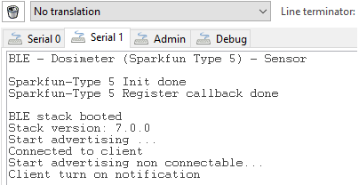

**Client:**

- Upon reset, the application will display the Silicon Labs logo on the OLED screen for a few seconds.

- Push the button 0 after reset the client device will make the device run into the **configuration** mode. In this mode, users can use the **Simplicity Connect** application to connect to the client device to change its operating configuration.

    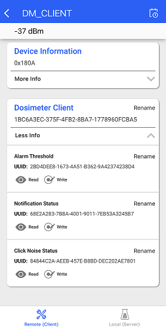

- After the firmware is configured, the device starts in normal mode. In this state, it starts Scanning/Discovering advertising devices. It initiates a connection with those devices that contain the DM_SENSOR name in their advertising packets.

- After a connection is established, the client discovers the service by UUID from the remote GATT database. After the service discovery is completed, the client discovers the radiation characteristics and enables notification sent from a remote GATT sensor. The application shows the received current radiation value on the display.

- Open your terminal emulator and connect to your client device over its serial port. Set the baud rate to 115200. A similar output as below.

    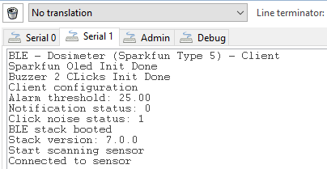

- **Note:** Button PB0 should be pressed during startup (power-on or reset) to run the client in Configuration Mode. The terminal will display information as below and the Oled will also display "**CONFIG MODE**".

    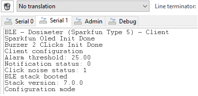
