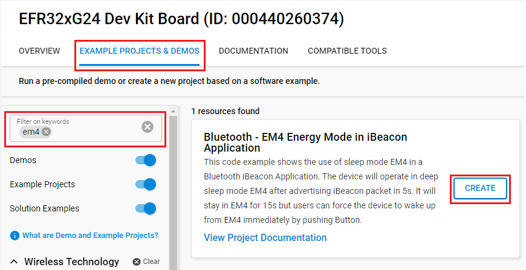
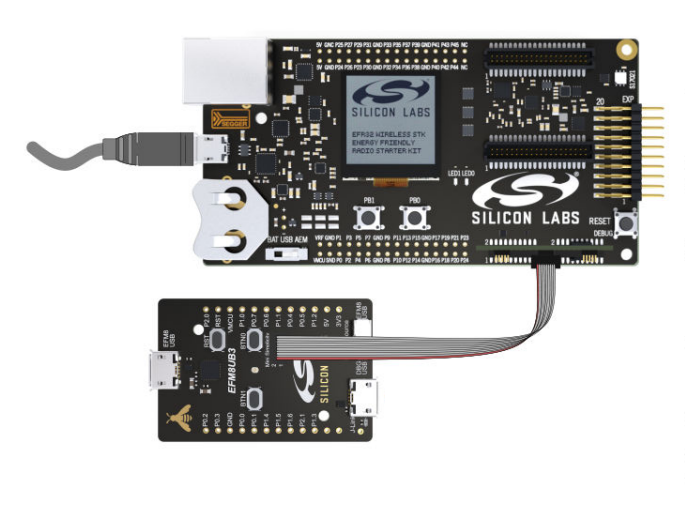
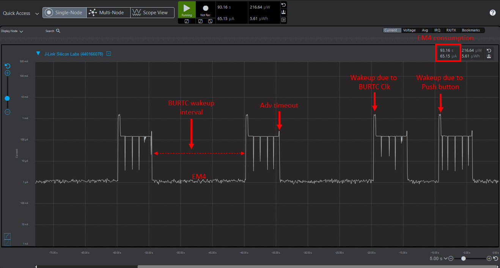

# Bluetooth - EM4 Energy Mode in iBeacon Application #


## Overview ##

This code example shows the use of sleep mode EM4 in a Bluetooth iBeacon Application. This example uses a Bluetooth iBeacon device, which operates in deep sleep mode EM4. When either the user interrupts the operation via a button, or the BURTC counter reaches the top value (15000 = 15 sec), the device exits from EM4 and advertises for 5 seconds before going back to EM4 again. BURTC counter resets every time the device exits from EM4.

Note that wake-up from EM4 is performed through a reset. Thus, no data is retained from the previous state, and the stack is reinitialized.

## Gecko SDK version ##

- GSDK v4.4.0

## Hardware Required ##

- A Silicon Labs compatible Kit.

**Note:**

- Users can use the Silicon Labs Explorer Kit or Development Kit instead of the WSTK. However, it requires an STK/WSTK Debug Adapter and there must be a mini Simplicity connector on this board.
- This project is tested only with the [EFR32xG24 Dev Kit](https://www.silabs.com/development-tools/wireless/efr32xg24-dev-kit?tab=overview)

## Connections Required ##

- Connect the EFR32xG24 Dev Kit to the PC through a micro USB cable.

## Setup ##

To test this application, you can either create a project based on an example project or start with a "Bluetooth - SoC Empty" project based on your hardware.

### Create a project based on an example project ###

1. From the Launcher Home, add your hardware to "My Products", click on it, and click on the EXAMPLE PROJECTS & DEMOS tab. Find the example project with filter "EM4".

2. Click **Create** button on both **Bluetooth - Using EM4 Energy Mode in Bluetooth iBeacon App** example. Example project creation dialog pops up -> click Create and Finish and the projects will be generated.

    

3. Build and flash the examples to the board.

### Start with a "Bluetooth - SoC Empty" project ###

1. Create **Bluetooth - SoC Empty** projects for your hardware using Simplicity Studio 5
2. Copy the attached src/app.c file into your project (overwriting existing)(overwriting existing).
3. Open the .slcp file. Select the SOFTWARE COMPONENTS tab and install the software components:
    - [Platform] → [Driver] → [Button] → [Simple Button] → default instance name: btn1

4. Build and flash the project to your device.

**Note:**

- Make sure to add this repository to [Preferences > Simplicity Studio > External Repos](https://docs.silabs.com/simplicity-studio-5-users-guide/latest/ss-5-users-guide-about-the-launcher/welcome-and-device-tabs).

- Do not forget to flash a bootloader to your board, see [Bootloader](https://github.com/SiliconLabs/bluetooth_applications/blob/master/README.md#bootloader) for more information

## How it Works ##

To initialize a device for EM4:

```C
EMU_EM4Init_TypeDef em4Init = EMU_EM4INIT_DEFAULT;
EMU_EM4Init(&em4Init);
```

To wake-up from EM4 using a specific module, the EM4WUEN register of that module must be enabled. In this example code, this is done via the call to  `BURTC_Init()` and `GPIO_EM4EnablePinWakeup()` for the BURTC and GPIO wakeup pins, respectively.

### Testing ###

In this example, we use the Energy Profiler to see how the energy changes between the advertising time and when the board is in EM4 mode by monitoring the current.

If users do not have the compatible WSTK, they need to use a Silicon Labs motherboard and a debug adapter to open the Energy Profier because the Energy Profier does not support the Explorer and the Development Kit. The connection should be the same as below.



After connecting all the required hardwares, users need to go back to the LAUNCHER HOME. In the debug adapter window, right-click on your connected motherboard and choose **device configuration** then choose **Adapter configuration** tab. Select the **Debug Mode** as **OUT** mode.

Finally, Select the debug interface as JTAG to detect the target part. Open the Energy Profiler to view the result.


