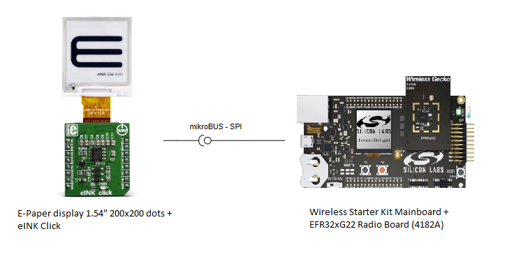
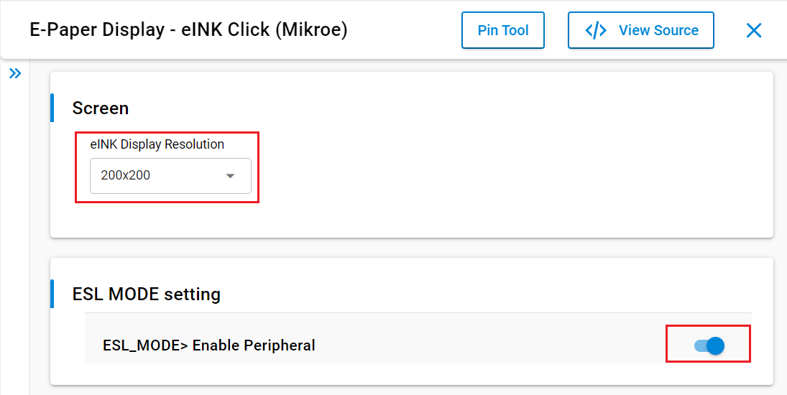

# ESL Tag with E-Paper display 1.54" 200x200 dots (Mikroe) #

## Summary ##

This project aims to show how the Bluetooth LE Electronic Shelf Label (ESL) works with the E-Paper display 1,54" 200x200 dots from Mikroe using a hardware driver via APIs of the GSDK. The ESL tag displays the image transfered by the ESL Access Point using the E-Paper 1,54" display. The application is capable of storing two images in two different image slots at the same time. By default, the images are stored in the NVM memory. 

This project is based on the [**Bluetooth - SoC ESL Tag**](https://github.com/SiliconLabs/gecko_sdk/tree/gsdk_4.3/app/bluetooth/example/bt_soc_esl_tag) application that can be found with documentation on GitHub and also in Simplicity Studio 5. Instead of the LCD that is on the Wireless Starter Kit Mainboard, this project uses an E-Paper display 1,54" 200x200 dots from Mikroe to display the image. The size of the transferred images should be 200x200 pixels.

The Bluetooth LE Electronic Shelf Label documentation and the setup for the ESL network can be found in the [**AN1419: Bluetooth® LE Electronic Shelf Label**](https://www.silabs.com/documents/public/application-notes/an1419-ble-electronic-shelf-label.pdf) application note. The usage of the [**ESL Access Point**](https://github.com/SiliconLabs/gecko_sdk/tree/gsdk_4.3/app/bluetooth/example_host/bt_host_esl_ap/readme) is also documented at the link.

E-Paper display is based on Active Matrix Electrophoretic Display (AMEPD) technology and has an integrated pixel driver, which uses the SPI interface to communicate with the host MCU. E-Paper display has a resolution of 200(V) X 200(H) pixels and an active display area of 27.6 mm X 27.6 mm. The size of its square-shaped pixels is 0.138 mm x 0.138 mm. The screen displays clear and crisp graphics and has an ultra-wide viewing range. Another key feature of the E-Ink technology is the extremely low power consumption, even when the display actively refreshes its content.

## Gecko SDK version ##

- GSDK v4.4.0
- [Third-Party Hardware Drivers v2.0.0](https://github.com/SiliconLabs/third_party_hw_drivers_extension)

## Required Hardware ##

- [EFR32xG22 Radio Board](https://www.silabs.com/development-tools/wireless/slwrb4182a-efr32xg22-wireless-gecko-radio-board)

- [Wireless Starter Kit Mainboard](https://www.silabs.com/development-tools/wireless/efr32xg22-wireless-starter-kit?tab=overview)

- [EINK CLICK - WITHOUT DISPLAY](https://www.mikroe.com/eink-click-without-display)

- [E-Paper display 1,54" 200x200 dots](https://www.mikroe.com/e-paper-display-154-200x200-dots)

**NOTE:**
Tested boards for working with this example:

| Board ID | Description  |
| ---------------------- | ------ |
| BRD4182A  | [EFR32xG22 Radio Board](https://www.silabs.com/development-tools/wireless/slwrb4182a-efr32xg22-wireless-gecko-radio-board)| 
| BRD2703A | [EFR32xG24 Explorer Kit - XG24-EK2703A](https://www.silabs.com/development-tools/wireless/efr32xg24-explorer-kit?tab=overview)    |
| BRD4108A | [BG22 Bluetooth SoC Explorer Kit - BG22-EK4108A](https://www.silabs.com/development-tools/wireless/bluetooth/bg22-explorer-kit?tab=overview)    |
| BRD4314A | [BGM220 Bluetooth Module Explorer Kit - BGM220-EK4314A](https://www.silabs.com/development-tools/wireless/bluetooth/bgm220-explorer-kit?tab=overview)    |

## Hardware Connection ##

eINK display needs an external adapter to interface with the Wireless Starter Kit Mainboard. The hardware connection is shown in the image below:

The eINK Click needs to be connected to the Wireless Starter Kit Mainboard via the EXP Header pins. In the project, the pins are set as in the table below:

| eClick pin (Name in SS5 configurator) | xG22 (4182a) pin | Exp Header  |
|----------|----------|----------|
| SCK (CLK) | PA05 | 12 |
| CS | PA06 | 14 |
| SO1 (Tx) | PB02 | 15 |
| D/C | PD02 | 11 |
| RST | PD03 | 13 |
| BSY | PB01 | 9 |
| GND | GND | 1 |
| 3.3V | 3.3V | 20 |
| - (Rx) | - | - |

Different pin combinations can also be set by changing the pin configuration in the Mikroe driver components (E-Paper display 1.54" 200x200 dots (Mikroe) and mikroe SPIDRV). 

This example application works with the listed explorer kits as well. The eINK Click board can be easily attached to the explorer kits via the mikrobus connector. The connected eINK Click board is shown in the image below.

## Setup ##

You can either create a project based on an example project or start with the Bluetooth - SoC ESL Tag project.

### Create a project based on an example project ###

1. From the Launcher Home, add the BRD4182A to My Products, or connect a BRD4182A to the PC,  click on it, and click on the **EXAMPLE PROJECTS & DEMOS** tab. Find the example project with filter **Mikroe**. Click the **Create** button on the **Bluetooth - ESL Tag with E-Paper display 154inch 200x200 dots from Mikroe** example. Example project creation dialog pops up -> click Create and Finish and Project should be generated.

3. Build and flash this example to the board. Do not forget to flash the proper Bootloader.

### Start with the Bluetooth - SoC ESL Tag project ###

1. Create a "Bluetooth - SoC ESL Tag" project for the "EFR32xG22 4182a radio board" using Simplicity Studio v5. Use the default project settings.

2. Install the software components:

    - Open the .slcp file in the project.

    - Select the SOFTWARE COMPONENTS tab.

    - Install the components detailed in the Component section of the document

3. Copy the files `app/example/bluetooth_esl_tag_mikroe_eink154_e_paper_display/app.c` and `app/example/bluetooth_esl_tag_mikroe_eink154_e_paper_display/esl_tag_user_display_driver.c` into the project root folder (overwriting the existing file).

4. Uninstall the **ESL Tag WSTK LCD driver** component

5. Configure the pins as described in the Hardware connection section.

6. Build and flash this example to the board. Do not forget to flash the proper Bootloader. 

**Note:**

- Make sure that the SDK extension has already been installed. If not, please follow [this documentation](https://github.com/SiliconLabs/third_party_hw_drivers_extension/blob/master/README.md#how-to-add-to-simplicity-studio-ide).

- Third-party drivers extension must be enabled for the project to install "E-Paper Display (Mikroe)" component.

### Components ###

The required components are detailed in this section. 

**E-Paper display 1.54" 200x200 dots (Mikroe)**:

This component contains the driver for the Mikroe eINK Click adapter board with the E-Paper display 1.54" 200x200 dots. The E-Paper display 1.54" 200x200 dots driver in this project is extended with APIs that are specially created for BLE ESL and have the required non-blocking structure. The pins can be configured on the configuration panel. Third-party drivers extension must be enabled for the project to install the "E-Paper Display 1.54" 200x200 dots (Mikroe)" component.

**mikroe SPIDRV**:

The SPI communication and the pins are set up here. The pins can be configured on the configuration panel. The Selected Module should be USART0.

Configuration: 

**ESL Tag NVM Image**:

The number of the Image objects can be configured in this component. By default, the transferred images are stored in the NVM memory. It is possible to store the image in the RAM. To to that, uninstall the latter component and install the **ESL Tag RAM Image** component. Note that the Image objects and the Image pool size variables have to be set properly. To save memory space in the RAM, it is recommended to use the **ESL Tag NVM Image** component.

**NVM3 Default Config**:

To store 2 images, the NVM3 Default Instance Size should be set to 40960.

**ESL Tag User Defined Display Driver**

This component provides skeleton code for a user-defined display driver - to be filled in with actual low-level driver code for driving any arbitrary ESL Tag display type.

Note that for displaying all of the components, the following filter should be cleared:

## How It Works ##

### Using the application ###

After downloading and importing the project, the application has to be built in Simplicity Studio 5 and flashed to the target BRD4182A radio board. Do not forget to build and flash the **Bootloader - SoC Bluetooth Apploader OTA DFU** Bootloader as well. 

By following the process presented in the readme file of the [**ESL Access Point**](https://github.com/SiliconLabs/gecko_sdk/blob/gsdk_4.4/app/bluetooth/example_host/bt_host_esl_ap/readme/readme.md), the uploaded images can be displayed on the E-Paper display. There are two different image slots (0 and 1) on the ESL Tag meaning that two images can be uploaded and stored on the tag. Both of the uploaded images can be displayed on the E-Paper Display separately. 

### Testing ###

The [**ESL Access Point**](https://github.com/SiliconLabs/gecko_sdk/blob/gsdk_4.4/app/bluetooth/example_host/bt_host_esl_ap/readme/readme.md) provides many different use cases. For instance, Windows PowerShell can be used to control the ESL Access Point. 

One of the possible uses is presented below with the following command flow:

python .\app.py COM*port* --cmd → connect *BLE address* → config --full → image_update 0 image/pizza.png → sync start → disconnect → display_image *esl_id* *image_index* *display_index*

The result on the E-Paper display 1,54" should be the following:

## Report Bugs & Get Support ##

To report bugs in the Application Examples projects, please create a new "Issue" in the "Issues" section of [third_party_hw_drivers_extension](https://github.com/SiliconLabs/third_party_hw_drivers_extension) repo. Please reference the board, project, and source files associated with the bug, and reference line numbers. If you are proposing a fix, also include information on the proposed fix. Since these examples are provided as-is, there is no guarantee that these examples will be updated to fix these issues.

Questions and comments related to these examples should be made by creating a new "Issue" in the "Issues" section of [third_party_hw_drivers_extension](https://github.com/SiliconLabs/third_party_hw_drivers_extension) repo.
