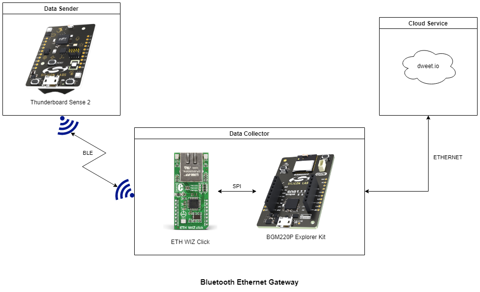
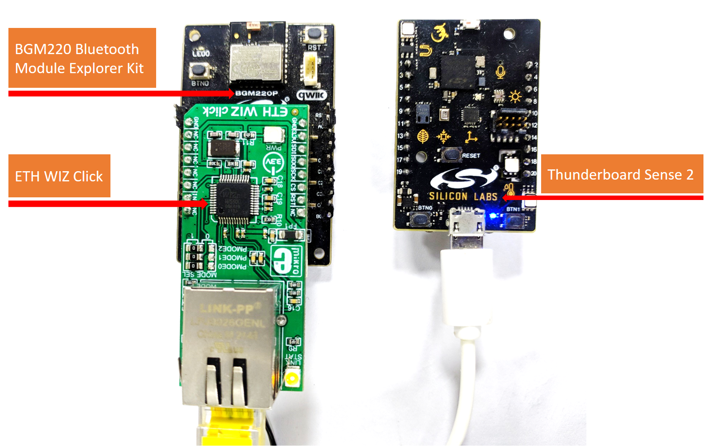
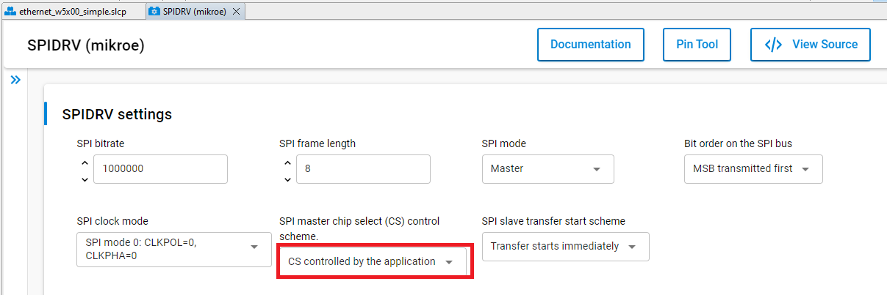
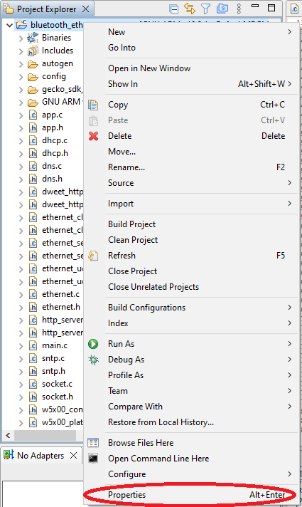
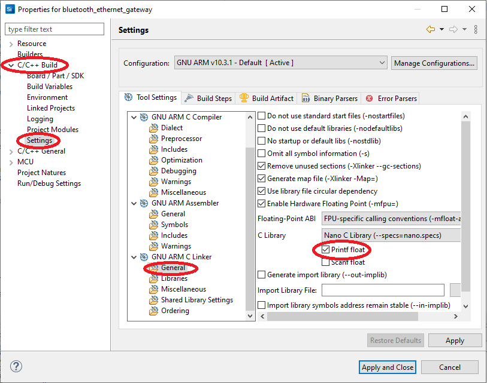
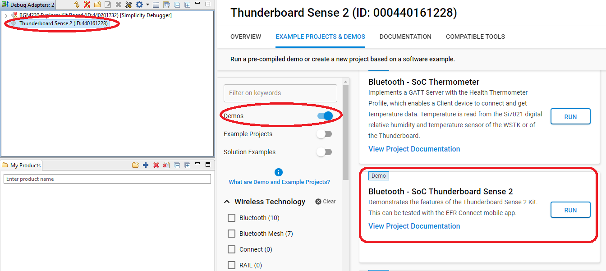
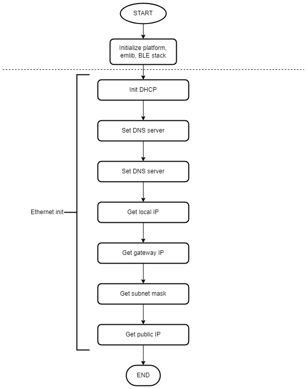
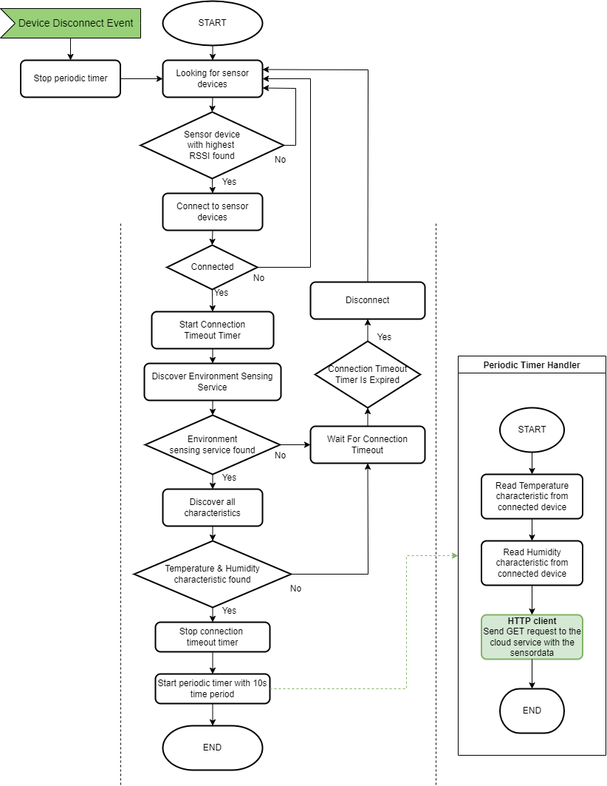
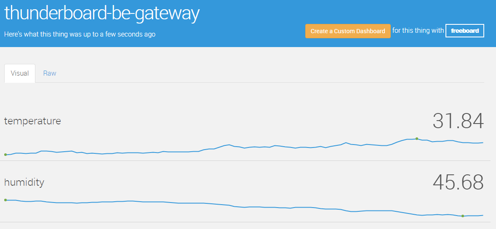

# BLE Ethernet Gateway

## Overview

This project aims to implement a simple Bluetooth-Ethernet Thin Gateway, the sensor measures and collects data from the device's environment and the gateway request the results via BLE.

When the device in connected to a sensor peripheral the gateway reads the BLE characteristics to retrieve the measured temperature and humidity. The measurements results are uploaded to dweet.io via the Ethernet Click board.

The block diagram of this application is shown in the image below:

More detailed information can be found in the section [How it works](#how-it-works).

This code example referred to the following code example. More detailed information can be found here:

- [W5500 Ethernet Module driver](https://github.com/SiliconLabs/platform_hardware_drivers/tree/master/ethernet_w5x00)

## Gecko SDK Suite version

GSDK v4.1.0

## Hardware Required

- [BGM220 Bluetooth Module Explorer Kit](https://www.silabs.com/development-tools/wireless/bluetooth/bgm220-explorer-kit)

- [Thunderboard Sense 2](https://www.silabs.com/development-tools/thunderboard/thunderboard-sense-two-kit)

- [ETH WIZ Click](https://www.mikroe.com/eth-wiz-click)

## Connections Required

The hardware connection is shown in the image below:

- The **ETH WIZ Click** can be plugged into the **BGM220 Bluetooth Module Explorer Kit** via the mikroBus socket

## Setup

To test this application, you can either import the provided `bluetooth_ethernet_gateway.sls` project file or start with an empty example project as the following:

1. Create a **Bluetooth - SoC Empty** project for the **BGM220 Bluetooth Module Explorer Kit** using Simplicity Studio 5.

2. Copy all attached files in *inc* and *src* folders into the project root folder (overwriting existing app.c).

3. Open the .slcp file. Select the SOFTWARE COMPONENTS tab and install the software components:

    - Install **[Platform] > [Driver] > [SPIDRV]** component with the default instance name: **mikroe**. Then select **CS controlled by the application** option.

      

    - Install **[Platform] > [IO Stream] > [IO Stream: USART]** component with the default instance name: **vcom**.

    - Install **[Platform] > [Driver] > [LED] > [Simple LED]** component with the default instance name: **led0**.

    - Install **[Application] > [Utility] > [Log]** component.

4. Build and flash the project to the **BGM220 Bluetooth Module Explorer Kit**.

    *Note*: Flash the application image to the device by using the .hex or .s37 output file.

5. Enable floating-point support for printf
    - Right clicking on your project in the **[Project Explorer]** window and select properties and then select **[C/C++ Build] > [Settings]**, then under **[GNU ARM C Linker] > [General]**, check the **[Printf float]** checkbox

    |  |  |
    | --- | --- |

6. Use Simplicity Studio 5 launcher to run the **Bluetooth - SOC Thunderboard sense 2** demo on the **Thunderboard Sense 2**

    

## How it Works

### Application overview  
  

### Gateway Implementation

#### Application initialization  

  

#### Sensor connect & upload sensor data to cloud service  

  

#### Application Workflows

1. Initialize the peripherals, the Bluetooth stack.

2. Initialize the ethernet module.

3. Initialize DHCP client on the ethernet module.

4. Get gateway IP, subnet mask, local IP from the DHCP server.

5. Setting DNS server.

6. Get the IP of the remote server: `dweet.io`.

7. Start scaning for thunderboard sense device filter the result by name: `Thunderboard`.

8. Connect to the device with highest RSSI
    - If BLE connection is established:

      - Discover **environment sensing** service and **temperature & humidity** characteristic.
      - Start a timer with period 3s to check the connection is timed out.
    - If failed to connect to the device then restart scaning process.

9. When discovering service and characteristic is finished
    - If the temperature & humidity characteristic are found then start a periodic timer to collect sensor data
    - If no service and characteristic is found within 3s then restart scaning process.

10. In periodic timer handler, collect sensor data and send them to the remote server by using HTTP GET request.

### LED

- Indicate the thunderboard sense device is connected

### Dweet cloud monitoring interfaces

- These interfaces can be opened from a simple browser (except real-time stream) or most of them can be integrated into dashboards, other services.
- Follow URL: [https://dweet.io/follow/<device_name>](https://dweet.io/follow/<device_name>)
- Example:
  - Visual dashboard: <https://dweet.io/follow/thunderboard-be-gateway>
    - To provide visual interfaces to monitor sensor data
    
  - Read all message: <https://dweet.io/get/dweets/for/thunderboard-be-gateway>
  - Real-time stream: <https://dweet.io/listen/for/dweets/from/thunderboard-be-gateway>

## .sls Projects Used

- [bluetooth_ethernet_gateway.sls](SimplicityStudio/bluetooth_ethernet_gateway.sls)
