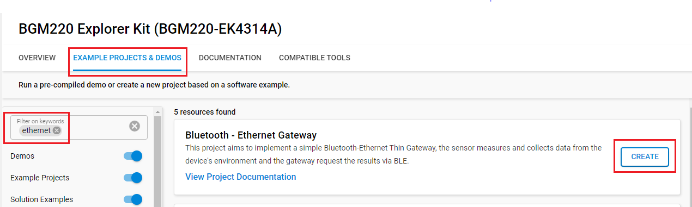
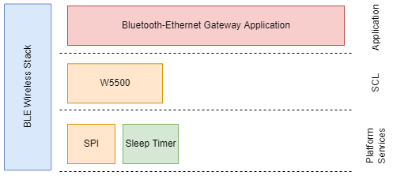

# Bluetooth - Ethernet Gateway

## Overview

This project aims to implement a simple Bluetooth-Ethernet Thin Gateway, the sensor measures and collects data from the device's environment and the gateway requests the results via BLE.

When the device is connected to a sensor peripheral the gateway reads the BLE characteristics to retrieve the measured temperature and humidity. The measurement results are uploaded to dweet.io via the Ethernet Click board.

The block diagram of this application is shown in the image below:

More detailed information can be found in the section [How it works](#how-it-works).

This code example referred to the following code example. More detailed information can be found here:

- [W5500 Ethernet Module driver](https://github.com/SiliconLabs/third_party_hw_drivers_extension/tree/master/app/example/mikroe_eth_wiz_w5500)

## SDK version

- [SiSDK v2024.12.0](https://github.com/SiliconLabs/simplicity_sdk)
- [Third Party Hardware Drivers v4.1.0](https://github.com/SiliconLabs/third_party_hw_drivers_extension)

## Software Required

- [Simplicity Studio v5 IDE](https://www.silabs.com/developers/simplicity-studio)

## Hardware Required

- 1x [Bluetooth Low Energy Explorer Kit](https://www.silabs.com/development-tools/wireless/bluetooth) is used for the Data Collector. For example, [BGM220-EK4314A](https://www.silabs.com/development-tools/wireless/bluetooth/bgm220-explorer-kit)
- 1x [SLTB010A](https://www.silabs.com/development-tools/thunderboard/thunderboard-bg22-kit) EFR32BG22 Thunderboard Kit running the **Bluetooth - SoC Thunderboard EFR32BG22 (BRD4184A)** example (included in the SiSDK)
- 1x [ETH WIZ Click](https://www.mikroe.com/eth-wiz-click)

## Connections Required

The hardware connection is shown in the image below:

- The **ETH WIZ Click** can be plugged into the **BGM220 Bluetooth Module Explorer Kit** via the mikroBus socket

## Setup

To test this application, you can either create a project based on an example project or start with a "Bluetooth - SoC Empty" project based on your hardware.

**NOTE**:

- Make sure that the [Third Party Hardware Drivers extension](https://github.com/SiliconLabs/third_party_hw_drivers_extension) is installed as part of the SiSDK and the [bluetooth_applications](https://github.com/SiliconLabs/bluetooth_applications) repository is added to [Preferences > Simplicity Studio > External Repos](https://docs.silabs.com/simplicity-studio-5-users-guide/latest/ss-5-users-guide-about-the-launcher/welcome-and-device-tabs).

- SDK Extension must be enabled for the project to install the required components.

### Create a project based on an example project

1. From the Launcher Home, add your hardware to My Products, click on it, and click on the **EXAMPLE PROJECTS & DEMOS** tab. Find the example project filtering by "ethernet".

2. Click **Create** button on **Bluetooth - Ethernet Gateway** examples. Example project creation dialog pops up -> click Create and Finish and Project should be generated.

3. Build and flash this example to the board.

### Start with a "Bluetooth - SoC Empty" project

1. Create a **Bluetooth - SoC Empty** project for your hardware using Simplicity Studio 5.

2. Copy all attached files in the *inc* and *src* folders into the project root folder (overwriting existing).

3. Open the .slcp file. Select the SOFTWARE COMPONENTS tab and install the software components:

   - [Services] → [IO Stream] → [IO Stream: USART] → default instance name: vcom
   - [Application] → [Utility] → [Log]
   - [Platform] → [Driver] → [SPI] → [SPIDRV] → default instance name: **mikroe** → Set "SPI master chip select (CS) control scheme" to "spidrvCsControlApplication"
   - [Platform] → [Driver] → [LED] → [Simple LED] → default instance name: led0
   - [Third Party Hardware Drivers] → [Interface] → [W5500 - ETH WIZ Click (Mikroe)]

4. Build and flash this example to the board.

5. From the Simplicity Studio 5 launcher, run the **Bluetooth - SoC Thunderboard EFR32BG22 (BRD4184A)** demo on the **Thunderboard EFR32BG22** board

   

**Note:**

- A bootloader needs to be flashed to your board if the project starts from the "Bluetooth - SoC Empty" project, see [Bootloader](https://github.com/SiliconLabs/bluetooth_applications/blob/master/README.md#bootloader) for more information.

- Enable floating-point support for printf
  - Right clicking on your project in the **[Project Explorer]** window and select properties and then select **[C/C++ Build] > [Settings]**, then under **[GNU ARM C Linker] > [General]**, check the **[Printf float]** checkbox

  |  |  |
  | --- | --- |

## How It Works

### Application Overview  
  

### Gateway Implementation

#### Application initialization  

  

#### Sensor connect & upload sensor data to cloud service  

  

#### Application Workflows

1. Initialize the peripherals and the Bluetooth stack.

2. Initialize the ethernet module.

3. Initialize the DHCP client on the ethernet module.

4. Get the gateway IP, subnet mask, and local IP from the DHCP server.

5. Setting DNS server.

6. Get the IP of the remote server: `dweet.io`.

7. Start scanning for thunderboard sense device filter the result by name: `Thunderboard`.

8. Connect to the device with the highest RSSI
    - If the BLE connection is established:

      - Discover **environment sensing** service and **temperature & humidity** characteristic.
      - Start a timer with period 3s to check the connection is timed out.
    - If failed to connect to the device then restart the scanning process.

9. When discovering service and characteristic is finished
    - If the temperature & humidity characteristic are found then start a periodic timer to collect sensor data
    - If no service and characteristic are found within 3s then restart the scanning process.

10. In periodic timer handler, collect sensor data and send them to the remote server by using HTTP GET request.

### LED

- Indicate the Thunderboard Sense device is connected

### Dweet cloud monitoring interfaces

- These interfaces can be opened from a simple browser (except real-time stream) or most of them can be integrated into dashboards and other services.
- Follow URL: [https://dweet.io/follow/<device_name>](https://dweet.io/follow/<device_name>)
- Example:
  - Visual dashboard: <https://dweet.io/follow/thunderboard-be-gateway>
    - To provide visual interfaces to monitor sensor data
    
  - Read all messages: <https://dweet.io/get/dweets/for/thunderboard-be-gateway>
  - Real-time stream: <https://dweet.io/listen/for/dweets/from/thunderboard-be-gateway>
