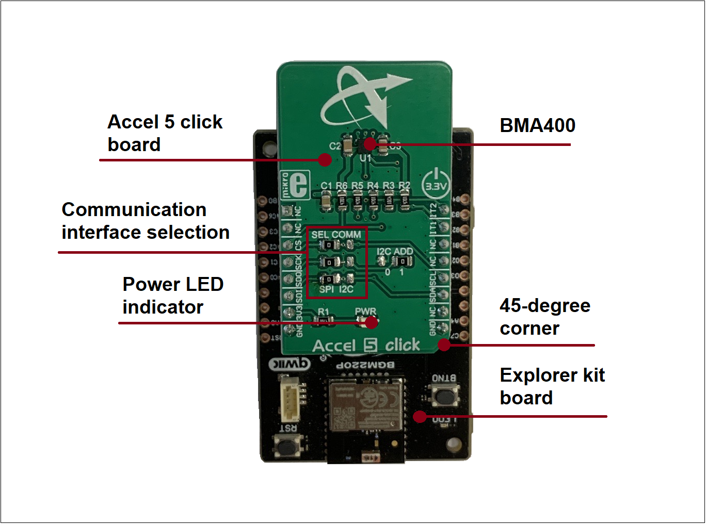
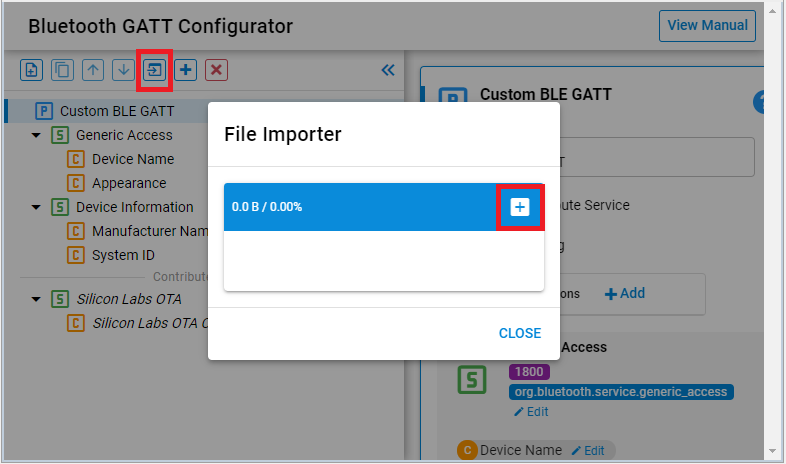
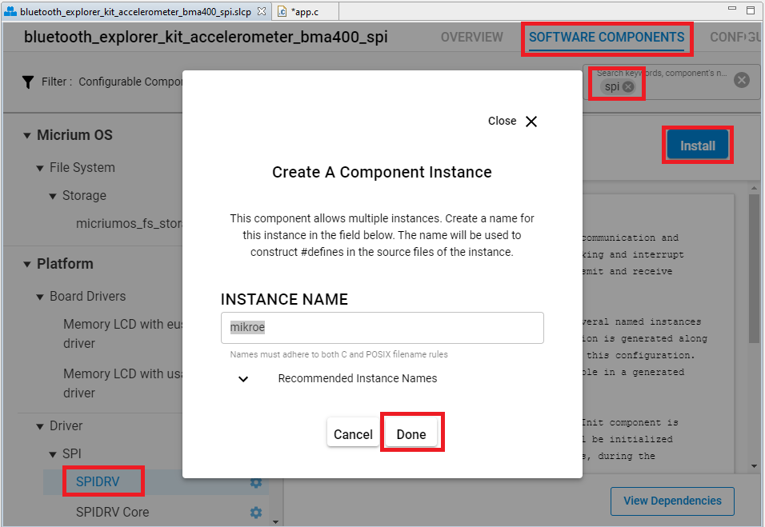
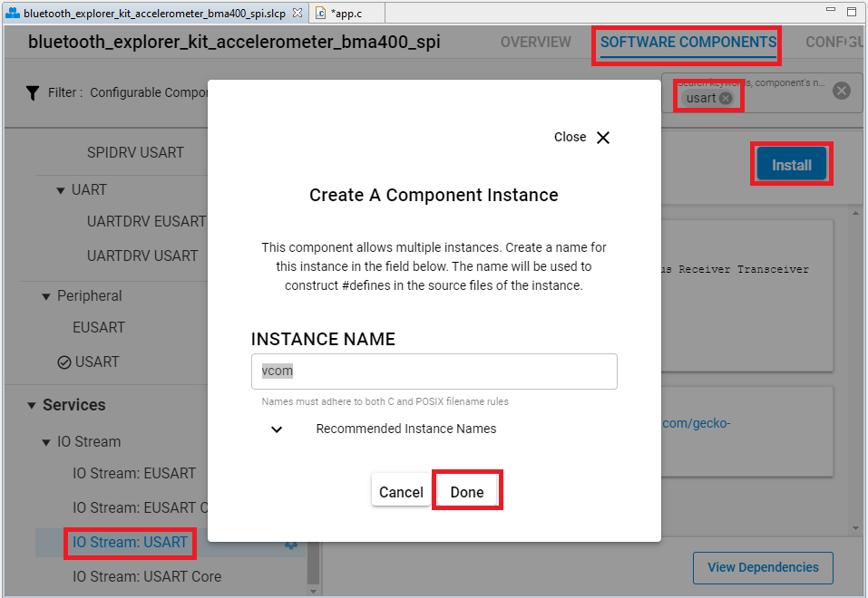
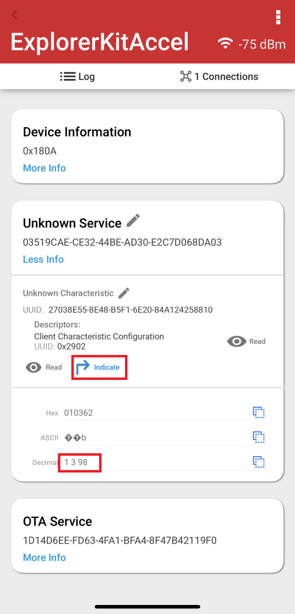
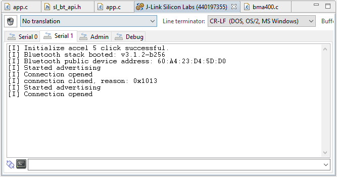

# Bluetooth Explorer Kit accelerometer example using BMA400 sensor with SPI bus #


[](https://www.mikroe.com/accel-5-click)


## Summary ##

This example implements a custom service with a custom characteristic where the accelerometer data is available to be read by a GATT client. The acceleration data can be seen via Bluetooth by reading it manually or it can be also automatically updated using Indication.

This code example has a related code example, which may be worth reading before. Find it here:

- [Accelerometer BMA400 driver.](https://github.com/SiliconLabs/platform_hardware_drivers_staging/tree/feature/accelerometer_bma400_spi/accelerometer_bma400_spi)

## Gecko SDK version ##

v3.1.2

## Hardware Required ##

- [A BGM220P Explorer Kit board.](https://www.silabs.com/development-tools/wireless/bluetooth/bgm220-explorer-kit)

- [A MikroE Accel 5 Click board.](https://www.mikroe.com/accel-5-click)

## Connections Required ##

The Accel 5 Click board can just be "clicked" into its place. Be sure that the board's 45-degree corner matches the Explorer Kit's 45-degree white line. Just be sure that the click board is configured into SPI-mode by the resistors and not into I2C-mode.



## Setup ##

To test this application, you should connect the BMG220 Explorer Kit Board to the PC using a microUSB cable.

You can either import the provided **bluetooth_explorer_kit_accelerometer_bma400_spi.sls** project file or start with an empty example project as basis:

1. Create a **Bluetooth - SoC Empty** project for the "BGM220 Explorer Kit Board" using Simplicity Studio v5. Use the default project settings. Be sure to connect and select the BGM220 Explorer Kit Board from the "Debug Adapters" on the left before creating a project.

2. Copy all attached files in *inc* and *src* folders into the project root folder (overwriting existing app.c).

3. Import the GATT configuration:

- Open the .slcp file in the project.
- Select the CONFIGURATION TOOLS tab and open the "Bluetooth GATT Configurator".
- Find the Import button and import the attached *gatt_configuration.btconf* file.
- Save the GATT configuration (ctrl-s).



4. Open the .slcp file again, select the "SOFTWARE COMPONENTS" tab and do the following changes:

- Install the first **SPIDRV** component with the default instance name: **mikroe**.



- Install **IO Stream: USART** component with the default instance name: **vcom**.



- Install **IO Stream: Retarget STDIO** component (found under **[Services]** > **[IO Stream]** group).

- Install the **Log** component (found under **[Application]** > **[Utility]** group).

5. Build and flash the project to your device.

6. Do not forget to flash a bootloader to your board, if you have not done so already.

*Note*: You need to create the bootloader project and flash it to the device before flashing the application. When flash the application image to the device, use the .hex or .s37 output file. Flashing the .bin files may overwrite (erase) the bootloader.

## How It Works ##

The application is based on the Bluetooth - SoC Empty example. Since the example already has the Bluetooth GATT server, advertising, and connection mechanisms, only minor changes are required.

The GATT changes were adding a new custom service using UUID ```03519cae-ce32-44be-ad30-e2c7d068da03``` that has a characteristic UUID ```27038e55-8e48-b5f1-6e20-84a124258810``` with Read and Indicate properties. The acceleration characteristic is 3 bytes containing 1 byte per X-, Y- and Z-axis accelerations. The axis values are absolute accelerations where 1 g is about value of 98. Typically "0 0 98" when the board is on a level plane like a table.

When the connection is opened, a 100 milliseconds periodic timer is started. When the timer is triggered, the application reads the current accelerations. If the indication was enabled, the client is notified about the updated values. The sl_bt_evt_gatt_server_characteristic_status_id-event is handling the indication enable/disable control. If the connection is closed, the periodic timer will be stopped, too.

Follow the below steps to test the example:

1. Open the EFR Connect app on your smartphone.

2. Find your device in the Bluetooth Browser, advertising as "ExplorerKitAccel", and tap Connect.

3. Find the unknown service, try to read the unknown characteristic and check the value.

4. Enable indication on the unknown characteristic. Try to move your kit in some direction and check the value.



You can launch the Console that is integrated in Simplicity Studio or can use a third-party terminal tool like TeraTerm to receive the logs from the virtual COM port.



## .sls Projects Used ##

bluetooth_explorer_kit_accelerometer_bma400_spi.sls - Import this project to have a ready-to-compile project.

Also precompiled binaries in S-Record format (.s37) are included for the projects above test the applications instantly. The files can be programmed using for example Simplicity Studio Flash Programmer tool or Simplicity Commander application. Remember to flash also the bootloader at least once, it is also included for a smooth experience.
