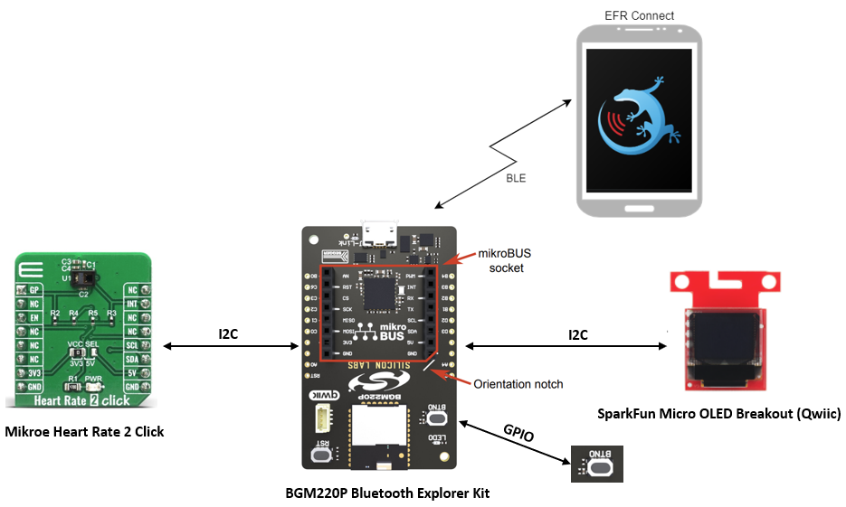
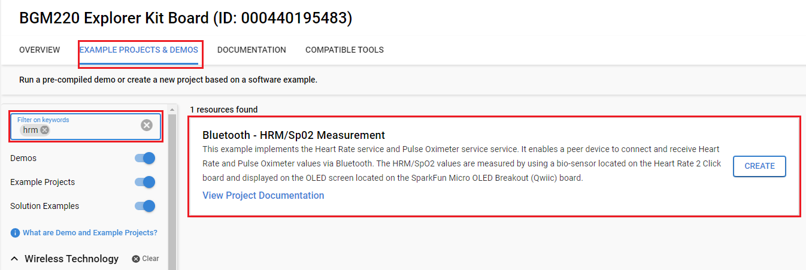
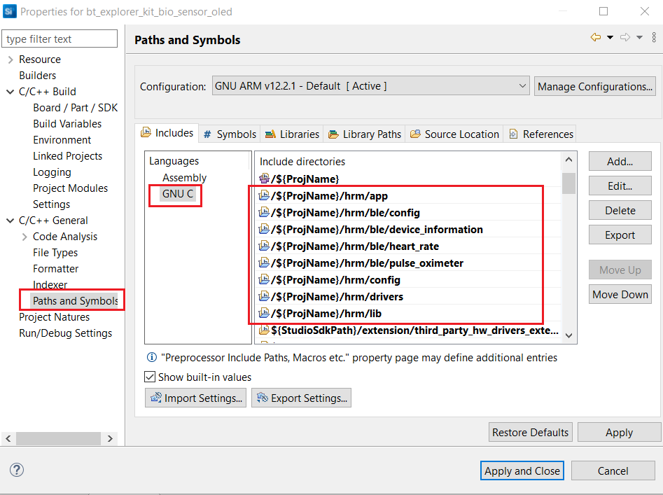
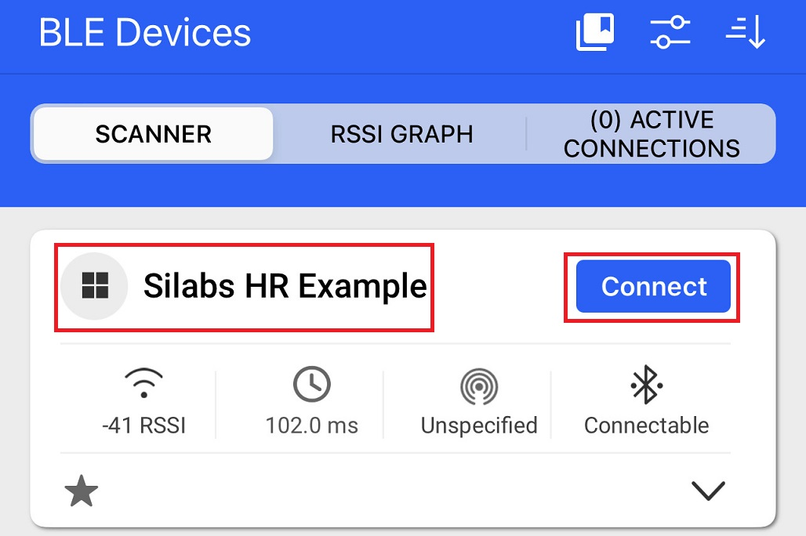
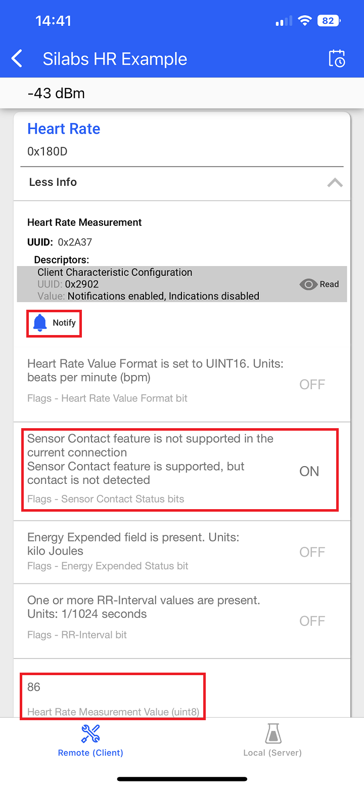
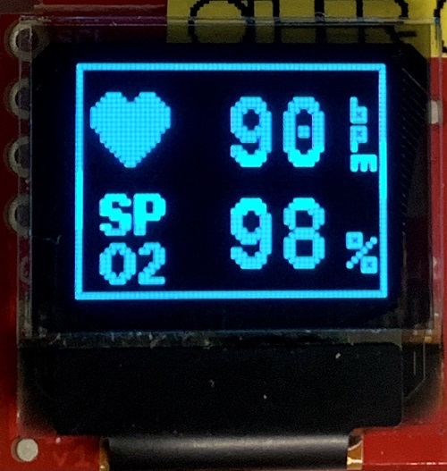
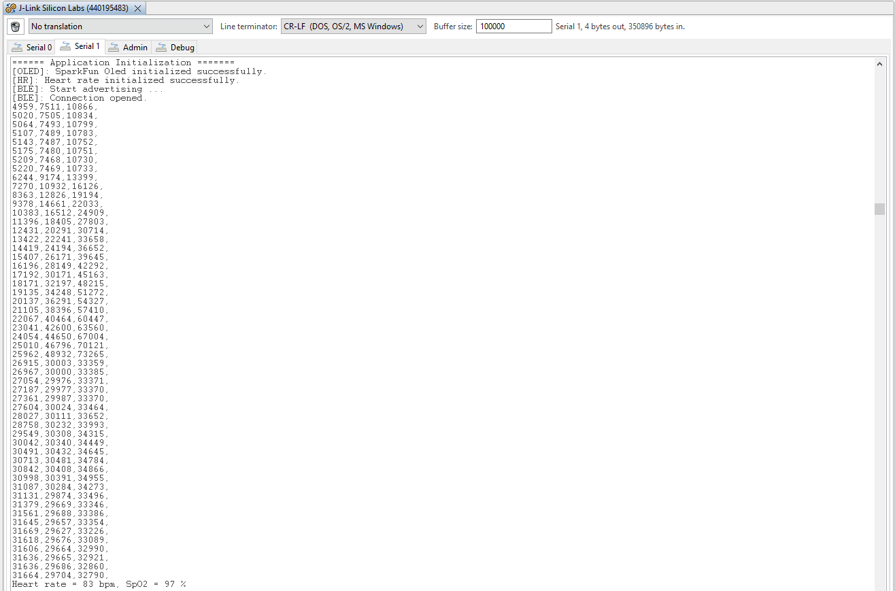

# Bluetooth - HRM/SpO2 Measurement #

[%20board-green)](https://www.sparkfun.com/products/14532)

## Overview ##

This example implements the **Heart Rate** service and **Pulse Oximeter** service. It enables a peer device to connect and receive Heart Rate and Pulse Oximeter values via Bluetooth. The HRM/SpO2 values are measured by using a bio-sensor located on the Heart Rate 2 Click board and displayed on the OLED screen located on the SparkFun Micro OLED Breakout (Qwiic) board.

This code example has related code examples, which may be worth reading before. Find them here:

- [OLED SSD1306 driver.](https://github.com/SiliconLabs/platform_hardware_drivers/tree/master/oled_ssd1306_i2c)

- [MAX86161 driver.](https://github.com/SiliconLabs/platform_hardware_drivers/tree/master/bio_sensor_maxm86161)

- [HRM/SpO2 Software Demo without OLED display.](https://github.com/SiliconLabs/bluetooth_applications/tree/master/bluetooth_explorer_kit_i2c_bio_sensor)

## SDK version ##

- [SiSDK v2024.12.0](https://github.com/SiliconLabs/simplicity_sdk)
- [Third Party Hardware Drivers v4.1.0](https://github.com/SiliconLabs/third_party_hw_drivers_extension)

## Software Required ##

- [Simplicity Studio v5 IDE](https://www.silabs.com/developers/simplicity-studio)
- [Simplicity Connect Mobile App](https://www.silabs.com/developer-tools/simplicity-connect-mobile-app)

## Hardware Required ##

- 1x [Bluetooth Low Energy Explorer Kit](https://www.silabs.com/development-tools/wireless/bluetooth). For example, [BGM220-EK4314A](https://www.silabs.com/development-tools/wireless/bluetooth/bgm220-explorer-kit)
- 1x [Mikroe Heart Rate 2 Click board](https://www.mikroe.com/heart-rate-2-click)
- 1x [SparkFun Micro OLED Breakout (Qwiic) board](https://www.sparkfun.com/products/14532)
- 1x smartphone running the 'Simplicity Connect' mobile app

## Connections Required ##

The Heart Rate 2 Click board can just be "clicked" into its place. Be sure that the board's 45-degree corner matches the Explorer Kit's 45-degree white line.

The SparkFun Micro OLED Breakout (Qwiic) board can be easily connected by using a Qwiic cable.

## Setup ##

To test this application, you can either create a project based on an example project or start with a "Bluetooth - SoC Empty" project based on your hardware.

**NOTE**:

- Make sure that the [Third Party Hardware Drivers extension](https://github.com/SiliconLabs/third_party_hw_drivers_extension) is installed as part of the SiSDK and the [bluetooth_applications](https://github.com/SiliconLabs/bluetooth_applications) repository is added to [Preferences > Simplicity Studio > External Repos](https://docs.silabs.com/simplicity-studio-5-users-guide/latest/ss-5-users-guide-about-the-launcher/welcome-and-device-tabs).

- SDK Extension must be enabled for the project to install the required components.

### Create a project based on an example project ###

1. From the Launcher Home, add your hardware to **My Products**, click on it, and click on the **EXAMPLE PROJECTS & DEMOS** tab. Find the example project filtering byfilter **"hrm"**.

2. Click **Create** button on the **Bluetooth - HRM/Sp02 Measurement** example. Example project creation dialog pops up -> click Create and Finish and Project should be generated.

3. Build and flash this example to the board.

### Start with a "Bluetooth - SoC Empty" project ###

1. Create a **Bluetooth - SoC Empty** project for your hardware using Simplicity Studio 5.

2. Copy the *app.c* file and the *hrm* folder into the project's root folder (app.c will replace the existing file). Add the include directories into the project

   

3. Import the GATT configuration:

    - Open the .slcp file in the project.

    - Select the **CONFIGURATION TOOLS** tab and open the **Bluetooth GATT Configurator**.

    - Find the Import button and import the configuration `bluetooth_explorer_kit_bio_sensor_oled/config/btconfig/gatt_configuration.btconf` file.

    - Save the GATT configuration (ctrl-s).

4. Open the .slcp file. Select the **SOFTWARE COMPONENTS** tab and install the software components:

    - [Services] → [IO Stream] → [IO Stream: USART] → default instance name: vcom.

    - [Application] → [Utility] → [Log]

    - [Platform] → [Driver] → [GPIOINT]

    - [Platform] → [Driver] → [I2C]→ [I2CSPM] → create new instances: mikroe and qwiic.

    - [Platform] → [Driver] → [Button] [Simple Button] → create an instance: btn0.

    - [Third Party Hardware Drivers] → [Display & LED] → [SSD1306 - Micro OLED Breakout (SparkFun) - I2C].

    - [Third Party Hardware Drivers] → [Services] → [GLIB - OLED Graphic Library].
  
5. Build and flash the project to your device.

**Note:**

- A bootloader needs to be flashed to your board if the project starts from the "Bluetooth - SoC Empty" project, see [Bootloader](https://github.com/SiliconLabs/bluetooth_applications/blob/master/README.md#bootloader) for more information.

## How It Works ##

### GATT Database ###

GATT Database

- Device name: **Silabs HR Example**

- **[Service]** Generic Access
- **[Service]** Device Information
- **[Service]** Heart Rate
  - **[Char]** Heart Rate Measurement
  - **[Char]** Body Sensor Location
  - **[Char]** Heart Rate Control Point
- **[Service]** Pulse Oximeter Service
  - **[Char]** PLX Spot-Check Measurement
  - **[Char]** PLX Continuous Measurement
  - **[Char]** PLX Features
  - **[Char]** Record Access Control Point

### Testing ###

Upon reset, the application will display the Silicon Labs' logo on the OLED screen for three seconds. Then the OLED display will be off to save energy.

Follow the below steps to test the example with the Simplicity Connect application:

1. Open the Simplicity Connect app on your smartphone and allow the permission requested the first time it is opened.

2. Find your device in the Bluetooth Browser, advertising as *Silabs HR Example*, and tap Connect.

    

You can use the BTN0 button to start or stop the measurement at any time. When starting the HRM/SpO2 measurement, you should put your finger on the sensor with appropriate pressure (solid contact between the finger and the sensor without optical leakage and don’t press with a too large force) and stay idle for at least 10 seconds. Then check the measured Heart Rate and Pulse Oximeter values on the OLED screen and the Simplicity Connect application on your smartphone.

**Heart Rate Service:**

You have to enable **Notify** for the **Heart Rate Measurement** characteristic. You can see the change of value, it represents your heart rate. After that, the notification will be sent every 500 milliseconds from the device. The normal heart rate of a healthy person is frequently in the range of 60-100 beats/minute at rest. The average person's SpO2 should be between 95 and 100%.

**OLED display:**

On the OLED screen, you can see the measured heart rate and Sp02 value. That value is allocated according to the icon and description on the left. Values also will be updated every 500 milliseconds.

You can launch the Console that is integrated into Simplicity Studio or can use a third-party terminal tool like TeraTerm to receive the logs from the virtual COM port. The raw data in each column represents "green LED, IR LED, red LED”. Heart rate and SpO2 values are updated once a second. The user can easily log the raw samples and debug messages to a *.csv file for post-analysis.

