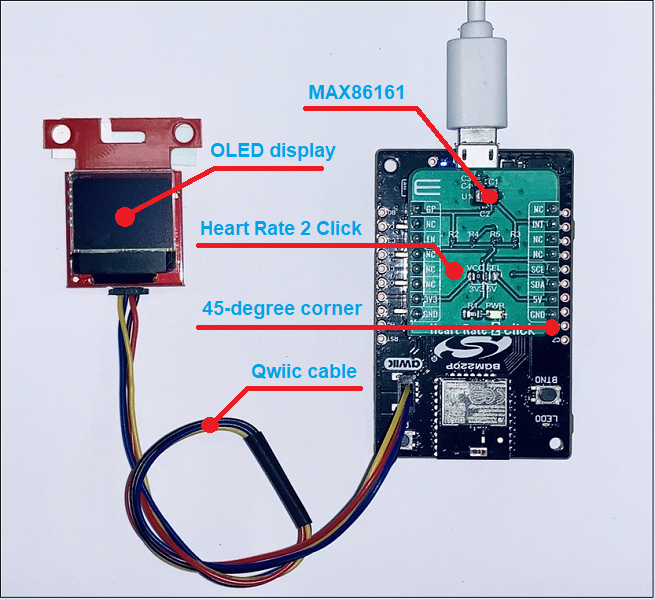
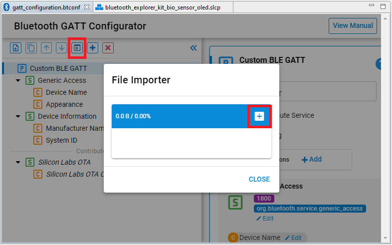
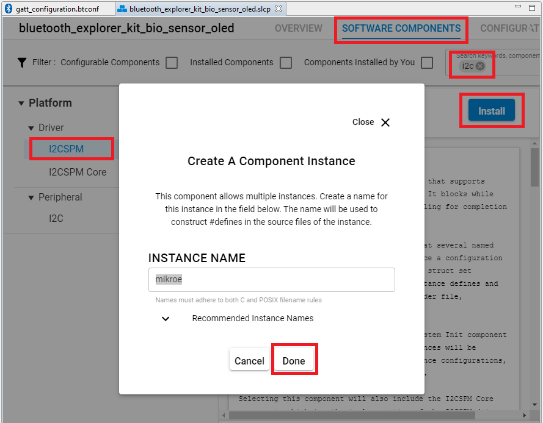
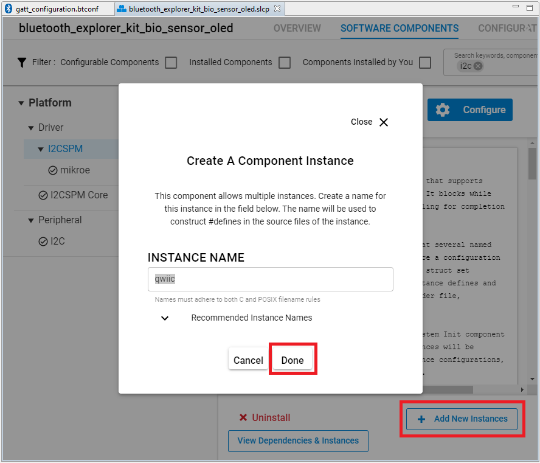
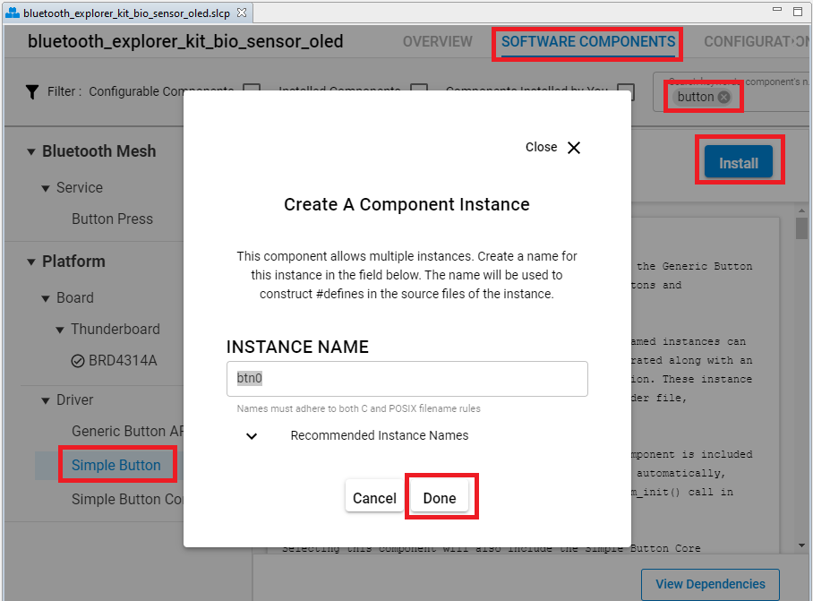
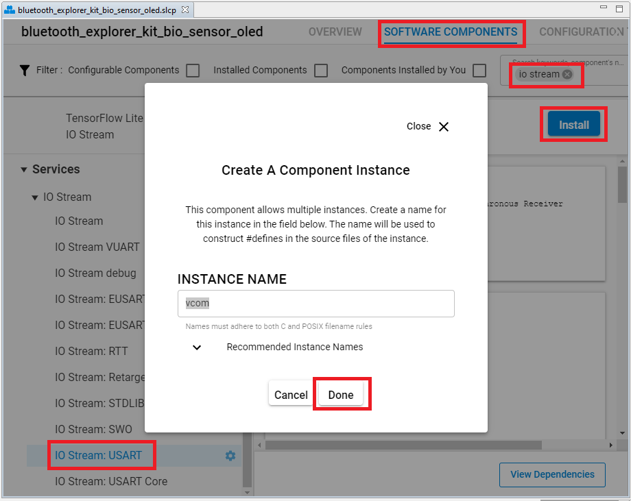
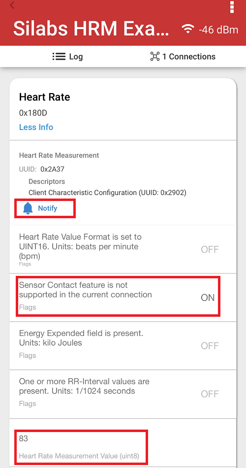
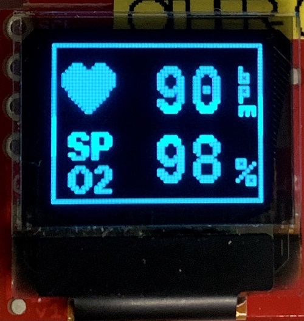
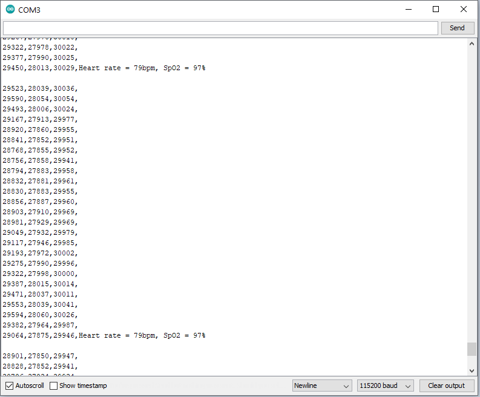

# Bluetooth Module Explorer Kit HRM/SpO2 Software Demo using MAXM86161 sensor and OLED display #

## Summary ##

This example implements the **Heart Rate** service and **Pulse Oximeter service** service. It enables a peer device to connect and receive Heart Rate and Pulse Oximeter values via Bluetooth. The HRM/SpO2 values are measured by using a bio-sensor located on the Heart Rate 2 Click board and displayed on the OLED screen located on the SparkFun Micro OLED Breakout (Qwiic) board.

This code example has the related code examples, which may be worth reading before. Find them here:

- [OLED SSD1306 driver.](https://github.com/SiliconLabs/platform_hardware_drivers/tree/master/oled_ssd1306_i2c)

- [MAX86161 driver.](https://github.com/SiliconLabs/platform_hardware_drivers/tree/master/bio_sensor_maxm86161)

- [HRM/SpO2 Software Demo without OLED display.](https://github.com/SiliconLabs/bluetooth_applications/tree/master/bluetooth_explorer_kit_i2c_bio_sensor)

## Gecko SDK version ##

v3.1.1

## Hardware Required ##

- [A BGM220 Explorer Kit board.](https://www.silabs.com/development-tools/wireless/bluetooth/bgm220-explorer-kit)

- [A Heart Rate 2 Click board.](https://www.mikroe.com/heart-rate-2-click)

- [A SparkFun Micro OLED Breakout (Qwiic) board.](https://www.sparkfun.com/products/14532)

## Connections Required ##

The Heart Rate 2 Click board can just be "clicked" into its place. Be sure that the board's 45-degree corner matches the Explorer Kit's 45-degree white line.

The SparkFun Micro OLED Breakout (Qwiic) board can be easily connected by using a Qwiic cable.

## Setup ##

To test this application, you should connect the BMG220 Explorer Kit Board to the PC using a microUSB cable.

You can either import the provided **bluetooth_explorer_kit_bio_sensor_oled.sls** project file or start with an empty example project as basis:

1. Create a **Bluetooth - SoC Empty** project for the "BGM220 Explorer Kit Board" using Simplicity Studio v5. Use the default project settings. Be sure to connect and select the BGM220 Explorer Kit Board from the "Debug Adapters" on the left before creating a project.

2. Copy the attached *app.c* file and the *hrm* folder into the project root folder (overwriting existing app.c). Add all of the directory paths in the *hrm* folder to the project.

3. Import the GATT configuration:

- Open the .slcp file in the project.
- Select the CONFIGURATION TOOLS tab and open the "Bluetooth GATT Configurator".
- Find the Import button and import the attached *gatt_configuration.btconf* file.
- Save the GATT configuration (ctrl-s).

4. Select the "SOFTWARE COMPONENTS" tab and do the following changes:

- Install the first **I2CSPM** component with the default instance name: **mikroe**.

- Create the second **I2CSPM** component by clicking the **Add New Instances** button with the default instance name: **qwiic**.

- Install the first **Simple Button** component with the default instance name: **btn0**.

- Create the second button by clicking the **Add New Instances** button with the instance name: **max86161_int**. Then seclect the newly created **max86161_int** button, tap Configure and assign PB03 to this button.

- Install **IO Stream: USART** component with the default instance name: **vcom**.

- Install **IO Stream: Retarget STDIO** component (found under **IO Stream: USART** component).

- Install the **Log** component (found under Bluetooth > Utility group).

5. Build and flash the project to your device.

6. Do not forget to flash a bootloader to your board, if you have not done so already.

*Note*: You need to create the bootloader project and flash it to the device before flashing the application. When flash the application image to the device, use the .hex or .s37 output file. Flashing the .bin files may overwrite (erase) the bootloader.

## How It Works ##

Upon reset, the application will display the Silicon Labs's logo on the OLED screen for three seconds. Then the OLED display will be off to save energy. Follow the below steps to test the example:

1. Open the EFR Connect app on your smartphone.

2. Find your device in the Bluetooth Browser, advertising as "Silabs HRM Example", and tap Connect.

3. Find the Heart Rate and Pulse Oximeter services at the GATT database, enable Notification on these services.

5. Try to use the BTN0 button to start/stop the measurement at any time. When start the HRM/SpO2 measurement, you should put your finger on the sensor with a proper pressure (solid contact between the finger and the sensor without optical leakage and don’t press with force) and stay idle for at least 10 s. Then check the measured Heart Rate and Pulse Oximeter values on the OLED screen and on the EFR Connect app.

*Heart Rate Service*

*OLED display*

You can launch the Console that is integrated in Simplicity Studio or can use a third-party terminal tool like TeraTerm to receive the logs from the virtual COM port. The raw data in each column represents "green LED, IR LED, red LED”. Heart rate and SpO2 values are updated once a second. The user can easily log the raw samples and debug messages to a *.csv file for post-analysis.

