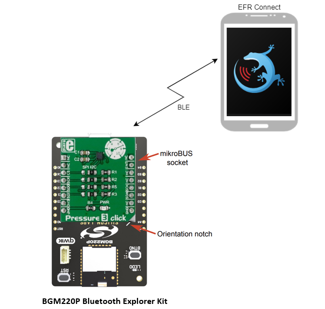

# Bluetooth - Barometer I2C #

## Overview ##

This project shows an example of **Bluetooth - Barometer I2C** using the **Silicon Labs BGM220-EK4314A BGM220 Bluetooth Module Explorer Kit.**

This example is intended to make a pressure and temperature measurement every second when the Bluetooth connection is open. The measurement can be seen via Bluetooth Pressure and Temperature characteristics under the Environmental Sensing service by reading it manually, or it can also be automatically updated using notifications. The application uses a Mikore Pressure 3 Click using mikroE mikroBUS-socket I2C connection. This example can be used as a barometer pressure sensor in the weather station an altitude sensor and so on.

## SDK version ##

- [SiSDK v2024.12.0](https://github.com/SiliconLabs/simplicity_sdk)
- [Third Party Hardware Drivers v4.1.0](https://github.com/SiliconLabs/third_party_hw_drivers_extension)

## Software Required ##

- [Simplicity Studio v5 IDE](https://www.silabs.com/developers/simplicity-studio)
- [Simplicity Connect Mobile App](https://www.silabs.com/developer-tools/simplicity-connect-mobile-app)

## Hardware Required ##

- 1x [Bluetooth Low Energy Explorer Kit](https://www.silabs.com/development-tools/wireless/bluetooth). For example, [BGM220-EK4314A](https://www.silabs.com/development-tools/wireless/bluetooth/bgm220-explorer-kit)
- 1x [MikroE Pressure 3 Click](https://www.mikroe.com/pressure-3-click) based on DPS310 sensor
- 1x smartphone running the 'Simplicity Connect' mobile app

## Connections Required ##

The Pressure 3 Click board can just be "clicked" into its place. Be sure that the board's 45-degree corner matches the Explorer Kit's 45-degree white line.

The following picture shows the system view of how it works.

## Setup ##

To test this application, you can either create a project based on an example project or start with a "Bluetooth - SoC Empty" project based on your hardware.

**NOTE**:

- Make sure that the [Third Party Hardware Drivers extension](https://github.com/SiliconLabs/third_party_hw_drivers_extension) is installed as part of the SiSDK and the [bluetooth_applications](https://github.com/SiliconLabs/bluetooth_applications) repository is added to [Preferences > Simplicity Studio > External Repos](https://docs.silabs.com/simplicity-studio-5-users-guide/latest/ss-5-users-guide-about-the-launcher/welcome-and-device-tabs).

- SDK Extension must be enabled for the project to install the required components.

### Create a project based on an example project ###

1. From the Launcher Home, add your hardware to **My Products**, click on it, and click on the **EXAMPLE PROJECTS & DEMOS** tab. Find the example project filtering by **"barometer"**.

2. Click **Create** button on the **Bluetooth - Barometer I2C** example. Example project creation dialog pops up -> click Create and Finish and Project should be generated.

3. Build and flash this example to the board.

### Start with a "Bluetooth - SoC Empty" project ###

1. Create a **Bluetooth - SoC Empty** project for your hardware using Simplicity Studio 5.

2. Copy all attached files in the **inc** and **src** folders into the project root folder (overwriting existing).

3. Import the GATT configuration:

    - Open the .slcp file in the project.

    - Select the **CONFIGURATION TOOLS** tab and open the **Bluetooth GATT Configurator**.

    - Find the Import button and import the configuration `bluetooth_rfid_notify/config/btconfig/gatt_configuration.btconf` file.

    - Save the GATT configuration (ctrl-s).

4. Open the .slcp file. Select the **SOFTWARE COMPONENTS** tab and install the software components:

    - [Services] → [IO Stream] → [IO Stream: USART] → default instance name: vcom

    - [Application] → [Utility] → [Log]

    - [Third Party Hardware Drivers] → [Sensors] → [DPS310- Pressure 3 Click (Mikroe) - I2C]

5. Install printf float

    - Open Properties of the Project.

    - Select C/C++ Build → Settings → Tool Settings → GNU ARM C Linker → General. Check Printf float.

      

6. Build and flash the project to your device.

**Note:**

- A bootloader needs to be flashed to your board if the project starts from the "Bluetooth - SoC Empty" project, see [Bootloader](https://github.com/SiliconLabs/bluetooth_applications/blob/master/README.md#bootloader) for more information.

## How It Works ##

### GATT Database ###

The application is based on the Bluetooth - SoC Empty example. Since the example already has the Bluetooth GATT server, advertising, and connection mechanisms, only minor changes are required.

Advertisement Packet Device name: **Silabs Barometer I2C**

GATT Database

- Device name: **Silabs Barometer I2C**
- **[Service] Environmental Sensing**
  - **[Char] Pressure**
    - [R] Read pressure value.
    - [N] Notify to update pressure value automatically.
  - **[Char] Temperature**
    - [R] Read temperature value.
    - [N] Notify to update temperature value automatically.

### Testing ###

After the barometer sensor initialization is successful. Bluetooth advertising will be started. When the connection is opened, the application gets the temperature and pressure from the sensor every second. If the connection is closed, also the barometer measurement timer is stopped.

Follow the below steps to test the example with the Simplicity Connect application:

1. Open the Simplicity Connect app on your smartphone and allow the permission requested the first time it is opened.

2. Find your device in the Bluetooth Browser, advertising as *Silabs Barometer I2C*, and tap Connect.

3. When the device is connected, you can read the temperature and pressure values manually. If you want these values updated automatically, you have to enable the **Notify** property for them, so the client device is notified about the value updated.

   

4. You can launch Console that's integrated into Simplicity Studio or use a third-party terminal tool like TeraTerm to receive the data from the USB. A screenshot of the console output is shown in the figure below.

   
