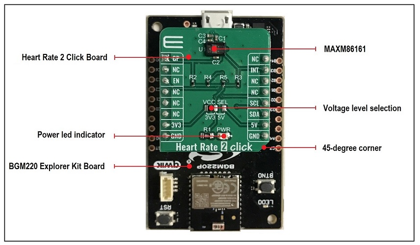
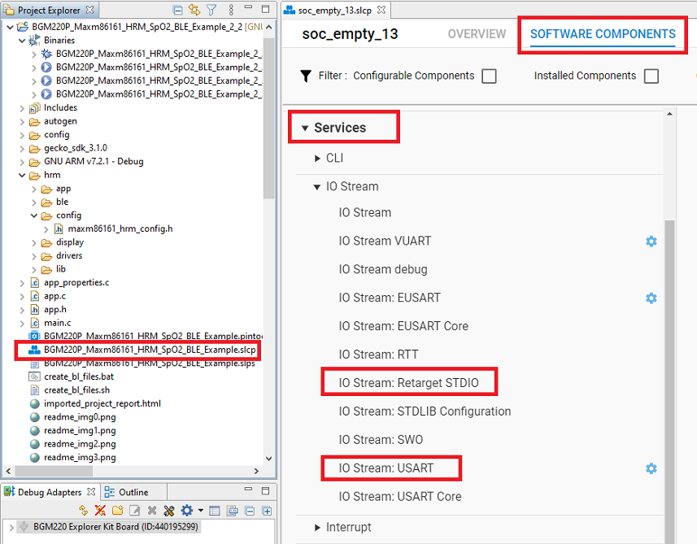
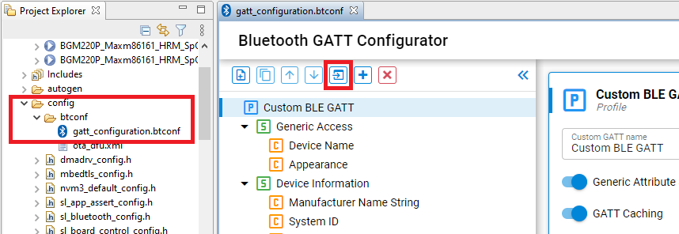
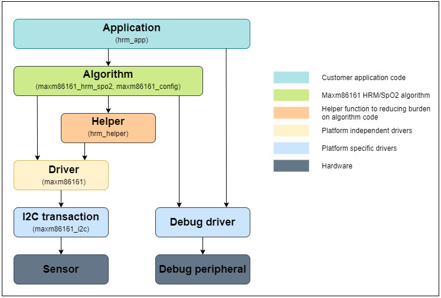
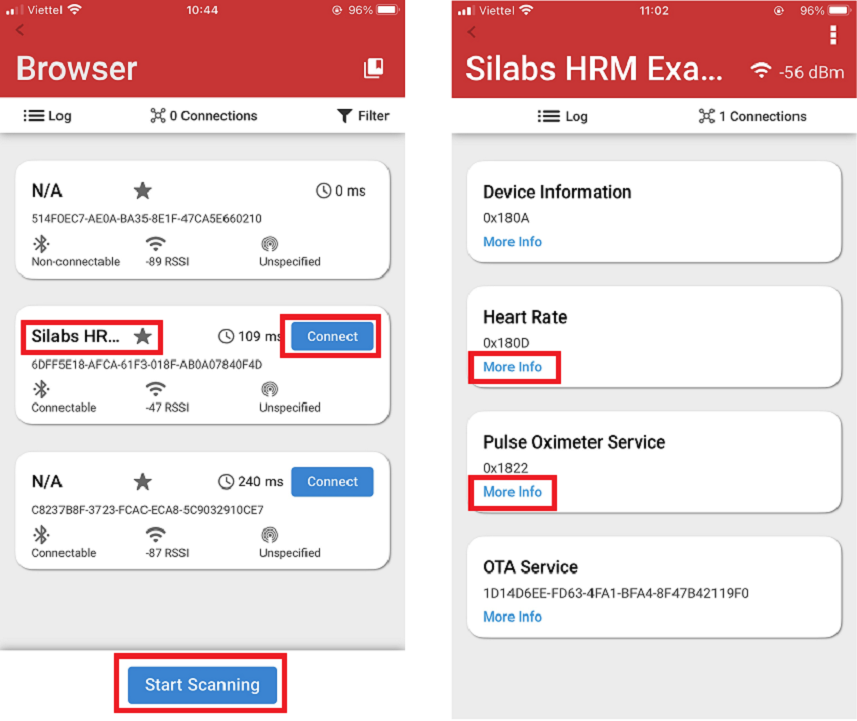
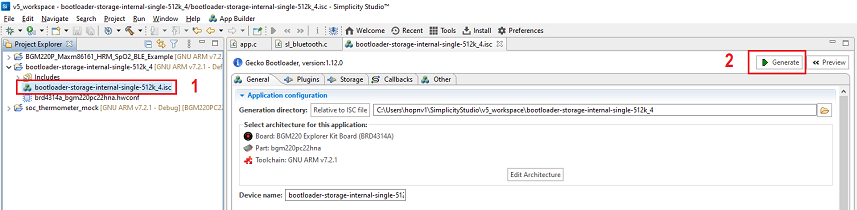

# Bluetooth Module Explorer Kit HRM/SpO2 Software Demo using MAXM86161 sensor #

## Summary ##

This example implements the **Heart Rate** service and **Pulse Oximeter** service. It enables a peer device to connect and receive heart rate and oxygen saturation values via Bluetooth. The reported values are measured by a bio-sensor located on the Heart Rate 2 Click.

## Gecko SDK version ##

v3.1.0

## Hardware Required ##

- [**BGM220-EK4314A** BGM220 Bluetooth Module Explorer Kit (BRD4314A BGM220 Explorer Kit Board)](https://www.silabs.com/development-tools/wireless/bluetooth/bgm220-explorer-kit)

- [**Heart Rate 2 Click** board based on MAXM86161 from Maxim Integrated](https://www.mikroe.com/heart-rate-2-click).

## Connections Required ##

The Heart Rate 2 Click board can just be "clicked" into its place. Be sure that the board's 45-degree corner matches the Explorer Kit's 45-degree white line. The board also has I2C-bus pull-ups. Just be sure that the click board is configured into I2C-mode (the default) by the resistors and not into SPI-mode. Afterwards, power up the board by connecting the kit to a PC using a miniUSB cable. The Power LED on Heart Rate 2 Click board will light when the kit is powered.  

## Setup ##

Simplicity Studio 5 was used to create the example code.

You can either use the already made bluetooth_explorer_kit_i2c_bio_sensor.sls-project or create an example application code as a basis and modify it according to the instructions below: 

1. Create a "Bluetooth - SoC Empty" project for the "BGM220 Explorer Kit Board" using Simplicity Studio 5 Launcher-perspective EXAMPLE PROJECTS-tab. Use the default project settings. Be sure to connect and select the BGM220 Explorer Kit Board from the "Debug Adapters" on the left before creating a project.

2. Copy the *app.c* file and the *hrm* folder into the project's root folder (app.c will replace the existing file). Add all of the directory paths in the *hrm* folder to the project.

3. Add the *I2CSPM Core*, *IO Stream: USART* and *IO Stream: Retarget STDIO* from the Component Library.

4. Import the GATT configuration by using the SOFTWARE COMPONENTS-tab and open the "Bluetooth GATT Configurator" and use its Import-button to import the *gatt_configuration.btconf*.

5. Save the files, build and ready to flash or debug! To build select the project from the "Simplicity IDE"-perspectives "Project Explorer" and then press the hammer sign from the above toolbar. If there were 0 warnings, then there should be a Binaries-folder in the project. Expand the folder and use the right menu button for the .s37 file and select "Flash to Device". Flash Programmer dialog should be opened. The correct file is selected so just select Program.

*Note*: Be sure to create the bootloader project and flash it to the device before flashing the application. When flashing the application image to the device, use the .hex or .s37 output file. Flashing the .bin file may overwrite (erase) the bootloader.

## How It Works ##

### Software architecture ###

Below is an overview of the HRM/SpO2 software architecture.

### GATT Configurator ###

The application is based on the Bluetooth SoC-Empty example. Since the example already has the Bluetooth GATT server, advertising, and connection mechanisms, only minor changes are required.

The GATT changes were adding a new *Heart Rate* service and *Pulse Oximeter Service* service. The *Heart Rate* service uses the UUID 0x180D that has a *Heart Rate Measurement* characteristic with the *Notify* property. The *Pulse Oximeter Service* service uses the UUID 0x1822 that has a *PLX Continuous Measurement* characteristic with the *Notify* property. As they are the Bluetooth SIG Assigned UUID, most applications know how to display the value correctly. 

When the connection is opened and the notification was enabled, a 500 milliseconds periodic timer is started. When the timer is triggered, the client is notified about the updated values. The sl_bt_evt_gatt_server_characteristic_status_id-event is handling the notification enable/disable control. If the connection is closed, the periodic timer will be stopped, too.

### Start/Stop the HRM/SpO2 Measurement ###
BTN0 button is used to start/stop the measurement. Upon reset, press BTN0 button to start the HRM/SpO2 measurement. Users should put their finger on the sensor with a proper pressure (solid contact between the finger and the sensor without optical leakage and don’t press with force) and stay idle for at least 10 s. Once started, the measurement can be stopped at anytime by pressing BTN0 button again.

### Proximity Mode ###

Maxm86161 includes an optical proximity function which could significantly reduce energy consumption and extend the battery life when the sensor is not in contact with the skin. There is a complier option PROXIMITY in the build configuration of the project that can choose Green/IR/Red LED for this feature.

### Use EFR Connect Mobile Application ###

The Silicon Labs EFR Connect application utilizes the Bluetooth adapter on your phone/tablet to scan, connect and interact with BLE devices. To run this example, an iOS or Android smartphone with EFR Connect app installed is required.

Open the EFR Connect application on your smartphone and **allow the permission request** when opened for the first time. Click [Develop] -> [Browser] and you will see a list of nearby devices which are sending Bluetooth advertisements. Find the one named "Silabs HRM Example" and click the connect button on the right side. Wait for the connection to establish and GATT database to be loaded, then find the *Heart Rate* service or the *Pulse Oximeter Service* service, and click More Info. 

To check the heart rate value and the status of finger (ON/OFF), users need turn on notify in the *Heart Rate Measurement* characteristic of the *Heart Rate* service. To check both the heart rate and the SpO2 values, users need turn on notify in the *PLX Continuous Measurement* characteristic of the *Pulse Oximeter Service* service.

### USB Debug Mode ###

The demo firmware includes a debug mode that enables HRM/SpO2 data including raw samples from the sensor to be streamed to a host PC via the Wireless STK’s USB interface. There is a compiler option UART_DEBUG in the build configuration of the project. There are 4 levels to choose from. If the UART_DEBUG is set to level 0, the USB debug mode will be disabled. Level 1 shows only raw PPG value, level 2 shows only the Heart Rate and SpO2 values and level 3 shows both raw PPG value, the Heart Rate and SpO2 values.

Users can launch the Console that is integrated on Simplicity Studio or can use a third-party terminal tool like TeraTerm to receive the data from the USB. A screenshot of the console output is shown in the figure below.

The raw data in each column represents "green LED, IR LED, red LED”. Heart rate and SpO2 values are updated once a second. The user can easily log the raw samples and debug messages to a *.csv file for post-analysis.

## .sls Projects Used ##

bluetooth_explorer_kit_i2c_bio_sensor.sls

## How to Port to Another Part ##

Open the "Project Properties" and navigate to the "C/C++ Build -> Board/Part/SDK" item. Select the new board or part to target and "Apply" the changes. 

*Note*: there may be dependencies that need to be resolved when changing the target architecture.

## Special Notes ##

- The HRM/SpO2 algorithm is developed by Silicon Labs for evaluation purpose. The performance of the algorithm is as it is. We do NOT plan to improve the performance or support any performance-related issues.

- The BGM220 Explorer Kit Board also requires a bootloader to run the application. You can either use the already made bootloader-storage-internal-single-512k_bgm220p.hex file or perform the instructions below to create a bootloader file:

1. Create a "Internal Storage Bootloader (single image on 512kB device)" project for the" BGM220 Explorer Kit Board" using Simplicity Studio 5 Launcher-perspective EXAMPLE PROJECTS-tab. Use the default project settings. Be sure to connect and select the BGM220 Explorer Kit Board from the "Debug Adapters" on the left before creating a project.

2. Open file *bootloader-storage-internal-single-512k_4.isc* then click *Generate* as picture below

3. Save the files, build and ready to flash! To build select the project from the "Simplicity IDE"-perspectives "Project Explorer" and then press the hammer sign from the above toolbar. If there were 0 warnings, then there should be a Binaries-folder in the project. Expand the folder and use the right menu button for the .s37 file and select "Flash to Device". Flash Programmer dialog should be opened. The correct file is selected so just select Program.
