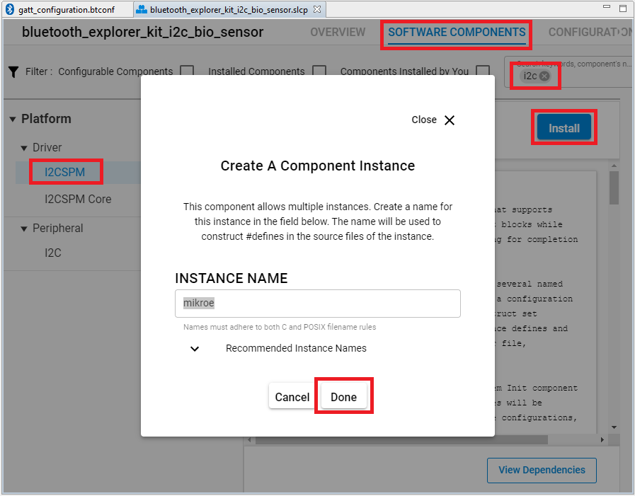
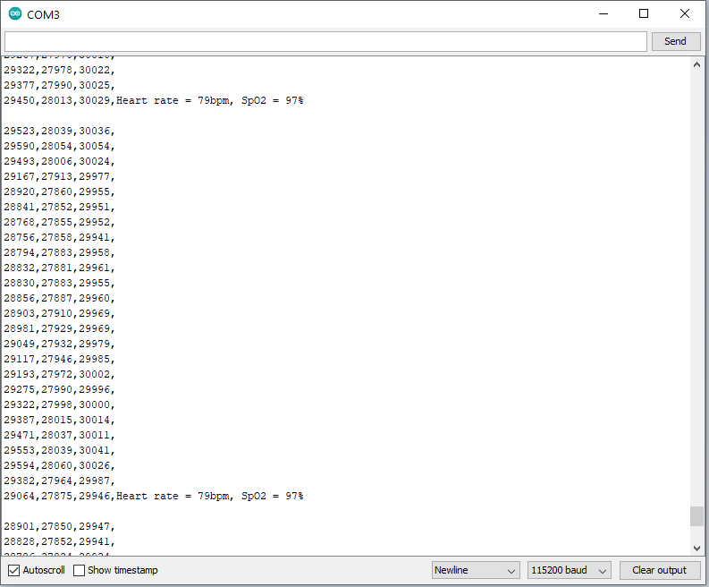

# Bluetooth - Explorer Kit I2C Bio Sensor

## Overview

This example implements the **Heart Rate** service and **Pulse Oximeter service** service. It enables a peer device to connect and receive heart rate and pulse Oximeter values via Bluetooth. The reported values are measured by a bio-sensor located on the Heart Rate 2 Click.

This code example has a related code example, which may be worth reading before. Find it here:

- [Bio sensor MAX86161 driver.](https://github.com/SiliconLabs/platform_hardware_drivers/tree/master/bio_sensor_maxm86161)

## SDK version

- [SiSDK v2024.12.0](https://github.com/SiliconLabs/simplicity_sdk)

## Software Required

- [Simplicity Studio v5 IDE](https://www.silabs.com/developers/simplicity-studio)
- [Simplicity Connect Mobile App](https://www.silabs.com/developer-tools/simplicity-connect-mobile-app)

## Hardware Required

- 1x [Bluetooth Low Energy Explorer Kit](https://www.silabs.com/development-tools/wireless/bluetooth). For example, [BGM220-EK4314A](https://www.silabs.com/development-tools/wireless/bluetooth/bgm220-explorer-kit)

- 1x [Heart Rate 2 Click](https://www.mikroe.com/heart-rate-2-click)

- 1x smartphone running the 'Simplicity Connect' mobile app

## Connections Required

The Heart Rate 2 Click board can just be "clicked" into its place. Be sure that the board's 45-degree corner matches the Explorer Kit's 45-degree white line. The board also has I2C-bus pull-ups. Just be sure that the click board is configured into I2C-mode (the default) by the resistors and not into SPI-mode. Afterwards, power up the board by connecting the kit to a PC using a microUSB cable. The Power LED on Heart Rate 2 Click board will light when the kit is powered.  

## Setup

To test this application, you can either create a project based on an example project or start with a "Bluetooth - SoC Empty" project based on your hardware.

*NOTE**:

- Make sure that the [Third Party Hardware Drivers extension](https://github.com/SiliconLabs/third_party_hw_drivers_extension) is installed as part of the SiSDK and the [bluetooth_applications](https://github.com/SiliconLabs/bluetooth_applications) repository is added to [Preferences > Simplicity Studio > External Repos](https://docs.silabs.com/simplicity-studio-5-users-guide/latest/ss-5-users-guide-about-the-launcher/welcome-and-device-tabs).

- SDK Extension must be enabled for the project to install the required components.

### Create a project based on an example project

1. From the Launcher Home, add your hardware to My Products, click on it, and click on the **EXAMPLE PROJECTS & DEMOS** tab. Find the example project filtering by "bio-sensor".

2. Click **Create** button on both **Bluetooth - Explorer Kit I2C Bio Sensor** examples. Example project creation dialog pops up -> click Create and Finish and Project should be generated.

3. Build and flash this example to the board.

### Start with a "Bluetooth - SoC Empty" project

1. Create a **Bluetooth - SoC Empty** project for your hardware using Simplicity Studio 5.

2. Copy the *app.c* file and the *hrm* folder into the project's root folder (app.c will replace the existing file). Add the include directories into the project

   

3. Import the GATT configuration:

    - Open the .slcp file in the project again.
    - Select the CONFIGURATION TOOLS tab and open the "Bluetooth GATT Configurator".
    - Find the Import button and import the  gatt_configuration.btconf file.

4. Install the software components:

- Open the .slcp file in the project.

- Select the SOFTWARE COMPONENTS tab.

- Install the following components:

  - [Platform] → [Driver] → [GPIOINT]

  - Install the **I2CSPM** component with the default instance name: **mikroe**.

    

  - Install the first **Simple Button** component with the default instance name: **btn0**.

    

  - Install **IO Stream: USART** component with the default instance name: **vcom**.

    

  - Install the **Log** component (found under **[Application] > [Utility]** group).

5. Build and flash this example to the board.

**Note:**

- A bootloader needs to be flashed to your board if the project starts from the "Bluetooth - SoC Empty" project, see [Bootloader](https://github.com/SiliconLabs/bluetooth_applications/blob/master/README.md#bootloader) for more information.

## How It Works

### Software architecture

Below is an overview of the HRM/SpO2 software architecture.

### GATT Configurator

The application is based on the Bluetooth - SoC Empty example. Since the example already has the Bluetooth GATT server, advertising, and connection mechanisms, only minor changes are required.

The GATT changes were adding a new *Heart Rate* service and *Pulse Oximeter Service* service. The *Heart Rate* service uses the UUID 0x180D that has a *Heart Rate Measurement* characteristic with the *Notify* property. The *Pulse Oximeter Service* service uses the UUID 0x1822 that has a *PLX Continuous Measurement* characteristic with the *Notify* property. As they are the Bluetooth SIG Assigned UUID, most applications know how to display the value correctly.

When the connection is opened and the notification is enabled, a 500 milliseconds periodic timer is started. When the timer is triggered, the client is notified about the updated values. The sl_bt_evt_gatt_server_characteristic_status_id-event is handling the notification enable/disable control. If the connection is closed, the periodic timer will be stopped, too.

### Start/Stop the HRM/SpO2 Measurement

BTN0 button is used to start/stop the measurement. Upon reset, press the BTN0 button to start the HRM/SpO2 measurement. Users should put their finger on the sensor with a proper pressure (solid contact between the finger and the sensor without optical leakage and don’t press with force) and stay idle for at least 10 seconds. Once started, the measurement can be stopped at anytime by pressing the BTN0 button again.

### Proximity Mode

Maxm86161 includes an optical proximity function which could significantly reduce energy consumption and extend the battery life when the sensor is not in contact with the skin. There is a compiler option PROXIMITY in the build configuration of the project that can choose Green/IR/Red LED for this feature.

### Use Simplicity Connect Mobile Application

Follow the below steps to test the example with the Simplicity Connect application:

- Open the Simplicity Connect app on your smartphone and allow the permission requested the first time it is opened.

- Find your device in the Bluetooth Browser, advertising as *Silabs HRM Example*, and tap Connect.

   

- Wait for the connection to establish and GATT database to be loaded, then find the *Heart Rate* service or the *Pulse Oximeter Service* service, and click More Info.

- To check the heart rate value and the status of finger (ON/OFF), users need turn on notify in the *Heart Rate Measurement* characteristic of the *Heart Rate* service. To check both the heart rate and the SpO2 values, users need turn on notify in the *PLX Continuous Measurement* characteristic of the *Pulse Oximeter Service* service.

### USB Debug Mode

The demo firmware includes a debug mode that enables HRM/SpO2 data including raw samples from the sensor to be streamed to a host PC via the Wireless STK’s USB interface. There is a compiler option UART_DEBUG in the build configuration of the project. There are 4 levels to choose from. If the UART_DEBUG is set to level 0, the USB debug mode will be disabled. Level 1 shows only raw PPG value, level 2 shows only the Heart Rate and SpO2 values and level 3 shows both raw PPG value, the Heart Rate and SpO2 values.

Users can launch the Console that is integrated on Simplicity Studio or can use a third-party terminal tool like TeraTerm to receive the data from the USB. A screenshot of the console output is shown in the figure below.

The raw data in each column represents "green LED, IR LED, red LED”. Heart rate and SpO2 values are updated once a second. The user can easily log the raw samples and debug messages to a *.csv file for post-analysis.

## Special Notes

- The HRM/SpO2 algorithm is developed by Silicon Labs for evaluation purpose. The performance of the algorithm is as it is. We do NOT plan to improve the performance or support any performance-related issues.
