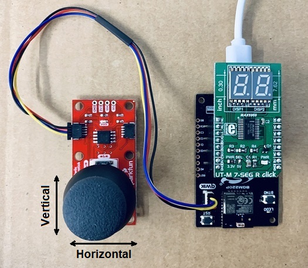
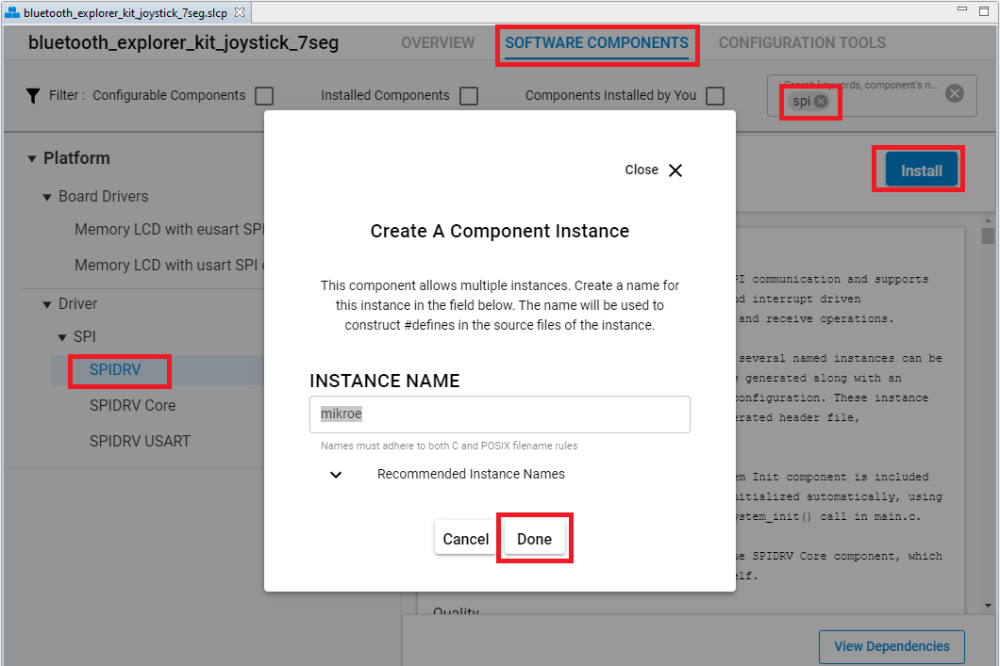
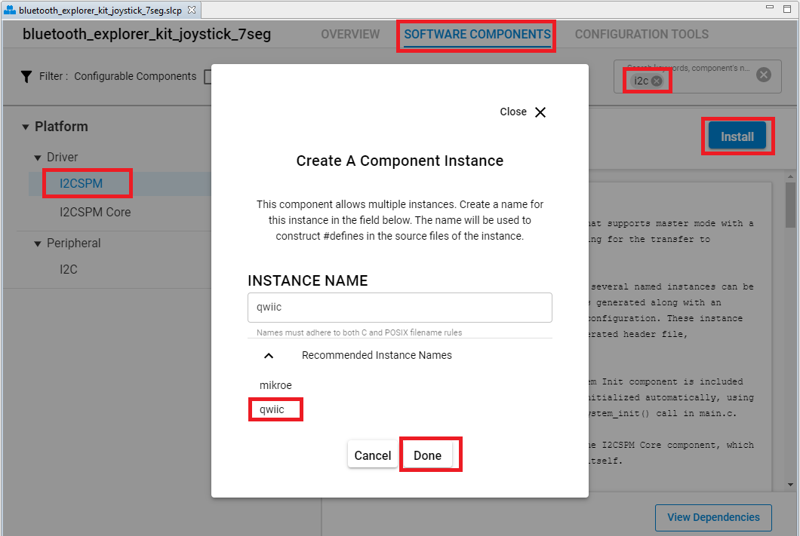
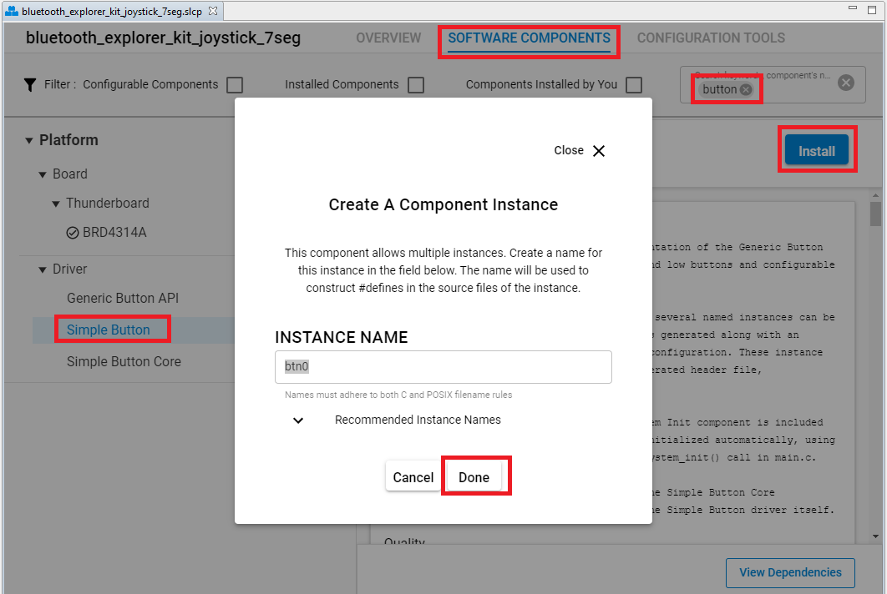
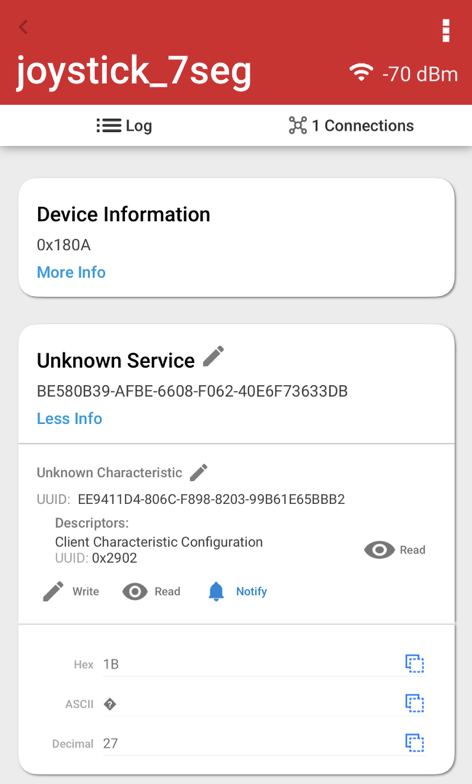
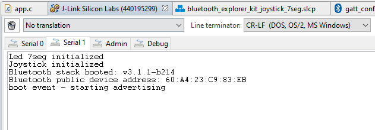

# Explorer Kit Bluetooth example using the I2C-bus Joystick and the SPI-bus 7-segment LED display #

## Description ##

This project shows an example of Bluetooth using the Silicon Labs BGM220 Bluetooth Module Explorer Kit. It is using a Sparkfun Qwiic Joystick board and a UT-L 7-SEG R click board.

UT-L 7-SEG R click carries two SMD ultra thin 7-segment LED displays and the MAX6969 constant-current LED driver from Maxim Integrated. It communicates with the target microcontroller over SPI interface.

For more information about the MAX6969 constant-current LED driver, see the [specification page](https://datasheets.maximintegrated.com/en/ds/MAX6969.pdf).

The SparkFun Qwiic Joystick combines the convenience of the Qwiic connection system and an analog joystick that is similar to the analog joysticks on PS2 (PlayStation 2) controllers. Directional movements are simply measured with two 10 kΩ potentiometers, connected with a gimbal mechanism that separates the horizontal and vertical movements. This joystick also has a select button that is actuated when the joystick is pressed down. With the pre-installed firmware, the ATtiny85 acts as an intermediary (microcontroller) for the analog and digital inputs from the joystick. This allows the Qwiic Joystick to report its position over I2C.

For more information about the SparkFun Qwiic Joystick, see the [specification page](https://learn.sparkfun.com/tutorials/qwiic-joystick-hookup-guide).

## Gecko SDK version ##

GSDK v3.1.1

## Hardware Required ##

- [A BGM220 Explorer Kit board.](https://www.silabs.com/development-tools/wireless/bluetooth/bgm220-explorer-kit)

- [A SparkFun Qwiic Joystick Board.](https://www.sparkfun.com/products/15168)

- [A UT-S 7-SEG R click Board.](https://www.mikroe.com/ut-s-7-seg-r-click)

## Connections Required ##

The UT-L 7-SEG R click board can just be "clicked" into its place. Be sure that the board's 45-degree corner matches the Explorer Kit's 45-degree white line.

The Sparkfun Qwiic Joystick board can be easily connected by using a Qwiic cable.

## Setup ##

To test this application, you should connect the BMG220 Explorer Kit Board to the PC using a microUSB cable.

You can either import the provided **bluetooth_explorer_kit_joystick_7seg.sls** project file or start with an empty example project as basis:

1. Create a "Bluetooth - SoC Empty" project for the "BGM220 Explorer Kit Board" using Simplicity Studio 5. Use the default project settings. Be sure to connect and select the BGM220 Explorer Kit Board from the "Debug Adapters" on the left before creating a project.

2. Copy all attached files in *inc* and *src* folders into the project root folder (overwriting existing app.c).

3. Import the GATT configuration:
- Open the .slcp file in the project.
- Select the CONFIGURATION TOOLS tab and open the "Bluetooth GATT Configurator".
- Find the Import button and import the attached *gatt_configuration.btconf* file.
- Save the GATT configuration (ctrl-s).

4. Open the .slcp file again. Select the "SOFTWARE COMPONENTS" tab and do the following changes:

- Install **SPIDRV** component with the default instance name: **mikroe**.

- Install **I2CSPM** component with the instance name: **qwiic**.

- Install **Simple Button** component with the default instance name: **btn0**.

- Install **IO Stream: USART** component with the default instance name: **vcom**.

- Install **IO Stream: Retarget STDIO** component (found under **IO Stream: USART** component).

- Install the **Log** component (found under Bluetooth > Utility group).

4. Build and flash the project to your device.

5. Do not forget to flash a bootloader to your board, if you have not done so already.

*Note*: You can either use the provided **bootloader_bgm220p.hex** file or create the bootloader project and flash it to the device before flashing the application. When flash the application image to the device, use the .hex or .s37 output file. Flashing the .bin files may overwrite (erase) the bootloader.

## How It Works ##

The application reads a current joystick position every 100ms and prints it on the 7-segment LED display. For simplicity, reading is the current vertical position from joystick and only look at the MSB and get an 8-bit reading (for 256 positions). Each time the joystick moves up to the highest position (255), the joystick data will be increased by 1. On the contrary, each time the joystick moves down to the lowest position (0), the joystick data will be decreased by 1. When the Bluetooth connection is opened, the joystick data can be seen via Bluetooth by reading it manually or it can be also automatically updated using Notification.
Follow the below steps to test the example:

1. Open the EFR Connect app on your smartphone.
2. Find your device in the Bluetooth Browser, advertising as joystick_7seg, and tap Connect.
3. Find the Unknown Service at the GATT database.
4. Try to read, write, re-read the characteristics, and check the value.
5. Enable Notification on this service. Try to move up/down the joystick then check the value on the 7-segment LED display and on the EFR Connect app.
6. Try to use the BTN0 button to turn on/off the 7-segment LED display at any time.

You can launch the Console that is integrated in Simplicity Studio or can use a third-party terminal tool like TeraTerm to receive the logs from the virtual COM port.

