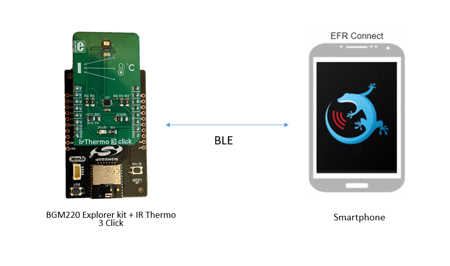
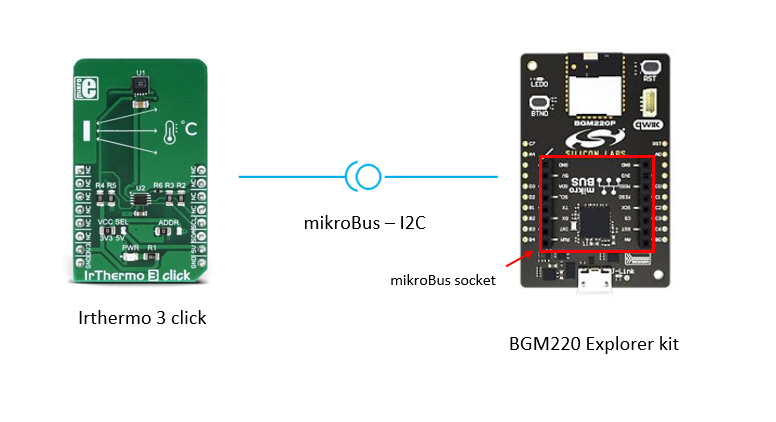
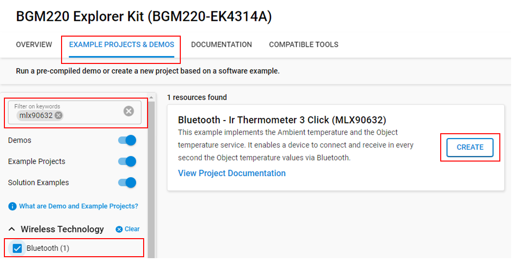
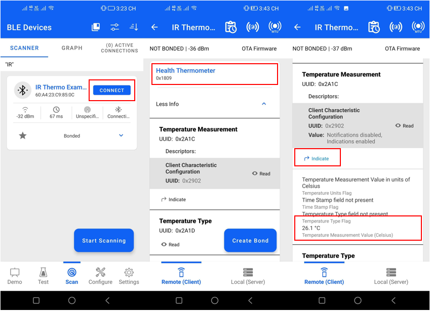
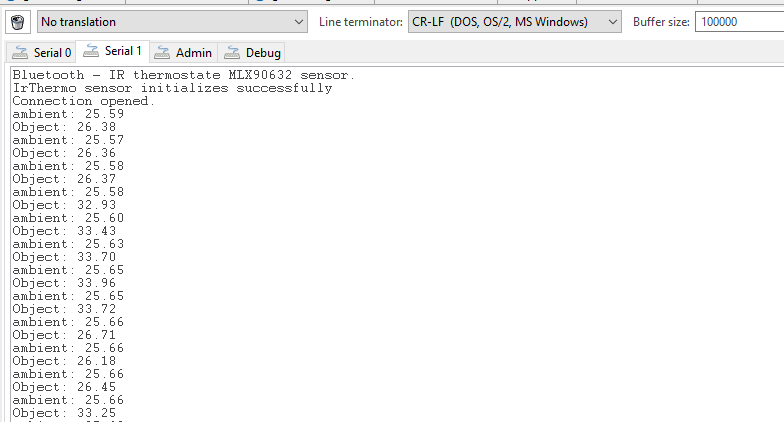

# Bluetooth - IrThermo 3 click (MLX90632) #


[](https://www.mikroe.com/ir-thermo-3-click)


## Overview ##

This example implements the Ambient temperature and the Object temperature services. It enables a device to connect and receive the Object temperature values every second via Bluetooth.



This example showcases the implementation of two services: Ambient temperature and Object temperature. The system consists of a client device and a sensor device that periodically read data from an IR thermometer sensor.

If the Indication feature is enabled, the client will be notified about any updated values. Specifically, the client will receive Object temperature values via Bluetooth every second. This feature enhances convenience and efficiency by automatically delivering relevant data at regular intervals.

## SDK version ##

- [SiSDK v2024.12.0](https://github.com/SiliconLabs/simplicity_sdk)
- [Third Party Hardware Drivers v4.1.0](https://github.com/SiliconLabs/third_party_hw_drivers_extension)

## Software Required ##

- [Simplicity Studio v5 IDE](https://www.silabs.com/developers/simplicity-studio)
- [Simplicity Connect Mobile App](https://www.silabs.com/developer-tools/simplicity-connect-mobile-app)

## Hardware Required ##

- 1x [Bluetooth Low Energy Explorer Kit](https://www.silabs.com/development-tools/wireless/bluetooth). For example, [BGM220-EK4314A](https://www.silabs.com/development-tools/wireless/bluetooth/bgm220-explorer-kit)
- 1x [IrThermo 3 Click - MLX90632 FIR sensor](https://www.mikroe.com/ir-thermo-3-click)
- 1x smartphone running the 'Simplicity Connect' mobile app

## Connections Required ##

The IrThermo 3 Click board supports MikroBus; therefore, it can connect easily to the MikroBus header of the BGM220 Explorer Kit. Be sure that the 45-degree corner of the IrThermo board matches the 45-degree white line of the Silicon Labs Explorer Kit.
The Power LED on IrThermo 3 Click board will light when the kit is powered.



## Setup ##

To test this application, you can either create a project based on an example project or start with a "Bluetooth - SoC Empty" project based on your hardware.

*NOTE**:

- Make sure that the [Third Party Hardware Drivers extension](https://github.com/SiliconLabs/third_party_hw_drivers_extension) is installed as part of the SiSDK and the [bluetooth_applications](https://github.com/SiliconLabs/bluetooth_applications) repository is added to [Preferences > Simplicity Studio > External Repos](https://docs.silabs.com/simplicity-studio-5-users-guide/latest/ss-5-users-guide-about-the-launcher/welcome-and-device-tabs).

- SDK Extension must be enabled for the project to install the required components.

### Create a project based on an example project ###

1. From the Launcher Home, add your product name to My Products, click on it, and click on the **EXAMPLE PROJECTS & DEMOS** tab. Find the example project filtering by "mlx90632".

2. Click **Create** button on **Bluetooth - IR Thermometer 3 Click (MLX90632)** example. Example project creation dialog pops up -> click Create and Finish and Project should be generated.

    

3. Build and flash this example to the board.

### Start with a "Bluetooth - SoC Empty" project ###

1. Create a **Bluetooth - SoC Empty** project for your hardware using Simplicity Studio 5.

2. Copy the [app.c](src/app.c) file to the following directory of the project root folder (overwriting the existing file).

3. Install the software components:

    - Open the .slcp file in the project.

    - Select the SOFTWARE COMPONENTS tab.

    - Install the following components:

        - [Services] → [Timers] → [Sleep Timer]
        - [Services] → [IO Stream] → [IO Stream: USART] → vcom
        - [Application] → [Utility] → [Log]
        - [Platform] → [Driver] → [I2C] → [I2CSPM] → mikroe
        - [Third Party Hardware Drivers] → [Sensors] → [MLX90632 - IrThermo 3 Click (Mikroe)]
        - [Bluetooth] → [OTA] → [In-Place OTA DFU] → uninstall
        - [Platform] → [Bootloader Application Interface] → uninstall.

4. Import the GATT configuration:

    - Open the .slcp file in the project again.
    - Select the CONFIGURATION TOOLS tab and open the "Bluetooth GATT Configurator".
    - Find the Import button and import the [gatt_configuration.btconf](config/btconf/gatt_configuration.btconf) file.
    - Save the GATT configuration (ctrl-s).

5. Build and flash this project to the board.

## How It Works ##

The application is based on the Bluetooth - SoC Empty example. Since the example already has the Bluetooth GATT server, advertising, and connection mechanisms, only minor changes are required.

The GATT changes were adding a standard service **Health Thermometer** with UUID ```0x1809``` that has a Temperature characteristic with UUID ```0x2A1C``` with Read and Indicate properties. The Temperature characteristic shows the temperature value, which is measured by IR Thermometer 3 click.

After resetting, the application will periodically read the IR thermometer sensor. If the Indication is enabled, the client is indicated about the updated values.

## Testing ##

Follow the below steps to test the example with the Simplicity Connect application:

1. Open the Simplicity Connect app on your smartphone and allow the permission requested the first time it is opened.

2. Find your device in the Bluetooth Browser, advertising as *IR Thermo Example*, and tap Connect.

3. Find the Health Thermometer service, try to read the Temperature measurement characteristic and check the value.

4. Enable Indicate the unknown characteristic. Now, you can cover the IR thermometer sensor by hand or other temperature source and check the value.

   

5. You can launch the Console that is integrated in Simplicity Studio or can use a third-party terminal tool like TeraTerm to receive the logs from the virtual COM port.

   
