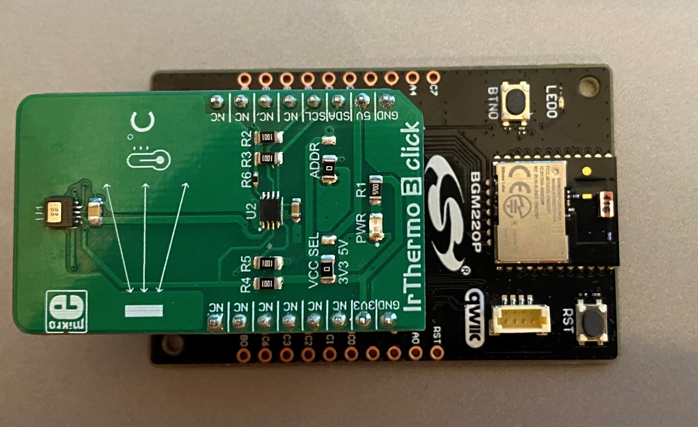

# MLX90632 IrThermo 3 click Bluetooth example #

## Summary ##

This example implements the Ambient temperature and the Object temperature service. It enables a device to connect and receive in every second the Object temperature values via Bluetooth. 
  
## Gecko SDK version ##

GSDK v3.1.1

## Simplicity Studio Version ## 

SV5.1.1.0

## Hardware Required ##

- [**BGM220-EK4314A** BGM220 Bluetooth Module Explorer Kit (BRD4314A BGM220 Explorer Kit Board)](https://www.silabs.com/development-tools/wireless/bluetooth/bgm220-explorer-kit)
- [**IrThermo 3 Click**(MLX90632 FIR sensor)](https://www.mikroe.com/ir-thermo-3-click)

## Connection Required ##

The IrThermo 3 Click board can just be "clicked" into its place. Be sure that the board is connected in a right way just like in the picture below.
The Power LED on IrThermo 3 Click board will light when the kit is powered.

## Create an example application ##

Simplicity Studio 5-series was used to create the example code.

You can either create an example application code as basis and modify it according to the instructions below or use the ready made .sls-project.

1.) Create a "Bluetooth - SoC Empty" project for the" BGM220 Explorer Kit Board" using SimplicityStudio 5 Launcher-perspective EXAMPLE PROJECTS-tab. Use the default project settings. Be sure to connect and select the BGM220 Explorer Kit Board from the "Debug Adapters" on the left before creating a project.

2.) Then copy the files [app.c](src/app.c), [mlx90632.c](src/mlx90632.c), [mlx90632_i2c.c](src/mlx90632_i2c.c), [mlx90632.h](inc/mlx90632.h) and [mlx90632_i2c.h](inc/mlx90632_i2c.h) in to the project root folder (app.c is replacing the old app.c).

3.) Install software components in the .slcp 
#### Bluetooth:
- Health Thermometer API
- Simple timer service
- Log
#### Platform:
- I2CSPM Core
- I2C
- I2CSPM
- USART
#### Services:
- CLI: CLI Core
- CLI: Command Line Interface
- IO Stream
- IO Stream: USART Core
- IO Stream: USART
#### Third Party:
- Tiny print

4.) Import the GATT configuration by using the SOFTWARE COMPONENTS-tab and open the "Bluetooth GATT Configurator" and use its Import-button to import the gatt_configuration.btconf.

5.) Save the files, build and ready to flash or debug! To build select the project from the "Simplicity IDE"-perspectives "Project Explorer" and then press the hammer sign from the above toolbar. If there were 0 warnings, then there should be a Binaries-folder in the project. Expand the folder and use the right menu button for the .s37 file and select "Flash to Device". Flash Programmer dialog should be opened. The correct file is selected so just select Program.

6.) If you want to debug you can Launch console and then choose Serial 1, finally press enter.

7.) Open EFR Connect APP in your smartphone.

8.) Choose the Demo page and Health Thermometer.

9.) Select a Bluetooth Device (IrThermo).

Note: The Explorer Kit also requires a bootloader to run the application.

## USB Debug Mode ##

Users can launch the Console that is integrated on Simplicity Studio or can use a third-party terminal tool like TeraTerm to receive the data from the USB. A screenshot of the console output is shown in the figure below.

## .sls Projects Used ##

soc_IrThermo.sls - Import this project to have a ready-to-compile -project.

Also precompiled binaries in S-Record format (.s37) are included for the projects above test the applications instantly. The files can be programmed using for example Simplicity Studio Flash Programmer tool or Simplicity Commander application.

## More information ##

More information about the sensor driver, how it works, architecture, and so on, can be found from it's own reference driver component project:
https://github.com/SiliconLabs/platform_hardware_drivers_staging/tree/feature/MLX90632/fir_sensor_mlx90632
