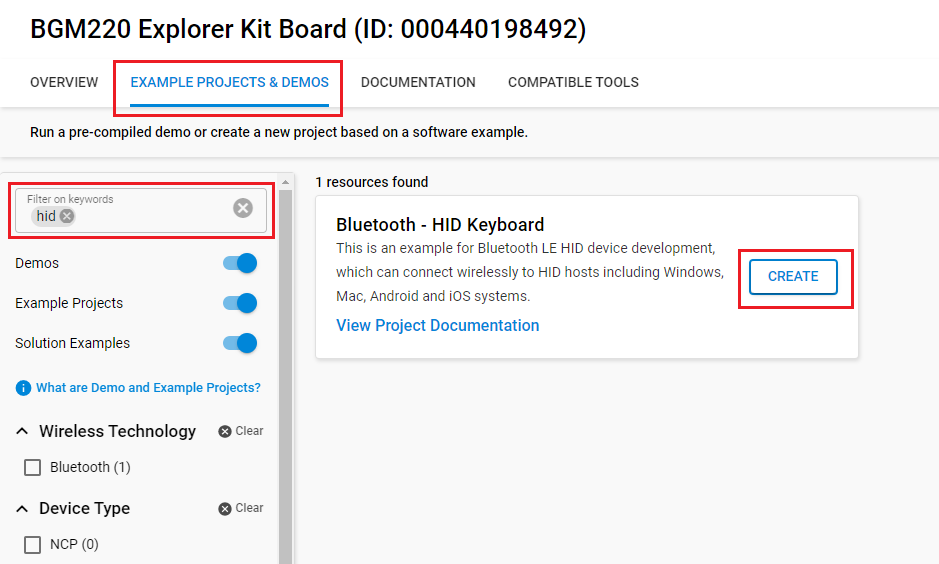
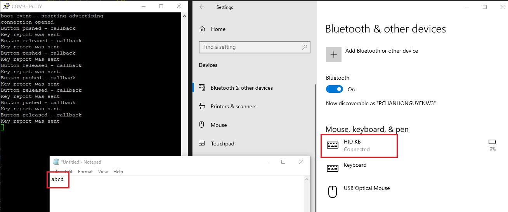

<!--Author: Bence Zupko -->

# Bluetooth - HID Keyboard #

## Description ##

This is an example for Bluetooth LE HID device development, which can connect wirelessly to HID hosts including Windows, Mac, Android and iOS systems. Bluetooth SIG defines an HID profile that specifies how a device can support HID services over the Bluetooth LE protocol stack using the Generic Attribute Profile.

This example implements a simple HID keyboard but can be used as a starting point to make any human interface device.

## Gecko SDK Suite version ##

- GSDK v4.2.1

## Hardware Required ##

- [BGM220 Bluetooth Module Explorer Kit - BGM220-EK4314A](https://www.silabs.com/development-tools/wireless/bluetooth/bgm220-explorer-kit?tab=overview)

**NOTE:**
Tested boards for working with this example:

| Board ID | Description  |
| ---------------------- | ------ |
| BRD2703A | [EFR32xG24 Explorer Kit - XG24-EK2703A ](https://www.silabs.com/development-tools/wireless/efr32xg24-explorer-kit?tab=overview)    |
| BRD2601B | [EFR32xG24 Dev Kit - xG24-DK2601B](https://www.silabs.com/development-tools/wireless/efr32xg24-dev-kit?tab=overview)   |
| BRD4314A | [BGM220 Bluetooth Module Explorer Kit - BGM220-EK4314A](https://www.silabs.com/development-tools/wireless/bluetooth/bgm220-explorer-kit?tab=overview)  |
| BRD4108A | [BG22 Bluetooth SoC Explorer Kit - BG22-EK4108A](https://www.silabs.com/development-tools/wireless/bluetooth/bg22-explorer-kit?tab=overview)  |

## Connections Required ##

- Connect the Bluetooth Development Kits to the PC through a compatible-cable. e.g. A micro USB cable for the BGM220 Bluetooth Module Explorer Kit.

## Setup ##

To test this application, you can either create a project based on an example project or start with a "Bluetooth - SoC Empty" project based on your hardware.

### Create a project based on an example project ###

1. From the Launcher Home, add your hardware to My Products, click on it, and click on the **EXAMPLE PROJECTS & DEMOS** tab. Find the example project with the filter "HID".

2. Click **Create** button on the **Bluetooth - HID Keyboard** example. Example project creation dialog pops up -> click Create and Finish and Project should be generated.

3. Build and flash this example to the board.

### Start with a "Bluetooth - SoC Empty" project ###

1. Create a **Bluetooth - SoC Empty** project for your hardware using Simplicity Studio 5.

2. Copy the attached src/app.c file into your project (overwriting existing).

3. Import the GATT configuration:

   - Open the .slcp file in the project.

   - Select the **CONFIGURATION TOOLS** tab and open the **Bluetooth GATT Configurator**.

   - Find the Import button and import the attached **config/btconf/gatt_configuration.btconf** file.

   - Save the GATT configuration (ctrl-s).

4. Open the .slcp file. Select the SOFTWARE COMPONENTS tab and install the software components:

   - [Platform] → [Driver] → [Button] → [Simple Button] → default instance name: **btn0**.
   - [Services] → [IO Stream] → [IO Stream: USART] → default instance name: vcom
   - [Platform] → [Board] → [Board Control] → enable *Virtual COM UART*
   - [Application] → [Utility] → [Log]

5. Build and flash the project to your device.

**NOTE:**

- Make sure that the [SDK extension](https://github.com/SiliconLabs/third_party_hw_drivers_extension/blob/master/README.md) is already be installed and this repository is added to [Preferences > Simplicity Studio > External Repos](https://docs.silabs.com/simplicity-studio-5-users-guide/latest/ss-5-users-guide-about-the-launcher/welcome-and-device-tabs).

- Do not forget to flash a bootloader to your board, see [Bootloader](https://github.com/SiliconLabs/bluetooth_applications/blob/master/README.md#bootloader) for more information.

## HID Introduction ##

The *host* and the *device* are two entities in the HID protocol. The device is the entity that directly interacts with humans, such as a keyboard or mouse. The host communicates with the device and receives input data from the device on actions performed by humans.

HID devices must meet a few general requirements that are imposed to keep the HID interface standardized and efficient. In normal operation, the HID Device and the HID Host exchange data through **reports**.

As defined in the USB HID, all data passed between an HID device and a host must be structured according to specifications found in the *Report descriptor*. This descriptor determines the size and composition of data reports from the HID class device. The *Report Descriptor* is loaded and parsed by the HID class driver as soon as the device is detected.
Before the HID device can enter its normal operating mode and transfer data with the host, the device must
properly enumerate. After a device has been successfully enumerated, the host can begin sending and receiving data in the form of reports.
For more information, see [HID Specification and Usage Tables](https://www.usb.org/hid).

The HID over GATT profile is an adaptation of the USB HID specification. In this profile, the *Report Map characteristic* (Bluetooth LE version of the USB *Report Descriptor*) is used to specify the HID *Report characteristic*, which is responsible for exchanging data between an HID Device and an HID Host.

In this profile, there can be several *Report characteristics* but only one *Report Map characteristic* which defines the size of the reports, and the purpose of each byte and bit in each report. Input reports are sent using notifications and they can also be read by the host.

A Bluetooth HID Device must implement the HID over the GATT profile. In addition to HID Service, this profile requires the Battery Service and the Device Information Service, too. The detailed description can be found in [HID over GATT Profile Specification](https://www.bluetooth.org/docman/handlers/downloaddoc.ashx?doc_id=245141).

As mentioned earlier, HID devices must meet several requirements. The purpose of this document is to list these requirements and provide a working solution to make the device successfully enumerate. To be accepted by the Host, the device needs to have properly initialized identification data and the right level of security.

The most important GATT characteristics will be described in detail with a practical example in the next section. These properties can be customized easily in the GATT Configurator.

## GATT Database for Keyboard Example ##

It is important to understand how reports can be structured and what are the identification properties that an HID device needs to enumerate properly. This section goes through the required attributes with a description and an example. As mentioned earlier, the HID over GATT Profile needs several services.

### Generic Access Service ##

**Appearance characteristic:**  contains a 16-bit number that can be mapped to an icon or string that describes the physical representation of the device during the device discovery procedure.
>This example implements a keyboard and its standard appearance value is **0xC103**.

### Device Information Service ##

**PnP ID Characteristic:**  a set of values that are used to create a device ID value that is unique for this device. Included in the characteristic are a Vendor ID source field, a Vendor ID field, a Product ID field, and a Product Version field.

Silicon Labs Vendor ID value (0x10C4) is used and assigned by USB Implementer’s Forum (0x02).

| Field            | Value  |
| :--------------- |:-------|
| Vendor ID Source | 0x02   |
| Vendor ID        | 0x10C4 |
| Product ID       | 0x0001 |
| Product Version  | 0x0001 |

This service is defined in the [Device Information Service Specification](https://www.bluetooth.org/docman/handlers/downloaddoc.ashx?doc_id=244369).

### Human Interface Device Service ##

The HID Service exposes characteristics required for an HID Device to transfer HID report descriptors and reports to an HID Host. This also exposes the characteristics for an HID Host to write to a Device. The HID Service needs to be advertised.

**HID Information Characteristic:** The HID Information characteristic value contains the bcdHID and bcountryCode fields as defined by the USB HID specification.

| Field           | Value                                                |
| :-------------- |:-----------------------------------------------------|
| bcdHID          | 0x0111 (HID Class Specification release number 1.11) |
| bcountryCode    | 0x0002 (not localized, NormallyConnectable)          |

**Protocol Mode Characteristic:** The Protocol Mode characteristic is used to expose the current protocol mode of the HID Service with which it is associated. There are Report and Boot modes.

In this case, Report Protocol is used so its value is **0x01**.

**Report Map Characteristic:** All data transferred must be formatted as reports whose structure is defined in this characteristic. The Report Map characteristic is used to define formatting information for Input Report, Output Report, and Feature Report data transferred between an HID Device and HID Host. It is a list of items each containing an item type and its value that provides information on how data can be used and other information regarding the physical aspects of the device. The length and content of a Report Map vary depending on the number of data fields required for the device’s report or reports.

This application's Report Map is based on the example given in [Device Class Definition for Human Interface Devices (HID)](https://www.usb.org/sites/default/files/documents/hid1_11.pdf)
(Appendix C: Keyboard Implementation). It contains the basic 8-byte long keyboard report which will be described in detail later.

| Value      | Item                                               |
| :--------- |:---------------------------------------------------|
| 0x05, 0x01 |    Usage Page (Generic Desktop)                    |
| 0x09, 0x06 |    Usage (Keyboard)                                |
| 0xa1, 0x01 |    Collection (Application)                        |
| 0x05, 0x07 |    Usage Page (Keyboard)                           |
| 0x19, 0xe0 |    Usage Minimum (Keyboard LeftControl)            |
| 0x29, 0xe7 |    Usage Maximum (Keyboard Right GUI)              |
| 0x15, 0x00 |    Logical Minimum (0)                             |
| 0x25, 0x01 |    Logical Maximum (1)                             |
| 0x75, 0x01 |    Report Size (1)                                 |
| 0x95, 0x08 |    Report Count (8)                                |
| 0x81, 0x02 |    Input (Data, Variable, Absolute) Modifier byte  |
| 0x95, 0x01 |    Report Count (1)                                |
| 0x75, 0x08 |    Report Size (8)                                 |
| 0x81, 0x01 |    Input (Constant) Reserved byte                  |
| 0x95, 0x06 |    Report Count (6)                                |
| 0x75, 0x08 |    Report Size (8)                                 |
| 0x15, 0x00 |    Logical Minimum (0)                             |
| 0x25, 0x65 |    Logical Maximum (101)                           |
| 0x05, 0x07 |    Usage Page (Key Codes)                          |
| 0x05, 0x01 |    Usage Minimum (Reserved (no event indicated))   |
| 0x05, 0x01 |    Usage Maximum (Keyboard Application)            |
| 0x05, 0x01 |    Input (Data,Array) Key arrays (6 bytes)         |
| 0xc0 |          End Collection                                  |

A detailed description of the item types and the structure of this descriptor can be found in section **6.2.2 Report Descriptor** of [Device Class Definition for Human Interface Devices (HID)](https://www.usb.org/sites/default/files/documents/hid1_11.pdf)

**Report Characteristic:** The Report characteristic is used to exchange data between an HID Device and an HID Host. Based on the Report Map, the length of a report in this application is 8 bytes (1 reserved, 1 modifier, 6 key code bytes). *Report Reference descriptor* contains the type and the ID of a report.

   In this example, an Input Report is used so the value is **0x0001**.

 A *Client Characteristic Configuration descriptor* will be included in each Report characteristic definition where the data contained in the Report characteristic value refers to an Input Report.

## Keyboard Application ##

This application has the basic functionality of a generic keyboard which sends "press key" and "release key" information to the host with input reports.

A usual keyboard report structure is used which contains a reserved byte, a modifier byte and 6 key code bytes (simultaneous keystrokes). In this example, one *Report characteristic* sends reports using notifications triggered by button presses. The used keyboard report format can be seen in the following figure.

There are two buttons on a WSTK. The functionalities of the buttons are presented in the following table.

| Button |  Action                                                     |
| :----- | :---------------------------------------------------------- |
| PB0/BTN0    | Sends a character (and jumps to the next letter of the ABC) |

The [Simple Button software component](https://docs.silabs.com/gecko-platform/latest/driver/api/group-simple-button) is used to initialize and read these buttons. Pressing or releasing each of PB0 or PB1 will trigger interrupts. In the interrupt callback function, an [evt_system_external_signal](https://docs.silabs.com/bluetooth/latest/group-sl-bt-evt-system-external-signal) event is pushed to the Bluetooth event queue. The report formatting takes place in the event handler and characters are associated with their keycode which is defined in the HID Usage Tables. Then, the application sends the structured report via notification to the host using the [gatt_server_send_notification](https://docs.silabs.com/bluetooth/latest/group-sl-bt-gatt-server#gad7728cd631dc63a5cba45da6ee4ddbe3)
 command.

An HID Device should include HID Service in the Service UUIDs AD type field of the advertising data. Also, an HID Device should include its Appearance in its Advertising Data. This device is discoverable as a keyboard. By using GATT Configurator, this example uses advertising packets that are automatically filled by the stack.

As a simple basis for further development, this example is not energy-optimized.
Also, use buffers in accordance with resources and application requirements.

## Security ##

HID Devices must bond and use LE Security Mode 1, Security Level 2 or 3, both of which require an encrypted link. In this example, the used security is Level 2: Unauthenticated pairing with encryption.

For iOS compatibility *Report Map Characteristic* and *Report Reference Descriptor* need to have **encrypted read** attribute permission, which means reading the characteristic value requires an encrypted link.

## How It Works ##

This section gives a brief description of the general usage.

On the host device, open Bluetooth settings and find the device which is called "HID KB". The host device may ask the user to accept pairing, which is necessary for keyboard operation. After the device is connected and paired successfully, press PB0 to send a character. Open a program on the host device (e.g. Note application on Windows) where keystrokes can appear.

