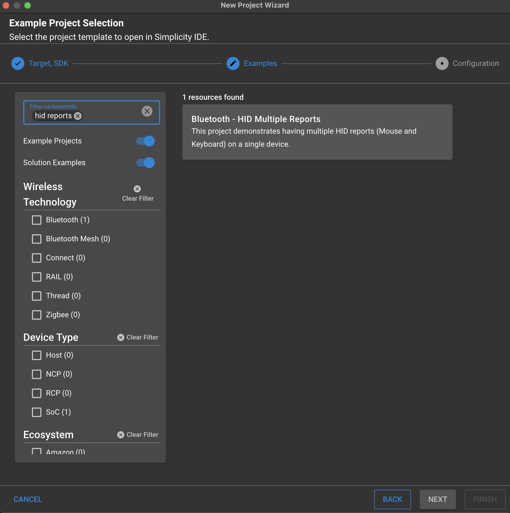
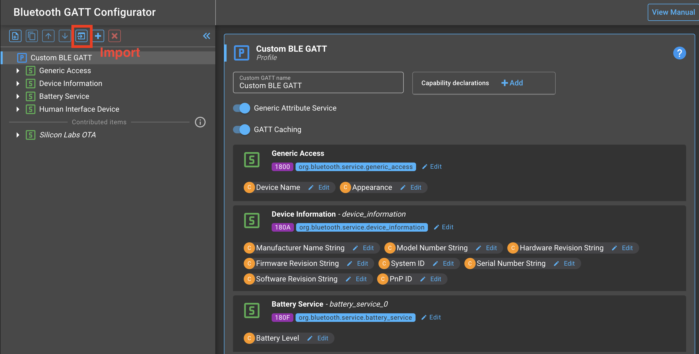
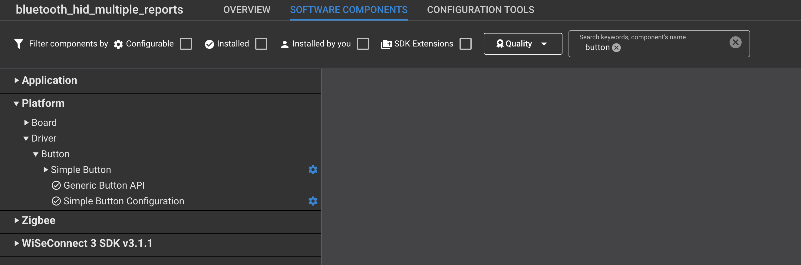

# Bluetooth - HID Multiple Reports


## Description

This is an example for Bluetooth LE HID device development, which can connect wirelessly to HID hosts including Windows, Mac, Android and iOS systems. Bluetooth SIG defines an HID profile that specifies how a device can support HID services over the Bluetooth LE protocol stack using the Generic Attribute Profile.

This example implements a simple HID mouse and HID keyboard to show how to have multiple HID reports for a single device.

## SDK version

- [SiSDK v2024.12.0](https://github.com/SiliconLabs/simplicity_sdk)

## Software Required

- [Simplicity Studio v5 IDE](https://www.silabs.com/developers/simplicity-studio)

## Hardware Required

- 1x [BRD4181A or BRD4181B - EFR32MG21](https://www.silabs.com/development-tools/wireless/slwrb4181b-efr32xg21-wireless-gecko-radio-board)
- 1x [Si-MB4002A Main Board with on-board joystick](https://www.silabs.com/development-tools/wireless/wireless-pro-kit-mainboard?tab=overview)
- Please note the 4001A version does not have an on-board joystick needed for this project.
- 1x BLE-supported Computer

## Connections Required

The MG21 was selected due to the availabilty of pins which are connected to the on-board joystick of the MB4002A (BRD4002A) Main Board. If you only have the BRD4001A variant, you'll need an external joystick component connected to the external pins.

## Setup

To test this application, you can either create a project based on the example project or start with a "Bluetooth - SoC Empty" project based on your hardware.

**NOTE**:

- Make sure that the [bluetooth_applications](https://github.com/SiliconLabs/bluetooth_applications) repository is added to [Preferences > Simplicity Studio > External Repos](https://docs.silabs.com/simplicity-studio-5-users-guide/latest/ss-5-users-guide-about-the-launcher/welcome-and-device-tabs).

### Create a project based on an example project

1. From the Launcher Home, add your hardware to My Products, click on it, and click on the **EXAMPLE PROJECTS & DEMOS** tab. Find the example project filtering by "tripwire".
2. Click **Create** button on the **Bluetooth - HID Multiple Reports** example. Example project creation dialog pops up -> click Create and Finish and Project should be generated.

3. Build and flash this example to the board.

If you do not see the project, add this repo to Simplicity Studio with these [instructions](https://docs.silabs.com/simplicity-studio-5-users-guide/latest/ss-5-users-guide-about-the-launcher/welcome-and-device-tabs#example-projects-demos-tab).

### Start with a "Bluetooth - SoC Empty" project

1. Create a "Bluetooth - SoC Empty" project in Simplicity Studio 5.
2. Replace the project's default app.c with the app.c contained within this repo.
3. Download [gatt_configuration.btconf](config/btconf/gatt_configuration.btconf) that is contained in this repo.
4. Open the `./config/btconf/gatt_configuration.btconf` file within the project directory in Simplicity Studio. The GATT Configurator should open when opening through Simplicity Studio.
5. Import the GATT database of this project into the new project. Click the import button as shown below then find the [gatt_configuration.btconf](config/btconf/gatt_configuration.btconf) that was downloaded.

6. Open the \<project name\>.slcp file (for this example, tripwire.slcp) in the top level of the project within Simplicity Studio. A project configurator like below should open in step 7.
7. Click the SOFTWARE COMPONENTS tab and add the following components to the project:
    - [Platform] → [Driver] → [Button] → [Simple Button] → default instance name: **btn0** and **btn1**
    - [Platform] → [Board Drivers] → [Joystick]
    - [Services] → [IO Stream] → [IO Stream: USART] → default instance name: vcom
    - [Platform] → [Board] → [Board Control] → enable *Virtual COM UART*
    - [Application] → [Utility] → [Log]
    
8. Build the project and flash.

**Note:**

- A bootloader needs to be flashed to your board if the project starts from the "Bluetooth - SoC Empty" project, see [Bootloader](https://github.com/SiliconLabs/bluetooth_applications/blob/master/README.md#bootloader) for more information.

## How it Works

More information about how a basic BLE HID keyboard works can be found [here](https://github.com/SiliconLabs/bluetooth_applications/blob/master/bluetooth_hid_keyboard/README.md). This example adds on top of the simple HID keyboard example to show how to have the HID mouse and keyboard in a single report map.

To prevent confusion between the USB HID terminology and the BLE GATT terminology (characteristics and descriptors), the following will use the BLE GATT terminology by default unless otherwise noted.

To have an HID mouse and keyboard in one device, multiple *Report characteristics* are required. There is only one *Report Map characteristic* that encodes all the *Report characteristics'* specifications. In order for the HID host to know which GATT *Report characteristic* to poll from and what the data format is, each *Report characteristic* has a *Report Reference descriptor* which contains a Report ID. The *Report Map characteristic* is a byte array with each Report's data specification and delimited with Report IDs to separate each *Report characteristic*.

```txt
Report Map characteristic:
...[Report ID 1][Usage Page Mouse]...[Report ID 2][Usage Page Keyboard]...[Report ID n][Usage Page n]...
```

For more exact formatting details, check out the USB specifications and tools:

- [HID over GATT Profile Specification](https://www.bluetooth.org/docman/handlers/downloaddoc.ashx?doc_id=245141)
- [Tool for the Report Map](https://usb.org/document-library/hid-descriptor-tool)
- [HID Specification](https://www.usb.org/hid)

The *Report Reference descriptor* can be be added through the GATT configurator under the "Descriptors" tab. The *Report Reference descriptor* data is 2 bytes long with the MSB being the report type (Input Report 0x01, Output Report 0x02, Feature Report 0x03) and the LSB containing the Report ID. Since the keyboard and mouse are input devices, the descriptors will have the following format:

- Mouse: 0x0101 for Input Report and Report ID 1
- Keyboard: 0x0102 for Input Report and Report ID 2

The BLE over GATT Profile should look similar to the following (HID Service contains more details):

- Device Information Service
- Battery Service
- HID Service
  - HID Information characteristic
  - Protocol Mode characteristic
  - HID Control Point characteristic
  - Report Map characteristic: ...[0x0801][Usage Page Mouse]...[0x0802][Usage Page Keyboard]... ; See [btconf](./config/btconf/gatt_configuration.btconf) file
    - External Report Reference descriptor
  - Report Mouse characteristic: input data 8B
    - Report Reference descriptor: 0x0101
  - Report Keyboard characteristic: input data 8B
    - Report Reference descriptor: 0x0102

### Report Map Characteristic:

The mouse report map has been taken from the example given in [Device Class Definition for Human Interface Devices (HID)](https://www.usb.org/sites/default/files/documents/hid1_11.pdf)
(Appendix E.10: Report Descriptor (Mouse)). The keyboard report map is explained in [BLE HID keyboard example](https://github.com/SiliconLabs/bluetooth_applications/blob/master/bluetooth_hid_keyboard/README.md) as well.

| Value      | Item                                                     |
| :--------- |:---------------------------------------------------------|
| 0x05, 0x01 |    Usage Page (Generic Desktop)                          |
| 0x09, 0x02 |    Usage (Mouse)                                         |
| 0xa1, 0x01 |    Collection (Application)                              |
| 0x09, 0x01 |    Usage (Pointer)                                       |
| 0xa1, 0x00 |    Collection (Physical)                                 |
| 0x85, 0x01 |    **Report ID** assigned for the mouse in the app       |
| 0x05, 0x09 |    Usage Page (Buttons)                                  |
| 0x19, 0x01 |    Usage Minimum (01)                                    |
| 0x29, 0x03 |    Usage Maximum (03)                                    |
| 0x15, 0x00 |    Logical Minimum (0)                                   |
| 0x25, 0x01 |    Logical Maximum (0)                                   |
| 0x95, 0x03 |    Report Count (3)                                      |
| 0x75, 0x01 |    Report Size (1)                                       |
| 0x81, 0x02 |    Input (Data, Variable, Absolute)                      |
| 0x95, 0x01 |    Report Count (1)                                      |
| 0x75, 0x05 |    Report Size (5)                                       |
| 0x81, 0x01 |    Input (Constant);5 bit padding                        |
| 0x05, 0x01 |    Usage Page (Generic Desktop)                          |
| 0x09, 0x30 |    Usage (X)                                             |
| 0x09, 0x31 |    Usage (Y)                                             |
| 0x15, 0x81 |    Logical Minimum (-127)                                |
| 0x25, 0x7F |    Logical Maximum (127)                                 |
| 0x75, 0x08 |    Report Size (8)                                       |
| 0x95, 0x02 |    Report Count (2)                                      |
| 0x81, 0x06 |    Input (Data, Variable, Relative)                      |
| 0xC0 |          End Collection                                        |
| 0xC0 |          End Collection                                        |
| 0x09, 0x06 |    Usage (Keyboard)                                      |
| 0xa1, 0x01 |    Collection (Application)                              |
| 0x85, 0x01 |    **Report ID** assigned for the keyboard in the app    |
| 0x05, 0x07 |    Usage Page (Keyboard)                                 |
| 0x19, 0xe0 |    Usage Minimum (Keyboard LeftControl)                  |
| 0x29, 0xe7 |    Usage Maximum (Keyboard Right GUI)                    |
| 0x15, 0x00 |    Logical Minimum (0)                                   |
| 0x25, 0x01 |    Logical Maximum (1)                                   |
| 0x75, 0x01 |    Report Size (1)                                       |
| 0x95, 0x08 |    Report Count (8)                                      |
| 0x81, 0x02 |    Input (Data, Variable, Absolute) Modifier byte        |
| 0x95, 0x01 |    Report Count (1)                                      |
| 0x75, 0x08 |    Report Size (8)                                       |
| 0x81, 0x01 |    Input (Constant) Reserved byte                        |
| 0x95, 0x06 |    Report Count (6)                                      |
| 0x75, 0x08 |    Report Size (8)                                       |
| 0x15, 0x00 |    Logical Minimum (0)                                   |
| 0x25, 0x65 |    Logical Maximum (101)                                 |
| 0x05, 0x07 |    Usage Page (Key Codes)                                |
| 0x05, 0x01 |    Usage Minimum (Reserved (no event indicated))         |
| 0x05, 0x01 |    Usage Maximum (Keyboard Application)                  |
| 0x05, 0x01 |    Input (Data,Array) Key arrays (6 bytes)               |
| 0xc0 |          End Collection  

A detailed description of the item types and the structure of this descriptor can be found in section **6.2.2 Report Descriptor** of [Device Class Definition for Human Interface Devices (HID)](https://www.usb.org/sites/default/files/documents/hid1_11.pdf)

### Running the project

1. Flash the project and the [bootloader](#notes) to the board
2. Once the device is powered, go into the Bluetooth settings of your computer to connect to the board of BLE. The device name is `keebmouse`. Connect to the device.
3. Once the device is connected, you can open a text editor of your choise and press BTN1 to write a character. BTN0 is mapped to the LSHIFT key.
4. Move the joystick to see the mouse cursor move. Press the joystick to perform a Mouse Left Click.

**Note:**

Like the BLE HID Keyboard example, this example is not energy-optimized. The computer may give warnings that the USB device is at critical power.

Due to the Joystick driver's implementation, the mouse moves in finite increments which can be modified in app.c.

## Project does not work for some reason? Bootloader

If you flash the project and it seems the device is not working e.g. cannot find the device on your PC, the LED does not blink, etc, then the bootloader may be missing. Depending on the part and flash size, there are different bootloader projects. For this project and any BLE-capable part, create the `Bootloader - SoC Bluetooth Apploader OTA DFU` project, build, and flash the bootloader project.

More information on the bootloader and apploader can be found in [UG489 Gecko Bootloader User Guide](https://www.silabs.com/documents/public/user-guides/ug489-gecko-bootloader-user-guide-gsdk-4.pdf) and [AN1086 AN1086: Using the Gecko Bootloader with the Silicon Labs Bluetooth® Applications](https://www.silabs.com/documents/public/application-notes/an1086-gecko-bootloader-bluetooth.pdf)
