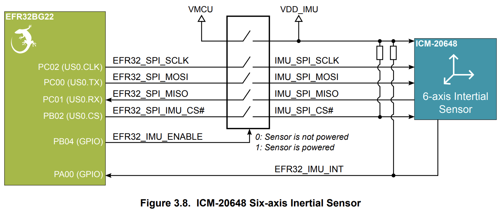
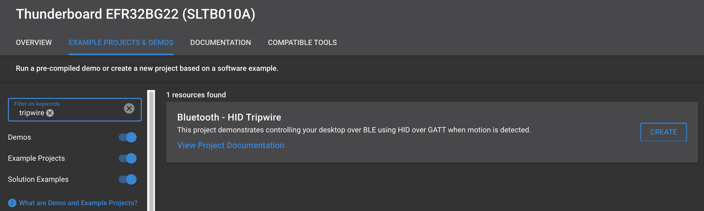
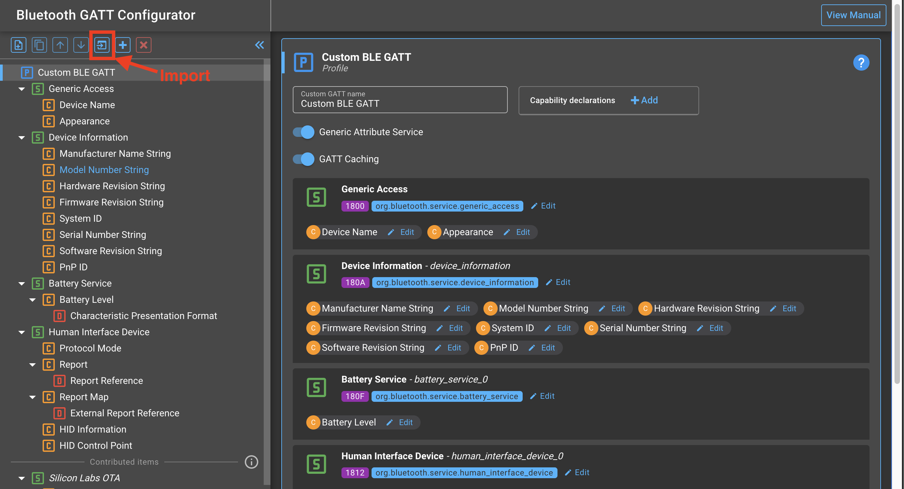
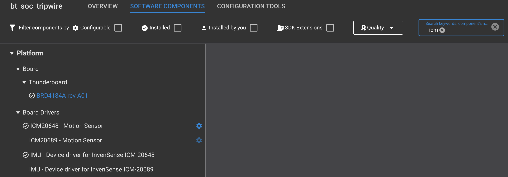
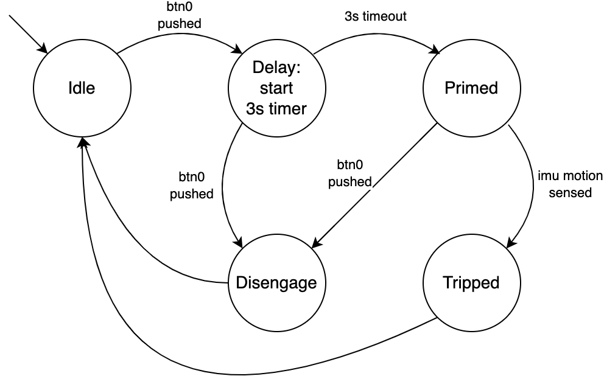

# Bluetooth - HID Tripwire

## Description

Premise: Sometimes, I want to play games at work without anyone knowing. Instead of being alert and listening for someone who may enter my room, I wanted a device that would automatically change my game to another tab/application whenever the door opened.

This project shows you how to make a battery-powered Silabs BLE HID device that connects to a computer and changes tabs (ALT+TAB) when motion is detected. The device hangs on the doorknob and an IMU is used to wake the device when motion is detected. When the device wakes up on motion, the keyboard command ALT+TAB is sent to the computer over the HID over GATT service to change your current workspace.

There are other methods of detecting when someone enters the door such as using a magnet and magnetic sensor or a light/distance sensor which can be adapted to this project. I chose motion detection to hide the device behind the door and keep the final device simple to just hang on the door.

## SDK version

- [SiSDK v2024.12.0](https://github.com/SiliconLabs/simplicity_sdk)

## Software Required

- [Simplicity Studio v5 IDE](https://www.silabs.com/developers/simplicity-studio)

## Hardware Required

- 1x [SLTB010A](https://www.silabs.com/development-tools/thunderboard/thunderboard-bg22-kit?tab=overview) EFR32BG22 Thunderboard Kit (BRD4184B)
- BRD4184A is also acceptable, but the [Connections Required](#connections-required) section thoroughly for differences.
- 1x PC with Windows keyboard layout

### Custom board

- EFR32BG22
- IMU ICM-20648
- Button
- LED

## Connections Required

Please note there are different BG22 Thunderboard revisions: BRD4184A and BRD4184B. Please check your board's silkscreen for the correct version. The BRD4184B is the latest version. There are slight differences in the connections of the buttons and IMU between the two board variations.

No matter the version of the board you have, the BG22 Thunderboard contains all the parts needed for this project. All the necessary connections will automatically be selected for the drivers if you create a studio project targeted specifically for the BG22 Thunderboard version that you have.

As a reference, the connections between the BG22 and IMU for the BRD4184B can be found in the [UG464: BG22 Thunderboard User Guide Figure 3.8](https://www.silabs.com/documents/public/user-guides/ug464-brd4184b-user-guide.pdf) and are the following:

On the BRD4184B, the additional connections are:

- PB03 : Button
- PA04 : LED

## Setup

To test this application, you can either create a project based on an example project or start with a "Bluetooth - SoC Empty" project based on your hardware.

**NOTE**:

- Make sure that the [bluetooth_applications](https://github.com/SiliconLabs/bluetooth_applications) repository is added to [Preferences > Simplicity Studio > External Repos](https://docs.silabs.com/simplicity-studio-5-users-guide/latest/ss-5-users-guide-about-the-launcher/welcome-and-device-tabs).

### Create a project based on an example project

1. From the Launcher Home, add your hardware to My Products, click on it, and click on the **EXAMPLE PROJECTS & DEMOS** tab. Find the example project filtering by "tripwire".
2. Click **Create** button on the **Bluetooth - HID Tripwire** example. Example project creation dialog pops up -> click Create and Finish and Project should be generated.

3. Build and flash this example to the board.

If you do not see the project, add this repo to Simplicity Studio with these [instructions](https://docs.silabs.com/simplicity-studio-5-users-guide/latest/ss-5-users-guide-about-the-launcher/welcome-and-device-tabs#example-projects-demos-tab).

### Start with a "Bluetooth - SoC Empty" project

1. Create a "Bluetooth - SoC Empty" project in Simplicity Studio 5. For this example, I named the project tripwire.
2. Replace the project's default app.c with the app.c contained within this repo.
3. Download [gatt_configuration.btconf](config/btconf/gatt_configuration.btconf) that is contained in this repo.
4. Open the `./config/btconf/gatt_configuration.btconf` file within the project directory in Simplicity Studio. The GATT Configurator should open when opening through Simplicity Studio.
5. Import the GATT database of this project into the new project. Click the import button as shown below then find the [gatt_configuration.btconf](config/btconf/gatt_configuration.btconf) that was downloaded.

6. Open the \<project name\>.slcp file (for this example, bt_hid_tripwire.slcp) in the top level of the project within Simplicity Studio. A project configurator like below should open in step 7.
7. Click the SOFTWARE COMPONENTS tab and add the following components to the project:
    - [Platform] → [Board Drivers] → [IMU - Device driver for InvenSense ICM-20648]
    - [Platform] → [Board Drivers] → [IMU - Inertial Measurement Unit]
    - [Platform] → [Driver] → [Button] → [Simple Button] → default instance name: **btn0**
    - [Platform] → [Driver] → [LED] → [Simple LED] → default instance name: **led0**
    - [Platform] → [Driver] → [GPIOINT]

    
8. Build the project and flash.

**Note:**

- A bootloader needs to be flashed to your board if the project starts from the "Bluetooth - SoC Empty" project, see [Bootloader](https://github.com/SiliconLabs/bluetooth_applications/blob/master/README.md#bootloader) for more information.

## How it Works

### Running the project

1. Flash the project and the [bootloader](#notes) to the board
2. Once the device is powered, go into the Bluetooth settings of your computer to connect to the board of BLE. The device name is `tripwire`. Connect to the device.
3. Once the device is connected, the user can now press BTN0
4. If BTN0 is pressed, the LED will turn on. The LED will stay on for 3 seconds indicating the device is about to be `Primed` or activated. Once activated, a heartbeat LED (blinking pattern) will be enabled and any motion will make the device send the ALT+TAB command to the computer.
5. Pressing BTN0 again will disengage the tripwire if the device has not detected any motion.

LED: Indicates device activity.

- Heartbeat/blinking pattern indicates the device is primed and any motion will make the device send the ALT+TAB command to the computer.
- Constant on light indicates the device is in `Delay` mode to allow the user to place the device onto the door handle and stabilize the device.

Button 0 (BTN0): Engage or disengage the tripwire.

### States

1. **Idle**: As the name suggests, the device is idling and waiting to be primed. Nothing will happen in this state. The next state **Delay** can be triggered by pressing BTN0 on the board.
2. **Delay**: After pressing BTN0 in the Idle state, the device will be in a delay state for 3 seconds to allow the user to physically adjust/stabilize the device on the door handle. This state exists to prevent any false starts if the action of pressing BTN0 causes the device to physically sway i.e. preventing any false detections. The device will automatically go to the **Primed** state after the 3-second timer ends.
3. **Primed**: When the tripwire is primed, the device will wait for any movement detected by the IMU. A heartbeat LED will also turn on to indicate to the user that the device is active and primed. The device will go to the **Tripped** state if the IMU detects movement or **Disengaged** state if BTN0 is pressed.
4. **Tripped**: Any movement will cause the device to go into the Tripped state. When the tripwire is tripped, the device will switch your current workspace on your computer by sending the keyboard command ALT+TAB and the heartbeat LED will be disabled. Once these operations are complete, the device will automatically set the state to **Idle**.
5. **Disengaged**: If BTN0 is pressed while the FSM is in the **Primed** state, then the device will disable the heartbeat LED and move to the **Idle** state. Useful for when the user needs to leave the room.

# Notes

There is additional documentation in the code. If you would like to add your own sensor to detect someone entering your room (e.g. laser), the IMU Wake Up callback function handles the state change. Remove that code and make sure some code triggers the state change from Primed to Tripped (i.e. set tw_next_state from TW_PRIMED to TW_TRIPPED then call sl_bt_external_signal to update the FSM).

## Project does not work for some reason? Bootloader

If you flash the project and it seems the device is not working e.g. cannot find the device on your PC, the LED does not blink, etc, then the bootloader may be missing. Depending on the part and flash size, there are different bootloader projects. For this project and any BLE-capable part, create the `Bootloader - SoC Bluetooth Apploader OTA DFU` project, build, and flash the bootloader project.

More information on the bootloader and apploader can be found in [UG489 Gecko Bootloader User Guide](https://www.silabs.com/documents/public/user-guides/ug489-gecko-bootloader-user-guide-gsdk-4.pdf) and [AN1086 AN1086: Using the Gecko Bootloader with the Silicon Labs Bluetooth® Applications](https://www.silabs.com/documents/public/application-notes/an1086-gecko-bootloader-bluetooth.pdf)
