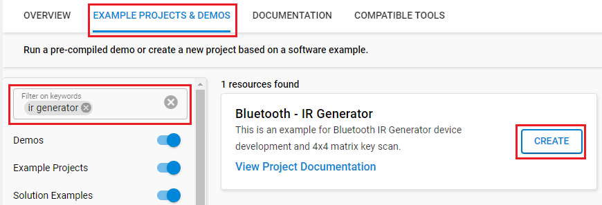
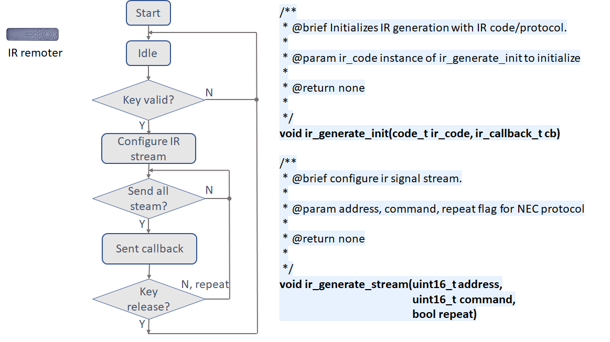
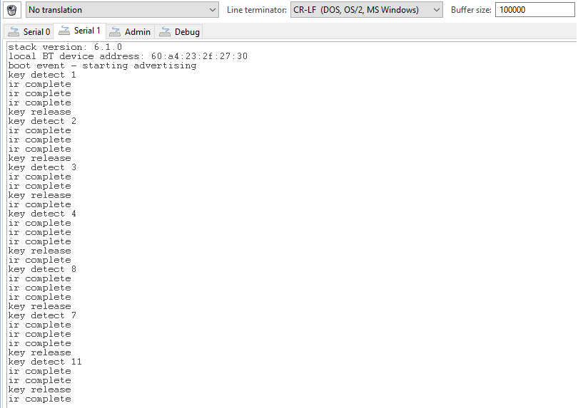

# BLE IR Generator Example #

## Summary ##

This project shows the implementation of an IR signal generator and 4x4 matrix key scan with BLE on our EFR32 devices.
The expectation is to ensure the IR signal generator works well in cases with heavy BLE traffic.

## Gecko SDK Suite version ##

- GSDK v4.3.1
- [Third Party Hardware Drivers v1.8.0](https://github.com/SiliconLabs/third_party_hw_drivers_extension)

## Hardware Required ##

- [EFR32xG22 Wireless Gecko Radio Board.](https://www.silabs.com/development-tools/wireless/slwrb4182a-efr32xg22-wireless-gecko-radio-board)
- [Silicon Labs Wireless Starter Kits.](https://www.silabs.com/development-tools/wireless)
- [4x4 Matrix 16 Keys Button Keypad.](https://www.amazon.com/Tegg-Matrix-Button-Arduino-Raspberry/dp/B07QKCQGXS/ref=sr_1_4?dchild=1&keywords=Key+matrix&qid=1591754882&sr=8-4)
- [Infrared diode](https://www.amazon.com/Digital-Receiver-Transmitter-Arduino-Compatible/dp/B01E20VQD8/ref=sr_1_14?dchild=1&keywords=IR+receiver&qid=1591754671&s=aht&sr=1-14)

## Connections Required ##

Connect [4x4 Matrix 16 Keys Button Keypad](https://www.amazon.com/Tegg-Matrix-Button-Arduino-Raspberry/dp/B07QKCQGXS/ref=sr_1_4?dchild=1&keywords=Key+matrix&qid=1591754882&sr=8-4) and [Infrared diode](https://www.amazon.com/Digital-Receiver-Transmitter-Arduino-Compatible/dp/B01E20VQD8/ref=sr_1_14?dchild=1&keywords=IR+receiver&qid=1591754671&s=aht&sr=1-14) to WSTK board through the expansion header.

## Setup ##

To test this application, you can either create a project based on an example project or start with a "Bluetooth - SoC Empty" project based on your hardware.

### Create a project based on an example project ###

1. From the Launcher Home, add your hardware to My Products, click on it, and click on the **EXAMPLE PROJECTS & DEMOS** tab. Find the example project with the filter "ir generator".

2. Click **Create** button on both **Bluetooth - IR Generator** examples. Example project creation dialog pops up -> click Create and Finish and Project should be generated.

3. Build and flash this example to the board.

### Start with a "Bluetooth - SoC Empty" project ###

1. Create a **Bluetooth - SoC Empty** project for your hardware using Simplicity Studio 5.

2. Copy all attached files in inc and src folders into the project root folder (overwriting existing).

3. Import the GATT configuration:

    - Open the .slcp file in the project.

    - Select the **CONFIGURATION TOOLS** tab and open the **Bluetooth GATT Configurator**.

    - Find the Import button and import the attached gatt_configuration.btconf file.

4. Open the .slcp file. Select the **SOFTWARE COMPONENTS** tab and install the software components:
    - [Services] → [IO Stream] → [IO Stream: USART] → default instance name: **vcom**
    - [Application] → [Utility] → [Log]
    - [Third Party Hardware Drivers] → [Miscellaneous] → [IR Generator (Silabs)]
    - [Platform] → [Driver] → [Button] → [Simple Button] → default instance name: **btn0** and **btn1**

5. Build and flash the project to your device.

**Note:**

- Make sure the [Third Party Hardware Drivers extension](https://github.com/SiliconLabs/third_party_hw_drivers_extension) is added to the required SDK: [Preferences > Simplicity Studio > SDKs](https://github.com/SiliconLabs/third_party_hw_drivers_extension/blob/master/README.md#how-to-add-to-simplicity-studio-ide).
- SDK Extension must be enabled for the project to install the [IR Generator (Silabs)] component.
- Do not forget to flash a bootloader to your board, see [Bootloader](https://github.com/SiliconLabs/bluetooth_applications/blob/master/README.md#bootloader) for more information.

## How It Works ##

### Keypad ###

When a key is active (pressed), the GPIO interrupt wakes-up the system, then the key scan and key timer (10ms) start to work. When a key is available or a key is released, the key callback is invoked to indicate, which key is detected or released. After a key is released, the system backs to idle state again.

- Initialization.
  - key_init() function initializes the keypad with 2 callback, set GPIO direction, and interrupt.
  - key_wakeup_callback_t wakeup_cb, is called in GPIO IRQ. It starts the key timer.
  - key_callback_t cb, is called in the key detection. It reports which key is detected or released.
- Running the key detection
  - key_scan() function runs in a key time slice, checks which key and how long the key is pressed, then reports the key status.

#### Keypad flowchart ###

### IR generate ###

Most of the time the system stays in an idle state. When an IR send is required, the system configures the stream according to the given data, then sends out all the stream bit. If no stop command is inputted, the system will repeat the stream. If no need to repeat the IR signal, the system will go back to the idle state.

- Initialization.
  - ir_generate_init() function initializes the keypad with callback.
  - code_t ir_code sets the IR protocol, currently supports NEC and SONY types only.
  - ir_callback_t cb is called if one frame stream is sent.
- Running the IR generate
  - ir_generate_stream() function configures the data that desires to send and start, repeats flag used in NEC IR protocol.
  - ir_generate_stop() function can stop the IR generate.

#### IR flowchart ####

### Testing ###

In this example, IR stream start/stop is controlled by a key event. We can use Console window for tracking the run status and logic analyzer/oscilloscope to check the IR waveform.

