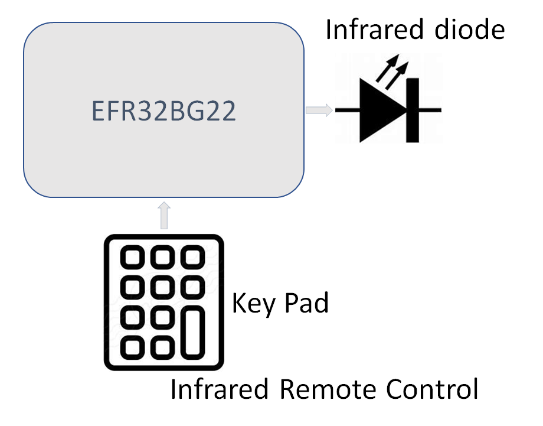
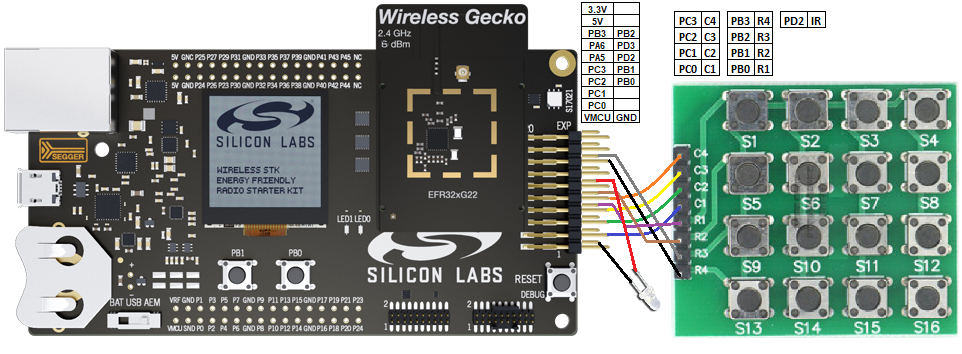
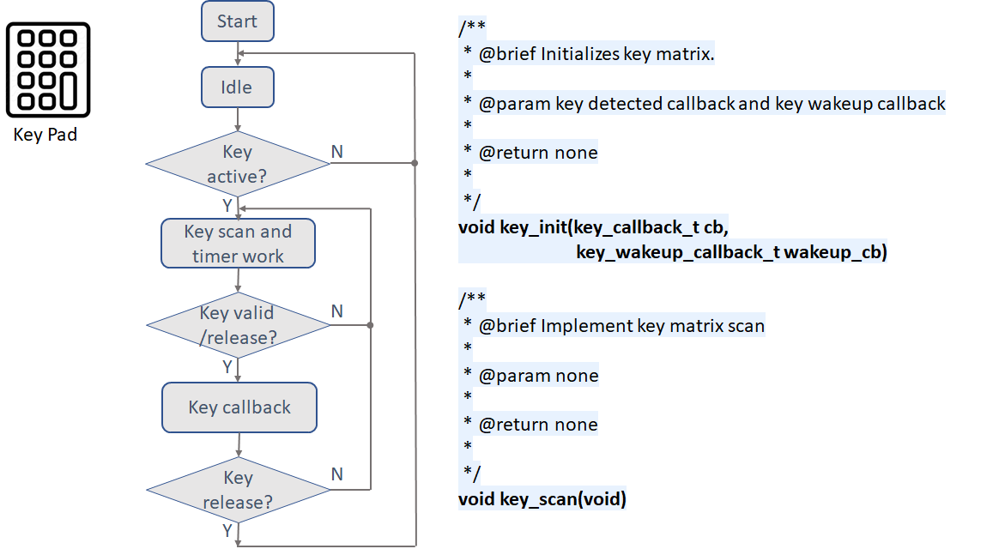

# BLE IR Generator Example #

## Summary ##

This project shows the implementation of an IR signal generator and 4x4 matrix key scan with BLE on our EFR32 devices. 
The expectation is to ensure the IR signal generator works well in cases with heavy BLE traffic.

  

## Gecko SDK Version ##

v2.7

## Hardware Required ##

- BRD4182A EFR32xG22 radio board
- BRD4001A WSTK board

## Setup ##
1. Hardware connection.

   

   Connect [matrix(4x4) key pad](https://www.amazon.com/Tegg-Matrix-Button-Arduino-Raspberry/dp/B07QKCQGXS/ref=sr_1_4?dchild=1&keywords=Key+matrix&qid=1591754882&sr=8-4) and [Infrared diode](https://www.amazon.com/Digital-Receiver-Transmitter-Arduino-Compatible/dp/B01E20VQD8/ref=sr_1_14?dchild=1&keywords=IR+receiver&qid=1591754671&s=aht&sr=1-14) to WSTK board through the expansion header. 

2. Import the bluetooth_ir_generator.sls file, build and program the EFR32 device with the hex file.

## How It Works ##

### Keypad

Most of the time the system stays in an idle state. When a key is active(pressed), the GPIO interrupt wakeups the system, then the key scan and key timer(10ms) starts to work. When a key is available or a key is released,  the key callback is invoked to indicate which key is detected or released, after a key release the system back to idle again.
- Initialization.
    - key_init() function initializes the keypad with 2 callback, set GPIO direction, and interrupt.
    - key_wakeup_callback_t wakeup_cb, is called in GPIO IRQ. It starts the key timer.
    - key_callback_t cb, is called in the key detection. It reports which key is detected or released.
- Running the key detection
    - key_scan() function runs in a key time slice, checks which key and how long the key is pressed, then reports the key status.
#### Keypad flowchart

  

### IR generate

Most of the time the system stays in an idle state. When an IR send is required, the system configures the stream according to the given data, then sends out all the stream bit. If no stop command is inputted, the system will repeat the stream. If no need to repeat the IR signal, the system will go back to the idle state. 
- Initialization.
    - ir_generate_init() function initializes the keypad with callback.
    - code_t ir_code sets the IR protocol, currently supports NEC and SONY type.
    - ir_callback_t cb is called if one frame stream is sent.
- Running the IR generate
    - ir_generate_stream() function configures the data that desire to send and start, repeat flag used in NEC IR protocol.
    - ir_generate_stop() function can stop the IR generate.

#### IR flowchart

  

In this example, IR stream start/stop is controlled by a key event. We can use tera term for tracking the run status and logic analyzer/oscilloscope to check the IR waveform.

## .sls Projects Used ##

-bluetooth_ir_generator.sls

## How to Port to Another Part ##

1. Create a new SoC-Empty project for target device.

2. Import the gatt.xml file.

3. Press Save and then Generate in the GATT Configurator.

4. Copy the relevant files(app.c,app.h,ir_generate.c,ir_generate.h,key_scan.c,key_scan.h) into your project (overwriting the existing one).

5. Copy the src directory from ..\SiliconLabs\Simplicity\Studio\v4\developer\sdks\gecko_sdk_suite\v2.7\platform\emdrv\gpiointerrupt to your project's ..\platform\emdrv\gpiointerrupt directory.

6. Build and flash the project to your device.